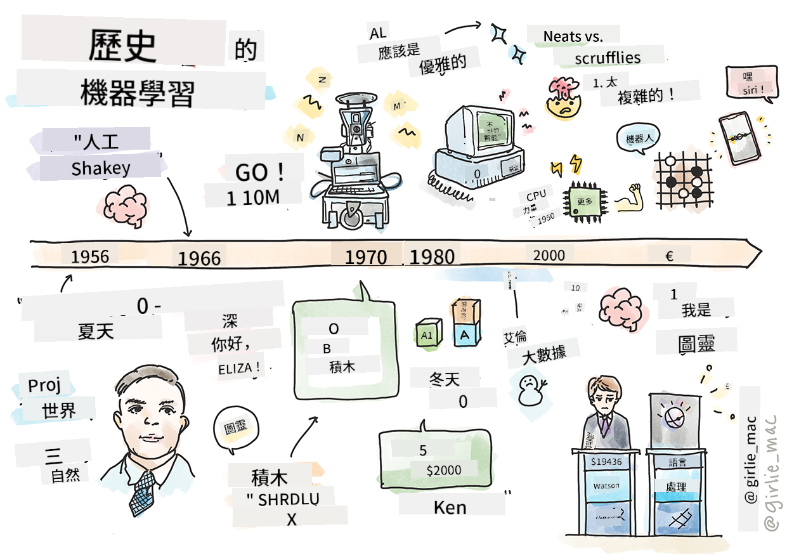

<!--
CO_OP_TRANSLATOR_METADATA:
{
  "original_hash": "b2d11df10030cacc41427a1fbc8bc8f1",
  "translation_date": "2025-09-03T17:51:29+00:00",
  "source_file": "1-Introduction/2-history-of-ML/README.md",
  "language_code": "hk"
}
-->
# 機器學習的歷史

> 手繪筆記由 [Tomomi Imura](https://www.twitter.com/girlie_mac) 提供

## [課前測驗](https://gray-sand-07a10f403.1.azurestaticapps.net/quiz/3/)

---

> 🎥 點擊上方圖片觀看本課程的短片。

在本課程中，我們將回顧機器學習和人工智能歷史上的重要里程碑。

人工智能（AI）作為一個領域的歷史與機器學習的歷史密切相關，因為支撐機器學習的算法和計算進步促進了人工智能的發展。值得注意的是，雖然這些領域作為獨立的研究方向在1950年代開始成形，但重要的[算法、統計、數學、計算和技術發現](https://wikipedia.org/wiki/Timeline_of_machine_learning)早在這個時期之前就已經出現並有所交集。事實上，人類已經思考這些問題[數百年](https://wikipedia.org/wiki/History_of_artificial_intelligence)：這篇文章探討了“思考機器”概念的歷史性智力基礎。

---
## 重要發現

- 1763年, 1812年 [貝葉斯定理](https://wikipedia.org/wiki/Bayes%27_theorem)及其前身。該定理及其應用是推理的基礎，描述了基於先驗知識事件發生的概率。
- 1805年 [最小二乘法](https://wikipedia.org/wiki/Least_squares)由法國數學家Adrien-Marie Legendre提出。該理論在我們的回歸單元中會學到，幫助進行數據擬合。
- 1913年 [馬爾可夫鏈](https://wikipedia.org/wiki/Markov_chain)，以俄羅斯數學家Andrey Markov命名，用於描述基於前一狀態的一系列可能事件。
- 1957年 [感知器](https://wikipedia.org/wiki/Perceptron)是一種由美國心理學家Frank Rosenblatt發明的線性分類器，為深度學習的進步奠定了基礎。

---

- 1967年 [最近鄰算法](https://wikipedia.org/wiki/Nearest_neighbor)最初設計用於路徑規劃。在機器學習中，它被用於模式檢測。
- 1970年 [反向傳播](https://wikipedia.org/wiki/Backpropagation)用於訓練[前饋神經網絡](https://wikipedia.org/wiki/Feedforward_neural_network)。
- 1982年 [循環神經網絡](https://wikipedia.org/wiki/Recurrent_neural_network)是從前饋神經網絡衍生出的人工神經網絡，用於創建時間圖。

✅ 做一些研究。還有哪些日期在機器學習和人工智能的歷史中具有重要意義？

---
## 1950年：思考的機器

艾倫·圖靈（Alan Turing），一位真正非凡的人物，被[公眾在2019年](https://wikipedia.org/wiki/Icons:_The_Greatest_Person_of_the_20th_Century)評選為20世紀最偉大的科學家，他被認為幫助奠定了“能夠思考的機器”概念的基礎。他面對反對者並需要實證來支持這一概念，部分原因是創造了[圖靈測試](https://www.bbc.com/news/technology-18475646)，你將在我們的自然語言處理課程中深入探討。

---
## 1956年：達特茅斯夏季研究項目

“達特茅斯夏季人工智能研究項目是人工智能作為一個領域的奠基事件”，在這裡，“人工智能”這一術語被首次提出（[來源](https://250.dartmouth.edu/highlights/artificial-intelligence-ai-coined-dartmouth)）。

> 學習的每一個方面或任何其他智能特徵都可以原則上被如此精確地描述，以至於可以製造出模擬它的機器。

---

領銜研究者、數學教授John McCarthy希望“基於這樣的猜想進行研究，即學習的每一個方面或任何其他智能特徵都可以原則上被如此精確地描述，以至於可以製造出模擬它的機器。”參與者包括該領域的另一位重要人物Marvin Minsky。

該研討會被認為促進並鼓勵了多項討論，包括“符號方法的興起、專注於有限領域的系統（早期專家系統）以及演繹系統與歸納系統之間的對比。”（[來源](https://wikipedia.org/wiki/Dartmouth_workshop)）。

---
## 1956年 - 1974年：“黃金時代”

從1950年代到70年代中期，人們對人工智能能夠解決許多問題充滿樂觀。1967年，Marvin Minsky自信地表示：“在一代人的時間內……創造‘人工智能’的問題將基本上得到解決。”（Minsky, Marvin (1967), Computation: Finite and Infinite Machines, Englewood Cliffs, N.J.: Prentice-Hall）

自然語言處理研究蓬勃發展，搜索技術得到了改進並變得更強大，“微世界”的概念被創造出來，簡單的任務可以通過簡單的語言指令完成。

---

研究得到了政府機構的充分資助，計算和算法方面取得了進展，智能機器的原型被製造出來。其中一些機器包括：

* [Shakey機器人](https://wikipedia.org/wiki/Shakey_the_robot)，它能夠智能地移動並決定如何執行任務。

    
    > 1972年的Shakey

---

* Eliza，一個早期的“聊天機器人”，能夠與人交談並充當一個原始的“治療師”。你將在自然語言處理課程中學到更多關於Eliza的內容。

    
    > Eliza的一個版本，聊天機器人

---

* “積木世界”是一個微世界的例子，積木可以被堆疊和排序，並且可以進行教導機器做出決策的實驗。使用像[SHRDLU](https://wikipedia.org/wiki/SHRDLU)這樣的庫進行的研究推動了語言處理的進步。

    

    > 🎥 點擊上方圖片觀看視頻：積木世界與SHRDLU

---
## 1974年 - 1980年：“人工智能寒冬”

到70年代中期，製造“智能機器”的複雜性已被低估，而其承諾在當時的計算能力下被過度吹捧。資金枯竭，對該領域的信心減弱。一些影響信心的問題包括：
---
- **限制**。計算能力過於有限。
- **組合爆炸**。隨著對計算機要求的增加，需要訓練的參數數量呈指數增長，而計算能力和性能並未同步發展。
- **數據匱乏**。數據的匱乏阻礙了測試、開發和改進算法的過程。
- **我們是否在問正確的問題？**。研究者開始質疑他們所提出的問題：
  - 圖靈測試因“中文房間理論”等觀點受到質疑，該理論認為，“為數字計算機編程可能使其看似理解語言，但無法產生真正的理解。”（[來源](https://plato.stanford.edu/entries/chinese-room/)）
  - 將像“治療師”ELIZA這樣的人工智能引入社會的倫理問題受到挑戰。

---

同時，各種人工智能學派開始形成。一種二分法在["凌亂"與"整潔人工智能"](https://wikipedia.org/wiki/Neats_and_scruffies)實踐之間建立起來。_凌亂_的實驗室花費數小時調整程序以達到預期結果。_整潔_的實驗室“專注於邏輯和正式問題解決”。ELIZA和SHRDLU是著名的_凌亂_系統。在1980年代，隨著需求的出現，要求使機器學習系統可重現，_整潔_的方法逐漸占據主導地位，因為其結果更具解釋性。

---
## 1980年代 專家系統

隨著該領域的發展，其對商業的益處變得更加明顯，1980年代“專家系統”的普及也隨之而來。“專家系統是人工智能（AI）軟件中最早真正成功的形式之一。”（[來源](https://wikipedia.org/wiki/Expert_system)）

這類系統實際上是_混合型_，部分由定義業務需求的規則引擎組成，部分由利用規則系統推導新事實的推理引擎組成。

這一時期也看到對神經網絡的關注逐漸增加。

---
## 1987年 - 1993年：人工智能“冷卻期”

專家系統硬件的專業化普及不幸地導致其過於專業化。個人電腦的興起也與這些大型、專業化、集中化系統形成競爭。計算的民主化已經開始，並最終為現代大數據的爆炸鋪平了道路。

---
## 1993年 - 2011年

這一時期迎來了機器學習和人工智能的新時代，能夠解決早期因數據和計算能力不足而引發的一些問題。數據量開始迅速增加並變得更廣泛可用，無論是好是壞，尤其是在2007年左右智能手機的出現之後。計算能力呈指數增長，算法也隨之演變。該領域開始成熟，過去自由奔放的日子逐漸凝聚成真正的學科。

---
## 現在

如今，機器學習和人工智能幾乎觸及我們生活的每一部分。這個時代需要仔細理解這些算法對人類生活的風險和潛在影響。正如微軟的Brad Smith所說：“信息技術提出了一些涉及基本人權保護的問題，比如隱私和言論自由。這些問題加重了創造這些產品的科技公司的責任。在我們看來，這些問題也呼籲政府進行深思熟慮的監管，以及制定關於可接受使用的規範。”（[來源](https://www.technologyreview.com/2019/12/18/102365/the-future-of-ais-impact-on-society/)）

---

未來會如何仍有待觀察，但理解這些計算機系統及其運行的軟件和算法是至關重要的。我們希望這份課程能幫助你更好地理解，從而讓你自己做出判斷。

> 🎥 點擊上方圖片觀看視頻：Yann LeCun在這次講座中討論深度學習的歷史

---
## 🚀挑戰

深入研究這些歷史時刻中的一個，了解背後的人物。這些人物非常有趣，沒有任何科學發現是在文化真空中誕生的。你發現了什麼？

## [課後測驗](https://gray-sand-07a10f403.1.azurestaticapps.net/quiz/4/)

---
## 回顧與自學

以下是一些可以觀看和聆聽的內容：

[這個播客中，Amy Boyd討論了人工智能的演變](http://runasradio.com/Shows/Show/739)

---

## 作業

[創建一個時間線](assignment.md)

---

**免責聲明**：  
本文件已使用人工智能翻譯服務 [Co-op Translator](https://github.com/Azure/co-op-translator) 進行翻譯。雖然我們致力於提供準確的翻譯，但請注意，自動翻譯可能包含錯誤或不準確之處。原始語言的文件應被視為權威來源。對於重要資訊，建議使用專業的人工作翻譯。我們對因使用此翻譯而引起的任何誤解或錯誤解釋概不負責。