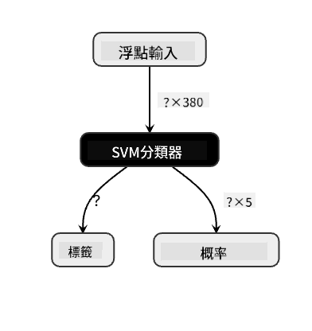
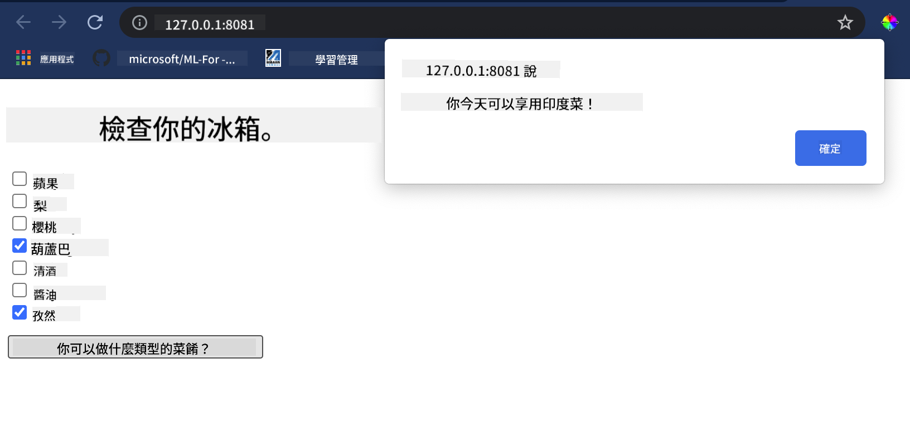

<!--
CO_OP_TRANSLATOR_METADATA:
{
  "original_hash": "ad2cf19d7490247558d20a6a59650d13",
  "translation_date": "2025-09-03T18:07:44+00:00",
  "source_file": "4-Classification/4-Applied/README.md",
  "language_code": "hk"
}
-->
# 建立一個美食推薦網頁應用程式

在這節課中，你將使用之前課程中學到的一些技術，並利用這個系列中使用的美味美食數據集，來建立一個分類模型。此外，你還將建立一個小型網頁應用程式，使用已保存的模型，並利用 Onnx 的網頁運行時。

機器學習最實用的應用之一就是建立推薦系統，而今天你可以邁出這個方向的第一步！

[](https://youtu.be/17wdM9AHMfg "應用機器學習")

> 🎥 點擊上方圖片觀看影片：Jen Looper 使用分類的美食數據建立了一個網頁應用程式

## [課前測驗](https://gray-sand-07a10f403.1.azurestaticapps.net/quiz/25/)

在這節課中，你將學到：

- 如何建立模型並將其保存為 Onnx 模型
- 如何使用 Netron 檢視模型
- 如何在網頁應用程式中使用你的模型進行推理

## 建立你的模型

建立應用機器學習系統是將這些技術應用於業務系統的重要部分。你可以將模型用於網頁應用程式中（因此在需要時也可以在離線環境中使用），方法是使用 Onnx。

在[之前的課程](../../3-Web-App/1-Web-App/README.md)中，你建立了一個關於 UFO 目擊事件的回歸模型，將其“pickle”保存，並在 Flask 應用程式中使用。雖然這種架構非常實用，但它是一個全棧的 Python 應用程式，而你的需求可能包括使用 JavaScript 應用程式。

在這節課中，你可以建立一個基於 JavaScript 的基本推理系統。不過，首先你需要訓練一個模型並將其轉換為 Onnx 格式。

## 練習 - 訓練分類模型

首先，使用我們之前使用的清理過的美食數據集來訓練一個分類模型。

1. 首先匯入有用的函式庫：

    ```python
    !pip install skl2onnx
    import pandas as pd 
    ```

    你需要使用 '[skl2onnx](https://onnx.ai/sklearn-onnx/)' 來幫助將 Scikit-learn 模型轉換為 Onnx 格式。

1. 然後，像之前課程中一樣，使用 `read_csv()` 讀取 CSV 文件來處理數據：

    ```python
    data = pd.read_csv('../data/cleaned_cuisines.csv')
    data.head()
    ```

1. 移除前兩列不必要的欄位，並將剩餘數據保存為 'X'：

    ```python
    X = data.iloc[:,2:]
    X.head()
    ```

1. 將標籤保存為 'y'：

    ```python
    y = data[['cuisine']]
    y.head()
    
    ```

### 開始訓練流程

我們將使用 'SVC' 函式庫，因為它具有良好的準確性。

1. 從 Scikit-learn 匯入適當的函式庫：

    ```python
    from sklearn.model_selection import train_test_split
    from sklearn.svm import SVC
    from sklearn.model_selection import cross_val_score
    from sklearn.metrics import accuracy_score,precision_score,confusion_matrix,classification_report
    ```

1. 分離訓練集和測試集：

    ```python
    X_train, X_test, y_train, y_test = train_test_split(X,y,test_size=0.3)
    ```

1. 像之前課程中一樣，建立一個 SVC 分類模型：

    ```python
    model = SVC(kernel='linear', C=10, probability=True,random_state=0)
    model.fit(X_train,y_train.values.ravel())
    ```

1. 現在，測試你的模型，呼叫 `predict()`：

    ```python
    y_pred = model.predict(X_test)
    ```

1. 輸出分類報告以檢查模型的質量：

    ```python
    print(classification_report(y_test,y_pred))
    ```

    如我們之前所見，準確性是很好的：

    ```output
                    precision    recall  f1-score   support
    
         chinese       0.72      0.69      0.70       257
          indian       0.91      0.87      0.89       243
        japanese       0.79      0.77      0.78       239
          korean       0.83      0.79      0.81       236
            thai       0.72      0.84      0.78       224
    
        accuracy                           0.79      1199
       macro avg       0.79      0.79      0.79      1199
    weighted avg       0.79      0.79      0.79      1199
    ```

### 將模型轉換為 Onnx

確保使用正確的 Tensor 數進行轉換。這個數據集中列出了 380 種食材，因此你需要在 `FloatTensorType` 中註明這個數字：

1. 使用 380 的 Tensor 數進行轉換。

    ```python
    from skl2onnx import convert_sklearn
    from skl2onnx.common.data_types import FloatTensorType
    
    initial_type = [('float_input', FloatTensorType([None, 380]))]
    options = {id(model): {'nocl': True, 'zipmap': False}}
    ```

1. 建立 onx 並保存為文件 **model.onnx**：

    ```python
    onx = convert_sklearn(model, initial_types=initial_type, options=options)
    with open("./model.onnx", "wb") as f:
        f.write(onx.SerializeToString())
    ```

    > 注意，你可以在轉換腳本中傳遞[選項](https://onnx.ai/sklearn-onnx/parameterized.html)。在這個例子中，我們將 'nocl' 設為 True，'zipmap' 設為 False。由於這是一個分類模型，你可以選擇移除 ZipMap，它會生成一個字典列表（非必要）。`nocl` 指的是是否在模型中包含類別資訊。通過將 `nocl` 設為 'True'，可以減少模型的大小。

執行整個筆記本後，將建立一個 Onnx 模型並將其保存到此文件夾中。

## 檢視你的模型

Onnx 模型在 Visual Studio Code 中不太容易查看，但有一個許多研究人員使用的非常好的免費軟體可以用來可視化模型，確保其正確構建。下載 [Netron](https://github.com/lutzroeder/Netron) 並打開你的 model.onnx 文件。你可以看到你的簡單模型被可視化，顯示其 380 個輸入和分類器：



Netron 是一個查看模型的有用工具。

現在你已經準備好在網頁應用程式中使用這個簡單的模型了。讓我們建立一個應用程式，當你查看冰箱並試圖找出可以用剩餘食材烹飪的菜餚時，這個應用程式會派上用場。

## 建立推薦網頁應用程式

你可以直接在網頁應用程式中使用你的模型。這種架構還允許你在本地甚至離線運行它。首先，在存儲 `model.onnx` 文件的同一文件夾中建立一個 `index.html` 文件。

1. 在這個文件 _index.html_ 中，添加以下標記：

    ```html
    <!DOCTYPE html>
    <html>
        <header>
            <title>Cuisine Matcher</title>
        </header>
        <body>
            ...
        </body>
    </html>
    ```

1. 現在，在 `body` 標籤內，添加一些標記以顯示一些反映食材的複選框列表：

    ```html
    <h1>Check your refrigerator. What can you create?</h1>
            <div id="wrapper">
                <div class="boxCont">
                    <input type="checkbox" value="4" class="checkbox">
                    <label>apple</label>
                </div>
            
                <div class="boxCont">
                    <input type="checkbox" value="247" class="checkbox">
                    <label>pear</label>
                </div>
            
                <div class="boxCont">
                    <input type="checkbox" value="77" class="checkbox">
                    <label>cherry</label>
                </div>
    
                <div class="boxCont">
                    <input type="checkbox" value="126" class="checkbox">
                    <label>fenugreek</label>
                </div>
    
                <div class="boxCont">
                    <input type="checkbox" value="302" class="checkbox">
                    <label>sake</label>
                </div>
    
                <div class="boxCont">
                    <input type="checkbox" value="327" class="checkbox">
                    <label>soy sauce</label>
                </div>
    
                <div class="boxCont">
                    <input type="checkbox" value="112" class="checkbox">
                    <label>cumin</label>
                </div>
            </div>
            <div style="padding-top:10px">
                <button onClick="startInference()">What kind of cuisine can you make?</button>
            </div> 
    ```

    注意，每個複選框都有一個值。這反映了數據集中食材所在的索引。例如，蘋果在這個按字母順序排列的列表中佔據第五列，因此其值為 '4'（因為我們從 0 開始計數）。你可以查閱 [ingredients spreadsheet](../../../../4-Classification/data/ingredient_indexes.csv) 來查找特定食材的索引。

    繼續在 index.html 文件中工作，在最後一個關閉的 `</div>` 後添加一個腳本區塊，該區塊將調用模型。

1. 首先，匯入 [Onnx Runtime](https://www.onnxruntime.ai/)：

    ```html
    <script src="https://cdn.jsdelivr.net/npm/onnxruntime-web@1.9.0/dist/ort.min.js"></script> 
    ```

    > Onnx Runtime 用於在廣泛的硬體平台上運行你的 Onnx 模型，包括優化和使用的 API。

1. 一旦 Runtime 就位，你可以調用它：

    ```html
    <script>
        const ingredients = Array(380).fill(0);
        
        const checks = [...document.querySelectorAll('.checkbox')];
        
        checks.forEach(check => {
            check.addEventListener('change', function() {
                // toggle the state of the ingredient
                // based on the checkbox's value (1 or 0)
                ingredients[check.value] = check.checked ? 1 : 0;
            });
        });

        function testCheckboxes() {
            // validate if at least one checkbox is checked
            return checks.some(check => check.checked);
        }

        async function startInference() {

            let atLeastOneChecked = testCheckboxes()

            if (!atLeastOneChecked) {
                alert('Please select at least one ingredient.');
                return;
            }
            try {
                // create a new session and load the model.
                
                const session = await ort.InferenceSession.create('./model.onnx');

                const input = new ort.Tensor(new Float32Array(ingredients), [1, 380]);
                const feeds = { float_input: input };

                // feed inputs and run
                const results = await session.run(feeds);

                // read from results
                alert('You can enjoy ' + results.label.data[0] + ' cuisine today!')

            } catch (e) {
                console.log(`failed to inference ONNX model`);
                console.error(e);
            }
        }
               
    </script>
    ```

在這段程式碼中，發生了以下幾件事：

1. 你建立了一個包含 380 個可能值（1 或 0）的陣列，根據是否選中某個食材複選框來設置並發送到模型進行推理。
2. 你建立了一個複選框陣列，以及一個在應用程式啟動時調用的 `init` 函數，用於確定複選框是否被選中。當複選框被選中時，`ingredients` 陣列會被修改以反映所選食材。
3. 你建立了一個 `testCheckboxes` 函數，用於檢查是否有任何複選框被選中。
4. 當按下按鈕時，你使用 `startInference` 函數，如果有任何複選框被選中，就開始推理。
5. 推理流程包括：
   1. 設置模型的非同步加載
   2. 建立一個 Tensor 結構以發送到模型
   3. 建立 'feeds'，反映你在訓練模型時建立的 `float_input` 輸入（你可以使用 Netron 驗證該名稱）
   4. 將這些 'feeds' 發送到模型並等待回應

## 測試你的應用程式

在 Visual Studio Code 中的終端會話中，進入 index.html 文件所在的文件夾。確保你已全域安裝 [http-server](https://www.npmjs.com/package/http-server)，然後在提示符下輸入 `http-server`。一個本地主機應該會打開，你可以查看你的網頁應用程式。檢查根據不同食材推薦的菜餚：



恭喜你，你已經建立了一個帶有幾個欄位的“推薦”網頁應用程式。花些時間來擴展這個系統吧！

## 🚀挑戰

你的網頁應用程式非常簡單，因此繼續使用 [ingredient_indexes](../../../../4-Classification/data/ingredient_indexes.csv) 數據中的食材及其索引來擴展它。哪些味道組合可以創造出特定的國家菜餚？

## [課後測驗](https://gray-sand-07a10f403.1.azurestaticapps.net/quiz/26/)

## 回顧與自學

雖然這節課只是簡單介紹了如何為食材建立推薦系統，但這個機器學習應用領域有非常豐富的例子。閱讀更多關於這些系統如何構建的內容：

- https://www.sciencedirect.com/topics/computer-science/recommendation-engine
- https://www.technologyreview.com/2014/08/25/171547/the-ultimate-challenge-for-recommendation-engines/
- https://www.technologyreview.com/2015/03/23/168831/everything-is-a-recommendation/

## 作業

[建立一個新的推薦系統](assignment.md)

---

**免責聲明**：  
本文件已使用人工智能翻譯服務 [Co-op Translator](https://github.com/Azure/co-op-translator) 進行翻譯。儘管我們致力於提供準確的翻譯，但請注意，自動翻譯可能包含錯誤或不準確之處。原始文件的母語版本應被視為權威來源。對於重要信息，建議使用專業人工翻譯。我們對因使用此翻譯而引起的任何誤解或錯誤解釋不承擔責任。