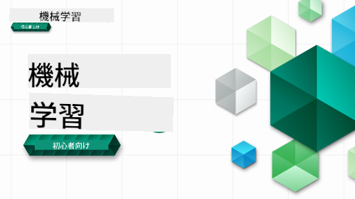

<!--
CO_OP_TRANSLATOR_METADATA:
{
  "original_hash": "4f0e1f1641aa1659ed5c8debc6f2e0b2",
  "translation_date": "2025-09-23T09:02:58+00:00",
  "source_file": "README.md",
  "language_code": "ja"
}
-->

### 🌐 多言語対応

#### GitHub Action によるサポート（自動化され、常に最新）

[French](../fr/README.md) | [Spanish](../es/README.md) | [German](../de/README.md) | [Russian](../ru/README.md) | [Arabic](../ar/README.md) | [Persian (Farsi)](../fa/README.md) | [Urdu](../ur/README.md) | [Chinese (Simplified)](../zh/README.md) | [Chinese (Traditional, Macau)](../mo/README.md) | [Chinese (Traditional, Hong Kong)](../hk/README.md) | [Chinese (Traditional, Taiwan)](../tw/README.md) | [Japanese](./README.md) | [Korean](../ko/README.md) | [Hindi](../hi/README.md) | [Bengali](../bn/README.md) | [Marathi](../mr/README.md) | [Nepali](../ne/README.md) | [Punjabi (Gurmukhi)](../pa/README.md) | [Portuguese (Portugal)](../pt/README.md) | [Portuguese (Brazil)](../br/README.md) | [Italian](../it/README.md) | [Polish](../pl/README.md) | [Turkish](../tr/README.md) | [Greek](../el/README.md) | [Thai](../th/README.md) | [Swedish](../sv/README.md) | [Danish](../da/README.md) | [Norwegian](../no/README.md) | [Finnish](../fi/README.md) | [Dutch](../nl/README.md) | [Hebrew](../he/README.md) | [Vietnamese](../vi/README.md) | [Indonesian](../id/README.md) | [Malay](../ms/README.md) | [Tagalog (Filipino)](../tl/README.md) | [Swahili](../sw/README.md) | [Hungarian](../hu/README.md) | [Czech](../cs/README.md) | [Slovak](../sk/README.md) | [Romanian](../ro/README.md) | [Bulgarian](../bg/README.md) | [Serbian (Cyrillic)](../sr/README.md) | [Croatian](../hr/README.md) | [Slovenian](../sl/README.md) | [Ukrainian](../uk/README.md) | [Burmese (Myanmar)](../my/README.md)

 #### コミュニティに参加しよう

現在、DiscordでAI学習シリーズを開催中です。詳細を確認し、2025年9月18日から30日までの[Learn with AI Series](https://aka.ms/learnwithai/discord)に参加してください。GitHub Copilotをデータサイエンスに活用するためのヒントやコツを学べます。

# 初心者のための機械学習 - カリキュラム

> 🌍 世界中を旅しながら、世界の文化を通じて機械学習を探求しましょう 🌍

Microsoftのクラウドアドボケイトチームは、**機械学習**に関する12週間、26レッスンのカリキュラムを提供します。このカリキュラムでは、主にScikit-learnライブラリを使用し、ディープラーニングを避けながら、いわゆる**クラシックな機械学習**について学びます。ディープラーニングについては、[AI for Beginners' カリキュラム](https://aka.ms/ai4beginners)で取り上げています。このレッスンを['Data Science for Beginners' カリキュラム](https://aka.ms/ds4beginners)と組み合わせて学ぶこともできます。

私たちと一緒に世界中を旅しながら、これらのクラシックな技術を世界中のデータに適用していきましょう。各レッスンには、事前および事後のクイズ、レッスンを完了するための手順、解答、課題などが含まれています。プロジェクトベースの教育法により、学びながら構築することで、新しいスキルを定着させることができます。

**✍️ 著者の皆さんに心から感謝します** Jen Looper, Stephen Howell, Francesca Lazzeri, Tomomi Imura, Cassie Breviu, Dmitry Soshnikov, Chris Noring, Anirban Mukherjee, Ornella Altunyan, Ruth Yakubu, Amy Boyd

**🎨 イラストレーターの皆さんにも感謝します** Tomomi Imura, Dasani Madipalli, Jen Looper

**🙏 特別な感謝 🙏 をMicrosoft Student Ambassadorの著者、レビュアー、コンテンツ貢献者の皆さんに** 特にRishit Dagli, Muhammad Sakib Khan Inan, Rohan Raj, Alexandru Petrescu, Abhishek Jaiswal, Nawrin Tabassum, Ioan Samuila, Snigdha Agarwal

**🤩 Rレッスンに貢献してくれたMicrosoft Student AmbassadorsのEric Wanjau, Jasleen Sondhi, Vidushi Guptaにも特別な感謝を！**

# 始め方

以下の手順に従ってください：
1. **リポジトリをフォークする**: このページの右上にある「Fork」ボタンをクリックします。
2. **リポジトリをクローンする**: `git clone https://github.com/microsoft/ML-For-Beginners.git`

> [このコースの追加リソースはMicrosoft Learnコレクションで見つけることができます](https://learn.microsoft.com/en-us/collections/qrqzamz1nn2wx3?WT.mc_id=academic-77952-bethanycheum)

**[学生の皆さん](https://aka.ms/student-page)**、このカリキュラムを使用するには、リポジトリ全体を自分のGitHubアカウントにフォークし、個人またはグループで演習を完了してください：

- レクチャー前のクイズから始めましょう。
- レクチャーを読み、各知識チェックで一時停止して振り返りながら活動を完了してください。
- レッスンを理解しながらプロジェクトを作成してみてください。ただし、解答コードは各プロジェクト指向レッスンの`/solution`フォルダーにあります。
- レクチャー後のクイズを受けてください。
- チャレンジを完了してください。
- 課題を完了してください。
- レッスングループを完了した後、[Discussion Board](https://github.com/microsoft/ML-For-Beginners/discussions)を訪れ、適切なPATルーブリックを記入して「声に出して学ぶ」ことを実践してください。PAT（進捗評価ツール）は、学習を深めるために記入するルーブリックです。他のPATに反応することで、一緒に学ぶことができます。

> さらなる学習のために、これらの[Microsoft Learn](https://docs.microsoft.com/en-us/users/jenlooper-2911/collections/k7o7tg1gp306q4?WT.mc_id=academic-77952-leestott)モジュールと学習パスをお勧めします。

**教師の皆さん**、このカリキュラムの使用方法について[いくつかの提案を含めています](for-teachers.md)。

---

## ビデオウォークスルー

一部のレッスンは短い形式のビデオとして利用可能です。これらはレッスン内でインラインで見つけることができるほか、[Microsoft Developer YouTubeチャンネルのML for Beginnersプレイリスト](https://aka.ms/ml-beginners-videos)で確認できます。以下の画像をクリックしてください。

---

## チーム紹介

**Gif作成者** [Mohit Jaisal](https://linkedin.com/in/mohitjaisal)

> 🎥 上の画像をクリックして、このプロジェクトと作成者についてのビデオをご覧ください！

---

## 教育方針

このカリキュラムを構築する際、2つの教育方針を採用しました：**プロジェクトベース**であることと、**頻繁なクイズ**を含むことです。さらに、このカリキュラムには一貫性を持たせるための共通の**テーマ**があります。

プロジェクトに沿った内容を確保することで、学生にとってより魅力的なプロセスとなり、概念の定着が促進されます。また、授業前の低リスクなクイズは、学生がトピックを学ぶ意図を設定し、授業後のクイズはさらに定着を確実にします。このカリキュラムは柔軟で楽しいものとして設計されており、全体または部分的に受講することができます。プロジェクトは小さなものから始まり、12週間のサイクルの終わりには徐々に複雑になります。このカリキュラムには、MLの実世界での応用に関する後書きも含まれており、追加のクレジットや議論の基礎として使用できます。

> [行動規範](CODE_OF_CONDUCT.md)、[貢献方法](CONTRIBUTING.md)、[翻訳ガイドライン](TRANSLATIONS.md)をご覧ください。建設的なフィードバックを歓迎します！

## 各レッスンには以下が含まれます

- 任意のスケッチノート
- 任意の補足ビデオ
- ビデオウォークスルー（一部のレッスンのみ）
- [レクチャー前のウォームアップクイズ](https://ff-quizzes.netlify.app/en/ml/)
- 書面によるレッスン
- プロジェクトベースのレッスンの場合、プロジェクトを構築するためのステップバイステップガイド
- 知識チェック
- チャレンジ
- 補足読書
- 課題
- [レクチャー後のクイズ](https://ff-quizzes.netlify.app/en/ml/)

> **言語についての注意**: これらのレッスンは主にPythonで書かれていますが、多くはRでも利用可能です。Rレッスンを完了するには、`/solution`フォルダーに移動し、Rレッスンを探してください。それらには`.rmd`拡張子が含まれており、これは**R Markdown**ファイルを表します。R Markdownは、`コードチャンク`（Rや他の言語のコード）と`YAMLヘッダー`（PDFなどの出力形式をガイドする）を`Markdownドキュメント`に埋め込んだものとして簡単に定義できます。このため、コード、出力、考えをMarkdownに書き込むことで、データサイエンスのための優れた著作フレームワークとして機能します。さらに、R MarkdownドキュメントはPDF、HTML、Wordなどの出力形式にレンダリングできます。

> **クイズについての注意**: すべてのクイズは[Quiz Appフォルダー](../../quiz-app)に含まれており、合計52個のクイズが各3問ずつあります。これらはレッスン内からリンクされていますが、クイズアプリはローカルで実行することもできます。`quiz-app`フォルダーの指示に従ってローカルホストまたはAzureにデプロイしてください。

| レッスン番号 |                             トピック                              |                   レッスングループ                   | 学習目標                                                                                                             |                                                              リンクされたレッスン                                                               |                        著者                        |
| :-----------: | :------------------------------------------------------------: | :-------------------------------------------------: | ------------------------------------------------------------------------------------------------------------------------------- | :--------------------------------------------------------------------------------------------------------------------------------------: | :--------------------------------------------------: |
|      01       |                機械学習の紹介                |      [Introduction](1-Introduction/README.md)       | 機械学習の基本概念を学ぶ                                                                                |                                             [Lesson](1-Introduction/1-intro-to-ML/README.md)                                             |                       Muhammad                       |
|      02       |                機械学習の歴史                 |      [Introduction](1-Introduction/README.md)       | この分野の歴史を学ぶ                                                                                         |                                            [Lesson](1-Introduction/2-history-of-ML/README.md)                                            |                     Jen and Amy                      |
|      03       |                 公平性と機械学習                              |      [Introduction](1-Introduction/README.md)       | 学生がMLモデルを構築・適用する際に考慮すべき公平性に関する重要な哲学的問題とは？ |                                              [Lesson](1-Introduction/3-fairness/README.md)                                               |                        Tomomi                        |
|      04       |                機械学習の技術                                 |      [Introduction](1-Introduction/README.md)       | ML研究者がMLモデルを構築するために使用する技術とは？                                                                       |                                          [Lesson](1-Introduction/4-techniques-of-ML/README.md)                                           |                    Chris and Jen                     |
|      05       |                   回帰の入門                                  |        [Regression](2-Regression/README.md)         | PythonとScikit-learnを使った回帰モデルの基礎を学ぶ                                                                          |         [Python](2-Regression/1-Tools/README.md) • [R](../../2-Regression/1-Tools/solution/R/lesson_1.html)         |      Jen • Eric Wanjau       |
|      06       |                北米のカボチャ価格 🎃                          |        [Regression](2-Regression/README.md)         | MLの準備としてデータを可視化し、クリーニングする                                                                            |          [Python](2-Regression/2-Data/README.md) • [R](../../2-Regression/2-Data/solution/R/lesson_2.html)          |      Jen • Eric Wanjau       |
|      07       |                北米のカボチャ価格 🎃                          |        [Regression](2-Regression/README.md)         | 線形回帰モデルと多項式回帰モデルを構築する                                                                                   |        [Python](2-Regression/3-Linear/README.md) • [R](../../2-Regression/3-Linear/solution/R/lesson_3.html)        |      Jen and Dmitry • Eric Wanjau       |
|      08       |                北米のカボチャ価格 🎃                          |        [Regression](2-Regression/README.md)         | ロジスティック回帰モデルを構築する                                                                                           |     [Python](2-Regression/4-Logistic/README.md) • [R](../../2-Regression/4-Logistic/solution/R/lesson_4.html)      |      Jen • Eric Wanjau       |
|      09       |                          Webアプリ 🔌                          |           [Web App](3-Web-App/README.md)            | 訓練済みモデルを使用するWebアプリを構築する                                                                                  |                                                 [Python](3-Web-App/1-Web-App/README.md)                                                  |                         Jen                          |
|      10       |                 分類の入門                                    |    [Classification](4-Classification/README.md)     | データをクリーニング、準備、可視化し、分類の基礎を学ぶ                                                                       | [Python](4-Classification/1-Introduction/README.md) • [R](../../4-Classification/1-Introduction/solution/R/lesson_10.html)  | Jen and Cassie • Eric Wanjau |
|      11       |             美味しいアジアとインド料理 🍜                     |    [Classification](4-Classification/README.md)     | 分類器の基礎を学ぶ                                                                                                           | [Python](4-Classification/2-Classifiers-1/README.md) • [R](../../4-Classification/2-Classifiers-1/solution/R/lesson_11.html) | Jen and Cassie • Eric Wanjau |
|      12       |             美味しいアジアとインド料理 🍜                     |    [Classification](4-Classification/README.md)     | より多くの分類器について学ぶ                                                                                                 | [Python](4-Classification/3-Classifiers-2/README.md) • [R](../../4-Classification/3-Classifiers-2/solution/R/lesson_12.html) | Jen and Cassie • Eric Wanjau |
|      13       |             美味しいアジアとインド料理 🍜                     |    [Classification](4-Classification/README.md)     | モデルを使用して推薦Webアプリを構築する                                                                                      |                                              [Python](4-Classification/4-Applied/README.md)                                              |                         Jen                          |
|      14       |                   クラスタリングの入門                        |        [Clustering](5-Clustering/README.md)         | データをクリーニング、準備、可視化し、クラスタリングの基礎を学ぶ                                                             |         [Python](5-Clustering/1-Visualize/README.md) • [R](../../5-Clustering/1-Visualize/solution/R/lesson_14.html)         |      Jen • Eric Wanjau       |
|      15       |              ナイジェリアの音楽嗜好を探る 🎧                   |        [Clustering](5-Clustering/README.md)         | K-Meansクラスタリング手法を探る                                                                                              |           [Python](5-Clustering/2-K-Means/README.md) • [R](../../5-Clustering/2-K-Means/solution/R/lesson_15.html)           |      Jen • Eric Wanjau       |
|      16       |        自然言語処理の入門 ☕️                                 |   [Natural language processing](6-NLP/README.md)    | 簡単なボットを構築しながらNLPの基礎を学ぶ                                                                                   |                                             [Python](6-NLP/1-Introduction-to-NLP/README.md)                                              |                       Stephen                        |
|      17       |                      一般的なNLPタスク ☕️                     |   [Natural language processing](6-NLP/README.md)    | 言語構造を扱う際に必要な一般的なタスクを理解し、NLPの知識を深める                                                           |                                                    [Python](6-NLP/2-Tasks/README.md)                                                     |                       Stephen                        |
|      18       |             翻訳と感情分析 ♥️                                 |   [Natural language processing](6-NLP/README.md)    | ジェーン・オースティンの作品を使った翻訳と感情分析                                                                           |                                            [Python](6-NLP/3-Translation-Sentiment/README.md)                                             |                       Stephen                        |
|      19       |                  ヨーロッパのロマンティックなホテル ♥️         |   [Natural language processing](6-NLP/README.md)    | ホテルレビューを使った感情分析1                                                                                            |                                               [Python](6-NLP/4-Hotel-Reviews-1/README.md)                                                |                       Stephen                        |
|      20       |                  ヨーロッパのロマンティックなホテル ♥️         |   [Natural language processing](6-NLP/README.md)    | ホテルレビューを使った感情分析2                                                                                            |                                               [Python](6-NLP/5-Hotel-Reviews-2/README.md)                                                |                       Stephen                        |
|      21       |            時系列予測の入門                                   |        [Time series](7-TimeSeries/README.md)        | 時系列予測の基礎を学ぶ                                                                                                       |                                             [Python](7-TimeSeries/1-Introduction/README.md)                                              |                      Francesca                       |
|      22       | ⚡️ 世界の電力使用 ⚡️ - ARIMAによる時系列予測                 |        [Time series](7-TimeSeries/README.md)        | ARIMAを使った時系列予測                                                                                                      |                                                 [Python](7-TimeSeries/2-ARIMA/README.md)                                                 |                      Francesca                       |
|      23       | ⚡️ 世界の電力使用 ⚡️ - SVRによる時系列予測                   |        [Time series](7-TimeSeries/README.md)        | サポートベクター回帰を使った時系列予測                                                                                       |                                                  [Python](7-TimeSeries/3-SVR/README.md)                                                  |                       Anirban                        |
|      24       |             強化学習の入門                                    | [Reinforcement learning](8-Reinforcement/README.md) | Q-Learningを使った強化学習の基礎を学ぶ                                                                                       |                                             [Python](8-Reinforcement/1-QLearning/README.md)                                              |                        Dmitry                        |
|      25       |                 ピーターをオオカミから守ろう！🐺              | [Reinforcement learning](8-Reinforcement/README.md) | 強化学習Gym                                                                                                                  |                                                [Python](8-Reinforcement/2-Gym/README.md)                                                 |                        Dmitry                        |
|  Postscript   |            実世界のMLシナリオと応用                            |      [ML in the Wild](9-Real-World/README.md)       | 古典的なMLの興味深く示唆に富む実世界の応用                                                                                   |                                             [Lesson](9-Real-World/1-Applications/README.md)                                              |                         Team                         |
|  Postscript   |            RAIダッシュボードを使ったMLモデルのデバッグ         |      [ML in the Wild](9-Real-World/README.md)       | 責任あるAIダッシュボードコンポーネントを使用した機械学習モデルのデバッグ                                                              |                                             [Lesson](9-Real-World/2-Debugging-ML-Models/README.md)                                              |                         Ruth Yakubu                       |

> [このコースの追加リソースはMicrosoft Learnコレクションで見つけることができます](https://learn.microsoft.com/en-us/collections/qrqzamz1nn2wx3?WT.mc_id=academic-77952-bethanycheum)

## オフラインアクセス

このドキュメントをオフラインで実行するには、[Docsify](https://docsify.js.org/#/)を使用します。このリポジトリをフォークし、ローカルマシンに[Docsifyをインストール](https://docsify.js.org/#/quickstart)してから、このリポジトリのルートフォルダで`docsify serve`と入力してください。ウェブサイトはローカルホストのポート3000で提供されます: `localhost:3000`.

## PDF

リンク付きのカリキュラムのPDFは[こちら](https://microsoft.github.io/ML-For-Beginners/pdf/readme.pdf)で見つけることができます。

## 🎒 その他のコース

私たちのチームは他にもコースを提供しています！以下をチェックしてください:

- [Generative AI for Beginners](https://aka.ms/genai-beginners)
- [Generative AI for Beginners .NET](https://github.com/microsoft/Generative-AI-for-beginners-dotnet)
- [Generative AI with JavaScript](https://github.com/microsoft/generative-ai-with-javascript)
- [Generative AI with Java](https://github.com/microsoft/Generative-AI-for-beginners-java)
- [AI for Beginners](https://aka.ms/ai-beginners)
- [Data Science for Beginners](https://aka.ms/datascience-beginners)
- [ML for Beginners](https://aka.ms/ml-beginners)
- [Cybersecurity for Beginners](https://github.com/microsoft/Security-101) 
- [Web Dev for Beginners](https://aka.ms/webdev-beginners)
- [IoT for Beginners](https://aka.ms/iot-beginners)
- [XR Development for Beginners](https://github.com/microsoft/xr-development-for-beginners)
- [Mastering GitHub Copilot for Paired Programming](https://github.com/microsoft/Mastering-GitHub-Copilot-for-Paired-Programming)
- [Mastering GitHub Copilot for C#/.NET Developers](https://github.com/microsoft/mastering-github-copilot-for-dotnet-csharp-developers)
- [Choose Your Own Copilot Adventure](https://github.com/microsoft/CopilotAdventures)

---

