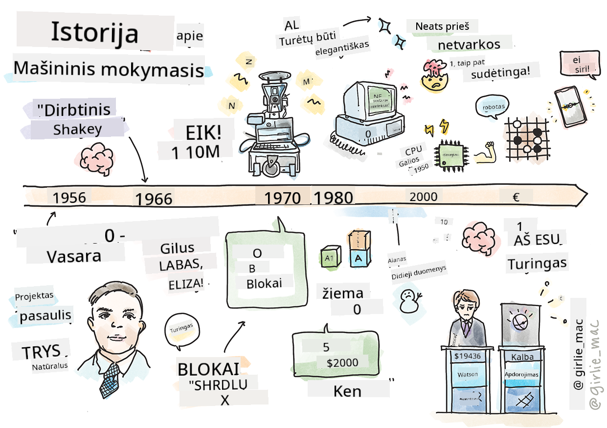
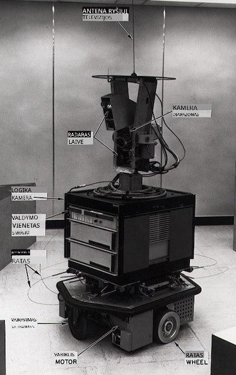
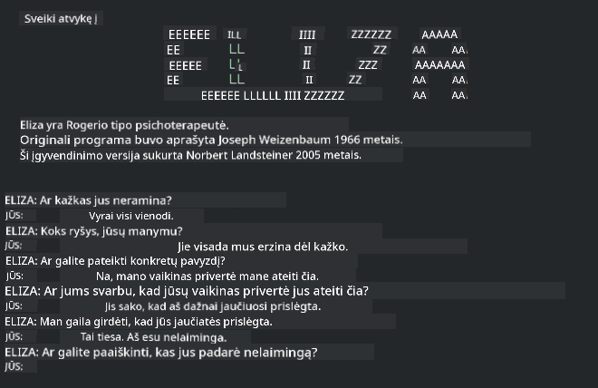

<!--
CO_OP_TRANSLATOR_METADATA:
{
  "original_hash": "b2d11df10030cacc41427a1fbc8bc8f1",
  "translation_date": "2025-09-03T17:49:13+00:00",
  "source_file": "1-Introduction/2-history-of-ML/README.md",
  "language_code": "lt"
}
-->
# Mašininio mokymosi istorija

> Sketchnote sukūrė [Tomomi Imura](https://www.twitter.com/girlie_mac)

## [Prieš paskaitą: testas](https://gray-sand-07a10f403.1.azurestaticapps.net/quiz/3/)

---

> 🎥 Spustelėkite aukščiau esančią nuotrauką, kad peržiūrėtumėte trumpą vaizdo įrašą apie šią pamoką.

Šioje pamokoje apžvelgsime svarbiausius mašininio mokymosi ir dirbtinio intelekto istorijos etapus.

Dirbtinio intelekto (DI) istorija kaip sritis yra glaudžiai susijusi su mašininio mokymosi istorija, nes algoritmai ir skaičiavimo pažanga, kuri sudaro ML pagrindą, prisidėjo prie DI vystymosi. Svarbu prisiminti, kad nors šios sritys kaip atskiros tyrimų kryptys pradėjo formuotis 1950-aisiais, svarbūs [algoritminiai, statistiniai, matematiniai, skaičiavimo ir techniniai atradimai](https://wikipedia.org/wiki/Timeline_of_machine_learning) vyko dar prieš šį laikotarpį ir persidengė su juo. Iš tiesų, žmonės apie šiuos klausimus galvojo jau [šimtus metų](https://wikipedia.org/wiki/History_of_artificial_intelligence): šiame straipsnyje aptariami istoriniai intelektualiniai pagrindai idėjos apie „mąstančią mašiną“.

---
## Svarbūs atradimai

- 1763, 1812 [Bayeso teorema](https://wikipedia.org/wiki/Bayes%27_theorem) ir jos pirmtakai. Ši teorema ir jos taikymas sudaro pagrindą išvadoms, apibūdinant įvykio tikimybę remiantis ankstesnėmis žiniomis.
- 1805 [Mažiausių kvadratų teorija](https://wikipedia.org/wiki/Least_squares), sukurta prancūzų matematiko Adrien-Marie Legendre. Ši teorija, apie kurią sužinosite mūsų regresijos skyriuje, padeda duomenų pritaikyme.
- 1913 [Markovo grandinės](https://wikipedia.org/wiki/Markov_chain), pavadintos rusų matematiko Andrejaus Markovo vardu, naudojamos apibūdinti galimų įvykių seką remiantis ankstesne būsena.
- 1957 [Perceptronas](https://wikipedia.org/wiki/Perceptron) – linijinis klasifikatorius, kurį sukūrė amerikiečių psichologas Frankas Rosenblattas, ir kuris sudaro pagrindą giluminio mokymosi pažangai.

---

- 1967 [Artimiausio kaimyno algoritmas](https://wikipedia.org/wiki/Nearest_neighbor) iš pradžių buvo sukurtas maršrutų sudarymui. ML kontekste jis naudojamas modeliams aptikti.
- 1970 [Atgalinio sklidimo algoritmas](https://wikipedia.org/wiki/Backpropagation) naudojamas treniruoti [priekinius neuroninius tinklus](https://wikipedia.org/wiki/Feedforward_neural_network).
- 1982 [Pasikartojantys neuroniniai tinklai](https://wikipedia.org/wiki/Recurrent_neural_network) – dirbtiniai neuroniniai tinklai, sukurti iš priekinių neuroninių tinklų, kurie sudaro laiko grafikus.

✅ Atlikite nedidelį tyrimą. Kokios kitos datos išsiskiria kaip svarbios ML ir DI istorijoje?

---
## 1950: Mąstančios mašinos

Alanas Turingas, išskirtinė asmenybė, kuris [2019 m. visuomenės apklausoje](https://wikipedia.org/wiki/Icons:_The_Greatest_Person_of_the_20th_Century) buvo pripažintas didžiausiu XX a. mokslininku, laikomas padėjusiu pagrindą „mąstančios mašinos“ koncepcijai. Jis susidūrė su skeptikais ir savo paties poreikiu empiriškai įrodyti šią koncepciją, iš dalies sukūręs [Turingo testą](https://www.bbc.com/news/technology-18475646), kurį nagrinėsite mūsų NLP pamokose.

---
## 1956: Dartmuto vasaros tyrimų projektas

„Dartmuto vasaros tyrimų projektas apie dirbtinį intelektą buvo svarbus įvykis dirbtinio intelekto kaip srities istorijoje“, ir būtent čia buvo sugalvotas terminas „dirbtinis intelektas“ ([šaltinis](https://250.dartmouth.edu/highlights/artificial-intelligence-ai-coined-dartmouth)).

> Kiekvienas mokymosi ar bet kurios kitos intelekto savybės aspektas iš esmės gali būti taip tiksliai aprašytas, kad mašina galėtų jį imituoti.

---

Pagrindinis tyrėjas, matematikos profesorius Johnas McCarthy, tikėjosi „remtis prielaida, kad kiekvienas mokymosi ar bet kurios kitos intelekto savybės aspektas iš esmės gali būti taip tiksliai aprašytas, kad mašina galėtų jį imituoti.“ Dalyviai buvo ir kitas šios srities šviesulys – Marvinas Minsky.

Seminaras laikomas paskatinusiu ir inicijavusiu kelias diskusijas, įskaitant „simbolinių metodų iškilimą, sistemų, orientuotų į ribotas sritis (ankstyvieji ekspertų sistemos), ir dedukcinių sistemų prieš indukcines sistemas“ ([šaltinis](https://wikipedia.org/wiki/Dartmouth_workshop)).

---
## 1956 - 1974: „Auksiniai metai“

Nuo 1950-ųjų iki 1970-ųjų vidurio vyravo optimizmas, kad DI galėtų išspręsti daugelį problemų. 1967 m. Marvinas Minsky užtikrintai teigė: „Per vieną kartą... dirbtinio intelekto sukūrimo problema iš esmės bus išspręsta.“ (Minsky, Marvin (1967), Computation: Finite and Infinite Machines, Englewood Cliffs, N.J.: Prentice-Hall)

Natūralios kalbos apdorojimo tyrimai klestėjo, paieška buvo patobulinta ir tapo galingesnė, o „mikropasaulių“ koncepcija buvo sukurta, kur paprastos užduotys buvo atliekamos naudojant paprastas kalbos instrukcijas.

---

Tyrimai buvo gerai finansuojami vyriausybės agentūrų, buvo pasiekta pažanga skaičiavimuose ir algoritmuose, o intelektualių mašinų prototipai buvo sukurti. Kai kurios iš šių mašinų apima:

* [Shakey robotą](https://wikipedia.org/wiki/Shakey_the_robot), kuris galėjo manevruoti ir nuspręsti, kaip „protingai“ atlikti užduotis.

    
    > Shakey 1972 m.

---

* Eliza, ankstyvas „chatterbotas“, galėjo bendrauti su žmonėmis ir veikti kaip primityvus „terapeutas“. Apie Elizą sužinosite daugiau NLP pamokose.

    
    > Elizos, chatbot versija

---

* „Blokų pasaulis“ buvo mikropasaulio pavyzdys, kur blokai galėjo būti sukrauti ir surūšiuoti, o eksperimentai mokant mašinas priimti sprendimus galėjo būti išbandyti. Pažanga, pasiekta naudojant bibliotekas, tokias kaip [SHRDLU](https://wikipedia.org/wiki/SHRDLU), padėjo kalbos apdorojimui judėti į priekį.

    

    > 🎥 Spustelėkite aukščiau esančią nuotrauką, kad peržiūrėtumėte vaizdo įrašą: Blokų pasaulis su SHRDLU

---
## 1974 - 1980: „DI žiema“

Iki 1970-ųjų vidurio tapo akivaizdu, kad „intelektualių mašinų“ kūrimo sudėtingumas buvo nepakankamai įvertintas, o jų pažadas, atsižvelgiant į turimą skaičiavimo galią, buvo pervertintas. Finansavimas sumažėjo, o pasitikėjimas šia sritimi sulėtėjo. Kai kurios problemos, kurios paveikė pasitikėjimą, apima:
---
- **Ribotumai**. Skaičiavimo galia buvo per maža.
- **Kombinatorinis sprogimas**. Parametrų, kuriuos reikėjo treniruoti, kiekis eksponentiškai augo, kai kompiuteriams buvo keliami didesni reikalavimai, be lygiagrečios skaičiavimo galios ir pajėgumų evoliucijos.
- **Duomenų trūkumas**. Duomenų trūkumas trukdė testavimo, kūrimo ir algoritmų tobulinimo procesui.
- **Ar užduodame tinkamus klausimus?**. Pradėta abejoti pačiais užduodamais klausimais. Tyrėjai susidūrė su kritika dėl savo požiūrių:
  - Turingo testai buvo kvestionuojami, be kita ko, „kinų kambario teorijos“, kuri teigė, kad „programuojant skaitmeninį kompiuterį gali atrodyti, kad jis supranta kalbą, tačiau negali sukurti tikro supratimo.“ ([šaltinis](https://plato.stanford.edu/entries/chinese-room/))
  - Etika, susijusi su dirbtinio intelekto, tokio kaip „terapeutas“ ELIZA, įvedimu į visuomenę, buvo ginčijama.

---

Tuo pačiu metu pradėjo formuotis įvairios DI mokyklos. Buvo nustatyta dichotomija tarp ["nešvaraus" ir "tvarkingo DI"](https://wikipedia.org/wiki/Neats_and_scruffies) praktikų. _Nešvarios_ laboratorijos valandų valandas koregavo programas, kol pasiekė norimus rezultatus. _Tvarkingos_ laboratorijos „fokusavosi į logiką ir formalių problemų sprendimą“. ELIZA ir SHRDLU buvo gerai žinomos _nešvarios_ sistemos. 1980-aisiais, kai atsirado poreikis padaryti ML sistemas atkuriamas, _tvarkinga_ prieiga palaipsniui tapo prioritetu, nes jos rezultatai yra labiau paaiškinami.

---
## 1980-ieji: Ekspertų sistemos

Augant sričiai, jos nauda verslui tapo aiškesnė, o 1980-aisiais taip pat išaugo „ekspertų sistemų“ skaičius. „Ekspertų sistemos buvo vienos iš pirmųjų tikrai sėkmingų dirbtinio intelekto (DI) programinės įrangos formų.“ ([šaltinis](https://wikipedia.org/wiki/Expert_system)).

Šio tipo sistema iš tikrųjų yra _hibridinė_, iš dalies sudaryta iš taisyklių variklio, apibrėžiančio verslo reikalavimus, ir išvadų variklio, kuris pasinaudojo taisyklių sistema, kad padarytų naujas išvadas.

Šiuo laikotarpiu taip pat buvo skiriamas didesnis dėmesys neuroniniams tinklams.

---
## 1987 - 1993: DI „atvėsimas“

Specializuotos ekspertų sistemų aparatinės įrangos plitimas turėjo neigiamą poveikį, nes tapo per daug specializuotas. Asmeninių kompiuterių iškilimas taip pat konkuravo su šiomis didelėmis, specializuotomis, centralizuotomis sistemomis. Prasidėjo kompiuterių demokratizacija, kuri galiausiai atvėrė kelią šiuolaikiniam didžiųjų duomenų sprogimui.

---
## 1993 - 2011

Šis laikotarpis atnešė naują erą ML ir DI, kad būtų galima išspręsti kai kurias ankstesnes problemas, kurias sukėlė duomenų ir skaičiavimo galios trūkumas. Duomenų kiekis pradėjo sparčiai augti ir tapo plačiau prieinamas, tiek gerai, tiek blogai, ypač su išmaniųjų telefonų atsiradimu apie 2007 m. Skaičiavimo galia eksponentiškai išaugo, o algoritmai evoliucionavo kartu. Sritis pradėjo bręsti, nes laisvamaniškos praeities dienos pradėjo kristalizuotis į tikrą discipliną.

---
## Dabar

Šiandien mašininis mokymasis ir DI paliečia beveik kiekvieną mūsų gyvenimo dalį. Šis laikotarpis reikalauja kruopštaus supratimo apie šių algoritmų riziką ir galimą poveikį žmonių gyvenimams. Kaip teigia „Microsoft“ Brad Smith: „Informacinės technologijos kelia klausimus, kurie liečia pagrindines žmogaus teisių apsaugos sritis, tokias kaip privatumas ir saviraiškos laisvė. Šie klausimai didina atsakomybę technologijų įmonėms, kurios kuria šiuos produktus. Mūsų nuomone, jie taip pat reikalauja apgalvoto vyriausybės reguliavimo ir normų kūrimo, susijusių su priimtinu naudojimu“ ([šaltinis](https://www.technologyreview.com/2019/12/18/102365/the-future-of-ais-impact-on-society/)).

---

Dar neaišku, ką ateitis atneš, tačiau svarbu suprasti šias kompiuterines sistemas, programinę įrangą ir algoritmus, kuriuos jos vykdo. Tikimės, kad ši mokymo programa padės jums geriau suprasti, kad galėtumėte nuspręsti patys.

> 🎥 Spustelėkite aukščiau esančią nuotrauką, kad peržiūrėtumėte vaizdo įrašą: Yann LeCun aptaria giluminio mokymosi istoriją šioje paskaitoje

---
## 🚀Iššūkis

Pasigilinkite į vieną iš šių istorinių momentų ir sužinokite daugiau apie žmones, kurie už jų slypi. Tai įdomios asmenybės, ir nė vienas mokslinis atradimas nebuvo sukurtas kultūrinėje vakuume. Ką atrandate?

## [Po paskaitos: testas](https://gray-sand-07a10f403.1.azurestaticapps.net/quiz/4/)

---
## Apžvalga ir savarankiškas mokymasis

Štai ką galite peržiūrėti ir išklausyti:

[Šis podcastas, kuriame Amy Boyd aptaria DI evoliuciją](http://runasradio.com/Shows/Show/739)

---

## Užduotis

[Sukurkite laiko juostą](assignment.md)

---

**Atsakomybės apribojimas**:  
Šis dokumentas buvo išverstas naudojant AI vertimo paslaugą [Co-op Translator](https://github.com/Azure/co-op-translator). Nors siekiame tikslumo, prašome atkreipti dėmesį, kad automatiniai vertimai gali turėti klaidų ar netikslumų. Originalus dokumentas jo gimtąja kalba turėtų būti laikomas autoritetingu šaltiniu. Kritinei informacijai rekomenduojama naudoti profesionalų žmogaus vertimą. Mes neprisiimame atsakomybės už nesusipratimus ar klaidingus interpretavimus, atsiradusius dėl šio vertimo naudojimo.