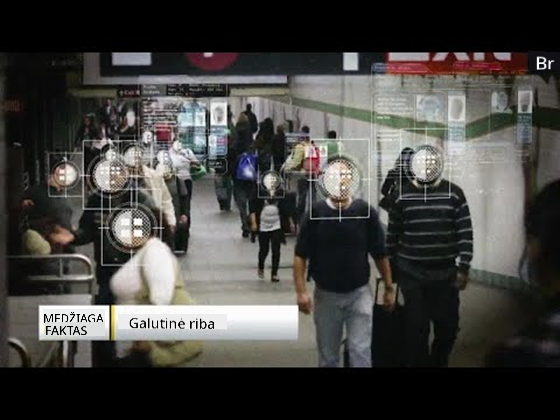

<!--
CO_OP_TRANSLATOR_METADATA:
{
  "original_hash": "8f819813b2ca08ec7b9f60a2c9336045",
  "translation_date": "2025-09-03T17:36:02+00:00",
  "source_file": "1-Introduction/3-fairness/README.md",
  "language_code": "lt"
}
-->
# Kuriant mašininio mokymosi sprendimus su atsakingu dirbtiniu intelektu

> Sketchnote sukūrė [Tomomi Imura](https://www.twitter.com/girlie_mac)

## [Prieš paskaitą atlikite testą](https://gray-sand-07a10f403.1.azurestaticapps.net/quiz/5/)

## Įvadas

Šioje mokymo programoje pradėsite suprasti, kaip mašininis mokymasis veikia ir keičia mūsų kasdienį gyvenimą. Jau dabar sistemos ir modeliai dalyvauja kasdieniuose sprendimų priėmimo procesuose, tokiuose kaip sveikatos priežiūros diagnozės, paskolų patvirtinimai ar sukčiavimo aptikimas. Todėl svarbu, kad šie modeliai veiktų patikimai ir teiktų patikimus rezultatus. Kaip ir bet kuri programinė įranga, dirbtinio intelekto sistemos gali neatitikti lūkesčių arba turėti nepageidaujamų rezultatų. Todėl būtina suprasti ir paaiškinti dirbtinio intelekto modelio elgesį.

Įsivaizduokite, kas gali nutikti, jei duomenys, kuriuos naudojate modelių kūrimui, neturi tam tikrų demografinių duomenų, tokių kaip rasė, lytis, politinės pažiūros, religija, arba neproporcingai atspindi šiuos demografinius duomenis. O kas, jei modelio rezultatai yra interpretuojami taip, kad jie teikia pirmenybę tam tikrai demografinei grupei? Kokios pasekmės tai turės programai? Be to, kas nutinka, kai modelis sukelia neigiamą rezultatą ir kenkia žmonėms? Kas yra atsakingas už dirbtinio intelekto sistemos elgesį? Tai yra klausimai, kuriuos nagrinėsime šioje mokymo programoje.

Šioje pamokoje jūs:

- Sužinosite apie sąžiningumo svarbą mašininiame mokymesi ir su sąžiningumu susijusius žalingus aspektus.
- Susipažinsite su praktika, kaip analizuoti išskirtinius atvejus ir neįprastas situacijas, siekiant užtikrinti patikimumą ir saugumą.
- Suprasite, kodėl svarbu kurti įtraukias sistemas, kurios suteikia galimybes visiems.
- Išnagrinėsite, kodėl būtina apsaugoti duomenų ir žmonių privatumą bei saugumą.
- Suprasite, kodėl svarbu turėti „stiklinės dėžės“ požiūrį, kad būtų galima paaiškinti dirbtinio intelekto modelių elgesį.
- Būsite sąmoningi, kad atsakomybė yra būtina, siekiant užtikrinti pasitikėjimą dirbtinio intelekto sistemomis.

## Būtinos žinios

Prieš pradedant, rekomenduojame išklausyti „Atsakingo dirbtinio intelekto principų“ mokymo kursą ir peržiūrėti žemiau pateiktą vaizdo įrašą šia tema:

Sužinokite daugiau apie atsakingą dirbtinį intelektą, sekdami šį [mokymo kursą](https://docs.microsoft.com/learn/modules/responsible-ai-principles/?WT.mc_id=academic-77952-leestott)

> 🎥 Spustelėkite aukščiau esančią nuotrauką, kad peržiūrėtumėte vaizdo įrašą: Microsoft požiūris į atsakingą dirbtinį intelektą

## Sąžiningumas

Dirbtinio intelekto sistemos turėtų elgtis sąžiningai su visais ir vengti skirtingo poveikio panašioms žmonių grupėms. Pavyzdžiui, kai dirbtinio intelekto sistemos teikia rekomendacijas dėl medicininio gydymo, paskolų paraiškų ar įdarbinimo, jos turėtų pateikti tas pačias rekomendacijas visiems, turintiems panašius simptomus, finansines aplinkybes ar profesinę kvalifikaciją. Kiekvienas iš mūsų, kaip žmonės, turime paveldėtus šališkumus, kurie veikia mūsų sprendimus ir veiksmus. Šie šališkumai gali atsispindėti duomenyse, kuriuos naudojame dirbtinio intelekto sistemų mokymui. Tokia manipuliacija kartais gali įvykti netyčia. Dažnai sunku sąmoningai suvokti, kada į duomenis įvedate šališkumą.

**„Nesąžiningumas“** apima neigiamą poveikį arba „žalą“ žmonių grupei, pavyzdžiui, apibrėžtai pagal rasę, lytį, amžių ar negalios statusą. Pagrindinės su sąžiningumu susijusios žalos rūšys gali būti klasifikuojamos taip:

- **Paskirstymas**, kai, pavyzdžiui, lytis ar etninė grupė yra teikiama pirmenybė kitų atžvilgiu.
- **Paslaugos kokybė**. Jei duomenys mokomi tik vienam konkrečiam scenarijui, tačiau realybė yra daug sudėtingesnė, tai lemia prastai veikiančią paslaugą. Pavyzdžiui, rankų muilo dozatorius, kuris negalėjo aptikti tamsios odos žmonių. [Nuoroda](https://gizmodo.com/why-cant-this-soap-dispenser-identify-dark-skin-1797931773)
- **Denigracija**. Nesąžiningai kritikuoti ir žymėti ką nors ar kažką. Pavyzdžiui, vaizdų žymėjimo technologija klaidingai pažymėjo tamsios odos žmonių nuotraukas kaip gorilas.
- **Perteklinis arba nepakankamas atstovavimas**. Idėja, kad tam tikra grupė nėra matoma tam tikroje profesijoje, o bet kokia paslauga ar funkcija, kuri tai skatina, prisideda prie žalos.
- **Stereotipai**. Tam tikros grupės siejimas su iš anksto priskirtais atributais. Pavyzdžiui, kalbos vertimo sistema tarp anglų ir turkų kalbų gali turėti netikslumų dėl žodžių, susijusių su stereotipiniais lyties atributais.

> vertimas į turkų kalbą

> vertimas atgal į anglų kalbą

Kuriant ir testuojant dirbtinio intelekto sistemas, turime užtikrinti, kad dirbtinis intelektas būtų sąžiningas ir neprogramuotas priimti šališkų ar diskriminacinių sprendimų, kurių žmonėms taip pat draudžiama priimti. Sąžiningumo užtikrinimas dirbtinio intelekto ir mašininio mokymosi srityje išlieka sudėtingu sociotechniniu iššūkiu.

### Patikimumas ir saugumas

Norint užtikrinti pasitikėjimą, dirbtinio intelekto sistemos turi būti patikimos, saugios ir nuoseklios tiek įprastomis, tiek netikėtomis sąlygomis. Svarbu žinoti, kaip dirbtinio intelekto sistemos elgsis įvairiose situacijose, ypač kai jos susiduria su išskirtiniais atvejais. Kuriant dirbtinio intelekto sprendimus, reikia skirti daug dėmesio tam, kaip spręsti įvairias aplinkybes, su kuriomis dirbtinio intelekto sprendimai gali susidurti. Pavyzdžiui, savarankiškai vairuojantis automobilis turi prioritetą teikti žmonių saugumui. Todėl dirbtinis intelektas, valdantis automobilį, turi atsižvelgti į visas galimas situacijas, su kuriomis automobilis gali susidurti, tokias kaip naktis, audros, pūgos, vaikai, bėgantys per gatvę, augintiniai, kelio darbai ir kt. Kaip gerai dirbtinio intelekto sistema gali patikimai ir saugiai spręsti įvairias sąlygas, atspindi duomenų mokslininko ar dirbtinio intelekto kūrėjo numatymą projektavimo ar testavimo metu.

> [🎥 Spustelėkite čia, kad peržiūrėtumėte vaizdo įrašą: ](https://www.microsoft.com/videoplayer/embed/RE4vvIl)

### Įtrauktis

Dirbtinio intelekto sistemos turėtų būti sukurtos taip, kad įtrauktų ir suteiktų galimybes visiems. Kuriant ir įgyvendinant dirbtinio intelekto sistemas, duomenų mokslininkai ir dirbtinio intelekto kūrėjai identifikuoja ir sprendžia galimas kliūtis sistemoje, kurios galėtų netyčia išskirti žmones. Pavyzdžiui, pasaulyje yra 1 milijardas žmonių su negalia. Su dirbtinio intelekto pažanga jie gali lengviau pasiekti įvairią informaciją ir galimybes savo kasdieniniame gyvenime. Sprendžiant kliūtis, atsiranda galimybės inovuoti ir kurti dirbtinio intelekto produktus su geresnėmis patirtimis, kurios naudingos visiems.

> [🎥 Spustelėkite čia, kad peržiūrėtumėte vaizdo įrašą: įtrauktis dirbtiniame intelekte](https://www.microsoft.com/videoplayer/embed/RE4vl9v)

### Saugumas ir privatumas

Dirbtinio intelekto sistemos turėtų būti saugios ir gerbti žmonių privatumą. Žmonės mažiau pasitiki sistemomis, kurios kelia pavojų jų privatumui, informacijai ar gyvybei. Mokant mašininio mokymosi modelius, mes pasikliaujame duomenimis, kad gautume geriausius rezultatus. Darydami tai, turime atsižvelgti į duomenų kilmę ir vientisumą. Pavyzdžiui, ar duomenys buvo pateikti vartotojų, ar viešai prieinami? Be to, dirbant su duomenimis, būtina kurti dirbtinio intelekto sistemas, kurios galėtų apsaugoti konfidencialią informaciją ir atsispirti atakoms. Kadangi dirbtinis intelektas tampa vis labiau paplitęs, privatumo apsauga ir svarbios asmeninės bei verslo informacijos saugumas tampa vis svarbesni ir sudėtingesni. Privatumo ir duomenų saugumo klausimai reikalauja ypatingo dėmesio dirbtinio intelekto srityje, nes duomenų prieiga yra būtina, kad dirbtinio intelekto sistemos galėtų tiksliai ir informuotai prognozuoti bei priimti sprendimus apie žmones.

> [🎥 Spustelėkite čia, kad peržiūrėtumėte vaizdo įrašą: saugumas dirbtiniame intelekte](https://www.microsoft.com/videoplayer/embed/RE4voJF)

- Pramonėje pasiekėme reikšmingų pažangų privatumo ir saugumo srityje, kurias labai paskatino tokie reglamentai kaip GDPR (Bendrasis duomenų apsaugos reglamentas).
- Tačiau dirbtinio intelekto sistemose turime pripažinti įtampą tarp poreikio turėti daugiau asmeninių duomenų, kad sistemos būtų asmeniškesnės ir efektyvesnės, ir privatumo.
- Kaip ir su interneto atsiradimu, matome didelį saugumo problemų, susijusių su dirbtiniu intelektu, augimą.
- Tuo pačiu metu matome, kaip dirbtinis intelektas naudojamas saugumui gerinti. Pavyzdžiui, dauguma šiuolaikinių antivirusinių skenerių yra pagrįsti dirbtinio intelekto heuristika.
- Turime užtikrinti, kad mūsų duomenų mokslų procesai harmoningai derėtų su naujausiomis privatumo ir saugumo praktikomis.

### Skaidrumas

Dirbtinio intelekto sistemos turėtų būti suprantamos. Svarbi skaidrumo dalis yra paaiškinti dirbtinio intelekto sistemų ir jų komponentų elgesį. Gerinant dirbtinio intelekto sistemų supratimą, reikia, kad suinteresuotosios šalys suprastų, kaip ir kodėl jos veikia, kad galėtų identifikuoti galimas veikimo problemas, saugumo ir privatumo rūpesčius, šališkumus, išskirtines praktikas ar nepageidaujamus rezultatus. Taip pat tikime, kad tie, kurie naudoja dirbtinio intelekto sistemas, turėtų būti sąžiningi ir atviri apie tai, kada, kodėl ir kaip jie nusprendžia jas naudoti. Taip pat apie sistemų, kurias jie naudoja, apribojimus. Pavyzdžiui, jei bankas naudoja dirbtinio intelekto sistemą, kad palaikytų vartotojų paskolų sprendimus, svarbu išnagrinėti rezultatus ir suprasti, kurie duomenys daro įtaką sistemos rekomendacijoms. Vyriausybės pradeda reguliuoti dirbtinį intelektą įvairiose pramonės šakose, todėl duomenų mokslininkai ir organizacijos turi paaiškinti, ar dirbtinio intelekto sistema atitinka reglamentavimo reikalavimus, ypač kai yra nepageidaujamas rezultatas.

> [🎥 Spustelėkite čia, kad peržiūrėtumėte vaizdo įrašą: skaidrumas dirbtiniame intelekte](https://www.microsoft.com/videoplayer/embed/RE4voJF)

- Kadangi dirbtinio intelekto sistemos yra tokios sudėtingos, sunku suprasti, kaip jos veikia ir interpretuoti rezultatus.
- Šis supratimo trūkumas veikia tai, kaip šios sistemos yra valdomos, operatyviai naudojamos ir dokumentuojamos.
- Šis supratimo trūkumas dar svarbiau veikia sprendimus, priimamus remiantis šių sistemų pateiktais rezultatais.

### Atsakomybė

Žmonės, kurie kuria ir diegia dirbtinio intelekto sistemas, turi būti atsakingi už tai, kaip jų sistemos veikia. Atsakomybės poreikis yra ypač svarbus jautrių technologijų, tokių kaip veido atpažinimas, naudojimo atveju. Pastaruoju metu didėja veido atpažinimo technologijos paklausa, ypač iš teisėsaugos organizacijų, kurios mato technologijos potencialą, pavyzdžiui, ieškant dingusių vaikų. Tačiau šios technologijos galėtų būti naudojamos vyriausybių, kad būtų pažeistos piliečių pagrindinės laisvės, pavyzdžiui, leidžiant nuolatinę tam tikrų asmenų stebėseną. Todėl duomenų mokslininkai ir organizacijos turi būti atsakingi už tai, kaip jų dirbtinio intelekto sistema veikia asmenis ar visuomenę.

> 🎥 Spustelėkite aukščiau esančią nuotrauką, kad peržiūrėtumėte vaizdo įrašą: Įspėjimai apie masinę stebėseną per veido atpažinimą

Galų gale vienas didžiausių mūsų kartos klausimų, kaip pirmosios kartos, kuri įveda dirbtinį intelektą į visuomenę, yra tai, kaip užtikrinti, kad kompiuteriai išliktų atsakingi žmonėms ir kaip užtikrinti, kad žmonės, kurie kuria kompiuterius, išliktų atsakingi visiems kitiems.

## Poveikio vertinimas

Prieš mokant mašininio mokymosi modelį, svarbu atlikti poveikio vertinimą, kad suprastumėte dirbtinio intelekto sistemos tikslą; numatomą naudojimą; kur ji bus diegiama; ir kas sąveikaus su sistema. Tai naudinga peržiūrėtojams ar testuotojams, vertinantiems sistemą, kad žinotų, kokius veiksnius reikia atsižvelgti identifikuojant galimas rizikas ir numat
Šioje pamokoje sužinojote pagrindinius sąžiningumo ir nesąžiningumo koncepcijų aspektus mašininio mokymosi srityje.  

Peržiūrėkite šį seminarą, kad giliau pasinertumėte į temas:  

- Atsakingo dirbtinio intelekto siekimas: principų įgyvendinimas praktikoje, Besmira Nushi, Mehrnoosh Sameki ir Amit Sharma  

  

> 🎥 Spustelėkite aukščiau esančią nuotrauką, kad peržiūrėtumėte vaizdo įrašą: RAI Toolbox: Atvirojo kodo sistema atsakingam dirbtiniam intelektui kurti, Besmira Nushi, Mehrnoosh Sameki ir Amit Sharma  

Taip pat skaitykite:  

- Microsoft atsakingo dirbtinio intelekto išteklių centras: [Atsakingo dirbtinio intelekto ištekliai – Microsoft AI](https://www.microsoft.com/ai/responsible-ai-resources?activetab=pivot1%3aprimaryr4)  

- Microsoft FATE tyrimų grupė: [FATE: Sąžiningumas, Atsakomybė, Skaidrumas ir Etika dirbtiniame intelekte - Microsoft Research](https://www.microsoft.com/research/theme/fate/)  

RAI įrankių rinkinys:  

- [Atsakingo dirbtinio intelekto įrankių rinkinio GitHub saugykla](https://github.com/microsoft/responsible-ai-toolbox)  

Skaitykite apie Azure Machine Learning įrankius, skirtus sąžiningumui užtikrinti:  

- [Azure Machine Learning](https://docs.microsoft.com/azure/machine-learning/concept-fairness-ml?WT.mc_id=academic-77952-leestott)  

## Užduotis  

[Susipažinkite su RAI įrankių rinkiniu](assignment.md)  

---

**Atsakomybės apribojimas**:  
Šis dokumentas buvo išverstas naudojant AI vertimo paslaugą [Co-op Translator](https://github.com/Azure/co-op-translator). Nors stengiamės užtikrinti tikslumą, prašome atkreipti dėmesį, kad automatiniai vertimai gali turėti klaidų ar netikslumų. Originalus dokumentas jo gimtąja kalba turėtų būti laikomas autoritetingu šaltiniu. Kritinei informacijai rekomenduojama naudoti profesionalų žmogaus vertimą. Mes neprisiimame atsakomybės už nesusipratimus ar klaidingus interpretavimus, atsiradusius dėl šio vertimo naudojimo.