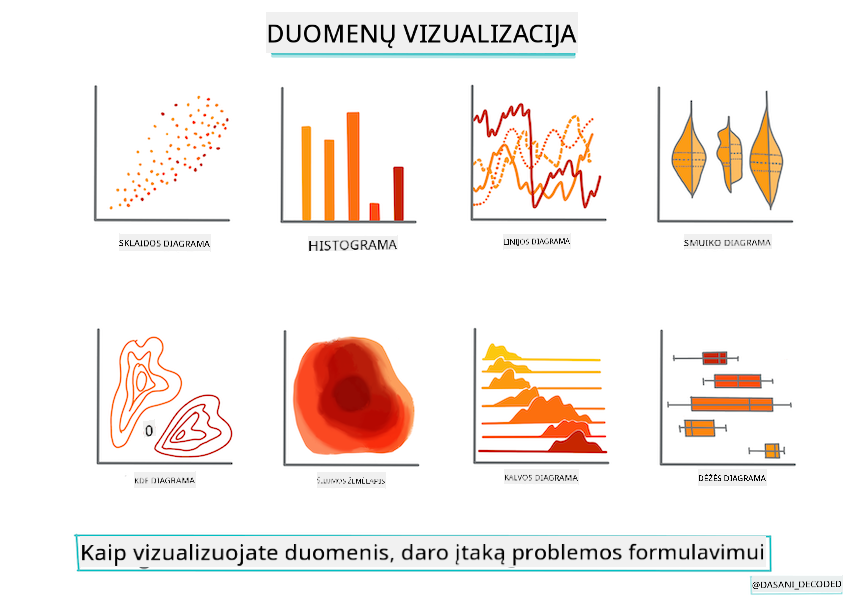
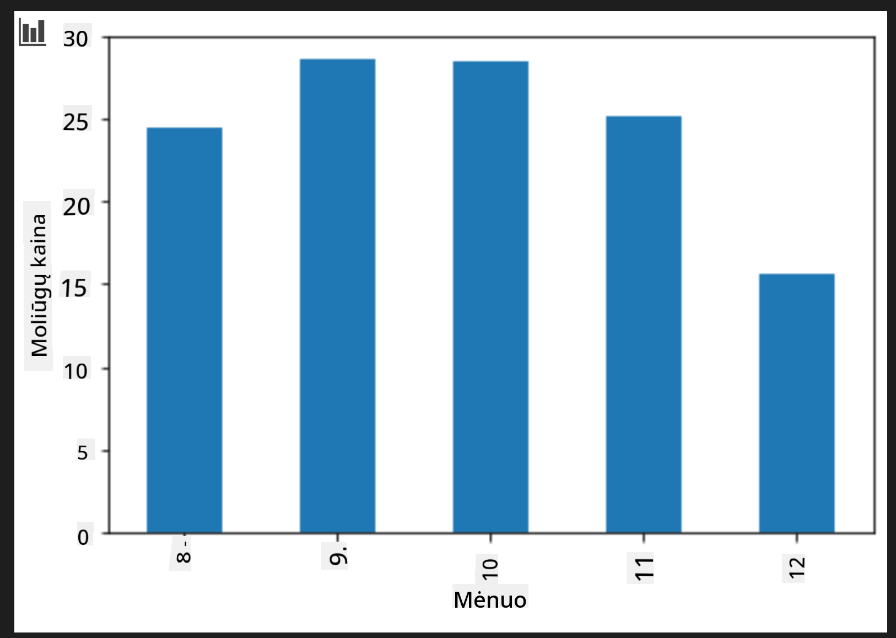

<!--
CO_OP_TRANSLATOR_METADATA:
{
  "original_hash": "a683e1fe430bb0d4a10b68f6ca15e0a6",
  "translation_date": "2025-09-03T16:41:24+00:00",
  "source_file": "2-Regression/2-Data/README.md",
  "language_code": "lt"
}
-->
# Sukurkite regresijos modelį naudodami Scikit-learn: paruoškite ir vizualizuokite duomenis



Infografiką sukūrė [Dasani Madipalli](https://twitter.com/dasani_decoded)

## [Prieš paskaitos testas](https://gray-sand-07a10f403.1.azurestaticapps.net/quiz/11/)

> ### [Ši pamoka yra prieinama R kalba!](../../../../2-Regression/2-Data/solution/R/lesson_2.html)

## Įvadas

Dabar, kai turite visus įrankius, reikalingus pradėti kurti mašininio mokymosi modelius su Scikit-learn, esate pasiruošę pradėti užduoti klausimus savo duomenims. Dirbant su duomenimis ir taikant ML sprendimus, labai svarbu mokėti užduoti tinkamus klausimus, kad galėtumėte tinkamai išnaudoti savo duomenų potencialą.

Šioje pamokoje sužinosite:

- Kaip paruošti duomenis modelio kūrimui.
- Kaip naudoti Matplotlib duomenų vizualizacijai.

## Tinkamų klausimų uždavimas duomenims

Klausimas, į kurį norite gauti atsakymą, nulems, kokio tipo ML algoritmus naudosite. Atsakymo kokybė labai priklausys nuo jūsų duomenų pobūdžio.

Pažvelkite į [duomenis](https://github.com/microsoft/ML-For-Beginners/blob/main/2-Regression/data/US-pumpkins.csv), pateiktus šiai pamokai. Šį .csv failą galite atidaryti VS Code. Greitai peržvelgus matyti, kad yra tuščių langelių, mišrių tekstinių ir skaitinių duomenų. Taip pat yra keista stulpelis, pavadintas „Package“, kuriame duomenys yra maišyti tarp „sacks“, „bins“ ir kitų reikšmių. Iš tiesų, duomenys yra šiek tiek netvarkingi.

[](https://youtu.be/5qGjczWTrDQ "ML pradedantiesiems - Kaip analizuoti ir valyti duomenų rinkinį")

> 🎥 Spustelėkite aukščiau esančią nuotrauką, kad peržiūrėtumėte trumpą vaizdo įrašą apie duomenų paruošimą šiai pamokai.

Iš tiesų, retai pasitaiko, kad duomenų rinkinys būtų visiškai paruoštas ML modelio kūrimui iš karto. Šioje pamokoje sužinosite, kaip paruošti neapdorotą duomenų rinkinį naudojant standartines Python bibliotekas. Taip pat išmoksite įvairių duomenų vizualizavimo technikų.

## Atvejo analizė: „moliūgų rinka“

Šiame aplanke rasite .csv failą pagrindiniame `data` aplanke, pavadintą [US-pumpkins.csv](https://github.com/microsoft/ML-For-Beginners/blob/main/2-Regression/data/US-pumpkins.csv), kuriame yra 1757 eilutės duomenų apie moliūgų rinką, suskirstytų pagal miestus. Tai yra neapdoroti duomenys, gauti iš [Specialty Crops Terminal Markets Standard Reports](https://www.marketnews.usda.gov/mnp/fv-report-config-step1?type=termPrice), kuriuos platina Jungtinių Valstijų Žemės ūkio departamentas.

### Duomenų paruošimas

Šie duomenys yra viešojoje erdvėje. Juos galima atsisiųsti iš USDA svetainės atskirais failais, pagal miestus. Kad išvengtume per daug atskirų failų, mes sujungėme visus miestų duomenis į vieną skaičiuoklę, taigi jau šiek tiek _paruošėme_ duomenis. Dabar pažvelkime į duomenis iš arčiau.

### Moliūgų duomenys - pirminės išvados

Ką pastebite apie šiuos duomenis? Jau matėte, kad yra mišrių tekstinių, skaitinių, tuščių ir keistų reikšmių, kurias reikia suprasti.

Kokį klausimą galite užduoti šiems duomenims, naudodami regresijos techniką? Pavyzdžiui: „Prognozuoti moliūgo kainą pardavimui tam tikrą mėnesį“. Pažvelgus į duomenis dar kartą, matyti, kad reikia atlikti tam tikrus pakeitimus, kad sukurtumėte tinkamą duomenų struktūrą šiai užduočiai.

## Užduotis - analizuoti moliūgų duomenis

Naudokime [Pandas](https://pandas.pydata.org/) (pavadinimas reiškia `Python Data Analysis`), labai naudingą įrankį duomenų formavimui, kad analizuotume ir paruoštume šiuos moliūgų duomenis.

### Pirma, patikrinkite, ar nėra trūkstamų datų

Pirmiausia turėsite atlikti veiksmus, kad patikrintumėte, ar nėra trūkstamų datų:

1. Konvertuokite datas į mėnesio formatą (tai yra JAV datos, todėl formatas yra `MM/DD/YYYY`).
2. Ištraukite mėnesį į naują stulpelį.

Atidarykite _notebook.ipynb_ failą Visual Studio Code ir importuokite skaičiuoklę į naują Pandas duomenų rėmelį.

1. Naudokite `head()` funkciją, kad peržiūrėtumėte pirmas penkias eilutes.

    ```python
    import pandas as pd
    pumpkins = pd.read_csv('../data/US-pumpkins.csv')
    pumpkins.head()
    ```

    ✅ Kokią funkciją naudotumėte, kad peržiūrėtumėte paskutines penkias eilutes?

1. Patikrinkite, ar dabartiniame duomenų rėmelyje yra trūkstamų duomenų:

    ```python
    pumpkins.isnull().sum()
    ```

    Yra trūkstamų duomenų, bet galbūt tai nesvarbu šiai užduočiai.

1. Kad jūsų duomenų rėmelis būtų lengviau valdomas, pasirinkite tik reikalingus stulpelius, naudodami `loc` funkciją, kuri iš originalaus duomenų rėmelio ištraukia eilutes (pateiktas kaip pirmas parametras) ir stulpelius (pateiktus kaip antras parametras). Ženklas `:` žemiau esančiame pavyzdyje reiškia „visos eilutės“.

    ```python
    columns_to_select = ['Package', 'Low Price', 'High Price', 'Date']
    pumpkins = pumpkins.loc[:, columns_to_select]
    ```

### Antra, nustatykite vidutinę moliūgo kainą

Pagalvokite, kaip nustatyti vidutinę moliūgo kainą tam tikrą mėnesį. Kokius stulpelius pasirinktumėte šiai užduočiai? Užuomina: jums reikės 3 stulpelių.

Sprendimas: paimkite vidurkį iš `Low Price` ir `High Price` stulpelių, kad užpildytumėte naują Price stulpelį, ir konvertuokite Date stulpelį, kad būtų rodomas tik mėnuo. Laimei, pagal aukščiau atliktą patikrinimą, datų ir kainų stulpeliuose nėra trūkstamų duomenų.

1. Norėdami apskaičiuoti vidurkį, pridėkite šį kodą:

    ```python
    price = (pumpkins['Low Price'] + pumpkins['High Price']) / 2

    month = pd.DatetimeIndex(pumpkins['Date']).month

    ```

   ✅ Galite spausdinti bet kokius duomenis, kuriuos norite patikrinti, naudodami `print(month)`.

2. Dabar nukopijuokite konvertuotus duomenis į naują Pandas duomenų rėmelį:

    ```python
    new_pumpkins = pd.DataFrame({'Month': month, 'Package': pumpkins['Package'], 'Low Price': pumpkins['Low Price'],'High Price': pumpkins['High Price'], 'Price': price})
    ```

    Spausdindami savo duomenų rėmelį pamatysite švarią, tvarkingą duomenų rinkinį, kuriame galėsite kurti naują regresijos modelį.

### Bet palaukite! Čia kažkas keisto

Jei pažvelgsite į `Package` stulpelį, moliūgai parduodami įvairiomis konfigūracijomis. Kai kurie parduodami „1 1/9 bushel“ matavimo vienetais, kai kurie „1/2 bushel“ matavimo vienetais, kai kurie pagal moliūgą, kai kurie pagal svorį, o kai kurie didelėse dėžėse su skirtingais pločiais.

> Moliūgus atrodo labai sunku sverti nuosekliai

Gilindamiesi į originalius duomenis, pastebėsite, kad viskas, kas turi `Unit of Sale` reikšmę „EACH“ arba „PER BIN“, taip pat turi `Package` tipą pagal colį, biną arba „each“. Moliūgus atrodo labai sunku sverti nuosekliai, todėl filtruokime juos, pasirinkdami tik moliūgus, kurių `Package` stulpelyje yra eilutė „bushel“.

1. Pridėkite filtrą failo viršuje, po pradinio .csv importo:

    ```python
    pumpkins = pumpkins[pumpkins['Package'].str.contains('bushel', case=True, regex=True)]
    ```

    Jei dabar spausdinsite duomenis, pamatysite, kad gaunate tik apie 415 eilutes duomenų, kuriuose moliūgai pateikiami pagal bushel.

### Bet palaukite! Dar vienas dalykas, kurį reikia padaryti

Ar pastebėjote, kad bushel kiekis skiriasi kiekvienoje eilutėje? Jums reikia normalizuoti kainas, kad būtų rodomos kainos pagal bushel, todėl atlikite keletą skaičiavimų, kad standartizuotumėte.

1. Pridėkite šias eilutes po bloko, kuris sukuria new_pumpkins duomenų rėmelį:

    ```python
    new_pumpkins.loc[new_pumpkins['Package'].str.contains('1 1/9'), 'Price'] = price/(1 + 1/9)

    new_pumpkins.loc[new_pumpkins['Package'].str.contains('1/2'), 'Price'] = price/(1/2)
    ```

✅ Pasak [The Spruce Eats](https://www.thespruceeats.com/how-much-is-a-bushel-1389308), bushel svoris priklauso nuo produkto tipo, nes tai yra tūrio matavimo vienetas. „Pavyzdžiui, pomidorų bushel turėtų sverti 56 svarus... Lapai ir žalumynai užima daugiau vietos su mažesniu svoriu, todėl špinatų bushel yra tik 20 svarų.“ Tai gana sudėtinga! Nesivarginkime su bushel į svarus konversija, o vietoj to kainą skaičiuokime pagal bushel. Visa ši moliūgų bushel analizė, tačiau, parodo, kaip svarbu suprasti savo duomenų pobūdį!

Dabar galite analizuoti kainas pagal vienetą, remdamiesi jų bushel matavimu. Jei dar kartą spausdinsite duomenis, pamatysite, kaip jie yra standartizuoti.

✅ Ar pastebėjote, kad moliūgai, parduodami pagal pusę bushel, yra labai brangūs? Ar galite suprasti, kodėl? Užuomina: maži moliūgai yra daug brangesni nei dideli, tikriausiai todėl, kad jų yra daug daugiau viename bushel, atsižvelgiant į nepanaudotą vietą, kurią užima vienas didelis tuščiaviduris pyrago moliūgas.

## Vizualizacijos strategijos

Duomenų mokslininko vaidmuo yra parodyti duomenų kokybę ir pobūdį, su kuriais jis dirba. Tam jie dažnai kuria įdomias vizualizacijas, tokias kaip grafikai, diagramos ir lentelės, kurios parodo skirtingus duomenų aspektus. Tokiu būdu jie gali vizualiai parodyti ryšius ir spragas, kurių kitaip būtų sunku pastebėti.

[](https://youtu.be/SbUkxH6IJo0 "ML pradedantiesiems - Kaip vizualizuoti duomenis su Matplotlib")

> 🎥 Spustelėkite aukščiau esančią nuotrauką, kad peržiūrėtumėte trumpą vaizdo įrašą apie duomenų vizualizavimą šiai pamokai.

Vizualizacijos taip pat gali padėti nustatyti, kuris mašininio mokymosi metodas yra tinkamiausias duomenims. Pavyzdžiui, sklaidos diagrama, kuri atrodo kaip linija, rodo, kad duomenys yra tinkami linijinės regresijos užduočiai.

Viena duomenų vizualizacijos biblioteka, kuri gerai veikia Jupyter užrašuose, yra [Matplotlib](https://matplotlib.org/) (ją taip pat matėte ankstesnėje pamokoje).

> Gaukite daugiau patirties su duomenų vizualizacija [šiame vadove](https://docs.microsoft.com/learn/modules/explore-analyze-data-with-python?WT.mc_id=academic-77952-leestott).

## Užduotis - eksperimentuokite su Matplotlib

Pabandykite sukurti keletą pagrindinių diagramų, kad parodytumėte naują duomenų rėmelį, kurį ką tik sukūrėte. Ką parodytų pagrindinė linijinė diagrama?

1. Importuokite Matplotlib failo viršuje, po Pandas importo:

    ```python
    import matplotlib.pyplot as plt
    ```

1. Iš naujo paleiskite visą užrašų knygelę, kad atnaujintumėte.
1. Užrašų knygelės apačioje pridėkite langelį, kad nubrėžtumėte duomenis kaip dėžutę:

    ```python
    price = new_pumpkins.Price
    month = new_pumpkins.Month
    plt.scatter(price, month)
    plt.show()
    ```

    

    Ar tai naudinga diagrama? Ar kas nors joje jus nustebino?

    Ji nėra ypač naudinga, nes tiesiog rodo jūsų duomenų taškų pasiskirstymą tam tikrą mėnesį.

### Padarykite ją naudingą

Kad diagramos rodytų naudingus duomenis, paprastai reikia kažkaip grupuoti duomenis. Pabandykime sukurti diagramą, kurioje y ašis rodytų mėnesius, o duomenys demonstruotų duomenų pasiskirstymą.

1. Pridėkite langelį, kad sukurtumėte grupuotą stulpelinę diagramą:

    ```python
    new_pumpkins.groupby(['Month'])['Price'].mean().plot(kind='bar')
    plt.ylabel("Pumpkin Price")
    ```

    

    Tai yra naudingesnė duomenų vizualizacija! Atrodo, kad didžiausia moliūgų kaina yra rugsėjį ir spalį. Ar tai atitinka jūsų lūkesčius? Kodėl taip arba kodėl ne?

---

## 🚀Iššūkis

Ištyrinėkite įvairius vizualizacijos tipus, kuriuos siūlo Matplotlib. Kurie tipai yra tinkamiausi regresijos problemoms?

## [Po paskaitos testas](https://gray-sand-07a10f403.1.azurestaticapps.net/quiz/12/)

## Apžvalga ir savarankiškas mokymasis

Pažvelkite į daugybę būdų vizualizuoti duomenis. Sudarykite įvairių bibliotekų sąrašą ir pažymėkite, kurios geriausiai tinka tam tikroms užduotims, pavyzdžiui, 2D vizualizacijoms ar 3D vizualizacijoms. Ką atrandate?

## Užduotis

[Duomenų vizualizacijos tyrimas](assignment.md)

---

**Atsakomybės apribojimas**:  
Šis dokumentas buvo išverstas naudojant AI vertimo paslaugą [Co-op Translator](https://github.com/Azure/co-op-translator). Nors siekiame tikslumo, prašome atkreipti dėmesį, kad automatiniai vertimai gali turėti klaidų ar netikslumų. Originalus dokumentas jo gimtąja kalba turėtų būti laikomas autoritetingu šaltiniu. Kritinei informacijai rekomenduojama profesionali žmogaus vertimo paslauga. Mes neprisiimame atsakomybės už nesusipratimus ar klaidingus interpretavimus, atsiradusius naudojant šį vertimą.