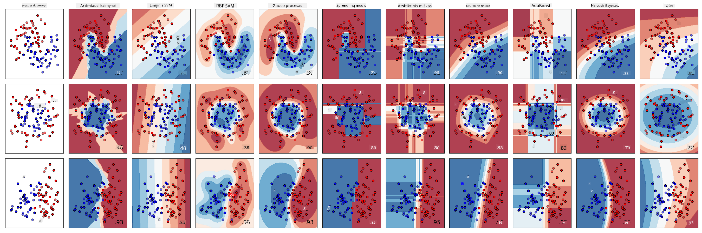
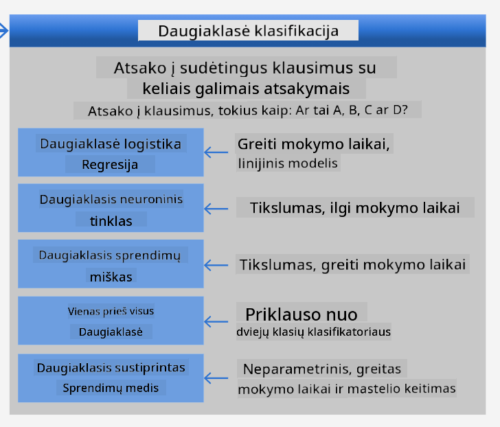
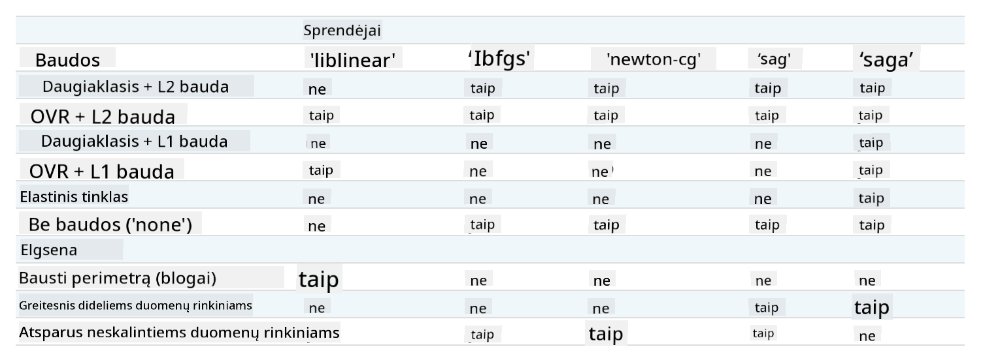

<!--
CO_OP_TRANSLATOR_METADATA:
{
  "original_hash": "9579f42e3ff5114c58379cc9e186a828",
  "translation_date": "2025-09-03T18:00:15+00:00",
  "source_file": "4-Classification/2-Classifiers-1/README.md",
  "language_code": "lt"
}
-->
# Virtuvės klasifikatoriai 1

Šioje pamokoje naudosite duomenų rinkinį, kurį išsaugojote iš ankstesnės pamokos, pilną subalansuotų ir švarių duomenų apie virtuvės tipus.

Naudodami šį duomenų rinkinį su įvairiais klasifikatoriais, _prognozuosite tam tikrą nacionalinę virtuvę pagal ingredientų grupę_. Tuo pačiu sužinosite daugiau apie tai, kaip algoritmai gali būti naudojami klasifikavimo užduotims.

## [Prieš pamokos testas](https://gray-sand-07a10f403.1.azurestaticapps.net/quiz/21/)
# Pasiruošimas

Jei baigėte [1 pamoką](../1-Introduction/README.md), įsitikinkite, kad _cleaned_cuisines.csv_ failas yra šakniniame `/data` aplanke, skirtame šioms keturioms pamokoms.

## Užduotis - prognozuoti nacionalinę virtuvę

1. Dirbdami šios pamokos _notebook.ipynb_ aplanke, importuokite tą failą kartu su Pandas biblioteka:

    ```python
    import pandas as pd
    cuisines_df = pd.read_csv("../data/cleaned_cuisines.csv")
    cuisines_df.head()
    ```

    Duomenys atrodo taip:

|     | Unnamed: 0 | cuisine | almond | angelica | anise | anise_seed | apple | apple_brandy | apricot | armagnac | ... | whiskey | white_bread | white_wine | whole_grain_wheat_flour | wine | wood | yam | yeast | yogurt | zucchini |
| --- | ---------- | ------- | ------ | -------- | ----- | ---------- | ----- | ------------ | ------- | -------- | --- | ------- | ----------- | ---------- | ----------------------- | ---- | ---- | --- | ----- | ------ | -------- |
| 0   | 0          | indian  | 0      | 0        | 0     | 0          | 0     | 0            | 0       | 0        | ... | 0       | 0           | 0          | 0                       | 0    | 0    | 0   | 0     | 0      | 0        |
| 1   | 1          | indian  | 1      | 0        | 0     | 0          | 0     | 0            | 0       | 0        | ... | 0       | 0           | 0          | 0                       | 0    | 0    | 0   | 0     | 0      | 0        |
| 2   | 2          | indian  | 0      | 0        | 0     | 0          | 0     | 0            | 0       | 0        | ... | 0       | 0           | 0          | 0                       | 0    | 0    | 0   | 0     | 0      | 0        |
| 3   | 3          | indian  | 0      | 0        | 0     | 0          | 0     | 0            | 0       | 0        | ... | 0       | 0           | 0          | 0                       | 0    | 0    | 0   | 0     | 0      | 0        |
| 4   | 4          | indian  | 0      | 0        | 0     | 0          | 0     | 0            | 0       | 0        | ... | 0       | 0           | 0          | 0                       | 0    | 0    | 0   | 0     | 1      | 0        |
  

1. Dabar importuokite dar kelias bibliotekas:

    ```python
    from sklearn.linear_model import LogisticRegression
    from sklearn.model_selection import train_test_split, cross_val_score
    from sklearn.metrics import accuracy_score,precision_score,confusion_matrix,classification_report, precision_recall_curve
    from sklearn.svm import SVC
    import numpy as np
    ```

1. Padalinkite X ir y koordinates į du duomenų rėmelius mokymui. `cuisine` gali būti etikečių duomenų rėmelis:

    ```python
    cuisines_label_df = cuisines_df['cuisine']
    cuisines_label_df.head()
    ```

    Tai atrodys taip:

    ```output
    0    indian
    1    indian
    2    indian
    3    indian
    4    indian
    Name: cuisine, dtype: object
    ```

1. Pašalinkite `Unnamed: 0` stulpelį ir `cuisine` stulpelį, naudodami `drop()`. Likusius duomenis išsaugokite kaip mokymui tinkamus požymius:

    ```python
    cuisines_feature_df = cuisines_df.drop(['Unnamed: 0', 'cuisine'], axis=1)
    cuisines_feature_df.head()
    ```

    Jūsų požymiai atrodo taip:

|      | almond | angelica | anise | anise_seed | apple | apple_brandy | apricot | armagnac | artemisia | artichoke |  ... | whiskey | white_bread | white_wine | whole_grain_wheat_flour | wine | wood |  yam | yeast | yogurt | zucchini |
| ---: | -----: | -------: | ----: | ---------: | ----: | -----------: | ------: | -------: | --------: | --------: | ---: | ------: | ----------: | ---------: | ----------------------: | ---: | ---: | ---: | ----: | -----: | -------: |
|    0 |      0 |        0 |     0 |          0 |     0 |            0 |       0 |        0 |         0 |         0 |  ... |       0 |           0 |          0 |                       0 |    0 |    0 |    0 |     0 |      0 |        0 | 0 |
|    1 |      1 |        0 |     0 |          0 |     0 |            0 |       0 |        0 |         0 |         0 |  ... |       0 |           0 |          0 |                       0 |    0 |    0 |    0 |     0 |      0 |        0 | 0 |
|    2 |      0 |        0 |     0 |          0 |     0 |            0 |       0 |        0 |         0 |         0 |  ... |       0 |           0 |          0 |                       0 |    0 |    0 |    0 |     0 |      0 |        0 | 0 |
|    3 |      0 |        0 |     0 |          0 |     0 |            0 |       0 |        0 |         0 |         0 |  ... |       0 |           0 |          0 |                       0 |    0 |    0 |    0 |     0 |      0 |        0 | 0 |
|    4 |      0 |        0 |     0 |          0 |     0 |            0 |       0 |        0 |         0 |         0 |  ... |       0 |           0 |          0 |                       0 |    0 |    0 |    0 |     0 |      1 |        0 | 0 |

Dabar esate pasiruošę mokyti savo modelį!

## Klasifikatoriaus pasirinkimas

Kai jūsų duomenys yra švarūs ir paruošti mokymui, turite nuspręsti, kokį algoritmą naudoti užduočiai atlikti.

Scikit-learn klasifikavimą priskiria prie Prižiūrimo Mokymosi, ir šioje kategorijoje rasite daugybę būdų klasifikuoti. [Įvairovė](https://scikit-learn.org/stable/supervised_learning.html) iš pradžių gali atrodyti gana paini. Šie metodai apima klasifikavimo technikas:

- Linijiniai modeliai
- Atramos vektorinės mašinos
- Stochastinis gradientinis nusileidimas
- Artimiausi kaimynai
- Gauso procesai
- Sprendimų medžiai
- Ansamblio metodai (balsavimo klasifikatorius)
- Daugiaklasiai ir daugiatiksliai algoritmai (daugiaklasis ir daugiatikslis klasifikavimas, daugiaklasis-daugiatikslis klasifikavimas)

> Taip pat galite naudoti [neuroninius tinklus duomenims klasifikuoti](https://scikit-learn.org/stable/modules/neural_networks_supervised.html#classification), tačiau tai neįeina į šios pamokos apimtį.

### Ką pasirinkti?

Taigi, kurį klasifikatorių pasirinkti? Dažnai, išbandant kelis ir ieškant geriausio rezultato, galima rasti tinkamą. Scikit-learn siūlo [palyginimą](https://scikit-learn.org/stable/auto_examples/classification/plot_classifier_comparison.html) sukurto duomenų rinkinio, lyginant KNeighbors, SVC dviem būdais, GaussianProcessClassifier, DecisionTreeClassifier, RandomForestClassifier, MLPClassifier, AdaBoostClassifier, GaussianNB ir QuadraticDiscrinationAnalysis, vizualizuojant rezultatus:


> Grafikai generuoti Scikit-learn dokumentacijoje

> AutoML šią problemą išsprendžia paprastai, atlikdamas šiuos palyginimus debesyje, leidžiant jums pasirinkti geriausią algoritmą jūsų duomenims. Išbandykite [čia](https://docs.microsoft.com/learn/modules/automate-model-selection-with-azure-automl/?WT.mc_id=academic-77952-leestott)

### Geresnis požiūris

Geresnis būdas nei spėliojimas yra vadovautis idėjomis iš šio atsisiunčiamo [ML Cheat Sheet](https://docs.microsoft.com/azure/machine-learning/algorithm-cheat-sheet?WT.mc_id=academic-77952-leestott). Čia sužinome, kad mūsų daugiaklasio problemos atveju turime keletą pasirinkimų:


> Microsoft Algoritmų Cheat Sheet dalis, apibūdinanti daugiaklasio klasifikavimo galimybes

✅ Atsisiųskite šį cheat sheet, atsispausdinkite ir pakabinkite ant sienos!

### Argumentavimas

Pažiūrėkime, ar galime logiškai pasirinkti skirtingus metodus, atsižvelgdami į turimus apribojimus:

- **Neuroniniai tinklai per sudėtingi**. Atsižvelgiant į mūsų švarų, bet minimalų duomenų rinkinį ir tai, kad mokymą vykdome lokaliai per užrašų knygeles, neuroniniai tinklai yra per sudėtingi šiai užduočiai.
- **Nenaudojame dviejų klasių klasifikatoriaus**. Mes nenaudojame dviejų klasių klasifikatoriaus, todėl tai atmeta one-vs-all metodą.
- **Sprendimų medis arba logistinė regresija galėtų veikti**. Sprendimų medis galėtų veikti, arba logistinė regresija daugiaklasiams duomenims.
- **Daugiaklasiai sustiprinti sprendimų medžiai sprendžia kitą problemą**. Daugiaklasiai sustiprinti sprendimų medžiai labiausiai tinka neparametrinėms užduotims, pvz., užduotims, skirtoms kurti reitingus, todėl jie mums nėra naudingi.

### Naudojant Scikit-learn 

Naudosime Scikit-learn analizuoti mūsų duomenis. Tačiau yra daug būdų naudoti logistinę regresiją Scikit-learn. Pažvelkite į [parametrus, kuriuos galima perduoti](https://scikit-learn.org/stable/modules/generated/sklearn.linear_model.LogisticRegression.html?highlight=logistic%20regressio#sklearn.linear_model.LogisticRegression).  

Iš esmės yra du svarbūs parametrai - `multi_class` ir `solver` - kuriuos reikia nurodyti, kai prašome Scikit-learn atlikti logistinę regresiją. `multi_class` vertė taiko tam tikrą elgesį. Solver vertė nurodo, kokį algoritmą naudoti. Ne visi solver gali būti derinami su visomis `multi_class` vertėmis.

Pagal dokumentaciją, daugiaklasio atveju mokymo algoritmas:

- **Naudoja one-vs-rest (OvR) schemą**, jei `multi_class` parinktis nustatyta kaip `ovr`
- **Naudoja kryžminio entropijos praradimą**, jei `multi_class` parinktis nustatyta kaip `multinomial`. (Šiuo metu `multinomial` parinktis palaikoma tik ‘lbfgs’, ‘sag’, ‘saga’ ir ‘newton-cg’ solver.)

> 🎓 Čia "schema" gali būti 'ovr' (one-vs-rest) arba 'multinomial'. Kadangi logistinė regresija iš esmės skirta dvejetainiam klasifikavimui, šios schemos leidžia jai geriau tvarkyti daugiaklasio klasifikavimo užduotis. [šaltinis](https://machinelearningmastery.com/one-vs-rest-and-one-vs-one-for-multi-class-classification/)

> 🎓 "Solver" apibrėžiamas kaip "algoritmas, naudojamas optimizavimo problemoms spręsti". [šaltinis](https://scikit-learn.org/stable/modules/generated/sklearn.linear_model.LogisticRegression.html?highlight=logistic%20regressio#sklearn.linear_model.LogisticRegression).

Scikit-learn siūlo šią lentelę, kad paaiškintų, kaip solver sprendžia skirtingus iššūkius, kuriuos kelia skirtingos duomenų struktūros:



## Užduotis - padalinti duomenis

Galime sutelkti dėmesį į logistinę regresiją pirmajam mokymo bandymui, nes neseniai apie ją mokėtės ankstesnėje pamokoje.
Padalinkite savo duomenis į mokymo ir testavimo grupes, naudodami `train_test_split()`:

```python
X_train, X_test, y_train, y_test = train_test_split(cuisines_feature_df, cuisines_label_df, test_size=0.3)
```

## Užduotis - taikyti logistinę regresiją

Kadangi naudojate daugiaklasio atvejį, turite pasirinkti, kokią _schemą_ naudoti ir kokį _solver_ nustatyti. Naudokite LogisticRegression su multi_class nustatymu ir **liblinear** solver mokymui.

1. Sukurkite logistinę regresiją su multi_class nustatytu kaip `ovr` ir solver nustatytu kaip `liblinear`:

    ```python
    lr = LogisticRegression(multi_class='ovr',solver='liblinear')
    model = lr.fit(X_train, np.ravel(y_train))
    
    accuracy = model.score(X_test, y_test)
    print ("Accuracy is {}".format(accuracy))
    ```

    ✅ Išbandykite kitą solver, pvz., `lbfgs`, kuris dažnai nustatomas kaip numatytasis
> Pastaba, naudokite Pandas [`ravel`](https://pandas.pydata.org/pandas-docs/stable/reference/api/pandas.Series.ravel.html) funkciją, kad prireikus išlygintumėte savo duomenis.
Tikslumas yra geras - daugiau nei **80%**!

1. Galite pamatyti šio modelio veikimą, išbandydami vieną duomenų eilutę (#50):

    ```python
    print(f'ingredients: {X_test.iloc[50][X_test.iloc[50]!=0].keys()}')
    print(f'cuisine: {y_test.iloc[50]}')
    ```

    Rezultatas atspausdinamas:

   ```output
   ingredients: Index(['cilantro', 'onion', 'pea', 'potato', 'tomato', 'vegetable_oil'], dtype='object')
   cuisine: indian
   ```

   ✅ Išbandykite kitą eilutės numerį ir patikrinkite rezultatus.

1. Gilinantis, galite patikrinti šios prognozės tikslumą:

    ```python
    test= X_test.iloc[50].values.reshape(-1, 1).T
    proba = model.predict_proba(test)
    classes = model.classes_
    resultdf = pd.DataFrame(data=proba, columns=classes)
    
    topPrediction = resultdf.T.sort_values(by=[0], ascending = [False])
    topPrediction.head()
    ```

    Rezultatas atspausdinamas - Indijos virtuvė yra geriausia spėjimo versija, su gera tikimybe:

    |          |        0 |
    | -------: | -------: |
    |   indian | 0.715851 |
    |  chinese | 0.229475 |
    | japanese | 0.029763 |
    |   korean | 0.017277 |
    |     thai | 0.007634 |

    ✅ Ar galite paaiškinti, kodėl modelis yra gana tikras, kad tai Indijos virtuvė?

1. Gaukite daugiau detalių, atspausdindami klasifikacijos ataskaitą, kaip tai darėte regresijos pamokose:

    ```python
    y_pred = model.predict(X_test)
    print(classification_report(y_test,y_pred))
    ```

    |              | tikslumas | atšaukimas | f1-rezultatas | palaikymas |
    | ------------ | --------- | ---------- | ------------ | ---------- |
    | chinese      | 0.73      | 0.71       | 0.72         | 229        |
    | indian       | 0.91      | 0.93       | 0.92         | 254        |
    | japanese     | 0.70      | 0.75       | 0.72         | 220        |
    | korean       | 0.86      | 0.76       | 0.81         | 242        |
    | thai         | 0.79      | 0.85       | 0.82         | 254        |
    | tikslumas    | 0.80      | 1199       |              |            |
    | vidurkis     | 0.80      | 0.80       | 0.80         | 1199       |
    | svertinis vidurkis | 0.80 | 0.80       | 0.80         | 1199       |

## 🚀Iššūkis

Šioje pamokoje naudojote išvalytus duomenis, kad sukurtumėte mašininio mokymosi modelį, galintį prognozuoti nacionalinę virtuvę pagal ingredientų sąrašą. Skirkite laiko perskaityti daugybę Scikit-learn siūlomų galimybių duomenų klasifikavimui. Gilinkitės į „sprendiklio“ (solver) koncepciją, kad suprastumėte, kas vyksta užkulisiuose.

## [Po paskaitos testas](https://gray-sand-07a10f403.1.azurestaticapps.net/quiz/22/)

## Apžvalga ir savarankiškas mokymasis

Gilinkitės į logistinės regresijos matematiką [šioje pamokoje](https://people.eecs.berkeley.edu/~russell/classes/cs194/f11/lectures/CS194%20Fall%202011%20Lecture%2006.pdf)
## Užduotis 

[Studijuokite sprendiklius](assignment.md)

---

**Atsakomybės apribojimas**:  
Šis dokumentas buvo išverstas naudojant AI vertimo paslaugą [Co-op Translator](https://github.com/Azure/co-op-translator). Nors siekiame tikslumo, prašome atkreipti dėmesį, kad automatiniai vertimai gali turėti klaidų ar netikslumų. Originalus dokumentas jo gimtąja kalba turėtų būti laikomas autoritetingu šaltiniu. Kritinei informacijai rekomenduojama naudoti profesionalų žmogaus vertimą. Mes neprisiimame atsakomybės už nesusipratimus ar klaidingus aiškinimus, atsiradusius dėl šio vertimo naudojimo.