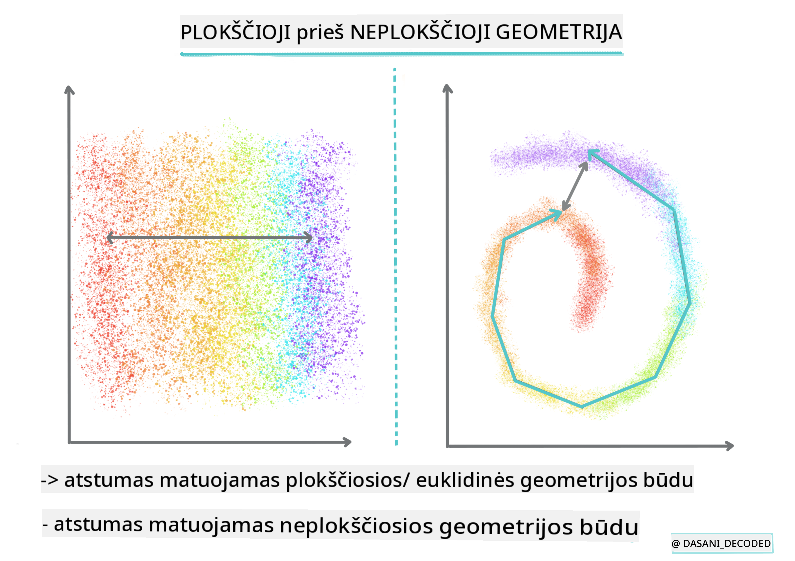
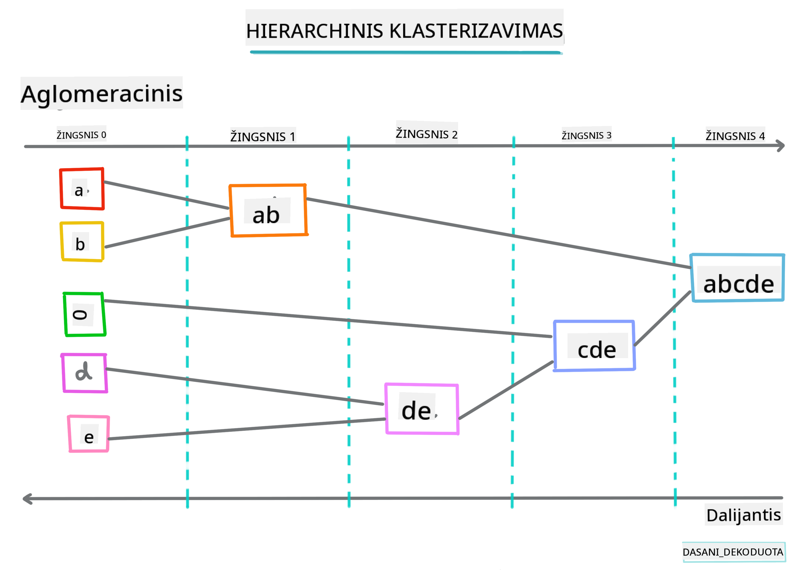
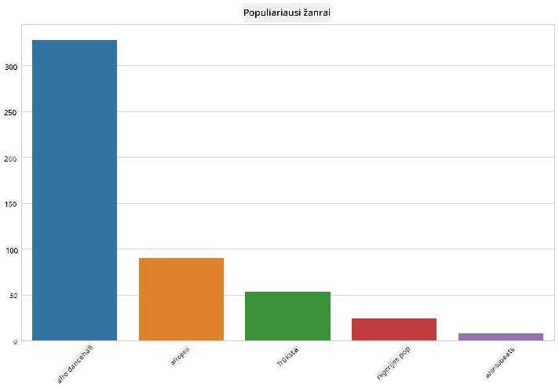
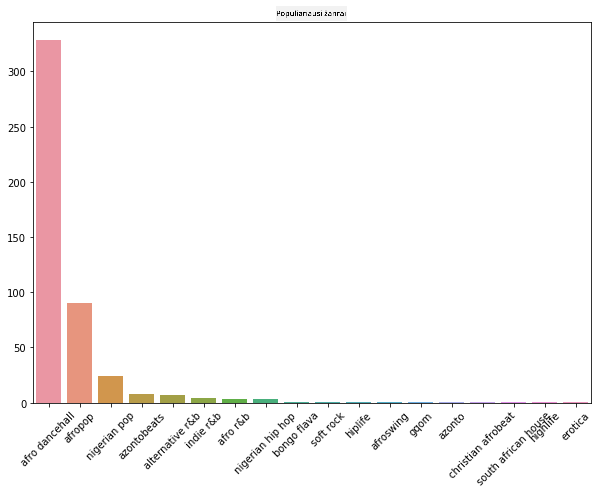
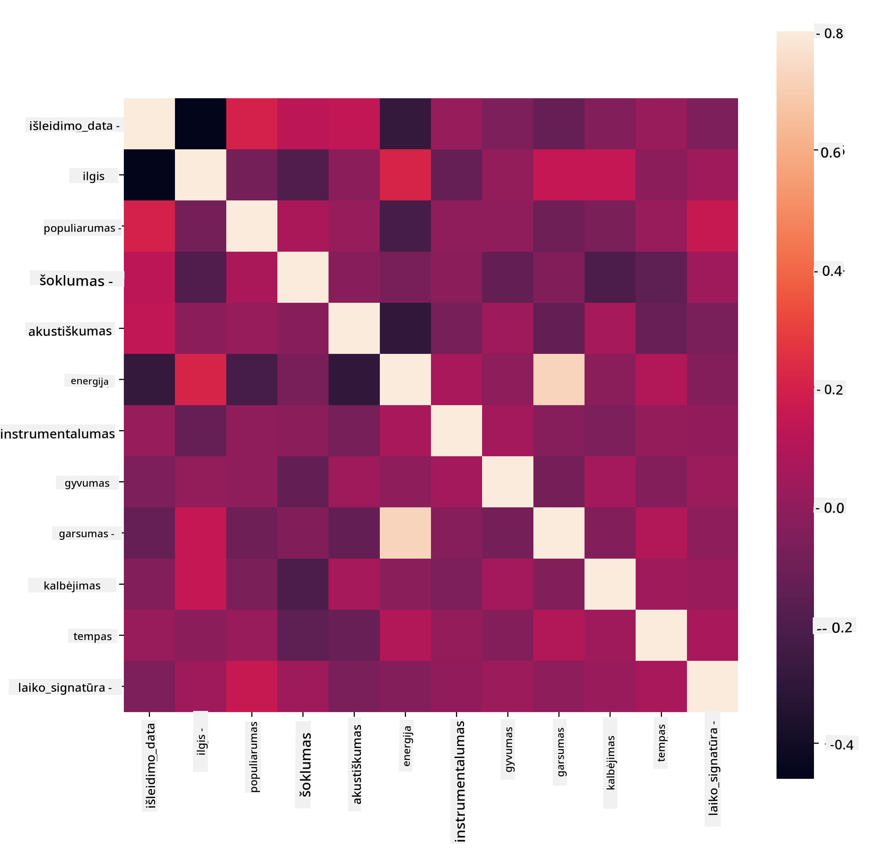
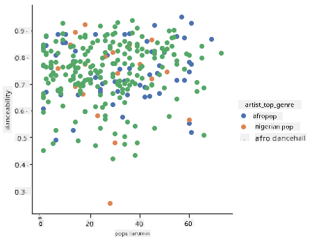

<!--
CO_OP_TRANSLATOR_METADATA:
{
  "original_hash": "0ab69b161efd7a41d325ee28b29415d7",
  "translation_date": "2025-09-03T17:04:09+00:00",
  "source_file": "5-Clustering/1-Visualize/README.md",
  "language_code": "lt"
}
-->
# Įvadas į klasterizaciją

Klasterizacija yra [Nesupervizuoto mokymosi](https://wikipedia.org/wiki/Unsupervised_learning) tipas, kuris remiasi prielaida, kad duomenų rinkinys yra nepažymėtas arba jo įvestys nėra susietos su iš anksto apibrėžtais rezultatais. Ji naudoja įvairius algoritmus, kad išanalizuotų nepažymėtus duomenis ir sudarytų grupes pagal duomenyse pastebėtus modelius.

[](https://youtu.be/ty2advRiWJM "No One Like You by PSquare")

> 🎥 Spustelėkite aukščiau esančią nuotrauką, kad peržiūrėtumėte vaizdo įrašą. Studijuodami mašininį mokymąsi su klasterizacija, pasimėgaukite Nigerijos šokių muzikos ritmais – tai labai vertinama PSquare daina iš 2014 metų.

## [Prieš paskaitos testas](https://gray-sand-07a10f403.1.azurestaticapps.net/quiz/27/)

### Įvadas

[Klasterizacija](https://link.springer.com/referenceworkentry/10.1007%2F978-0-387-30164-8_124) yra labai naudinga duomenų tyrinėjimui. Pažiūrėkime, ar ji gali padėti atrasti tendencijas ir modelius, kaip Nigerijos auditorija suvartoja muziką.

✅ Skirkite minutę pagalvoti apie klasterizacijos panaudojimą. Kasdieniame gyvenime klasterizacija vyksta, kai turite skalbinių krūvą ir reikia išrūšiuoti šeimos narių drabužius 🧦👕👖🩲. Duomenų moksle klasterizacija vyksta analizuojant vartotojo pageidavimus arba nustatant bet kokio nepažymėto duomenų rinkinio charakteristikas. Klasterizacija tam tikra prasme padeda suprasti chaosą, kaip tvarkant kojinių stalčių.

[](https://youtu.be/esmzYhuFnds "Introduction to Clustering")

> 🎥 Spustelėkite aukščiau esančią nuotrauką, kad peržiūrėtumėte vaizdo įrašą: MIT profesorius John Guttag pristato klasterizaciją.

Profesinėje aplinkoje klasterizacija gali būti naudojama rinkos segmentavimui, pavyzdžiui, nustatant, kokios amžiaus grupės perka kokius daiktus. Kitas panaudojimas galėtų būti anomalijų aptikimas, galbūt siekiant nustatyti sukčiavimą iš kredito kortelių operacijų duomenų rinkinio. Taip pat galite naudoti klasterizaciją, kad nustatytumėte auglius medicininių skenavimų rinkinyje.

✅ Pagalvokite minutę, kaip galėjote susidurti su klasterizacija „laukinėje gamtoje“, bankininkystės, e. prekybos ar verslo aplinkoje.

> 🎓 Įdomu tai, kad klasterių analizė atsirado antropologijos ir psichologijos srityse 1930-aisiais. Ar galite įsivaizduoti, kaip ji galėjo būti naudojama?

Be to, ją galima naudoti grupuojant paieškos rezultatus – pavyzdžiui, pagal apsipirkimo nuorodas, vaizdus ar apžvalgas. Klasterizacija yra naudinga, kai turite didelį duomenų rinkinį, kurį norite sumažinti ir atlikti detalesnę analizę, todėl ši technika gali būti naudojama norint sužinoti apie duomenis prieš kuriant kitus modelius.

✅ Kai jūsų duomenys yra organizuoti klasteriuose, galite priskirti jiems klasterio ID. Ši technika gali būti naudinga išsaugant duomenų rinkinio privatumą; vietoj to galite nurodyti duomenų tašką pagal jo klasterio ID, o ne pagal labiau atskleidžiančius identifikuojamus duomenis. Ar galite sugalvoti kitų priežasčių, kodėl norėtumėte nurodyti klasterio ID, o ne kitus klasterio elementus, kad jį identifikuotumėte?

Gilinkite savo supratimą apie klasterizacijos technikas šiame [mokymosi modulyje](https://docs.microsoft.com/learn/modules/train-evaluate-cluster-models?WT.mc_id=academic-77952-leestott).

## Pradžia su klasterizacija

[Scikit-learn siūlo platų metodų pasirinkimą](https://scikit-learn.org/stable/modules/clustering.html) klasterizacijai atlikti. Jūsų pasirinkimas priklausys nuo naudojimo atvejo. Pagal dokumentaciją, kiekvienas metodas turi įvairių privalumų. Štai supaprastinta lentelė apie Scikit-learn palaikomus metodus ir jų tinkamus naudojimo atvejus:

| Metodo pavadinimas            | Naudojimo atvejis                                                   |
| :---------------------------- | :------------------------------------------------------------------ |
| K-Means                       | bendras naudojimas, induktyvus                                      |
| Affinity propagation          | daug, netolygūs klasteriai, induktyvus                             |
| Mean-shift                    | daug, netolygūs klasteriai, induktyvus                             |
| Spectral clustering           | mažai, tolygūs klasteriai, transduktyvus                           |
| Ward hierarchical clustering  | daug, apriboti klasteriai, transduktyvus                           |
| Agglomerative clustering      | daug, apriboti, ne Euklidiniai atstumai, transduktyvus             |
| DBSCAN                        | netolygi geometrija, netolygūs klasteriai, transduktyvus           |
| OPTICS                        | netolygi geometrija, netolygūs klasteriai su kintamu tankiu, transduktyvus |
| Gaussian mixtures             | tolygi geometrija, induktyvus                                      |
| BIRCH                         | didelis duomenų rinkinys su išimtimis, induktyvus                  |

> 🎓 Kaip mes kuriame klasterius, labai priklauso nuo to, kaip mes grupuojame duomenų taškus į grupes. Išskaidykime kai kuriuos terminus:
>
> 🎓 ['Transduktyvus' vs. 'induktyvus'](https://wikipedia.org/wiki/Transduction_(machine_learning))
> 
> Transduktyvi išvada yra gaunama iš stebėtų mokymo atvejų, kurie susiejami su konkrečiais testavimo atvejais. Induktyvi išvada yra gaunama iš mokymo atvejų, kurie susiejami su bendromis taisyklėmis, kurios tik tada taikomos testavimo atvejams.
> 
> Pavyzdys: Įsivaizduokite, kad turite duomenų rinkinį, kuris yra tik iš dalies pažymėtas. Kai kurie dalykai yra „įrašai“, kai kurie „CD“, o kai kurie yra tušti. Jūsų užduotis yra suteikti etiketes tuštiems duomenims. Jei pasirinksite induktyvų požiūrį, treniruosite modelį ieškodami „įrašų“ ir „CD“ ir taikysite tas etiketes nepažymėtiems duomenims. Šis požiūris turės sunkumų klasifikuojant dalykus, kurie iš tikrųjų yra „kasetės“. Transduktyvus požiūris, kita vertus, efektyviau tvarko šiuos nežinomus duomenis, nes jis dirba grupuodamas panašius elementus ir tada priskiria etiketę grupei. Šiuo atveju klasteriai gali atspindėti „apvalius muzikinius dalykus“ ir „kvadratinius muzikinius dalykus“.
> 
> 🎓 ['Netolygi' vs. 'tolygia' geometrija](https://datascience.stackexchange.com/questions/52260/terminology-flat-geometry-in-the-context-of-clustering)
> 
> Kilusi iš matematinės terminologijos, netolygi vs. tolygi geometrija reiškia atstumų tarp taškų matavimą naudojant „tolygias“ ([Euklidines](https://wikipedia.org/wiki/Euclidean_geometry)) arba „netolygias“ (ne Euklidines) geometrines metodikas.
>
>'Tolygia' šiame kontekste reiškia Euklidinę geometriją (dalys kurios mokomos kaip „plokštuminė“ geometrija), o netolygi reiškia ne Euklidinę geometriją. Ką geometrija turi bendro su mašininiu mokymusi? Na, kaip dvi matematikos šakos, turi būti bendras būdas matuoti atstumus tarp taškų klasteriuose, ir tai gali būti daroma „tolygiai“ arba „netolygiai“, priklausomai nuo duomenų pobūdžio. [Euklidiniai atstumai](https://wikipedia.org/wiki/Euclidean_distance) matuojami kaip linijos segmento ilgis tarp dviejų taškų. [Ne Euklidiniai atstumai](https://wikipedia.org/wiki/Non-Euclidean_geometry) matuojami palei kreivę. Jei jūsų duomenys, vizualizuoti, atrodo, kad neegzistuoja plokštumoje, jums gali prireikti specializuoto algoritmo, kad juos apdorotumėte.
>

> Infografikas sukurtas [Dasani Madipalli](https://twitter.com/dasani_decoded)
> 
> 🎓 ['Atstumai'](https://web.stanford.edu/class/cs345a/slides/12-clustering.pdf)
> 
> Klasteriai apibrėžiami pagal jų atstumų matricą, pvz., atstumus tarp taškų. Šis atstumas gali būti matuojamas keliais būdais. Euklidiniai klasteriai apibrėžiami pagal taškų reikšmių vidurkį ir turi „centroidą“ arba centrinį tašką. Atstumai matuojami pagal atstumą iki to centro. Ne Euklidiniai atstumai reiškia „klastroidus“, tašką, kuris yra arčiausiai kitų taškų. Klastroidai savo ruožtu gali būti apibrėžiami įvairiais būdais.
> 
> 🎓 ['Apriboti'](https://wikipedia.org/wiki/Constrained_clustering)
> 
> [Apribota klasterizacija](https://web.cs.ucdavis.edu/~davidson/Publications/ICDMTutorial.pdf) įveda „pusiau prižiūrimą“ mokymąsi į šį nesupervizuotą metodą. Taškų tarpusavio ryšiai pažymimi kaip „negali būti susieti“ arba „turi būti susieti“, todėl kai kurios taisyklės priverčiamos duomenų rinkiniui.
>
>Pavyzdys: Jei algoritmas paleidžiamas laisvai ant nepažymėtų arba pusiau pažymėtų duomenų, klasteriai, kuriuos jis sukuria, gali būti prastos kokybės. Aukščiau pateiktame pavyzdyje klasteriai gali grupuoti „apvalius muzikinius dalykus“, „kvadratinius muzikinius dalykus“, „trikampius dalykus“ ir „sausainius“. Jei pateikiami tam tikri apribojimai arba taisyklės, kurių reikia laikytis („daiktas turi būti pagamintas iš plastiko“, „daiktas turi galėti groti muziką“), tai gali padėti „apriboti“ algoritmą, kad jis priimtų geresnius sprendimus.
> 
> 🎓 'Tankis'
> 
> Duomenys, kurie yra „triukšmingi“, laikomi „tankiais“. Atstumai tarp taškų kiekviename jo klasteryje gali, ištyrus, pasirodyti daugiau ar mažiau tankūs, arba „susigrūdę“, todėl šiuos duomenis reikia analizuoti naudojant tinkamą klasterizacijos metodą. [Šis straipsnis](https://www.kdnuggets.com/2020/02/understanding-density-based-clustering.html) demonstruoja skirtumą tarp K-Means klasterizacijos ir HDBSCAN algoritmų naudojimo triukšmingam duomenų rinkiniui su netolygiu klasterio tankiu tyrinėti.

## Klasterizacijos algoritmai

Yra daugiau nei 100 klasterizacijos algoritmų, ir jų naudojimas priklauso nuo turimų duomenų pobūdžio. Aptarkime keletą pagrindinių:

- **Hierarchinė klasterizacija**. Jei objektas klasifikuojamas pagal jo artumą prie netoliese esančio objekto, o ne prie tolimesnio, klasteriai formuojami pagal jų narių atstumą iki ir nuo kitų objektų. Scikit-learn aglomeracinė klasterizacija yra hierarchinė.

   
   > Infografikas sukurtas [Dasani Madipalli](https://twitter.com/dasani_decoded)

- **Centroidų klasterizacija**. Šis populiarus algoritmas reikalauja pasirinkti „k“, arba klasterių skaičių, kurį reikia suformuoti, po kurio algoritmas nustato klasterio centrinį tašką ir surenka duomenis aplink tą tašką. [K-means klasterizacija](https://wikipedia.org/wiki/K-means_clustering) yra populiari centroidų klasterizacijos versija. Centras nustatomas pagal artimiausią vidurkį, todėl toks pavadinimas. Kvadratinis atstumas nuo klasterio yra minimalizuojamas.

   
   > Infografikas sukurtas [Dasani Madipalli](https://twitter.com/dasani_decoded)

- **Paskirstymo pagrindu klasterizacija**. Remiantis statistiniu modeliavimu, paskirstymo pagrindu klasterizacija orientuojasi į tikimybės nustatymą, kad duomenų taškas priklauso klasteriui, ir priskiria jį atitinkamai. Gaussian mišinių metodai priklauso šiam tipui.

- **Tankio pagrindu klasterizacija**. Duomenų taškai priskiriami klasteriams pagal jų tankį arba jų grupavimą aplink vienas kitą. Duomenų taškai, esantys toli nuo grupės, laikomi išimtimis arba triukšmu. DBSCAN, Mean-shift ir OPTICS priklauso šiam klasterizacijos tipui.

- **Tinklelio pagrindu klasterizacija**. Daugiamatėms duomenų rinkiniams sukuriamas tinklelis, o duomenys paskirstomi tarp tinklelio ląstelių, taip sukuriant klasterius.

## Užduotis – suklasterizuokite savo duomenis

Klasterizacijos technika labai palengvinama tinkama vizualizacija, todėl pradėkime vizualizuoti mūsų muzikos duomenis. Ši užduotis padės mums nuspręsti, kurį klasterizacijos metodą efektyviausiai naudoti šių duomenų pobūdžiui.

1. Atidarykite [_notebook.ipynb_](https://github.com/microsoft/ML-For-Beginners/blob/main/5-Clustering/1-Visualize/notebook.ipynb) failą šiame aplanke.

1. Importuokite `Seaborn` paketą gerai duomenų vizualizacijai.

    ```python
    !pip install seaborn
    ```

1. Pridėkite dainų duomenis iš [_nigerian-songs.csv_](https://github.com/microsoft/ML-For-Beginners/blob/main/5-Clustering/data/nigerian-songs.csv). Įkelkite duomenų rėmelį su kai kuriais duomenimis apie dainas. Pasiruoškite tyrinėti šiuos duomenis importuodami bibliotekas ir išvesdami duomenis:

    ```python
    import matplotlib.pyplot as plt
    import pandas as pd
    
    df = pd.read_csv("../data/nigerian-songs.csv")
    df.head()
    ```

    Patikrinkite pirmas kelias duomenų eilutes:

    |     | pavadinimas             | albumas                      | atlikėjas           | atlikėjo žanras   | išleidimo data | ilgis  | populiarumas | šoklumas      | akustiškumas | energija | instrumentiškumas | gyvumas  | garsumas | kalbėjimas  | tempas  | laiko parašas  |
    | --- | ----------------------- | ---------------------------- | ------------------- | ---------------- | ------------- | ------ | ----------- | ------------ | ------------ | ------- | ---------------- | ------- | -------- | ---------- | ------- | ------------- |
    | 0   | Sparky                  | Mandy & The Jungle           | Cruel Santino       | alternatyvus r&b | 2019          | 144000 | 48          | 0.666        | 0.851        | 0.42    | 0.534            | 0.11    | -6.699   | 0.0829     | 133.015 | 5             |
    | 1   | sh
| 2   | LITT!                    | LITT!                        | AYLØ                | indie r&b        | 2018         | 207758 | 40         | 0.836        | 0.272        | 0.564  | 0.000537         | 0.11     | -7.127   | 0.0424      | 130.005 | 4              |
| 3   | Confident / Feeling Cool | Enjoy Your Life              | Lady Donli          | nigerian pop     | 2019         | 175135 | 14         | 0.894        | 0.798        | 0.611  | 0.000187         | 0.0964   | -4.961   | 0.113       | 111.087 | 4              |
| 4   | wanted you               | rare.                        | Odunsi (The Engine) | afropop          | 2018         | 152049 | 25         | 0.702        | 0.116        | 0.833  | 0.91             | 0.348    | -6.044   | 0.0447      | 105.115 | 4              |

1. Gaukite informaciją apie duomenų rėmelį, iškviesdami `info()`:

    ```python
    df.info()
    ```

   Rezultatas atrodo taip:

    ```output
    <class 'pandas.core.frame.DataFrame'>
    RangeIndex: 530 entries, 0 to 529
    Data columns (total 16 columns):
     #   Column            Non-Null Count  Dtype  
    ---  ------            --------------  -----  
     0   name              530 non-null    object 
     1   album             530 non-null    object 
     2   artist            530 non-null    object 
     3   artist_top_genre  530 non-null    object 
     4   release_date      530 non-null    int64  
     5   length            530 non-null    int64  
     6   popularity        530 non-null    int64  
     7   danceability      530 non-null    float64
     8   acousticness      530 non-null    float64
     9   energy            530 non-null    float64
     10  instrumentalness  530 non-null    float64
     11  liveness          530 non-null    float64
     12  loudness          530 non-null    float64
     13  speechiness       530 non-null    float64
     14  tempo             530 non-null    float64
     15  time_signature    530 non-null    int64  
    dtypes: float64(8), int64(4), object(4)
    memory usage: 66.4+ KB
    ```

1. Patikrinkite, ar nėra tuščių reikšmių, iškviesdami `isnull()` ir patvirtindami, kad suma yra 0:

    ```python
    df.isnull().sum()
    ```

    Viskas gerai:

    ```output
    name                0
    album               0
    artist              0
    artist_top_genre    0
    release_date        0
    length              0
    popularity          0
    danceability        0
    acousticness        0
    energy              0
    instrumentalness    0
    liveness            0
    loudness            0
    speechiness         0
    tempo               0
    time_signature      0
    dtype: int64
    ```

1. Aprašykite duomenis:

    ```python
    df.describe()
    ```

    |       | release_date | length      | popularity | danceability | acousticness | energy   | instrumentalness | liveness | loudness  | speechiness | tempo      | time_signature |
    | ----- | ------------ | ----------- | ---------- | ------------ | ------------ | -------- | ---------------- | -------- | --------- | ----------- | ---------- | -------------- |
    | count | 530          | 530         | 530        | 530          | 530          | 530      | 530              | 530      | 530       | 530         | 530        | 530            |
    | mean  | 2015.390566  | 222298.1698 | 17.507547  | 0.741619     | 0.265412     | 0.760623 | 0.016305         | 0.147308 | -4.953011 | 0.130748    | 116.487864 | 3.986792       |
    | std   | 3.131688     | 39696.82226 | 18.992212  | 0.117522     | 0.208342     | 0.148533 | 0.090321         | 0.123588 | 2.464186  | 0.092939    | 23.518601  | 0.333701       |
    | min   | 1998         | 89488       | 0          | 0.255        | 0.000665     | 0.111    | 0                | 0.0283   | -19.362   | 0.0278      | 61.695     | 3              |
    | 25%   | 2014         | 199305      | 0          | 0.681        | 0.089525     | 0.669    | 0                | 0.07565  | -6.29875  | 0.0591      | 102.96125  | 4              |
    | 50%   | 2016         | 218509      | 13         | 0.761        | 0.2205       | 0.7845   | 0.000004         | 0.1035   | -4.5585   | 0.09795     | 112.7145   | 4              |
    | 75%   | 2017         | 242098.5    | 31         | 0.8295       | 0.403        | 0.87575  | 0.000234         | 0.164    | -3.331    | 0.177       | 125.03925  | 4              |
    | max   | 2020         | 511738      | 73         | 0.966        | 0.954        | 0.995    | 0.91             | 0.811    | 0.582     | 0.514       | 206.007    | 5              |

> 🤔 Jei dirbame su klasterizavimu, nesupervizuotu metodu, kuriam nereikia pažymėtų duomenų, kodėl rodome šiuos duomenis su etiketėmis? Duomenų tyrimo fazėje jie yra naudingi, tačiau klasterizavimo algoritmams jie nėra būtini. Galėtumėte tiesiog pašalinti stulpelių pavadinimus ir nurodyti duomenis pagal stulpelių numerius.

Pažvelkite į bendras duomenų reikšmes. Atkreipkite dėmesį, kad populiarumas gali būti '0', kas rodo dainas, kurios neturi reitingo. Pašalinkime jas netrukus.

1. Naudokite stulpelinę diagramą, kad sužinotumėte populiariausius žanrus:

    ```python
    import seaborn as sns
    
    top = df['artist_top_genre'].value_counts()
    plt.figure(figsize=(10,7))
    sns.barplot(x=top[:5].index,y=top[:5].values)
    plt.xticks(rotation=45)
    plt.title('Top genres',color = 'blue')
    ```

    

✅ Jei norite pamatyti daugiau aukščiausių reikšmių, pakeiskite top `[:5]` į didesnę reikšmę arba pašalinkite ją, kad pamatytumėte viską.

Atkreipkite dėmesį, kai aukščiausias žanras apibūdinamas kaip 'Missing', tai reiškia, kad Spotify jo neklasifikavo, todėl pašalinkime jį.

1. Pašalinkite trūkstamus duomenis, juos filtruodami

    ```python
    df = df[df['artist_top_genre'] != 'Missing']
    top = df['artist_top_genre'].value_counts()
    plt.figure(figsize=(10,7))
    sns.barplot(x=top.index,y=top.values)
    plt.xticks(rotation=45)
    plt.title('Top genres',color = 'blue')
    ```

    Dabar dar kartą patikrinkite žanrus:

    

1. Trys populiariausi žanrai akivaizdžiai dominuoja šiame duomenų rinkinyje. Susikoncentruokime į `afro dancehall`, `afropop` ir `nigerian pop`, papildomai filtruokime duomenų rinkinį, kad pašalintume viską su 0 populiarumo reikšme (tai reiškia, kad jie nebuvo klasifikuoti pagal populiarumą duomenų rinkinyje ir gali būti laikomi triukšmu mūsų tikslams):

    ```python
    df = df[(df['artist_top_genre'] == 'afro dancehall') | (df['artist_top_genre'] == 'afropop') | (df['artist_top_genre'] == 'nigerian pop')]
    df = df[(df['popularity'] > 0)]
    top = df['artist_top_genre'].value_counts()
    plt.figure(figsize=(10,7))
    sns.barplot(x=top.index,y=top.values)
    plt.xticks(rotation=45)
    plt.title('Top genres',color = 'blue')
    ```

1. Greitai patikrinkite, ar duomenys koreliuoja kokiu nors ypatingai stipriu būdu:

    ```python
    corrmat = df.corr(numeric_only=True)
    f, ax = plt.subplots(figsize=(12, 9))
    sns.heatmap(corrmat, vmax=.8, square=True)
    ```

    

    Vienintelė stipri koreliacija yra tarp `energy` ir `loudness`, kas nėra labai stebėtina, nes garsus muzika paprastai yra gana energinga. Kitaip koreliacijos yra gana silpnos. Bus įdomu pamatyti, ką klasterizavimo algoritmas gali padaryti su šiais duomenimis.

    > 🎓 Atkreipkite dėmesį, kad koreliacija nereiškia priežastinio ryšio! Turime koreliacijos įrodymą, bet neturime priežastinio ryšio įrodymo. [Ši juokinga svetainė](https://tylervigen.com/spurious-correlations) turi keletą vizualizacijų, kurios pabrėžia šį punktą.

Ar šiame duomenų rinkinyje yra konvergencija aplink dainos suvokiamą populiarumą ir šokamumą? FacetGrid rodo, kad yra koncentriniai apskritimai, kurie sutampa, nepriklausomai nuo žanro. Ar gali būti, kad Nigerijos skoniai sutampa tam tikru šokamumo lygiu šiam žanrui?  

✅ Išbandykite skirtingus duomenų taškus (energy, loudness, speechiness) ir daugiau ar skirtingų muzikos žanrų. Ką galite atrasti? Pažvelkite į `df.describe()` lentelę, kad pamatytumėte bendrą duomenų taškų pasiskirstymą.

### Užduotis - duomenų pasiskirstymas

Ar šie trys žanrai reikšmingai skiriasi pagal jų šokamumo suvokimą, remiantis jų populiarumu?

1. Išnagrinėkite mūsų trijų populiariausių žanrų duomenų pasiskirstymą pagal populiarumą ir šokamumą išilgai tam tikros x ir y ašies.

    ```python
    sns.set_theme(style="ticks")
    
    g = sns.jointplot(
        data=df,
        x="popularity", y="danceability", hue="artist_top_genre",
        kind="kde",
    )
    ```

    Galite atrasti koncentrinius apskritimus aplink bendrą konvergencijos tašką, rodančius taškų pasiskirstymą.

    > 🎓 Atkreipkite dėmesį, kad šiame pavyzdyje naudojama KDE (Kernel Density Estimate) grafika, kuri atvaizduoja duomenis naudojant nuolatinę tikimybės tankio kreivę. Tai leidžia interpretuoti duomenis dirbant su keliomis pasiskirstymo formomis.

    Apskritai, trys žanrai laisvai sutampa pagal jų populiarumą ir šokamumą. Klasterių nustatymas šiuose laisvai suderintuose duomenyse bus iššūkis:

    

1. Sukurkite sklaidos diagramą:

    ```python
    sns.FacetGrid(df, hue="artist_top_genre", height=5) \
       .map(plt.scatter, "popularity", "danceability") \
       .add_legend()
    ```

    Sklaidos diagrama su tomis pačiomis ašimis rodo panašų konvergencijos modelį

    

Apskritai, klasterizavimui galite naudoti sklaidos diagramas, kad parodytumėte duomenų klasterius, todėl šio tipo vizualizacijos įvaldymas yra labai naudingas. Kitoje pamokoje naudosime šiuos filtruotus duomenis ir taikysime k-means klasterizavimą, kad atrastume grupes šiuose duomenyse, kurios įdomiai persidengia.

---

## 🚀Iššūkis

Ruošiantis kitai pamokai, sudarykite diagramą apie įvairius klasterizavimo algoritmus, kuriuos galite atrasti ir naudoti gamybos aplinkoje. Kokias problemas klasterizavimas bando spręsti?

## [Po paskaitos testas](https://gray-sand-07a10f403.1.azurestaticapps.net/quiz/28/)

## Apžvalga ir savarankiškas mokymasis

Prieš taikydami klasterizavimo algoritmus, kaip išmokome, gerai suprasti savo duomenų rinkinio pobūdį. Skaitykite daugiau apie šią temą [čia](https://www.kdnuggets.com/2019/10/right-clustering-algorithm.html)

[Šis naudingas straipsnis](https://www.freecodecamp.org/news/8-clustering-algorithms-in-machine-learning-that-all-data-scientists-should-know/) paaiškina įvairius būdus, kaip skirtingi klasterizavimo algoritmai elgiasi, atsižvelgiant į skirtingas duomenų formas.

## Užduotis

[Tyrinėkite kitus klasterizavimo vizualizacijos būdus](assignment.md)

---

**Atsakomybės apribojimas**:  
Šis dokumentas buvo išverstas naudojant dirbtinio intelekto vertimo paslaugą [Co-op Translator](https://github.com/Azure/co-op-translator). Nors siekiame tikslumo, atkreipiame dėmesį, kad automatiniai vertimai gali turėti klaidų ar netikslumų. Originalus dokumentas jo gimtąja kalba turėtų būti laikomas autoritetingu šaltiniu. Kritinei informacijai rekomenduojama naudotis profesionalių vertėjų paslaugomis. Mes neprisiimame atsakomybės už nesusipratimus ar klaidingus aiškinimus, kylančius dėl šio vertimo naudojimo.