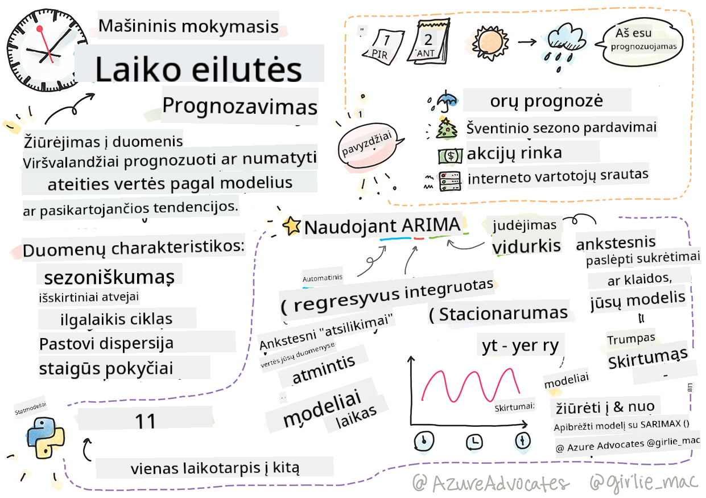
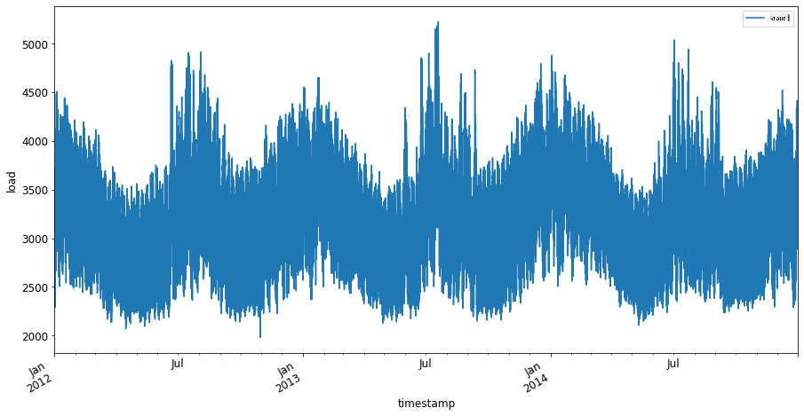

<!--
CO_OP_TRANSLATOR_METADATA:
{
  "original_hash": "3150d40f36a77857316ecaed5f31e856",
  "translation_date": "2025-09-03T16:52:43+00:00",
  "source_file": "7-TimeSeries/1-Introduction/README.md",
  "language_code": "lt"
}
-->
# Įvadas į laiko eilučių prognozavimą



> Sketchnote sukūrė [Tomomi Imura](https://www.twitter.com/girlie_mac)

Šioje pamokoje ir kitoje pamokoje sužinosite apie laiko eilučių prognozavimą – įdomią ir vertingą ML mokslininko kompetencijos dalį, kuri yra šiek tiek mažiau žinoma nei kitos temos. Laiko eilučių prognozavimas yra tarsi „kristalinis rutulys“: remiantis praeities kintamojo, pvz., kainos, veikimu, galima numatyti jo būsimą potencialią vertę.

[](https://youtu.be/cBojo1hsHiI "Įvadas į laiko eilučių prognozavimą")

> 🎥 Spustelėkite aukščiau esančią nuotrauką, kad peržiūrėtumėte vaizdo įrašą apie laiko eilučių prognozavimą

## [Prieš paskaitą – testas](https://gray-sand-07a10f403.1.azurestaticapps.net/quiz/41/)

Tai naudinga ir įdomi sritis, turinti realią vertę verslui, nes ji tiesiogiai taikoma kainodaros, inventoriaus ir tiekimo grandinės problemoms spręsti. Nors giluminio mokymosi metodai pradėti naudoti siekiant geriau numatyti būsimą veikimą, laiko eilučių prognozavimas vis dar yra sritis, kurioje klasikiniai ML metodai turi didelę reikšmę.

> Pensilvanijos universiteto naudingą laiko eilučių mokymo programą rasite [čia](https://online.stat.psu.edu/stat510/lesson/1)

## Įvadas

Įsivaizduokite, kad prižiūrite išmaniųjų automobilių stovėjimo skaitiklių tinklą, kuris teikia duomenis apie tai, kaip dažnai ir kiek laiko jie naudojami laikui bėgant.

> Kas, jei galėtumėte numatyti, remdamiesi skaitiklio praeities veikimu, jo būsimą vertę pagal pasiūlos ir paklausos dėsnius?

Tiksliai numatyti, kada veikti, kad pasiektumėte savo tikslą, yra iššūkis, kurį galima spręsti naudojant laiko eilučių prognozavimą. Nors žmonėms nebūtų malonu mokėti daugiau už stovėjimą užimtose vietose, kai jie ieško vietos, tai būtų patikimas būdas generuoti pajamas gatvių valymui!

Pažvelkime į kai kuriuos laiko eilučių algoritmų tipus ir pradėkime darbą su užrašų knyga, kad išvalytume ir paruoštume duomenis. Analizuojami duomenys yra paimti iš GEFCom2014 prognozavimo konkurso. Jie apima 3 metų valandinį elektros apkrovos ir temperatūros vertes nuo 2012 iki 2014 metų. Atsižvelgiant į istorinius elektros apkrovos ir temperatūros modelius, galite numatyti būsimą elektros apkrovos vertę.

Šiame pavyzdyje išmoksite prognozuoti vieną laiko žingsnį į priekį, naudodami tik istorinius apkrovos duomenis. Tačiau prieš pradedant naudinga suprasti, kas vyksta užkulisiuose.

## Kai kurie apibrėžimai

Susidūrus su terminu „laiko eilutės“, svarbu suprasti jo naudojimą įvairiuose kontekstuose.

🎓 **Laiko eilutės**

Matematikoje „laiko eilutės yra duomenų taškų seka, indeksuota (arba išvardyta, arba pavaizduota grafike) laiko tvarka. Dažniausiai laiko eilutės yra seka, paimta iš eilės vienodai išdėstytų laiko taškų.“ Laiko eilučių pavyzdys yra kasdienė [Dow Jones Industrial Average](https://wikipedia.org/wiki/Time_series) uždarymo vertė. Laiko eilučių grafikai ir statistinis modeliavimas dažnai naudojami signalų apdorojime, orų prognozavime, žemės drebėjimų numatyme ir kitose srityse, kur įvykiai vyksta ir duomenų taškai gali būti pavaizduoti laike.

🎓 **Laiko eilučių analizė**

Laiko eilučių analizė – tai aukščiau minėtų laiko eilučių duomenų analizė. Laiko eilučių duomenys gali būti įvairių formų, įskaitant „pertrauktas laiko eilutes“, kurios aptinka modelius laiko eilučių evoliucijoje prieš ir po pertraukiančio įvykio. Analizės tipas, reikalingas laiko eilutėms, priklauso nuo duomenų pobūdžio. Laiko eilučių duomenys patys gali būti skaičių ar simbolių seka.

Atliekama analizė naudoja įvairius metodus, įskaitant dažnio srities ir laiko srities, linijinius ir nelinijinius, ir dar daugiau. [Sužinokite daugiau](https://www.itl.nist.gov/div898/handbook/pmc/section4/pmc4.htm) apie daugybę būdų analizuoti šio tipo duomenis.

🎓 **Laiko eilučių prognozavimas**

Laiko eilučių prognozavimas – tai modelio naudojimas būsimoms vertėms numatyti, remiantis anksčiau surinktų duomenų modeliais, kaip jie vyko praeityje. Nors regresijos modelius galima naudoti laiko eilučių duomenims tyrinėti, kai laiko indeksai yra x kintamieji grafike, tokie duomenys geriausiai analizuojami naudojant specialius modelių tipus.

Laiko eilučių duomenys yra užsakytų stebėjimų sąrašas, skirtingai nei duomenys, kurie gali būti analizuojami linijine regresija. Dažniausias modelis yra ARIMA, akronimas, reiškiantis „Autoregresinis Integruotas Judantis Vidurkis“.

[ARIMA modeliai](https://online.stat.psu.edu/stat510/lesson/1/1.1) „siejasi su dabartine serijos verte, praeities vertėmis ir praeities prognozavimo klaidomis.“ Jie labiausiai tinka laiko srities duomenų analizei, kur duomenys yra užsakyti laike.

> Yra keletas ARIMA modelių tipų, apie kuriuos galite sužinoti [čia](https://people.duke.edu/~rnau/411arim.htm) ir kuriuos aptarsime kitoje pamokoje.

Kitoje pamokoje sukursite ARIMA modelį, naudodami [Vieno kintamojo laiko eilutes](https://itl.nist.gov/div898/handbook/pmc/section4/pmc44.htm), kurios orientuojasi į vieną kintamąjį, kuris keičia savo vertę laikui bėgant. Šio tipo duomenų pavyzdys yra [šis duomenų rinkinys](https://itl.nist.gov/div898/handbook/pmc/section4/pmc4411.htm), kuris registruoja mėnesinę CO2 koncentraciją Mauna Loa observatorijoje:

|  CO2   | YearMonth | Year  | Month |
| :----: | :-------: | :---: | :---: |
| 330.62 |  1975.04  | 1975  |   1   |
| 331.40 |  1975.13  | 1975  |   2   |
| 331.87 |  1975.21  | 1975  |   3   |
| 333.18 |  1975.29  | 1975  |   4   |
| 333.92 |  1975.38  | 1975  |   5   |
| 333.43 |  1975.46  | 1975  |   6   |
| 331.85 |  1975.54  | 1975  |   7   |
| 330.01 |  1975.63  | 1975  |   8   |
| 328.51 |  1975.71  | 1975  |   9   |
| 328.41 |  1975.79  | 1975  |  10   |
| 329.25 |  1975.88  | 1975  |  11   |
| 330.97 |  1975.96  | 1975  |  12   |

✅ Nustatykite kintamąjį, kuris keičiasi laikui bėgant šiame duomenų rinkinyje.

## Laiko eilučių duomenų savybės, į kurias reikia atsižvelgti

Analizuodami laiko eilučių duomenis, galite pastebėti, kad jie turi [tam tikras savybes](https://online.stat.psu.edu/stat510/lesson/1/1.1), į kurias reikia atsižvelgti ir jas sumažinti, kad geriau suprastumėte jų modelius. Jei laikote laiko eilučių duomenis potencialiai teikiančiais „signalą“, kurį norite analizuoti, šios savybės gali būti laikomos „triukšmu“. Dažnai reikia sumažinti šį „triukšmą“, naudojant tam tikras statistines technikas.

Štai keletas sąvokų, kurias turėtumėte žinoti, kad galėtumėte dirbti su laiko eilutėmis:

🎓 **Tendencijos**

Tendencijos apibrėžiamos kaip matuojami padidėjimai ir sumažėjimai laikui bėgant. [Skaitykite daugiau](https://machinelearningmastery.com/time-series-trends-in-python). Laiko eilučių kontekste tai yra apie tai, kaip naudoti ir, jei reikia, pašalinti tendencijas iš laiko eilučių.

🎓 **[Sezoniškumas](https://machinelearningmastery.com/time-series-seasonality-with-python/)**

Sezoniškumas apibrėžiamas kaip periodiniai svyravimai, pvz., šventiniai pirkimo bumas, kuris gali paveikti pardavimus. [Pažvelkite](https://itl.nist.gov/div898/handbook/pmc/section4/pmc443.htm), kaip skirtingų tipų grafikai rodo sezoniškumą duomenyse.

🎓 **Išskirtiniai taškai**

Išskirtiniai taškai yra toli nuo standartinės duomenų variacijos.

🎓 **Ilgalaikiai ciklai**

Nepriklausomai nuo sezoniškumo, duomenys gali rodyti ilgalaikį ciklą, pvz., ekonominį nuosmukį, kuris trunka ilgiau nei metus.

🎓 **Pastovi variacija**

Laikui bėgant kai kurie duomenys rodo pastovius svyravimus, pvz., energijos naudojimą dieną ir naktį.

🎓 **Staigūs pokyčiai**

Duomenys gali rodyti staigų pokytį, kuris gali reikalauti papildomos analizės. Pavyzdžiui, staigus verslų uždarymas dėl COVID sukėlė duomenų pokyčius.

✅ Štai [pavyzdinis laiko eilučių grafikas](https://www.kaggle.com/kashnitsky/topic-9-part-1-time-series-analysis-in-python), rodantis kasdienes išlaidas žaidimo valiutai per keletą metų. Ar galite nustatyti bet kurią iš aukščiau išvardytų savybių šiuose duomenyse?


## Užduotis – pradžia su elektros energijos naudojimo duomenimis

Pradėkime kurti laiko eilučių modelį, kad numatytume būsimą elektros energijos naudojimą, remdamiesi praeities naudojimu.

> Šio pavyzdžio duomenys yra paimti iš GEFCom2014 prognozavimo konkurso. Jie apima 3 metų valandinį elektros apkrovos ir temperatūros vertes nuo 2012 iki 2014 metų.
>
> Tao Hong, Pierre Pinson, Shu Fan, Hamidreza Zareipour, Alberto Troccoli ir Rob J. Hyndman, „Tikimybinis energijos prognozavimas: Global Energy Forecasting Competition 2014 ir toliau“, International Journal of Forecasting, vol.32, no.3, pp 896-913, liepa-rugsėjis, 2016.

1. Pamokos `working` aplanke atidarykite _notebook.ipynb_ failą. Pradėkite pridėdami bibliotekas, kurios padės įkelti ir vizualizuoti duomenis:

    ```python
    import os
    import matplotlib.pyplot as plt
    from common.utils import load_data
    %matplotlib inline
    ```

    Atkreipkite dėmesį, kad naudojate failus iš pridėto `common` aplanko, kuris nustato jūsų aplinką ir tvarko duomenų atsisiuntimą.

2. Toliau, peržiūrėkite duomenis kaip duomenų rėmelį, iškviesdami `load_data()` ir `head()`:

    ```python
    data_dir = './data'
    energy = load_data(data_dir)[['load']]
    energy.head()
    ```

    Matote, kad yra dvi stulpeliai, atspindintys datą ir apkrovą:

    |                     |  load  |
    | :-----------------: | :----: |
    | 2012-01-01 00:00:00 | 2698.0 |
    | 2012-01-01 01:00:00 | 2558.0 |
    | 2012-01-01 02:00:00 | 2444.0 |
    | 2012-01-01 03:00:00 | 2402.0 |
    | 2012-01-01 04:00:00 | 2403.0 |

3. Dabar, nubrėžkite duomenis, iškviesdami `plot()`:

    ```python
    energy.plot(y='load', subplots=True, figsize=(15, 8), fontsize=12)
    plt.xlabel('timestamp', fontsize=12)
    plt.ylabel('load', fontsize=12)
    plt.show()
    ```

    

4. Dabar, nubrėžkite pirmąją 2014 m. liepos savaitę, pateikdami ją kaip įvestį `energy` `[nuo datos]: [iki datos]` formatu:

    ```python
    energy['2014-07-01':'2014-07-07'].plot(y='load', subplots=True, figsize=(15, 8), fontsize=12)
    plt.xlabel('timestamp', fontsize=12)
    plt.ylabel('load', fontsize=12)
    plt.show()
    ```

    

    Gražus grafikas! Pažvelkite į šiuos grafikus ir pabandykite nustatyti bet kurią iš aukščiau išvardytų savybių. Ką galime suprasti vizualizuodami duomenis?

Kitoje pamokoje sukursite ARIMA modelį, kad sukurtumėte prognozes.

---

## 🚀Iššūkis

Sudarykite sąrašą visų pramonės šakų ir tyrimų sričių, kuriose, jūsų manymu, laiko eilučių prognozavimas būtų naudingas. Ar galite sugalvoti šių metodų taikymą mene? Ekonometrikoje? Ekologijoje? Mažmeninėje prekyboje? Pramonėje? Finansuose? Kur dar?

## [Po paskaitos – testas](https://gray-sand-07a10f403.1.azurestaticapps.net/quiz/42/)

## Apžvalga ir savarankiškas mokymasis

Nors čia jų neaptarsime, neuroniniai tinklai kartais naudojami klasikiniais laiko eilučių prognozavimo metodais. Skaitykite daugiau apie juos [šiame straipsnyje](https://medium.com/microsoftazure/neural-networks-for-forecasting-financial-and-economic-time-series-6aca370ff412)

## Užduotis

[Vizualizuokite daugiau laiko eilučių](assignment.md)

---

**Atsakomybės apribojimas**:  
Šis dokumentas buvo išverstas naudojant AI vertimo paslaugą [Co-op Translator](https://github.com/Azure/co-op-translator). Nors siekiame tikslumo, prašome atkreipti dėmesį, kad automatiniai vertimai gali turėti klaidų ar netikslumų. Originalus dokumentas jo gimtąja kalba turėtų būti laikomas autoritetingu šaltiniu. Kritinei informacijai rekomenduojama naudoti profesionalų žmogaus vertimą. Mes neprisiimame atsakomybės už nesusipratimus ar klaidingus interpretavimus, atsiradusius dėl šio vertimo naudojimo.