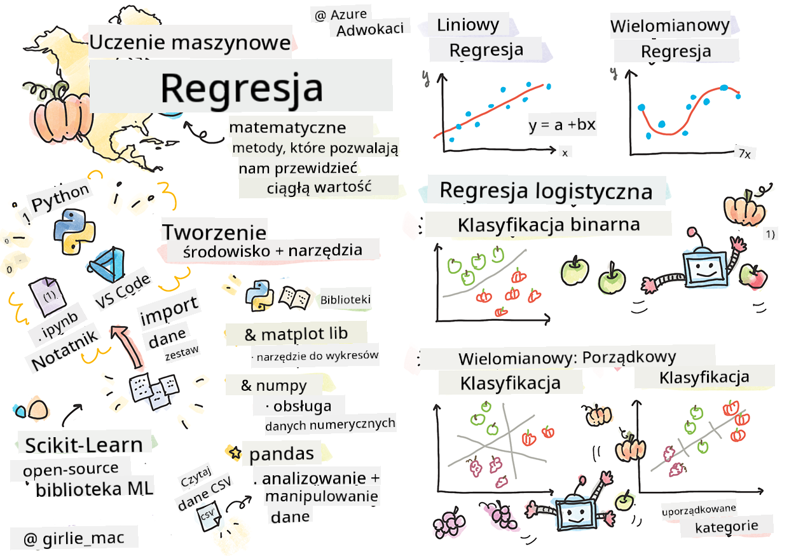
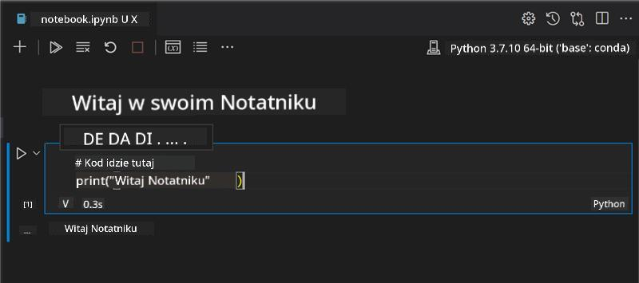
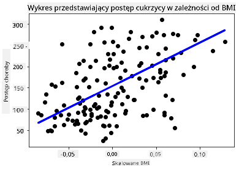

<!--
CO_OP_TRANSLATOR_METADATA:
{
  "original_hash": "6b1cb0e46d4c5b747eff6e3607642760",
  "translation_date": "2025-09-03T16:36:44+00:00",
  "source_file": "2-Regression/1-Tools/README.md",
  "language_code": "pl"
}
-->
# Rozpocznij pracę z Pythonem i Scikit-learn dla modeli regresji



> Sketchnote autorstwa [Tomomi Imura](https://www.twitter.com/girlie_mac)

## [Quiz przed lekcją](https://gray-sand-07a10f403.1.azurestaticapps.net/quiz/9/)

> ### [Ta lekcja jest dostępna w R!](../../../../2-Regression/1-Tools/solution/R/lesson_1.html)

## Wprowadzenie

W tych czterech lekcjach dowiesz się, jak budować modele regresji. Wkrótce omówimy, do czego one służą. Ale zanim zaczniesz, upewnij się, że masz odpowiednie narzędzia, aby rozpocząć proces!

W tej lekcji nauczysz się:

- Konfigurować komputer do lokalnych zadań związanych z uczeniem maszynowym.
- Pracować z notatnikami Jupyter.
- Korzystać z Scikit-learn, w tym instalacji.
- Eksplorować regresję liniową w praktycznym ćwiczeniu.

## Instalacje i konfiguracje

[](https://youtu.be/-DfeD2k2Kj0 "ML dla początkujących - Przygotuj narzędzia do budowy modeli uczenia maszynowego")

> 🎥 Kliknij obrazek powyżej, aby obejrzeć krótki film o konfiguracji komputera do ML.

1. **Zainstaluj Python**. Upewnij się, że [Python](https://www.python.org/downloads/) jest zainstalowany na Twoim komputerze. Będziesz używać Pythona do wielu zadań związanych z nauką o danych i uczeniem maszynowym. Większość systemów komputerowych ma już zainstalowanego Pythona. Dostępne są również przydatne [Pakiety Kodowania w Pythonie](https://code.visualstudio.com/learn/educators/installers?WT.mc_id=academic-77952-leestott), które ułatwiają konfigurację dla niektórych użytkowników.

   Niektóre zastosowania Pythona wymagają jednej wersji oprogramowania, podczas gdy inne wymagają innej wersji. Z tego powodu warto pracować w [wirtualnym środowisku](https://docs.python.org/3/library/venv.html).

2. **Zainstaluj Visual Studio Code**. Upewnij się, że Visual Studio Code jest zainstalowany na Twoim komputerze. Postępuj zgodnie z instrukcjami, aby [zainstalować Visual Studio Code](https://code.visualstudio.com/) w podstawowej wersji. W tym kursie będziesz używać Pythona w Visual Studio Code, więc warto zapoznać się z tym, jak [skonfigurować Visual Studio Code](https://docs.microsoft.com/learn/modules/python-install-vscode?WT.mc_id=academic-77952-leestott) do pracy z Pythonem.

   > Zapoznaj się z Pythonem, przechodząc przez tę kolekcję [modułów Learn](https://docs.microsoft.com/users/jenlooper-2911/collections/mp1pagggd5qrq7?WT.mc_id=academic-77952-leestott)
   >
   > [](https://youtu.be/yyQM70vi7V8 "Konfiguracja Pythona w Visual Studio Code")
   >
   > 🎥 Kliknij obrazek powyżej, aby obejrzeć film: używanie Pythona w VS Code.

3. **Zainstaluj Scikit-learn**, postępując zgodnie z [tymi instrukcjami](https://scikit-learn.org/stable/install.html). Ponieważ musisz upewnić się, że używasz Pythona 3, zaleca się korzystanie z wirtualnego środowiska. Jeśli instalujesz tę bibliotekę na komputerze Mac z procesorem M1, na stronie podanej powyżej znajdują się specjalne instrukcje.

4. **Zainstaluj Jupyter Notebook**. Musisz [zainstalować pakiet Jupyter](https://pypi.org/project/jupyter/).

## Twoje środowisko do tworzenia ML

Będziesz używać **notatników** do tworzenia kodu w Pythonie i budowania modeli uczenia maszynowego. Ten typ pliku jest popularnym narzędziem dla naukowców zajmujących się danymi i można go rozpoznać po rozszerzeniu `.ipynb`.

Notatniki to interaktywne środowisko, które pozwala programiście zarówno kodować, jak i dodawać notatki oraz pisać dokumentację wokół kodu, co jest bardzo pomocne w projektach eksperymentalnych lub badawczych.

[](https://youtu.be/7E-jC8FLA2E "ML dla początkujących - Konfiguracja Jupyter Notebooks do budowy modeli regresji")

> 🎥 Kliknij obrazek powyżej, aby obejrzeć krótki film przechodzący przez to ćwiczenie.

### Ćwiczenie - praca z notatnikiem

W tym folderze znajdziesz plik _notebook.ipynb_.

1. Otwórz _notebook.ipynb_ w Visual Studio Code.

   Serwer Jupyter uruchomi się z Pythonem 3+. Znajdziesz obszary notatnika, które można `uruchomić`, czyli fragmenty kodu. Możesz uruchomić blok kodu, wybierając ikonę przypominającą przycisk odtwarzania.

2. Wybierz ikonę `md` i dodaj trochę markdown, a następnie tekst **# Witamy w Twoim notatniku**.

   Następnie dodaj trochę kodu w Pythonie.

3. Wpisz **print('hello notebook')** w bloku kodu.
4. Wybierz strzałkę, aby uruchomić kod.

   Powinieneś zobaczyć wydrukowany komunikat:

    ```output
    hello notebook
    ```



Możesz przeplatać swój kod komentarzami, aby samodokumentować notatnik.

✅ Zastanów się przez chwilę, jak różni się środowisko pracy programisty webowego od środowiska naukowca zajmującego się danymi.

## Rozpoczęcie pracy z Scikit-learn

Teraz, gdy Python jest skonfigurowany w Twoim lokalnym środowisku, a Ty czujesz się komfortowo z notatnikami Jupyter, czas na zapoznanie się z Scikit-learn (wymawiaj `sci` jak w `science`). Scikit-learn oferuje [rozbudowane API](https://scikit-learn.org/stable/modules/classes.html#api-ref), które pomoże Ci wykonywać zadania związane z ML.

Według ich [strony internetowej](https://scikit-learn.org/stable/getting_started.html), "Scikit-learn to otwartoźródłowa biblioteka uczenia maszynowego, która wspiera uczenie nadzorowane i nienadzorowane. Oferuje również różne narzędzia do dopasowywania modeli, wstępnego przetwarzania danych, wyboru modeli i ich oceny oraz wiele innych funkcji."

W tym kursie będziesz używać Scikit-learn i innych narzędzi do budowy modeli uczenia maszynowego, aby wykonywać zadania, które nazywamy 'tradycyjnym uczeniem maszynowym'. Celowo uniknęliśmy sieci neuronowych i uczenia głębokiego, ponieważ są one lepiej omówione w naszym nadchodzącym programie 'AI dla początkujących'.

Scikit-learn sprawia, że budowanie modeli i ich ocena są proste. Biblioteka skupia się głównie na danych numerycznych i zawiera kilka gotowych zestawów danych do nauki. Oferuje również wstępnie zbudowane modele, które studenci mogą wypróbować. Przyjrzyjmy się procesowi ładowania wstępnie zapakowanych danych i używania wbudowanego estymatora do pierwszego modelu ML z Scikit-learn na podstawie podstawowych danych.

## Ćwiczenie - Twój pierwszy notatnik z Scikit-learn

> Ten samouczek został zainspirowany [przykładem regresji liniowej](https://scikit-learn.org/stable/auto_examples/linear_model/plot_ols.html#sphx-glr-auto-examples-linear-model-plot-ols-py) na stronie internetowej Scikit-learn.

[](https://youtu.be/2xkXL5EUpS0 "ML dla początkujących - Twój pierwszy projekt regresji liniowej w Pythonie")

> 🎥 Kliknij obrazek powyżej, aby obejrzeć krótki film przechodzący przez to ćwiczenie.

W pliku _notebook.ipynb_ powiązanym z tą lekcją, wyczyść wszystkie komórki, naciskając ikonę 'kosza'.

W tej sekcji będziesz pracować z małym zestawem danych dotyczącym cukrzycy, który jest wbudowany w Scikit-learn do celów edukacyjnych. Wyobraź sobie, że chcesz przetestować leczenie dla pacjentów z cukrzycą. Modele uczenia maszynowego mogą pomóc Ci określić, którzy pacjenci lepiej zareagują na leczenie, na podstawie kombinacji zmiennych. Nawet bardzo podstawowy model regresji, gdy zostanie zwizualizowany, może dostarczyć informacji o zmiennych, które pomogą Ci zorganizować teoretyczne badania kliniczne.

✅ Istnieje wiele rodzajów metod regresji, a wybór odpowiedniej zależy od pytania, na które chcesz odpowiedzieć. Jeśli chcesz przewidzieć prawdopodobny wzrost osoby w określonym wieku, użyjesz regresji liniowej, ponieważ szukasz **wartości numerycznej**. Jeśli interesuje Cię ustalenie, czy dany typ kuchni powinien być uznany za wegański, szukasz **przypisania kategorii**, więc użyjesz regresji logistycznej. Dowiesz się więcej o regresji logistycznej później. Zastanów się chwilę nad pytaniami, które możesz zadać danym, i które z tych metod byłyby bardziej odpowiednie.

Zacznijmy od tego zadania.

### Importowanie bibliotek

Do tego zadania zaimportujemy kilka bibliotek:

- **matplotlib**. Jest to przydatne [narzędzie do tworzenia wykresów](https://matplotlib.org/), które wykorzystamy do stworzenia wykresu liniowego.
- **numpy**. [numpy](https://numpy.org/doc/stable/user/whatisnumpy.html) to przydatna biblioteka do obsługi danych numerycznych w Pythonie.
- **sklearn**. To jest biblioteka [Scikit-learn](https://scikit-learn.org/stable/user_guide.html).

Zaimportuj kilka bibliotek, które pomogą w zadaniach.

1. Dodaj importy, wpisując następujący kod:

   ```python
   import matplotlib.pyplot as plt
   import numpy as np
   from sklearn import datasets, linear_model, model_selection
   ```

   Powyżej importujesz `matplotlib`, `numpy` oraz `datasets`, `linear_model` i `model_selection` z `sklearn`. `model_selection` służy do dzielenia danych na zestawy treningowe i testowe.

### Zestaw danych dotyczący cukrzycy

Wbudowany [zestaw danych dotyczący cukrzycy](https://scikit-learn.org/stable/datasets/toy_dataset.html#diabetes-dataset) zawiera 442 próbki danych dotyczących cukrzycy, z 10 zmiennymi cech, w tym:

- wiek: wiek w latach
- bmi: wskaźnik masy ciała
- bp: średnie ciśnienie krwi
- s1 tc: komórki T (rodzaj białych krwinek)

✅ Ten zestaw danych zawiera koncepcję 'płci' jako zmiennej cechy ważnej w badaniach nad cukrzycą. Wiele medycznych zestawów danych zawiera tego typu klasyfikację binarną. Zastanów się chwilę, jak takie kategoryzacje mogą wykluczać pewne części populacji z leczenia.

Teraz załaduj dane X i y.

> 🎓 Pamiętaj, że to uczenie nadzorowane, więc potrzebujemy nazwanej zmiennej docelowej 'y'.

W nowej komórce kodu załaduj zestaw danych dotyczący cukrzycy, wywołując `load_diabetes()`. Parametr `return_X_y=True` sygnalizuje, że `X` będzie macierzą danych, a `y` będzie celem regresji.

1. Dodaj kilka poleceń print, aby pokazać kształt macierzy danych i jej pierwszy element:

    ```python
    X, y = datasets.load_diabetes(return_X_y=True)
    print(X.shape)
    print(X[0])
    ```

    To, co otrzymujesz jako odpowiedź, to krotka. Przypisujesz dwie pierwsze wartości krotki odpowiednio do `X` i `y`. Dowiedz się więcej [o krotkach](https://wikipedia.org/wiki/Tuple).

    Możesz zobaczyć, że te dane mają 442 elementy ułożone w tablicach po 10 elementów:

    ```text
    (442, 10)
    [ 0.03807591  0.05068012  0.06169621  0.02187235 -0.0442235  -0.03482076
    -0.04340085 -0.00259226  0.01990842 -0.01764613]
    ```

    ✅ Zastanów się chwilę nad związkiem między danymi a celem regresji. Regresja liniowa przewiduje związki między cechą X a zmienną docelową y. Czy możesz znaleźć [cel](https://scikit-learn.org/stable/datasets/toy_dataset.html#diabetes-dataset) dla zestawu danych dotyczącego cukrzycy w dokumentacji? Co pokazuje ten zestaw danych, biorąc pod uwagę cel?

2. Następnie wybierz część tego zestawu danych do wykreślenia, wybierając 3. kolumnę zestawu danych. Możesz to zrobić, używając operatora `:` do wyboru wszystkich wierszy, a następnie wybierając 3. kolumnę za pomocą indeksu (2). Możesz również przekształcić dane w tablicę 2D - jak wymaga tego wykreślenie - używając `reshape(n_rows, n_columns)`. Jeśli jeden z parametrów to -1, odpowiedni wymiar jest obliczany automatycznie.

   ```python
   X = X[:, 2]
   X = X.reshape((-1,1))
   ```

   ✅ W dowolnym momencie wydrukuj dane, aby sprawdzić ich kształt.

3. Teraz, gdy masz dane gotowe do wykreślenia, możesz sprawdzić, czy maszyna może pomóc w określeniu logicznego podziału między liczbami w tym zestawie danych. Aby to zrobić, musisz podzielić zarówno dane (X), jak i cel (y) na zestawy testowe i treningowe. Scikit-learn ma prosty sposób na to; możesz podzielić dane testowe w określonym punkcie.

   ```python
   X_train, X_test, y_train, y_test = model_selection.train_test_split(X, y, test_size=0.33)
   ```

4. Teraz jesteś gotowy, aby wytrenować swój model! Załaduj model regresji liniowej i wytrenuj go za pomocą zestawów treningowych X i y, używając `model.fit()`:

    ```python
    model = linear_model.LinearRegression()
    model.fit(X_train, y_train)
    ```

    ✅ `model.fit()` to funkcja, którą zobaczysz w wielu bibliotekach ML, takich jak TensorFlow.

5. Następnie stwórz predykcję, używając danych testowych, za pomocą funkcji `predict()`. Zostanie ona użyta do narysowania linii między grupami danych.

    ```python
    y_pred = model.predict(X_test)
    ```

6. Teraz czas na pokazanie danych na wykresie. Matplotlib to bardzo przydatne narzędzie do tego zadania. Stwórz wykres punktowy wszystkich danych testowych X i y, a następnie użyj predykcji, aby narysować linię w najbardziej odpowiednim miejscu, między grupami danych modelu.

    ```python
    plt.scatter(X_test, y_test,  color='black')
    plt.plot(X_test, y_pred, color='blue', linewidth=3)
    plt.xlabel('Scaled BMIs')
    plt.ylabel('Disease Progression')
    plt.title('A Graph Plot Showing Diabetes Progression Against BMI')
    plt.show()
    ```

   
✅ Zastanów się chwilę, co tu się dzieje. Przez wiele małych punktów danych przebiega prosta linia, ale co dokładnie robi? Czy widzisz, jak można użyć tej linii do przewidzenia, gdzie nowy, niewidziany wcześniej punkt danych powinien pasować w odniesieniu do osi y wykresu? Spróbuj opisać praktyczne zastosowanie tego modelu.

Gratulacje, stworzyłeś swój pierwszy model regresji liniowej, wykonałeś za jego pomocą prognozę i przedstawiłeś ją na wykresie!

---
## 🚀Wyzwanie

Zobrazuj inną zmienną z tego zestawu danych. Podpowiedź: edytuj tę linię: `X = X[:,2]`. Biorąc pod uwagę cel tego zestawu danych, co możesz odkryć na temat postępu cukrzycy jako choroby?
## [Quiz po wykładzie](https://gray-sand-07a10f403.1.azurestaticapps.net/quiz/10/)

## Przegląd i samodzielna nauka

W tym samouczku pracowałeś z prostą regresją liniową, a nie z regresją jednowymiarową czy wielowymiarową. Przeczytaj trochę o różnicach między tymi metodami lub obejrzyj [ten film](https://www.coursera.org/lecture/quantifying-relationships-regression-models/linear-vs-nonlinear-categorical-variables-ai2Ef).

Przeczytaj więcej o koncepcji regresji i zastanów się, na jakie pytania można odpowiedzieć za pomocą tej techniki. Weź udział w [tym samouczku](https://docs.microsoft.com/learn/modules/train-evaluate-regression-models?WT.mc_id=academic-77952-leestott), aby pogłębić swoją wiedzę.

## Zadanie

[Inny zestaw danych](assignment.md)

---

**Zastrzeżenie**:  
Ten dokument został przetłumaczony za pomocą usługi tłumaczenia AI [Co-op Translator](https://github.com/Azure/co-op-translator). Chociaż dokładamy wszelkich starań, aby tłumaczenie było precyzyjne, prosimy pamiętać, że automatyczne tłumaczenia mogą zawierać błędy lub nieścisłości. Oryginalny dokument w jego rodzimym języku powinien być uznawany za autorytatywne źródło. W przypadku informacji o kluczowym znaczeniu zaleca się skorzystanie z profesjonalnego tłumaczenia przez człowieka. Nie ponosimy odpowiedzialności za jakiekolwiek nieporozumienia lub błędne interpretacje wynikające z użycia tego tłumaczenia.