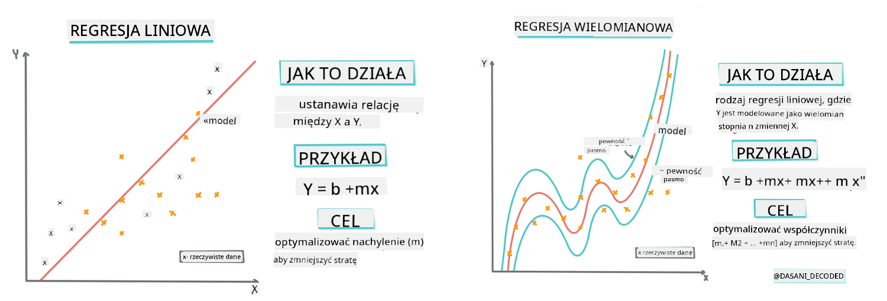
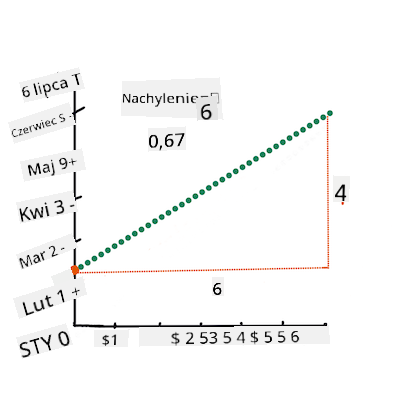
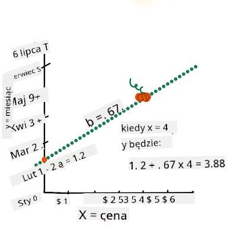

<!--
CO_OP_TRANSLATOR_METADATA:
{
  "original_hash": "2f88fbc741d792890ff2f1430fe0dae0",
  "translation_date": "2025-09-03T16:19:22+00:00",
  "source_file": "2-Regression/3-Linear/README.md",
  "language_code": "pl"
}
-->
# Budowanie modelu regresji za pomocą Scikit-learn: regresja na cztery sposoby


> Infografika autorstwa [Dasani Madipalli](https://twitter.com/dasani_decoded)
## [Quiz przed lekcją](https://gray-sand-07a10f403.1.azurestaticapps.net/quiz/13/)

> ### [Ta lekcja jest dostępna w R!](../../../../2-Regression/3-Linear/solution/R/lesson_3.html)
### Wprowadzenie 

Do tej pory zapoznałeś się z pojęciem regresji, korzystając z przykładowych danych z zestawu dotyczącego cen dyni, który będziemy używać w tej lekcji. Wizualizowałeś również dane za pomocą biblioteki Matplotlib.

Teraz jesteś gotowy, aby zagłębić się w temat regresji w kontekście uczenia maszynowego. Chociaż wizualizacja pozwala zrozumieć dane, prawdziwa siła uczenia maszynowego tkwi w _trenowaniu modeli_. Modele są trenowane na danych historycznych, aby automatycznie uchwycić zależności między danymi, co pozwala przewidywać wyniki dla nowych danych, których model wcześniej nie widział.

W tej lekcji dowiesz się więcej o dwóch typach regresji: _podstawowej regresji liniowej_ i _regresji wielomianowej_, wraz z niektórymi aspektami matematycznymi stojącymi za tymi technikami. Te modele pozwolą nam przewidywać ceny dyni w zależności od różnych danych wejściowych.

[](https://youtu.be/CRxFT8oTDMg "ML dla początkujących - Zrozumienie regresji liniowej")

> 🎥 Kliknij obrazek powyżej, aby obejrzeć krótki film o regresji liniowej.

> W całym tym kursie zakładamy minimalną znajomość matematyki i staramy się uczynić ją przystępną dla studentów z innych dziedzin. Zwracaj uwagę na notatki, 🧮 wywołania, diagramy i inne narzędzia edukacyjne, które pomogą w zrozumieniu.

### Wymagania wstępne

Powinieneś już znać strukturę danych dotyczących dyni, które analizujemy. Znajdziesz je wstępnie załadowane i oczyszczone w pliku _notebook.ipynb_ dołączonym do tej lekcji. W pliku cena dyni jest wyświetlana za buszel w nowej ramce danych. Upewnij się, że możesz uruchomić te notatniki w kernelach w Visual Studio Code.

### Przygotowanie

Przypominamy, że wczytujesz te dane, aby zadawać im pytania.

- Kiedy jest najlepszy czas na zakup dyni? 
- Jakiej ceny mogę się spodziewać za skrzynkę miniaturowych dyni?
- Czy powinienem kupować je w koszach na pół buszla czy w pudełkach o pojemności 1 1/9 buszla?
Zagłębmy się dalej w te dane.

W poprzedniej lekcji utworzyłeś ramkę danych Pandas i wypełniłeś ją częścią oryginalnego zestawu danych, standaryzując ceny za buszel. Jednak w ten sposób udało Ci się zebrać tylko około 400 punktów danych i tylko dla jesiennych miesięcy.

Spójrz na dane, które wstępnie załadowaliśmy w notatniku dołączonym do tej lekcji. Dane są wstępnie załadowane, a początkowy wykres punktowy pokazuje dane miesięczne. Może uda nam się uzyskać więcej szczegółów na temat charakteru danych, oczyszczając je bardziej.

## Linia regresji liniowej

Jak nauczyłeś się w Lekcji 1, celem ćwiczenia regresji liniowej jest możliwość narysowania linii, aby:

- **Pokazać zależności między zmiennymi**. Pokazać relację między zmiennymi
- **Dokonywać prognoz**. Dokonywać dokładnych prognoz, gdzie nowy punkt danych znajdzie się w stosunku do tej linii.

Typowe dla **regresji najmniejszych kwadratów** jest rysowanie tego typu linii. Termin „najmniejsze kwadraty” oznacza, że wszystkie punkty danych otaczające linię regresji są podnoszone do kwadratu, a następnie sumowane. Idealnie, ta końcowa suma jest jak najmniejsza, ponieważ chcemy mieć małą liczbę błędów, czyli `najmniejsze kwadraty`.

Robimy to, ponieważ chcemy modelować linię, która ma najmniejszą skumulowaną odległość od wszystkich naszych punktów danych. Podnosimy również wartości do kwadratu przed ich dodaniem, ponieważ interesuje nas ich wielkość, a nie kierunek.

> **🧮 Pokaż mi matematykę** 
> 
> Ta linia, zwana _linią najlepszego dopasowania_, może być wyrażona za pomocą [równania](https://en.wikipedia.org/wiki/Simple_linear_regression): 
> 
> ```
> Y = a + bX
> ```
>
> `X` to 'zmienna objaśniająca'. `Y` to 'zmienna zależna'. Nachylenie linii to `b`, a `a` to punkt przecięcia z osią Y, który odnosi się do wartości `Y`, gdy `X = 0`. 
>
>
>
> Najpierw oblicz nachylenie `b`. Infografika autorstwa [Jen Looper](https://twitter.com/jenlooper)
>
> Innymi słowy, odnosząc się do pierwotnego pytania dotyczącego danych o dyniach: „przewidzieć cenę dyni za buszel w zależności od miesiąca sprzedaży”, `X` odnosiłoby się do ceny, a `Y` do miesiąca sprzedaży. 
>
>
>
> Oblicz wartość Y. Jeśli płacisz około 4 dolarów, to musi być kwiecień! Infografika autorstwa [Jen Looper](https://twitter.com/jenlooper)
>
> Matematyka obliczająca linię musi uwzględniać nachylenie linii, które również zależy od punktu przecięcia, czyli miejsca, w którym `Y` znajduje się, gdy `X = 0`.
>
> Możesz zobaczyć metodę obliczania tych wartości na stronie [Math is Fun](https://www.mathsisfun.com/data/least-squares-regression.html). Odwiedź również [ten kalkulator regresji najmniejszych kwadratów](https://www.mathsisfun.com/data/least-squares-calculator.html), aby zobaczyć, jak wartości liczbowe wpływają na linię.

## Korelacja

Jeszcze jedno pojęcie do zrozumienia to **współczynnik korelacji** między danymi zmiennymi X i Y. Korzystając z wykresu punktowego, możesz szybko zwizualizować ten współczynnik. Wykres z punktami danych ułożonymi w schludną linię ma wysoką korelację, ale wykres z punktami danych rozrzuconymi wszędzie między X i Y ma niską korelację.

Dobry model regresji liniowej to taki, który ma wysoki (bliższy 1 niż 0) współczynnik korelacji, korzystając z metody regresji najmniejszych kwadratów z linią regresji.

✅ Uruchom notatnik dołączony do tej lekcji i spójrz na wykres punktowy przedstawiający zależność między miesiącem a ceną. Czy dane dotyczące sprzedaży dyni w zależności od miesiąca wydają się mieć wysoką czy niską korelację, według Twojej wizualnej interpretacji wykresu punktowego? Czy to się zmienia, jeśli użyjesz bardziej szczegółowego miary zamiast `Month`, np. *dnia roku* (czyli liczby dni od początku roku)?

W poniższym kodzie zakładamy, że oczyściliśmy dane i uzyskaliśmy ramkę danych o nazwie `new_pumpkins`, podobną do następującej:

ID | Month | DayOfYear | Variety | City | Package | Low Price | High Price | Price
---|-------|-----------|---------|------|---------|-----------|------------|-------
70 | 9 | 267 | PIE TYPE | BALTIMORE | 1 1/9 bushel cartons | 15.0 | 15.0 | 13.636364
71 | 9 | 267 | PIE TYPE | BALTIMORE | 1 1/9 bushel cartons | 18.0 | 18.0 | 16.363636
72 | 10 | 274 | PIE TYPE | BALTIMORE | 1 1/9 bushel cartons | 18.0 | 18.0 | 16.363636
73 | 10 | 274 | PIE TYPE | BALTIMORE | 1 1/9 bushel cartons | 17.0 | 17.0 | 15.454545
74 | 10 | 281 | PIE TYPE | BALTIMORE | 1 1/9 bushel cartons | 15.0 | 15.0 | 13.636364

> Kod do oczyszczenia danych jest dostępny w [`notebook.ipynb`](notebook.ipynb). Wykonaliśmy te same kroki oczyszczania co w poprzedniej lekcji i obliczyliśmy kolumnę `DayOfYear` za pomocą następującego wyrażenia: 

```python
day_of_year = pd.to_datetime(pumpkins['Date']).apply(lambda dt: (dt-datetime(dt.year,1,1)).days)
```

Teraz, gdy rozumiesz matematykę stojącą za regresją liniową, stwórzmy model regresji, aby sprawdzić, czy możemy przewidzieć, który pakiet dyni będzie miał najlepsze ceny. Ktoś kupujący dynie na świąteczny plac dyniowy może chcieć tej informacji, aby zoptymalizować swoje zakupy pakietów dyni na plac.

## Szukanie korelacji

[](https://youtu.be/uoRq-lW2eQo "ML dla początkujących - Szukanie korelacji: Klucz do regresji liniowej")

> 🎥 Kliknij obrazek powyżej, aby obejrzeć krótki film o korelacji.

Z poprzedniej lekcji prawdopodobnie zauważyłeś, że średnia cena w różnych miesiącach wygląda tak:


To sugeruje, że powinna istnieć jakaś korelacja, i możemy spróbować wytrenować model regresji liniowej, aby przewidzieć zależność między `Month` a `Price`, lub między `DayOfYear` a `Price`. Oto wykres punktowy pokazujący tę drugą zależność:

 

Sprawdźmy, czy istnieje korelacja, używając funkcji `corr`:

```python
print(new_pumpkins['Month'].corr(new_pumpkins['Price']))
print(new_pumpkins['DayOfYear'].corr(new_pumpkins['Price']))
```

Wygląda na to, że korelacja jest dość mała, -0.15 dla `Month` i -0.17 dla `DayOfMonth`, ale może istnieć inna ważna zależność. Wygląda na to, że istnieją różne skupiska cen odpowiadające różnym odmianom dyni. Aby potwierdzić tę hipotezę, narysujmy każdą kategorię dyni za pomocą innego koloru. Przekazując parametr `ax` do funkcji `scatter`, możemy narysować wszystkie punkty na tym samym wykresie:

```python
ax=None
colors = ['red','blue','green','yellow']
for i,var in enumerate(new_pumpkins['Variety'].unique()):
    df = new_pumpkins[new_pumpkins['Variety']==var]
    ax = df.plot.scatter('DayOfYear','Price',ax=ax,c=colors[i],label=var)
```

 

Nasze badanie sugeruje, że odmiana ma większy wpływ na ogólną cenę niż rzeczywista data sprzedaży. Możemy to zobaczyć na wykresie słupkowym:

```python
new_pumpkins.groupby('Variety')['Price'].mean().plot(kind='bar')
```

 

Skupmy się na chwilę tylko na jednej odmianie dyni, 'pie type', i zobaczmy, jaki wpływ ma data na cenę:

```python
pie_pumpkins = new_pumpkins[new_pumpkins['Variety']=='PIE TYPE']
pie_pumpkins.plot.scatter('DayOfYear','Price') 
```
 

Jeśli teraz obliczymy korelację między `Price` a `DayOfYear` za pomocą funkcji `corr`, otrzymamy coś w rodzaju `-0.27` - co oznacza, że trenowanie modelu predykcyjnego ma sens.

> Przed trenowaniem modelu regresji liniowej ważne jest, aby upewnić się, że nasze dane są czyste. Regresja liniowa nie działa dobrze z brakującymi wartościami, dlatego warto pozbyć się wszystkich pustych komórek:

```python
pie_pumpkins.dropna(inplace=True)
pie_pumpkins.info()
```

Innym podejściem byłoby wypełnienie tych pustych wartości średnimi wartościami z odpowiedniej kolumny.

## Prosta regresja liniowa

[](https://youtu.be/e4c_UP2fSjg "ML dla początkujących - Regresja liniowa i wielomianowa za pomocą Scikit-learn")

> 🎥 Kliknij obrazek powyżej, aby obejrzeć krótki film o regresji liniowej i wielomianowej.

Aby wytrenować nasz model regresji liniowej, użyjemy biblioteki **Scikit-learn**.

```python
from sklearn.linear_model import LinearRegression
from sklearn.metrics import mean_squared_error
from sklearn.model_selection import train_test_split
```

Zaczynamy od oddzielenia wartości wejściowych (cech) i oczekiwanych wyników (etykiet) w osobne tablice numpy:

```python
X = pie_pumpkins['DayOfYear'].to_numpy().reshape(-1,1)
y = pie_pumpkins['Price']
```

> Zauważ, że musieliśmy wykonać `reshape` na danych wejściowych, aby pakiet regresji liniowej mógł je poprawnie zrozumieć. Regresja liniowa oczekuje tablicy 2D jako danych wejściowych, gdzie każdy wiersz tablicy odpowiada wektorowi cech wejściowych. W naszym przypadku, ponieważ mamy tylko jeden parametr wejściowy, potrzebujemy tablicy o kształcie N×1, gdzie N to rozmiar zestawu danych.

Następnie musimy podzielić dane na zestawy treningowe i testowe, aby móc zweryfikować nasz model po treningu:

```python
X_train, X_test, y_train, y_test = train_test_split(X, y, test_size=0.2, random_state=0)
```

Ostatecznie, trenowanie rzeczywistego modelu regresji liniowej zajmuje tylko dwie linie kodu. Definiujemy obiekt `LinearRegression` i dopasowujemy go do naszych danych za pomocą metody `fit`:

```python
lin_reg = LinearRegression()
lin_reg.fit(X_train,y_train)
```

Obiekt `LinearRegression` po dopasowaniu zawiera wszystkie współczynniki regresji, które można uzyskać za pomocą właściwości `.coef_`. W naszym przypadku jest tylko jeden współczynnik, który powinien wynosić około `-0.017`. Oznacza to, że ceny wydają się nieco spadać z czasem, ale niezbyt dużo, około 2 centy dziennie. Możemy również uzyskać punkt przecięcia regresji z osią Y za pomocą `lin_reg.intercept_` - w naszym przypadku będzie to około `21`, co wskazuje na cenę na początku roku.

Aby sprawdzić, jak dokładny jest nasz model, możemy przewidzieć ceny na zestawie testowym, a następnie zmierzyć, jak bliskie są nasze przewidywania do oczekiwanych wartości. Można to zrobić za pomocą metryki średniego błędu kwadratowego (MSE), która jest średnią wszystkich kwadratowych różnic między oczekiwaną a przewidywaną wartością.

```python
pred = lin_reg.predict(X_test)

mse = np.sqrt(mean_squared_error(y_test,pred))
print(f'Mean error: {mse:3.3} ({mse/np.mean(pred)*100:3.3}%)')
```
Nasz błąd wydaje się dotyczyć 2 punktów, co stanowi około 17%. Niezbyt dobrze. Innym wskaźnikiem jakości modelu jest **współczynnik determinacji**, który można obliczyć w następujący sposób:

```python
score = lin_reg.score(X_train,y_train)
print('Model determination: ', score)
```
Jeśli wartość wynosi 0, oznacza to, że model nie uwzględnia danych wejściowych i działa jako *najgorszy liniowy predyktor*, który jest po prostu średnią wartością wyniku. Wartość 1 oznacza, że możemy idealnie przewidzieć wszystkie oczekiwane wyniki. W naszym przypadku współczynnik wynosi około 0,06, co jest dość niskie.

Możemy również wykreślić dane testowe razem z linią regresji, aby lepiej zobaczyć, jak regresja działa w naszym przypadku:

```python
plt.scatter(X_test,y_test)
plt.plot(X_test,pred)
```


## Regresja wielomianowa

Innym typem regresji liniowej jest regresja wielomianowa. Chociaż czasami istnieje liniowa zależność między zmiennymi – im większa objętość dyni, tym wyższa cena – czasami te zależności nie mogą być przedstawione jako płaszczyzna lub prosta linia.

✅ Oto [kilka przykładów](https://online.stat.psu.edu/stat501/lesson/9/9.8) danych, które mogą wymagać regresji wielomianowej.

Spójrz ponownie na zależność między datą a ceną. Czy ten wykres punktowy wydaje się koniecznie analizowany za pomocą prostej linii? Czy ceny nie mogą się wahać? W takim przypadku możesz spróbować regresji wielomianowej.

✅ Wielomiany to wyrażenia matematyczne, które mogą składać się z jednej lub więcej zmiennych i współczynników.

Regresja wielomianowa tworzy zakrzywioną linię, aby lepiej dopasować dane nieliniowe. W naszym przypadku, jeśli uwzględnimy kwadratową zmienną `DayOfYear` w danych wejściowych, powinniśmy być w stanie dopasować nasze dane do krzywej parabolicznej, która będzie miała minimum w określonym punkcie w ciągu roku.

Scikit-learn zawiera przydatne [API pipeline](https://scikit-learn.org/stable/modules/generated/sklearn.pipeline.make_pipeline.html?highlight=pipeline#sklearn.pipeline.make_pipeline), które pozwala połączyć różne kroki przetwarzania danych. **Pipeline** to łańcuch **estymatorów**. W naszym przypadku stworzymy pipeline, który najpierw dodaje cechy wielomianowe do naszego modelu, a następnie trenuje regresję:

```python
from sklearn.preprocessing import PolynomialFeatures
from sklearn.pipeline import make_pipeline

pipeline = make_pipeline(PolynomialFeatures(2), LinearRegression())

pipeline.fit(X_train,y_train)
```

Użycie `PolynomialFeatures(2)` oznacza, że uwzględnimy wszystkie wielomiany drugiego stopnia z danych wejściowych. W naszym przypadku będzie to po prostu `DayOfYear`<sup>2</sup>, ale przy dwóch zmiennych wejściowych X i Y, dodamy X<sup>2</sup>, XY i Y<sup>2</sup>. Możemy również użyć wielomianów wyższego stopnia, jeśli tego chcemy.

Pipeline można używać w taki sam sposób jak oryginalny obiekt `LinearRegression`, tj. możemy `fit` pipeline, a następnie użyć `predict`, aby uzyskać wyniki predykcji. Oto wykres pokazujący dane testowe i krzywą aproksymacji:


Dzięki regresji wielomianowej możemy uzyskać nieco niższy MSE i wyższy współczynnik determinacji, ale nie znacząco. Musimy uwzględnić inne cechy!

> Możesz zauważyć, że minimalne ceny dyni są obserwowane gdzieś w okolicach Halloween. Jak możesz to wyjaśnić?

🎃 Gratulacje, właśnie stworzyłeś model, który może pomóc przewidzieć cenę dyni na ciasto. Możesz prawdopodobnie powtórzyć tę samą procedurę dla wszystkich typów dyni, ale byłoby to żmudne. Nauczmy się teraz, jak uwzględnić różnorodność dyni w naszym modelu!

## Cechy kategoryczne

W idealnym świecie chcielibyśmy być w stanie przewidzieć ceny dla różnych odmian dyni, używając tego samego modelu. Jednak kolumna `Variety` różni się od takich kolumn jak `Month`, ponieważ zawiera wartości nienumeryczne. Takie kolumny nazywane są **kategorycznymi**.

[](https://youtu.be/DYGliioIAE0 "ML dla początkujących - Predykcja cech kategorycznych za pomocą regresji liniowej")

> 🎥 Kliknij obrazek powyżej, aby obejrzeć krótki film o używaniu cech kategorycznych.

Tutaj możesz zobaczyć, jak średnia cena zależy od odmiany:


Aby uwzględnić odmianę, najpierw musimy przekonwertować ją na formę numeryczną, czyli **zakodować**. Istnieje kilka sposobów, aby to zrobić:

* Proste **kodowanie numeryczne** stworzy tabelę różnych odmian, a następnie zastąpi nazwę odmiany indeksem w tej tabeli. Nie jest to najlepszy pomysł dla regresji liniowej, ponieważ regresja liniowa uwzględnia rzeczywistą wartość liczbową indeksu i dodaje ją do wyniku, mnożąc przez pewien współczynnik. W naszym przypadku zależność między numerem indeksu a ceną jest wyraźnie nieliniowa, nawet jeśli upewnimy się, że indeksy są uporządkowane w określony sposób.
* **Kodowanie one-hot** zastąpi kolumnę `Variety` czterema różnymi kolumnami, po jednej dla każdej odmiany. Każda kolumna będzie zawierać `1`, jeśli odpowiedni wiersz dotyczy danej odmiany, a `0` w przeciwnym razie. Oznacza to, że w regresji liniowej będą cztery współczynniki, po jednym dla każdej odmiany dyni, odpowiedzialne za "cenę początkową" (lub raczej "dodatkową cenę") dla danej odmiany.

Kod poniżej pokazuje, jak możemy zakodować odmianę za pomocą one-hot:

```python
pd.get_dummies(new_pumpkins['Variety'])
```

 ID | FAIRYTALE | MINIATURE | MIXED HEIRLOOM VARIETIES | PIE TYPE
----|-----------|-----------|--------------------------|----------
70 | 0 | 0 | 0 | 1
71 | 0 | 0 | 0 | 1
... | ... | ... | ... | ...
1738 | 0 | 1 | 0 | 0
1739 | 0 | 1 | 0 | 0
1740 | 0 | 1 | 0 | 0
1741 | 0 | 1 | 0 | 0
1742 | 0 | 1 | 0 | 0

Aby wytrenować regresję liniową, używając zakodowanej odmiany jako danych wejściowych, wystarczy poprawnie zainicjalizować dane `X` i `y`:

```python
X = pd.get_dummies(new_pumpkins['Variety'])
y = new_pumpkins['Price']
```

Reszta kodu jest taka sama jak ta, którą użyliśmy powyżej do trenowania regresji liniowej. Jeśli spróbujesz, zobaczysz, że średni błąd kwadratowy jest mniej więcej taki sam, ale uzyskujemy znacznie wyższy współczynnik determinacji (~77%). Aby uzyskać jeszcze bardziej dokładne przewidywania, możemy uwzględnić więcej cech kategorycznych, a także cechy numeryczne, takie jak `Month` czy `DayOfYear`. Aby uzyskać jedną dużą tablicę cech, możemy użyć `join`:

```python
X = pd.get_dummies(new_pumpkins['Variety']) \
        .join(new_pumpkins['Month']) \
        .join(pd.get_dummies(new_pumpkins['City'])) \
        .join(pd.get_dummies(new_pumpkins['Package']))
y = new_pumpkins['Price']
```

Tutaj uwzględniamy również `City` i typ `Package`, co daje nam MSE 2.84 (10%) i współczynnik determinacji 0.94!

## Łącząc wszystko razem

Aby stworzyć najlepszy model, możemy użyć połączonych danych (zakodowane kategoryczne + numeryczne) z powyższego przykładu razem z regresją wielomianową. Oto kompletny kod dla Twojej wygody:

```python
# set up training data
X = pd.get_dummies(new_pumpkins['Variety']) \
        .join(new_pumpkins['Month']) \
        .join(pd.get_dummies(new_pumpkins['City'])) \
        .join(pd.get_dummies(new_pumpkins['Package']))
y = new_pumpkins['Price']

# make train-test split
X_train, X_test, y_train, y_test = train_test_split(X, y, test_size=0.2, random_state=0)

# setup and train the pipeline
pipeline = make_pipeline(PolynomialFeatures(2), LinearRegression())
pipeline.fit(X_train,y_train)

# predict results for test data
pred = pipeline.predict(X_test)

# calculate MSE and determination
mse = np.sqrt(mean_squared_error(y_test,pred))
print(f'Mean error: {mse:3.3} ({mse/np.mean(pred)*100:3.3}%)')

score = pipeline.score(X_train,y_train)
print('Model determination: ', score)
```

To powinno dać nam najlepszy współczynnik determinacji, prawie 97%, oraz MSE=2.23 (~8% błędu predykcji).

| Model | MSE | Determinacja |
|-------|-----|-------------|
| `DayOfYear` Liniowy | 2.77 (17.2%) | 0.07 |
| `DayOfYear` Wielomianowy | 2.73 (17.0%) | 0.08 |
| `Variety` Liniowy | 5.24 (19.7%) | 0.77 |
| Wszystkie cechy Liniowy | 2.84 (10.5%) | 0.94 |
| Wszystkie cechy Wielomianowy | 2.23 (8.25%) | 0.97 |

🏆 Brawo! Stworzyłeś cztery modele regresji w jednej lekcji i poprawiłeś jakość modelu do 97%. W ostatniej sekcji dotyczącej regresji nauczysz się o regresji logistycznej, aby określać kategorie.

---
## 🚀Wyzwanie

Przetestuj kilka różnych zmiennych w tym notebooku, aby zobaczyć, jak korelacja odpowiada dokładności modelu.

## [Quiz po wykładzie](https://gray-sand-07a10f403.1.azurestaticapps.net/quiz/14/)

## Przegląd i samodzielna nauka

W tej lekcji nauczyliśmy się o regresji liniowej. Istnieją inne ważne typy regresji. Przeczytaj o technikach Stepwise, Ridge, Lasso i Elasticnet. Dobrym kursem do nauki jest [Stanford Statistical Learning course](https://online.stanford.edu/courses/sohs-ystatslearning-statistical-learning).

## Zadanie

[Zbuduj model](assignment.md)

---

**Zastrzeżenie**:  
Ten dokument został przetłumaczony za pomocą usługi tłumaczenia AI [Co-op Translator](https://github.com/Azure/co-op-translator). Chociaż dokładamy wszelkich starań, aby zapewnić poprawność tłumaczenia, prosimy pamiętać, że automatyczne tłumaczenia mogą zawierać błędy lub nieścisłości. Oryginalny dokument w jego języku źródłowym powinien być uznawany za autorytatywne źródło. W przypadku informacji o kluczowym znaczeniu zaleca się skorzystanie z profesjonalnego tłumaczenia przez człowieka. Nie ponosimy odpowiedzialności za jakiekolwiek nieporozumienia lub błędne interpretacje wynikające z korzystania z tego tłumaczenia.