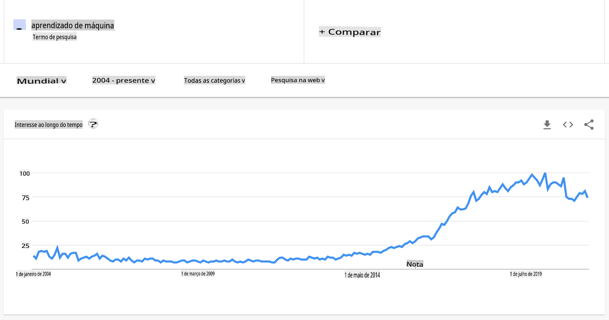
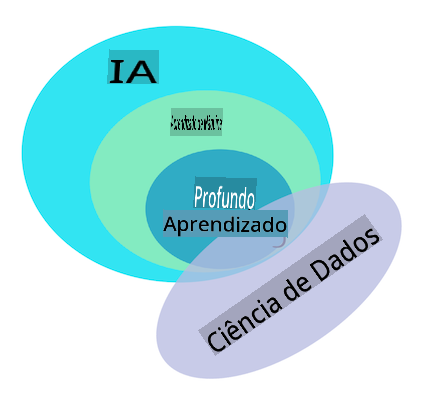

<!--
CO_OP_TRANSLATOR_METADATA:
{
  "original_hash": "73e9a7245aa57f00cd413ffd22c0ccb6",
  "translation_date": "2025-09-03T17:46:54+00:00",
  "source_file": "1-Introduction/1-intro-to-ML/README.md",
  "language_code": "pt"
}
-->
# Introdução ao machine learning

## [Questionário pré-aula](https://gray-sand-07a10f403.1.azurestaticapps.net/quiz/1/)

---

> 🎥 Clique na imagem acima para assistir a um vídeo curto sobre esta lição.

Bem-vindo a este curso sobre machine learning clássico para iniciantes! Quer seja completamente novo neste tópico ou um praticante experiente de ML que deseja revisar uma área, estamos felizes por tê-lo conosco! Queremos criar um ponto de partida amigável para o seu estudo de ML e ficaremos felizes em avaliar, responder e incorporar o seu [feedback](https://github.com/microsoft/ML-For-Beginners/discussions).

> 🎥 Clique na imagem acima para assistir a um vídeo: John Guttag do MIT apresenta o machine learning.

---
## Começando com machine learning

Antes de começar com este currículo, é necessário configurar o seu computador para executar notebooks localmente.

- **Configure a sua máquina com estes vídeos**. Use os seguintes links para aprender [como instalar Python](https://youtu.be/CXZYvNRIAKM) no seu sistema e [configurar um editor de texto](https://youtu.be/EU8eayHWoZg) para desenvolvimento.
- **Aprenda Python**. Também é recomendado ter um entendimento básico de [Python](https://docs.microsoft.com/learn/paths/python-language/?WT.mc_id=academic-77952-leestott), uma linguagem de programação útil para cientistas de dados que utilizamos neste curso.
- **Aprenda Node.js e JavaScript**. Também utilizamos JavaScript algumas vezes neste curso ao construir aplicações web, então será necessário ter [node](https://nodejs.org) e [npm](https://www.npmjs.com/) instalados, bem como [Visual Studio Code](https://code.visualstudio.com/) disponível para desenvolvimento em Python e JavaScript.
- **Crie uma conta no GitHub**. Já que nos encontrou aqui no [GitHub](https://github.com), talvez já tenha uma conta, mas, se não, crie uma e depois faça um fork deste currículo para usar por conta própria. (Sinta-se à vontade para nos dar uma estrela também 😊)
- **Explore o Scikit-learn**. Familiarize-se com [Scikit-learn](https://scikit-learn.org/stable/user_guide.html), um conjunto de bibliotecas de ML que referenciamos nestas lições.

---
## O que é machine learning?

O termo 'machine learning' é um dos mais populares e frequentemente usados atualmente. Existe uma grande possibilidade de que já tenha ouvido este termo pelo menos uma vez, caso tenha algum tipo de familiaridade com tecnologia, independentemente da área em que trabalha. No entanto, a mecânica do machine learning é um mistério para a maioria das pessoas. Para um iniciante em machine learning, o assunto pode parecer, às vezes, intimidante. Por isso, é importante entender o que realmente é machine learning e aprender sobre ele passo a passo, através de exemplos práticos.

---
## A curva de hype

> O Google Trends mostra a recente 'curva de hype' do termo 'machine learning'.

---
## Um universo misterioso

Vivemos em um universo cheio de mistérios fascinantes. Grandes cientistas como Stephen Hawking, Albert Einstein e muitos outros dedicaram suas vidas à busca de informações significativas que desvendassem os mistérios do mundo ao nosso redor. Esta é a condição humana de aprender: uma criança humana aprende coisas novas e descobre a estrutura do seu mundo ano após ano enquanto cresce até a idade adulta.

---
## O cérebro da criança

O cérebro e os sentidos de uma criança percebem os fatos ao seu redor e gradualmente aprendem os padrões ocultos da vida, o que ajuda a criança a criar regras lógicas para identificar padrões aprendidos. O processo de aprendizagem do cérebro humano torna os humanos as criaturas mais sofisticadas deste mundo. Aprender continuamente, descobrindo padrões ocultos e depois inovando com base nesses padrões, permite que nos tornemos melhores ao longo de nossas vidas. Essa capacidade de aprendizagem e evolução está relacionada a um conceito chamado [plasticidade cerebral](https://www.simplypsychology.org/brain-plasticity.html). Superficialmente, podemos traçar algumas semelhanças motivacionais entre o processo de aprendizagem do cérebro humano e os conceitos de machine learning.

---
## O cérebro humano

O [cérebro humano](https://www.livescience.com/29365-human-brain.html) percebe coisas do mundo real, processa as informações percebidas, toma decisões racionais e realiza certas ações com base nas circunstâncias. Isso é o que chamamos de comportamento inteligente. Quando programamos uma réplica do processo de comportamento inteligente em uma máquina, isso é chamado de inteligência artificial (IA).

---
## Alguns termos

Embora os termos possam ser confundidos, machine learning (ML) é um subconjunto importante da inteligência artificial. **ML está relacionado ao uso de algoritmos especializados para descobrir informações significativas e encontrar padrões ocultos a partir de dados percebidos, corroborando o processo de tomada de decisão racional**.

---
## IA, ML, Aprendizagem Profunda

> Um diagrama mostrando as relações entre IA, ML, aprendizagem profunda e ciência de dados. Infográfico por [Jen Looper](https://twitter.com/jenlooper) inspirado por [este gráfico](https://softwareengineering.stackexchange.com/questions/366996/distinction-between-ai-ml-neural-networks-deep-learning-and-data-mining).

---
## Conceitos a abordar

Neste currículo, vamos abordar apenas os conceitos fundamentais de machine learning que um iniciante deve conhecer. Abordamos o que chamamos de 'machine learning clássico', principalmente usando Scikit-learn, uma excelente biblioteca que muitos estudantes utilizam para aprender o básico. Para entender conceitos mais amplos de inteligência artificial ou aprendizagem profunda, um conhecimento fundamental sólido de machine learning é indispensável, e é isso que queremos oferecer aqui.

---
## Neste curso, você aprenderá:

- conceitos fundamentais de machine learning
- a história do ML
- ML e justiça
- técnicas de regressão em ML
- técnicas de classificação em ML
- técnicas de agrupamento em ML
- técnicas de processamento de linguagem natural em ML
- técnicas de previsão de séries temporais em ML
- aprendizagem por reforço
- aplicações reais de ML

---
## O que não abordaremos

- aprendizagem profunda
- redes neurais
- IA

Para proporcionar uma melhor experiência de aprendizagem, evitaremos as complexidades das redes neurais, 'aprendizagem profunda' - construção de modelos com várias camadas usando redes neurais - e IA, que discutiremos em um currículo diferente. Também ofereceremos um futuro currículo de ciência de dados para focar nesse aspecto deste campo mais amplo.

---
## Por que estudar machine learning?

Machine learning, de uma perspectiva de sistemas, é definido como a criação de sistemas automatizados que podem aprender padrões ocultos a partir de dados para ajudar na tomada de decisões inteligentes.

Essa motivação é vagamente inspirada em como o cérebro humano aprende certas coisas com base nos dados que percebe do mundo exterior.

✅ Pense por um momento por que uma empresa gostaria de usar estratégias de machine learning em vez de criar um motor baseado em regras codificadas.

---
## Aplicações de machine learning

As aplicações de machine learning estão agora quase em toda parte e são tão onipresentes quanto os dados que circulam em nossas sociedades, gerados por nossos smartphones, dispositivos conectados e outros sistemas. Considerando o imenso potencial dos algoritmos de machine learning de última geração, os pesquisadores têm explorado sua capacidade de resolver problemas reais multidimensionais e multidisciplinares com resultados altamente positivos.

---
## Exemplos de ML aplicado

**Você pode usar machine learning de várias maneiras**:

- Para prever a probabilidade de uma doença com base no histórico médico ou relatórios de um paciente.
- Para utilizar dados meteorológicos e prever eventos climáticos.
- Para entender o sentimento de um texto.
- Para detectar notícias falsas e impedir a disseminação de propaganda.

Finanças, economia, ciência da terra, exploração espacial, engenharia biomédica, ciência cognitiva e até mesmo áreas das humanidades têm adaptado o machine learning para resolver os problemas árduos e pesados em processamento de dados de seus domínios.

---
## Conclusão

Machine learning automatiza o processo de descoberta de padrões ao encontrar insights significativos a partir de dados reais ou gerados. Ele tem se mostrado altamente valioso em aplicações empresariais, de saúde e financeiras, entre outras.

No futuro próximo, entender os fundamentos de machine learning será essencial para pessoas de qualquer área devido à sua ampla adoção.

---
# 🚀 Desafio

Desenhe, no papel ou usando um aplicativo online como [Excalidraw](https://excalidraw.com/), a sua compreensão das diferenças entre IA, ML, aprendizagem profunda e ciência de dados. Adicione algumas ideias sobre os problemas que cada uma dessas técnicas é boa em resolver.

# [Questionário pós-aula](https://gray-sand-07a10f403.1.azurestaticapps.net/quiz/2/)

---
# Revisão e Autoestudo

Para aprender mais sobre como trabalhar com algoritmos de ML na nuvem, siga este [Caminho de Aprendizagem](https://docs.microsoft.com/learn/paths/create-no-code-predictive-models-azure-machine-learning/?WT.mc_id=academic-77952-leestott).

Faça um [Caminho de Aprendizagem](https://docs.microsoft.com/learn/modules/introduction-to-machine-learning/?WT.mc_id=academic-77952-leestott) sobre os fundamentos de ML.

---
# Tarefa

[Prepare-se e comece](assignment.md)

---

**Aviso Legal**:  
Este documento foi traduzido utilizando o serviço de tradução por IA [Co-op Translator](https://github.com/Azure/co-op-translator). Embora nos esforcemos para garantir a precisão, é importante ter em conta que traduções automáticas podem conter erros ou imprecisões. O documento original na sua língua nativa deve ser considerado a fonte autoritária. Para informações críticas, recomenda-se a tradução profissional realizada por humanos. Não nos responsabilizamos por quaisquer mal-entendidos ou interpretações incorretas decorrentes da utilização desta tradução.