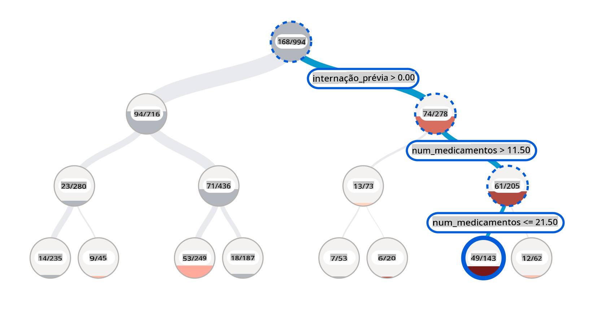
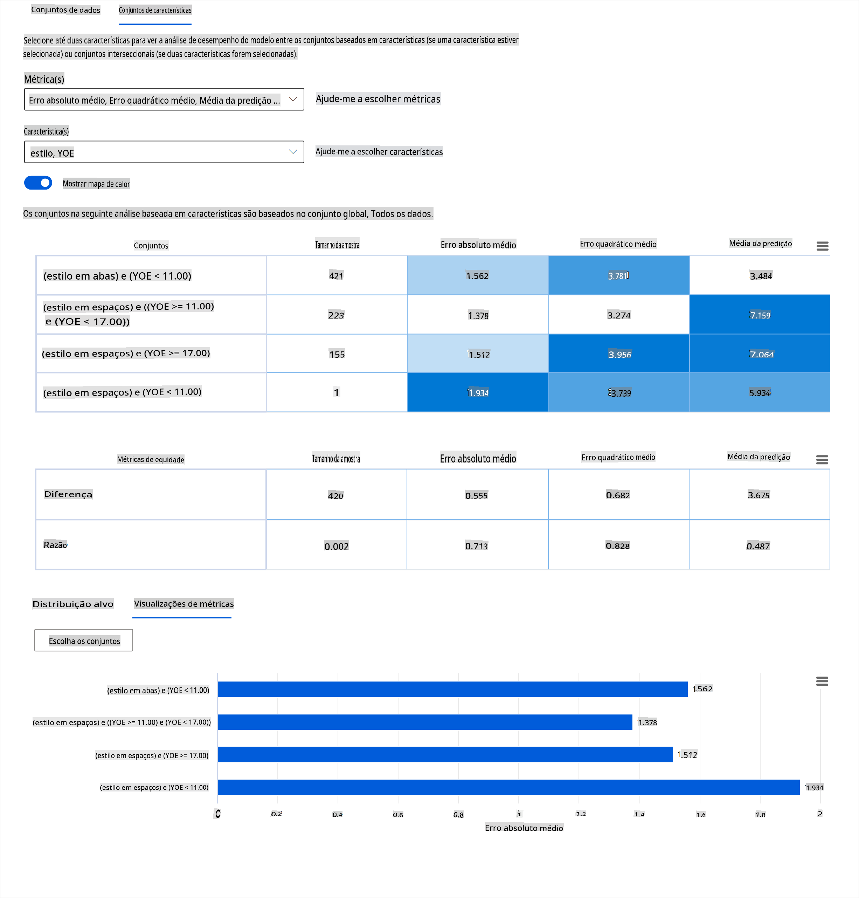
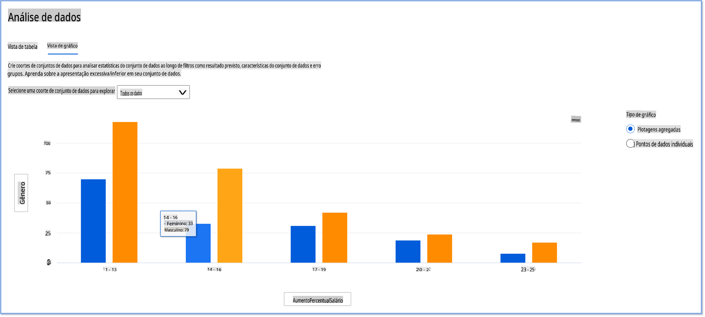
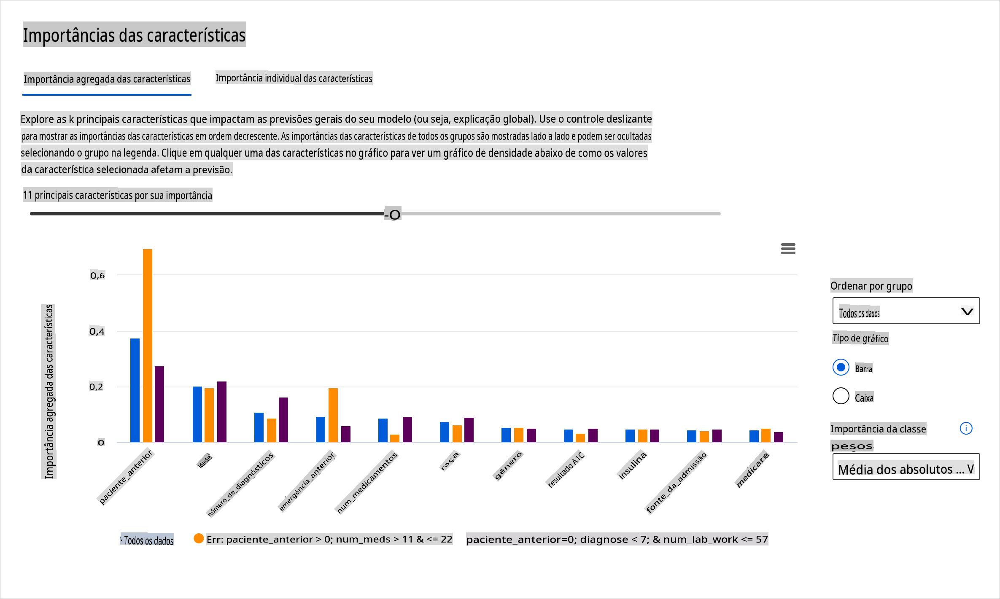
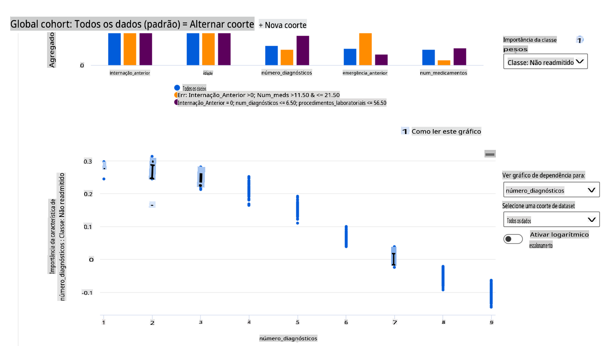

<!--
CO_OP_TRANSLATOR_METADATA:
{
  "original_hash": "ba0f6e1019351351c8ee4c92867b6a0b",
  "translation_date": "2025-09-03T17:29:27+00:00",
  "source_file": "9-Real-World/2-Debugging-ML-Models/README.md",
  "language_code": "pt"
}
-->
# Pós-escrito: Depuração de Modelos de Machine Learning usando componentes do painel de IA Responsável

## [Questionário pré-aula](https://gray-sand-07a10f403.1.azurestaticapps.net/quiz/5/)

## Introdução

O machine learning impacta as nossas vidas diariamente. A IA está a integrar-se em alguns dos sistemas mais importantes que nos afetam como indivíduos e como sociedade, desde a saúde, finanças, educação e emprego. Por exemplo, sistemas e modelos estão envolvidos em tarefas de tomada de decisão diária, como diagnósticos médicos ou deteção de fraude. Consequentemente, os avanços na IA, juntamente com a sua adoção acelerada, estão a ser acompanhados por expectativas sociais em evolução e regulamentações crescentes em resposta. Continuamos a observar áreas onde os sistemas de IA não cumprem as expectativas; expõem novos desafios; e os governos começam a regulamentar as soluções de IA. Por isso, é essencial que estes modelos sejam analisados para garantir resultados justos, fiáveis, inclusivos, transparentes e responsáveis para todos.

Neste currículo, iremos explorar ferramentas práticas que podem ser usadas para avaliar se um modelo apresenta problemas relacionados com IA responsável. As técnicas tradicionais de depuração de machine learning tendem a basear-se em cálculos quantitativos, como precisão agregada ou perda média de erro. Imagine o que pode acontecer quando os dados que está a usar para construir estes modelos carecem de certos grupos demográficos, como raça, género, visão política, religião, ou representam desproporcionalmente esses grupos. E quando a saída do modelo é interpretada de forma a favorecer um grupo demográfico? Isso pode introduzir uma representação excessiva ou insuficiente desses grupos sensíveis, resultando em problemas de justiça, inclusão ou fiabilidade no modelo. Outro fator é que os modelos de machine learning são considerados "caixas pretas", o que dificulta a compreensão e explicação do que impulsiona as previsões de um modelo. Todos estes são desafios enfrentados por cientistas de dados e desenvolvedores de IA quando não possuem ferramentas adequadas para depurar e avaliar a justiça ou confiabilidade de um modelo.

Nesta lição, aprenderá a depurar os seus modelos usando:

- **Análise de Erros**: identificar onde na distribuição dos seus dados o modelo apresenta taxas de erro elevadas.
- **Visão Geral do Modelo**: realizar análises comparativas entre diferentes grupos de dados para descobrir disparidades nas métricas de desempenho do modelo.
- **Análise de Dados**: investigar onde pode haver representação excessiva ou insuficiente nos seus dados, o que pode enviesar o modelo para favorecer um grupo demográfico em detrimento de outro.
- **Importância das Features**: compreender quais as features que impulsionam as previsões do modelo a nível global ou local.

## Pré-requisito

Como pré-requisito, reveja [Ferramentas de IA Responsável para desenvolvedores](https://www.microsoft.com/ai/ai-lab-responsible-ai-dashboard)

> 

## Análise de Erros

As métricas tradicionais de desempenho de modelos usadas para medir a precisão são, na maioria das vezes, cálculos baseados em previsões corretas versus incorretas. Por exemplo, determinar que um modelo é preciso 89% das vezes com uma perda de erro de 0,001 pode ser considerado um bom desempenho. No entanto, os erros nem sempre estão distribuídos uniformemente no conjunto de dados subjacente. Pode obter uma pontuação de precisão de 89% no modelo, mas descobrir que existem diferentes regiões nos seus dados onde o modelo falha 42% das vezes. As consequências desses padrões de falha em certos grupos de dados podem levar a problemas de justiça ou fiabilidade. É essencial compreender as áreas onde o modelo está a ter um bom desempenho ou não. As regiões de dados onde há um número elevado de imprecisões no modelo podem revelar-se um grupo demográfico importante.

O componente de Análise de Erros no painel de IA Responsável ilustra como as falhas do modelo estão distribuídas entre vários grupos com uma visualização em árvore. Isto é útil para identificar features ou áreas onde há uma taxa de erro elevada no seu conjunto de dados. Ao observar de onde vêm a maioria das imprecisões do modelo, pode começar a investigar a causa raiz. Também pode criar grupos de dados para realizar análises. Estes grupos de dados ajudam no processo de depuração para determinar por que o desempenho do modelo é bom num grupo, mas apresenta erros noutro.

Os indicadores visuais no mapa de árvore ajudam a localizar as áreas problemáticas mais rapidamente. Por exemplo, quanto mais escuro for o tom de vermelho num nó da árvore, maior será a taxa de erro.

O mapa de calor é outra funcionalidade de visualização que os utilizadores podem usar para investigar a taxa de erro usando uma ou duas features para encontrar contribuintes para os erros do modelo em todo o conjunto de dados ou grupos.

Use a análise de erros quando precisar de:

* Obter uma compreensão profunda de como as falhas do modelo estão distribuídas num conjunto de dados e em várias dimensões de entrada e features.
* Dividir as métricas de desempenho agregadas para descobrir automaticamente grupos com erros e informar os seus passos de mitigação direcionados.

## Visão Geral do Modelo

Avaliar o desempenho de um modelo de machine learning requer uma compreensão holística do seu comportamento. Isto pode ser alcançado ao rever mais de uma métrica, como taxa de erro, precisão, recall, precisão ou MAE (Erro Absoluto Médio), para encontrar disparidades entre as métricas de desempenho. Uma métrica de desempenho pode parecer ótima, mas imprecisões podem ser expostas noutra métrica. Além disso, comparar as métricas para disparidades em todo o conjunto de dados ou grupos ajuda a esclarecer onde o modelo está a ter um bom desempenho ou não. Isto é especialmente importante para observar o desempenho do modelo entre features sensíveis e insensíveis (por exemplo, raça, género ou idade de pacientes) para descobrir possíveis injustiças que o modelo possa ter. Por exemplo, descobrir que o modelo é mais impreciso num grupo que possui features sensíveis pode revelar potenciais injustiças no modelo.

O componente Visão Geral do Modelo do painel de IA Responsável ajuda não apenas na análise das métricas de desempenho da representação de dados num grupo, mas também dá aos utilizadores a capacidade de comparar o comportamento do modelo entre diferentes grupos.

A funcionalidade de análise baseada em features do componente permite que os utilizadores reduzam subgrupos de dados dentro de uma feature específica para identificar anomalias a um nível mais granular. Por exemplo, o painel possui inteligência integrada para gerar automaticamente grupos para uma feature selecionada pelo utilizador (ex., *"tempo_no_hospital < 3"* ou *"tempo_no_hospital >= 7"*). Isto permite que o utilizador isole uma feature específica de um grupo de dados maior para verificar se é um influenciador chave dos resultados errados do modelo.

O componente Visão Geral do Modelo suporta duas classes de métricas de disparidade:

**Disparidade no desempenho do modelo**: Estas métricas calculam a disparidade (diferença) nos valores da métrica de desempenho selecionada entre subgrupos de dados. Aqui estão alguns exemplos:

* Disparidade na taxa de precisão
* Disparidade na taxa de erro
* Disparidade na precisão
* Disparidade no recall
* Disparidade no erro absoluto médio (MAE)

**Disparidade na taxa de seleção**: Esta métrica contém a diferença na taxa de seleção (previsão favorável) entre subgrupos. Um exemplo disso é a disparidade nas taxas de aprovação de empréstimos. A taxa de seleção refere-se à fração de pontos de dados em cada classe classificados como 1 (em classificação binária) ou à distribuição dos valores de previsão (em regressão).

## Análise de Dados

> "Se torturar os dados o suficiente, eles confessarão qualquer coisa" - Ronald Coase

Esta afirmação parece extrema, mas é verdade que os dados podem ser manipulados para apoiar qualquer conclusão. Tal manipulação pode, por vezes, acontecer de forma não intencional. Como humanos, todos temos preconceitos, e é frequentemente difícil saber conscientemente quando estamos a introduzir preconceitos nos dados. Garantir justiça na IA e no machine learning continua a ser um desafio complexo.

Os dados são um grande ponto cego para as métricas tradicionais de desempenho de modelos. Pode ter pontuações de precisão elevadas, mas isso nem sempre reflete o preconceito subjacente nos dados que pode estar no seu conjunto de dados. Por exemplo, se um conjunto de dados de funcionários tiver 27% de mulheres em posições executivas numa empresa e 73% de homens no mesmo nível, um modelo de IA de anúncios de emprego treinado com esses dados pode direcionar principalmente um público masculino para posições de alto nível. Ter este desequilíbrio nos dados enviesou a previsão do modelo para favorecer um género. Isto revela um problema de justiça onde há preconceito de género no modelo de IA.

O componente de Análise de Dados no painel de IA Responsável ajuda a identificar áreas onde há representação excessiva ou insuficiente no conjunto de dados. Ele ajuda os utilizadores a diagnosticar a causa raiz de erros e problemas de justiça introduzidos por desequilíbrios nos dados ou falta de representação de um grupo de dados específico. Isto dá aos utilizadores a capacidade de visualizar conjuntos de dados com base em resultados previstos e reais, grupos de erros e features específicas. Por vezes, descobrir um grupo de dados sub-representado também pode revelar que o modelo não está a aprender bem, daí as imprecisões elevadas. Ter um modelo com preconceito nos dados não é apenas um problema de justiça, mas mostra que o modelo não é inclusivo ou fiável.

Use a análise de dados quando precisar de:

* Explorar as estatísticas do seu conjunto de dados selecionando diferentes filtros para dividir os seus dados em diferentes dimensões (também conhecidos como grupos).
* Compreender a distribuição do seu conjunto de dados entre diferentes grupos e features.
* Determinar se as suas descobertas relacionadas com justiça, análise de erros e causalidade (derivadas de outros componentes do painel) são resultado da distribuição do seu conjunto de dados.
* Decidir em quais áreas coletar mais dados para mitigar erros provenientes de problemas de representação, ruído de rótulos, ruído de features, preconceito de rótulos e fatores semelhantes.

## Interpretabilidade do Modelo

Os modelos de machine learning tendem a ser "caixas pretas". Compreender quais as features chave dos dados que impulsionam as previsões de um modelo pode ser um desafio. É importante fornecer transparência sobre por que um modelo faz uma determinada previsão. Por exemplo, se um sistema de IA prever que um paciente diabético está em risco de ser readmitido num hospital em menos de 30 dias, deve ser capaz de fornecer dados de suporte que levaram à sua previsão. Ter indicadores de suporte traz transparência para ajudar os clínicos ou hospitais a tomar decisões bem informadas. Além disso, ser capaz de explicar por que um modelo fez uma previsão para um paciente individual permite responsabilidade com as regulamentações de saúde. Quando está a usar modelos de machine learning de formas que afetam a vida das pessoas, é crucial compreender e explicar o que influencia o comportamento de um modelo. A explicabilidade e interpretabilidade do modelo ajudam a responder a perguntas em cenários como:

* Depuração do modelo: Por que o meu modelo cometeu este erro? Como posso melhorar o meu modelo?
* Colaboração humano-IA: Como posso compreender e confiar nas decisões do modelo?
* Conformidade regulamentar: O meu modelo cumpre os requisitos legais?

O componente Importância das Features do painel de IA Responsável ajuda a depurar e obter uma compreensão abrangente de como um modelo faz previsões. Também é uma ferramenta útil para profissionais de machine learning e tomadores de decisão explicarem e mostrarem evidências das features que influenciam o comportamento de um modelo para conformidade regulamentar. Em seguida, os utilizadores podem explorar explicações globais e locais para validar quais as features que impulsionam as previsões do modelo. As explicações globais listam as principais features que afetaram a previsão geral do modelo. As explicações locais mostram quais as features que levaram à previsão de um modelo para um caso individual. A capacidade de avaliar explicações locais também é útil na depuração ou auditoria de um caso específico para compreender e interpretar melhor por que um modelo fez uma previsão precisa ou imprecisa.

* Explicações globais: Por exemplo, quais as features que afetam o comportamento geral de um modelo de readmissão hospitalar para diabetes?
* Explicações locais: Por exemplo, por que um paciente diabético com mais de 60 anos e hospitalizações anteriores foi previsto como readmitido ou não readmitido num hospital dentro de 30 dias?

No processo de depuração ao examinar o desempenho de um modelo entre diferentes grupos, a Importância das Features mostra o nível de impacto que uma feature tem entre os grupos. Ajuda a revelar anomalias ao comparar o nível de influência que a feature tem em impulsionar previsões erradas do modelo. O componente Importância das Features pode mostrar quais os valores numa feature que influenciaram positivamente ou negativamente o resultado do modelo. Por exemplo, se um modelo fez uma previsão imprecisa, o componente dá-lhe a capacidade de aprofundar e identificar quais as features ou valores das features que impulsionaram a previsão. Este nível de detalhe ajuda não apenas na depuração, mas também fornece transparência e responsabilidade em situações de auditoria. Finalmente, o componente pode ajudá-lo a identificar problemas de justiça. Para ilustrar, se uma feature sensível como etnia ou género for altamente influente em impulsionar a previsão de um modelo, isso pode ser um sinal de preconceito de raça ou género no modelo.

Use a interpretabilidade quando precisar de:

* Determinar quão confiáveis são as previsões do seu sistema de IA ao compreender quais as features mais importantes para as previsões.
* Abordar a depuração do seu modelo ao compreendê-lo primeiro e identificar se o modelo está a usar features saudáveis ou apenas correlações falsas.
* Descobrir potenciais fontes de injustiça ao compreender se o modelo está a basear previsões em features sensíveis ou em features altamente correlacionadas com elas.
* Construir confiança dos utilizadores nas decisões do modelo ao gerar explicações locais para ilustrar os seus resultados.
* Completar uma auditoria regulamentar de um sistema de IA para validar modelos e monitorizar o impacto das decisões do modelo nas pessoas.

## Conclusão

Todos os componentes do painel de IA Responsável são ferramentas práticas para ajudar a construir modelos de machine learning que sejam menos prejudiciais e mais confiáveis para a sociedade. Eles melhoram a prevenção de ameaças aos direitos humanos; discriminação ou exclusão de certos grupos de oportunidades de vida; e o risco de danos físicos ou psicológicos. Também ajudam a construir confiança nas decisões do modelo ao gerar explicações locais para ilustrar os seus resultados. Alguns dos potenciais danos podem ser classificados como:

- **Alocação**, se um género ou etnia, por exemplo, for favorecido em detrimento de outro.
- **Qualidade do serviço**. Se treinar os dados para um cenário específico, mas a realidade for muito mais complexa, isso leva a um serviço de desempenho inferior.
- **Estereotipagem**. Associar um determinado grupo a atributos pré-definidos.
- **Denigração**. Criticar ou rotular algo ou alguém de forma injusta.
- **Representação excessiva ou insuficiente**. A ideia é que um determinado grupo não seja visto em uma certa profissão, e qualquer serviço ou função que continue a promover isso está a contribuir para o problema.

### Azure RAI dashboard

[Azure RAI dashboard](https://learn.microsoft.com/en-us/azure/machine-learning/concept-responsible-ai-dashboard?WT.mc_id=aiml-90525-ruyakubu) é construído com ferramentas de código aberto desenvolvidas por instituições académicas e organizações líderes, incluindo a Microsoft, que são fundamentais para cientistas de dados e desenvolvedores de IA compreenderem melhor o comportamento dos modelos, identificarem e mitigarem problemas indesejáveis nos modelos de IA.

- Aprenda a usar os diferentes componentes consultando a [documentação do RAI dashboard.](https://learn.microsoft.com/en-us/azure/machine-learning/how-to-responsible-ai-dashboard?WT.mc_id=aiml-90525-ruyakubu)

- Veja alguns [notebooks de exemplo do RAI dashboard](https://github.com/Azure/RAI-vNext-Preview/tree/main/examples/notebooks) para depurar cenários de IA mais responsável no Azure Machine Learning.

---
## 🚀 Desafio

Para evitar que vieses estatísticos ou de dados sejam introduzidos desde o início, devemos:

- ter uma diversidade de origens e perspetivas entre as pessoas que trabalham nos sistemas
- investir em conjuntos de dados que reflitam a diversidade da nossa sociedade
- desenvolver melhores métodos para detetar e corrigir vieses quando eles ocorrem

Pense em cenários da vida real onde a injustiça é evidente na construção e utilização de modelos. O que mais deveríamos considerar?

## [Questionário pós-aula](https://gray-sand-07a10f403.1.azurestaticapps.net/quiz/6/)
## Revisão e Autoestudo

Nesta lição, aprendeu algumas ferramentas práticas para incorporar IA responsável em machine learning.

Assista a este workshop para aprofundar os tópicos:

- Responsible AI Dashboard: Uma solução completa para operacionalizar IA responsável na prática, por Besmira Nushi e Mehrnoosh Sameki

> 🎥 Clique na imagem acima para ver o vídeo: Responsible AI Dashboard: Uma solução completa para operacionalizar IA responsável na prática, por Besmira Nushi e Mehrnoosh Sameki

Consulte os seguintes materiais para aprender mais sobre IA responsável e como construir modelos mais confiáveis:

- Ferramentas do RAI dashboard da Microsoft para depurar modelos de ML: [Recursos de ferramentas de IA responsável](https://aka.ms/rai-dashboard)

- Explore o kit de ferramentas de IA responsável: [Github](https://github.com/microsoft/responsible-ai-toolbox)

- Centro de recursos de IA responsável da Microsoft: [Recursos de IA Responsável – Microsoft AI](https://www.microsoft.com/ai/responsible-ai-resources?activetab=pivot1%3aprimaryr4)

- Grupo de pesquisa FATE da Microsoft: [FATE: Justiça, Responsabilidade, Transparência e Ética em IA - Microsoft Research](https://www.microsoft.com/research/theme/fate/)

## Tarefa

[Explore o RAI dashboard](assignment.md)

---

**Aviso Legal**:  
Este documento foi traduzido utilizando o serviço de tradução por IA [Co-op Translator](https://github.com/Azure/co-op-translator). Embora nos esforcemos para garantir a precisão, é importante notar que traduções automáticas podem conter erros ou imprecisões. O documento original na sua língua nativa deve ser considerado a fonte autoritária. Para informações críticas, recomenda-se a tradução profissional realizada por humanos. Não nos responsabilizamos por quaisquer mal-entendidos ou interpretações incorretas decorrentes da utilização desta tradução.