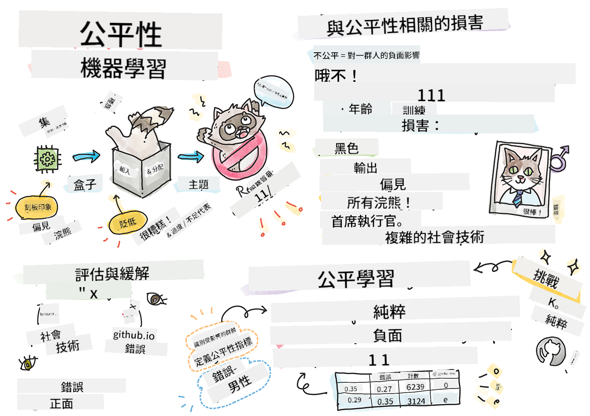

<!--
CO_OP_TRANSLATOR_METADATA:
{
  "original_hash": "8f819813b2ca08ec7b9f60a2c9336045",
  "translation_date": "2025-09-03T17:40:02+00:00",
  "source_file": "1-Introduction/3-fairness/README.md",
  "language_code": "tw"
}
-->
# 使用負責任的人工智慧建構機器學習解決方案

> 示意圖由 [Tomomi Imura](https://www.twitter.com/girlie_mac) 提供

## [課前測驗](https://gray-sand-07a10f403.1.azurestaticapps.net/quiz/5/)

## 簡介

在這份課程中，您將開始了解機器學習如何影響我們的日常生活。即使在現在，系統和模型已經參與了日常的決策任務，例如醫療診斷、貸款批准或欺詐檢測。因此，確保這些模型能夠提供值得信賴的結果是非常重要的。就像任何軟體應用程式一樣，人工智慧系統可能會未達預期或產生不理想的結果。因此，了解並解釋人工智慧模型的行為是至關重要的。

想像一下，當您用來建構這些模型的數據缺乏某些人口統計特徵，例如種族、性別、政治觀點、宗教，或是過度代表某些人口統計特徵時，會發生什麼情況？如果模型的輸出被解釋為偏向某些人口統計特徵，又會有什麼後果？此外，當模型產生不良結果並對人們造成傷害時，誰應該對人工智慧系統的行為負責？這些是我們在課程中將探討的一些問題。

在這堂課中，您將：

- 提高對機器學習公平性及相關傷害的重要性的認識。
- 熟悉探索異常值和不尋常情境以確保可靠性和安全性的實踐。
- 了解設計包容性系統以賦能每個人的必要性。
- 探討保護數據和個人隱私及安全的重要性。
- 認識採用透明化方法解釋人工智慧模型行為的重要性。
- 注意到如何透過問責性來建立對人工智慧系統的信任。

## 先修條件

作為先修條件，請完成「負責任人工智慧原則」學習路徑並觀看以下主題影片：

透過此 [學習路徑](https://docs.microsoft.com/learn/modules/responsible-ai-principles/?WT.mc_id=academic-77952-leestott) 了解更多關於負責任人工智慧的資訊。

> 🎥 點擊上方圖片觀看影片：Microsoft 的負責任人工智慧方法

## 公平性

人工智慧系統應公平對待每個人，避免對相似群體產生不同的影響。例如，當人工智慧系統提供醫療建議、貸款申請或就業建議時，應對具有相似症狀、財務狀況或專業資格的每個人提出相同的建議。作為人類，我們每個人都帶有影響決策和行動的固有偏見。這些偏見可能會反映在我們用來訓練人工智慧系統的數據中。有時這種操控可能是無意的。我們通常很難有意識地知道自己何時在數據中引入了偏見。

**「不公平性」** 包括對某些群體的負面影響或「傷害」，例如基於種族、性別、年齡或殘疾狀況等定義的群體。主要與公平性相關的傷害可分為以下幾類：

- **分配**：例如，某一性別或族群被偏袒。
- **服務品質**：如果您僅針對特定情境訓練數據，而現實情況更為複雜，可能導致服務表現不佳。例如，一款洗手液分配器無法感應深色皮膚的人。[參考資料](https://gizmodo.com/why-cant-this-soap-dispenser-identify-dark-skin-1797931773)
- **貶低**：不公平地批評或標籤某事或某人。例如，一項影像標籤技術曾錯誤地將深色皮膚的人標籤為猩猩。
- **過度或不足代表**：某一群體在某些職業中未被看到，而任何持續推動這種情況的服務或功能都在助長傷害。
- **刻板印象**：將某一群體與預設屬性聯繫起來。例如，英語和土耳其語之間的語言翻譯系統可能因與性別相關的刻板印象而出現不準確。

> 翻譯成土耳其語

> 翻譯回英語

在設計和測試人工智慧系統時，我們需要確保人工智慧是公平的，並且未被編程為做出偏頗或歧視性的決策，這些決策也是人類被禁止做出的。保證人工智慧和機器學習的公平性仍然是一項複雜的社會技術挑戰。

### 可靠性與安全性

為了建立信任，人工智慧系統需要在正常和意外情況下保持可靠、安全和一致。了解人工智慧系統在各種情境下的行為，尤其是異常情況下的行為，是非常重要的。在建構人工智慧解決方案時，需要大量關注如何處理人工智慧解決方案可能遇到的各種情況。例如，自駕車需要將人們的安全放在首位。因此，驅動汽車的人工智慧需要考慮汽車可能遇到的所有可能情境，例如夜晚、雷雨或暴風雪、孩子跑過街道、寵物、道路施工等。人工智慧系統能否可靠、安全地處理廣泛情況，反映了數據科學家或人工智慧開發者在設計或測試系統時的預見程度。

> [🎥 點擊此處觀看影片：](https://www.microsoft.com/videoplayer/embed/RE4vvIl)

### 包容性

人工智慧系統應設計為能夠吸引並賦能每個人。在設計和實施人工智慧系統時，數據科學家和人工智慧開發者需要識別並解決系統中可能無意間排除某些人的潛在障礙。例如，全球有 10 億人患有某種形式的殘疾。隨著人工智慧的進步，他們可以更輕鬆地獲取各種資訊和機會。通過解決這些障礙，可以創造創新機會，開發能夠為每個人提供更好體驗的人工智慧產品。

> [🎥 點擊此處觀看影片：人工智慧中的包容性](https://www.microsoft.com/videoplayer/embed/RE4vl9v)

### 安全性與隱私

人工智慧系統應安全並尊重人們的隱私。人們對那些可能危及隱私、資訊或生命的系統信任度較低。在訓練機器學習模型時，我們依賴數據以產生最佳結果。在此過程中，必須考慮數據的來源和完整性。例如，數據是用戶提交的還是公開可用的？接下來，在處理數據時，至關重要的是開發能夠保護機密資訊並抵禦攻擊的人工智慧系統。隨著人工智慧的普及，保護隱私和確保重要的個人及商業資訊的安全變得越來越重要且複雜。隱私和數據安全問題需要特別關注人工智慧，因為數據的可用性對人工智慧系統做出準確且有根據的預測和決策至關重要。

> [🎥 點擊此處觀看影片：人工智慧中的安全性](https://www.microsoft.com/videoplayer/embed/RE4voJF)

- 作為一個行業，我們在隱私和安全方面取得了重大進展，這在很大程度上得益於像 GDPR（通用數據保護條例）這樣的法規。
- 然而，對於人工智慧系統，我們必須承認需要更多個人數據以使系統更具個性化和有效性與隱私之間的緊張關係。
- 就像互聯網誕生時連接電腦一樣，我們也看到與人工智慧相關的安全問題急劇增加。
- 同時，我們也看到人工智慧被用來改善安全性。例如，當前大多數現代防病毒掃描器都是由人工智慧啟發式驅動的。
- 我們需要確保我們的數據科學流程與最新的隱私和安全實踐和諧融合。

### 透明性

人工智慧系統應該是可理解的。透明性的一個重要部分是解釋人工智慧系統及其組件的行為。提高對人工智慧系統的理解需要利益相關者了解其運作方式及原因，以便識別潛在的性能問題、安全和隱私問題、偏見、排他性做法或意外結果。我們還認為，使用人工智慧系統的人應該誠實並坦率地說明何時、為什麼以及如何選擇部署它們，以及所使用系統的局限性。例如，如果銀行使用人工智慧系統來支持其消費者貸款決策，則需要檢查結果並了解哪些數據影響了系統的建議。政府開始在各行業中對人工智慧進行監管，因此數據科學家和組織必須解釋人工智慧系統是否符合監管要求，尤其是在出現不理想結果時。

> [🎥 點擊此處觀看影片：人工智慧中的透明性](https://www.microsoft.com/videoplayer/embed/RE4voJF)

- 由於人工智慧系統非常複雜，很難理解它們的運作方式並解釋結果。
- 這種缺乏理解影響了這些系統的管理、運營化和文檔化方式。
- 更重要的是，這種缺乏理解影響了使用這些系統產生的結果所做出的決策。

### 問責性

設計和部署人工智慧系統的人必須對其系統的運作方式負責。問責性在敏感技術的使用中尤為重要，例如面部識別技術。最近，對面部識別技術的需求不斷增長，尤其是來自執法機構，他們看到了該技術在尋找失蹤兒童等用途上的潛力。然而，這些技術可能會被政府用來危及公民的基本自由，例如對特定個體進行持續監控。因此，數據科學家和組織需要對其人工智慧系統對個人或社會的影響負責。

> 🎥 點擊上方圖片觀看影片：面部識別可能導致大規模監控的警告

最終，對我們這一代人來說，作為第一代將人工智慧引入社會的人，最大的問題之一是如何確保電腦仍然對人類負責，以及如何確保設計電腦的人對其他人負責。

## 影響評估

在訓練機器學習模型之前，進行影響評估以了解人工智慧系統的目的、預期用途、部署地點以及與系統互動的人是非常重要的。這些評估對於評審者或測試者在評估系統時了解需要考慮哪些因素以識別潛在風險和預期後果非常有幫助。

以下是進行影響評估時的重點領域：

* **對個人的不利影響**：了解任何限制或要求、不支持的用途或任何已知限制妨礙系統性能至關重要，以確保系統不會以可能對個人造成傷害的方式使用。
* **數據需求**：了解系統如何以及在哪裡使用數據使評審者能夠探索需要注意的任何數據需求（例如 GDPR 或 HIPPA 數據法規）。此外，檢查數據的來源或數量是否足以進行訓練。
* **影響摘要**：收集使用系統可能產生的潛在傷害清單。在機器學習生命周期中，檢查是否已解決或處理所識別的問題。
* **六大核心原則的適用目標**：評估每個原則的目標是否達成，並檢查是否存在任何差距。

## 使用負責任人工智慧進行除錯

與除錯軟體應用程式類似，除錯人工智慧系統是識別和解決系統問題的必要過程。許多因素可能導致模型未如預期或負責任地運行。大多數傳統模型性能指標是模型性能的量化聚合，這不足以分析模型如何違反負責任人工智慧原則。此外，機器學習模型是一個黑箱，難以理解其結果的驅動因素或在出錯時提供解釋。在本課程的後續部分，我們將學習如何使用負責任人工智慧儀表板來幫助除錯人工智慧系統。該儀表板為數據科學家和人工智慧開發者提供了一個全面的工具，用於執行以下操作：

* **錯誤分析**：識別模型的錯誤分佈，這可能影響系統的公平性或可靠性。
* **模型概述**：發現模型在不同數據群體中的性能差異。
* **數據分析**：了解數據分佈並識別數據中可能導致公平性、包容性和可靠性問題的偏見。
* **模型可解釋性**：了解影響或影響模型預測的因素。這有助於解釋模型的行為，對於透明性和問責性至關重要。

## 🚀 挑戰

為了防止傷害被引入，我們應該：

- 確保參與系統工作的人的背景和觀點多樣化
- 投資於反映社會多樣性的數據集
- 在機器學習生命周期中開發更好的方法來檢測和修正負責任人工智慧問題

思考一些模型在建構和使用過程中不可信的真實情境。我們還應該考慮什麼？

## [課後測驗](https://gray-sand-07a10f403.1.azurestaticapps.net/quiz/6/)
## 回顧與自學
在本課程中，您已學習了機器學習中公平性與不公平性概念的一些基礎知識。

觀看這場工作坊以深入了解相關主題：

- 《追求負責任的人工智慧：將原則付諸實踐》，由 Besmira Nushi、Mehrnoosh Sameki 和 Amit Sharma 主講

> 🎥 點擊上方圖片觀看影片：《RAI Toolbox: 建立負責任人工智慧的開源框架》，由 Besmira Nushi、Mehrnoosh Sameki 和 Amit Sharma 主講

此外，請閱讀：

- 微軟的 RAI 資源中心：[負責任人工智慧資源 – Microsoft AI](https://www.microsoft.com/ai/responsible-ai-resources?activetab=pivot1%3aprimaryr4)

- 微軟的 FATE 研究小組：[FATE: 公平性、問責性、透明性與人工智慧倫理 - Microsoft Research](https://www.microsoft.com/research/theme/fate/)

RAI 工具箱：

- [負責任人工智慧工具箱 GitHub 儲存庫](https://github.com/microsoft/responsible-ai-toolbox)

了解 Azure Machine Learning 的工具如何確保公平性：

- [Azure Machine Learning](https://docs.microsoft.com/azure/machine-learning/concept-fairness-ml?WT.mc_id=academic-77952-leestott)

## 作業

[探索 RAI 工具箱](assignment.md)

---

**免責聲明**：  
本文件已使用 AI 翻譯服務 [Co-op Translator](https://github.com/Azure/co-op-translator) 進行翻譯。儘管我們努力確保翻譯的準確性，但請注意，自動翻譯可能包含錯誤或不準確之處。原始語言的文件應被視為權威來源。對於關鍵資訊，建議使用專業人工翻譯。我們對因使用此翻譯而產生的任何誤解或錯誤解釋不承擔責任。