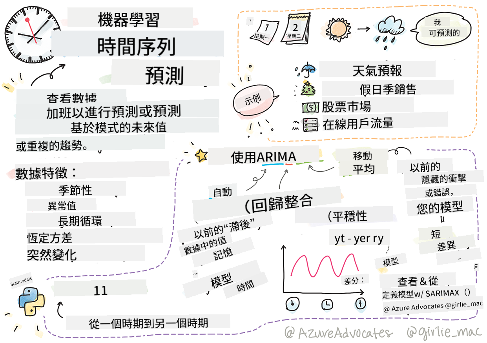
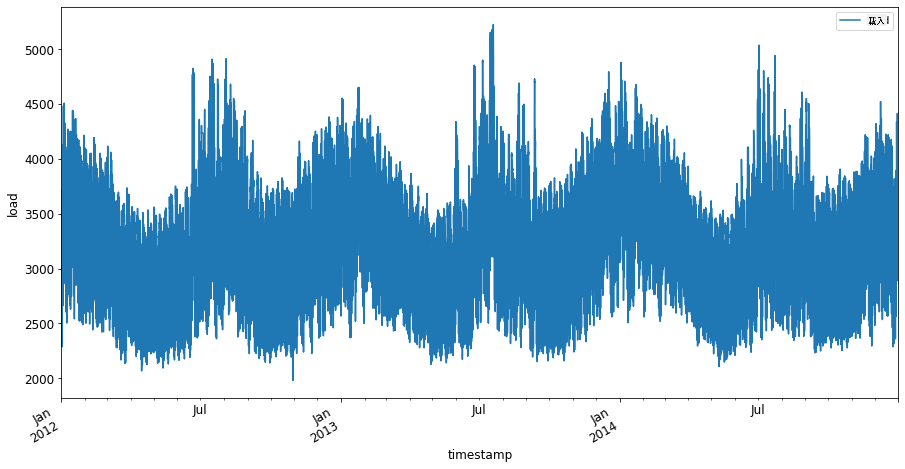
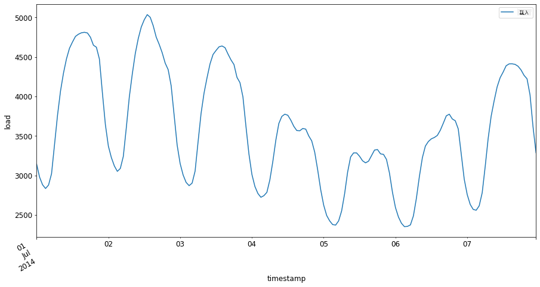

<!--
CO_OP_TRANSLATOR_METADATA:
{
  "original_hash": "3150d40f36a77857316ecaed5f31e856",
  "translation_date": "2025-09-03T16:55:41+00:00",
  "source_file": "7-TimeSeries/1-Introduction/README.md",
  "language_code": "tw"
}
-->
# 時間序列預測介紹



> 示意圖由 [Tomomi Imura](https://www.twitter.com/girlie_mac) 提供

在本課程及接下來的課程中，您將學習一些關於時間序列預測的知識。這是一個有趣且有價值的機器學習科學家技能，雖然它的知名度可能不如其他主題。時間序列預測就像一個「水晶球」：根據某個變數（例如價格）的過去表現，您可以預測其未來的潛在價值。

[](https://youtu.be/cBojo1hsHiI "時間序列預測介紹")

> 🎥 點擊上方圖片觀看關於時間序列預測的影片

## [課前測驗](https://gray-sand-07a10f403.1.azurestaticapps.net/quiz/41/)

時間序列預測是一個有用且有趣的領域，對於商業具有實際價值，因為它直接應用於定價、庫存和供應鏈問題。雖然深度學習技術已開始被用來獲得更多洞察以更好地預測未來表現，但時間序列預測仍然是一個主要由經典機器學習技術所驅動的領域。

> 賓州州立大學的時間序列課程可在 [這裡](https://online.stat.psu.edu/stat510/lesson/1) 找到

## 介紹

假設您管理一組智慧停車計時器，這些計時器提供關於它們使用頻率及使用時長的數據。

> 如果您能根據計時器的過去表現，根據供需法則預測其未來價值，會怎麼樣？

準確地預測何時採取行動以達成目標是一個挑戰，可以通過時間序列預測來解決。雖然在繁忙時段收取更高的停車費可能不會讓人們感到高興，但這確實是一種產生收入以清潔街道的有效方式！

讓我們來探索一些時間序列算法的類型，並開始使用筆記本清理和準備一些數據。您將分析的數據來自 GEFCom2014 預測競賽。它包含 2012 年至 2014 年之間的 3 年每小時的電力負載和溫度值。根據電力負載和溫度的歷史模式，您可以預測未來的電力負載值。

在這個例子中，您將學習如何僅使用歷史負載數據來預測下一個時間步驟。在開始之前，了解背後的原理是很有幫助的。

## 一些定義

當遇到「時間序列」這個術語時，您需要了解它在不同上下文中的使用。

🎓 **時間序列**

在數學中，「時間序列是一系列按時間順序索引（或列出或繪製）的數據點。最常見的是，時間序列是在時間上等間隔點處採集的序列。」時間序列的一個例子是 [道瓊工業平均指數](https://wikipedia.org/wiki/Time_series) 的每日收盤價。時間序列圖和統計建模的使用在信號處理、天氣預測、地震預測以及其他事件發生並且數據點可以隨時間繪製的領域中經常遇到。

🎓 **時間序列分析**

時間序列分析是對上述時間序列數據的分析。時間序列數據可以採取不同的形式，包括「中斷時間序列」，它檢測時間序列在中斷事件之前和之後的演變模式。所需的時間序列分析取決於數據的性質。時間序列數據本身可以是數字或字符的序列。

分析使用多種方法，包括頻域和時域、線性和非線性等。[了解更多](https://www.itl.nist.gov/div898/handbook/pmc/section4/pmc4.htm) 關於分析此類數據的多種方式。

🎓 **時間序列預測**

時間序列預測是使用模型根據過去收集的數據所顯示的模式來預測未來值。雖然可以使用回歸模型來探索時間序列數據，並將時間索引作為圖上的 x 變量，但此類數據最好使用特殊類型的模型進行分析。

時間序列數據是一個有序觀測值的列表，不同於可以通過線性回歸分析的數據。最常見的模型是 ARIMA，這是一個代表「自回歸整合移動平均」的縮寫。

[ARIMA 模型](https://online.stat.psu.edu/stat510/lesson/1/1.1)「將序列的當前值與過去的值和過去的預測誤差相關聯。」它們最適合分析時間域數據，即按時間順序排列的數據。

> ARIMA 模型有多種類型，您可以在 [這裡](https://people.duke.edu/~rnau/411arim.htm) 學習，並且您將在下一課中接觸到。

在下一課中，您將使用 [單變量時間序列](https://itl.nist.gov/div898/handbook/pmc/section4/pmc44.htm) 建立 ARIMA 模型，該模型專注於一個隨時間變化的變量。此類數據的一個例子是 [這個數據集](https://itl.nist.gov/div898/handbook/pmc/section4/pmc4411.htm)，記錄了 Mauna Loa 天文台的每月 CO2 濃度：

|   CO2   | YearMonth | Year  | Month |
| :-----: | :-------: | :---: | :---: |
| 330.62  |  1975.04  | 1975  |   1   |
| 331.40  |  1975.13  | 1975  |   2   |
| 331.87  |  1975.21  | 1975  |   3   |
| 333.18  |  1975.29  | 1975  |   4   |
| 333.92  |  1975.38  | 1975  |   5   |
| 333.43  |  1975.46  | 1975  |   6   |
| 331.85  |  1975.54  | 1975  |   7   |
| 330.01  |  1975.63  | 1975  |   8   |
| 328.51  |  1975.71  | 1975  |   9   |
| 328.41  |  1975.79  | 1975  |  10   |
| 329.25  |  1975.88  | 1975  |  11   |
| 330.97  |  1975.96  | 1975  |  12   |

✅ 識別此數據集中隨時間變化的變量

## 時間序列數據的特徵需要考慮

當查看時間序列數據時，您可能會注意到它具有一些 [特定特徵](https://online.stat.psu.edu/stat510/lesson/1/1.1)，需要考慮並減少以更好地理解其模式。如果您將時間序列數據視為可能提供「信號」的數據，這些特徵可以被視為「噪音」。您通常需要使用一些統計技術來減少這些「噪音」。

以下是一些您需要了解的概念，以便能夠處理時間序列：

🎓 **趨勢**

趨勢被定義為隨時間可測量的增長和減少。[了解更多](https://machinelearningmastery.com/time-series-trends-in-python)。在時間序列的上下文中，這是關於如何使用以及（如果需要）移除時間序列中的趨勢。

🎓 **[季節性](https://machinelearningmastery.com/time-series-seasonality-with-python/)**

季節性被定義為周期性波動，例如假期高峰可能影響銷售。[看看](https://itl.nist.gov/div898/handbook/pmc/section4/pmc443.htm) 不同類型的圖表如何顯示數據中的季節性。

🎓 **異常值**

異常值遠離標準數據變異範圍。

🎓 **長期週期**

獨立於季節性，數據可能顯示長期週期，例如持續超過一年的經濟衰退。

🎓 **恆定方差**

隨著時間的推移，一些數據顯示恆定的波動，例如每天和夜間的能源使用量。

🎓 **突然變化**

數據可能顯示需要進一步分析的突然變化。例如，由於 COVID 的突然停業導致數據發生變化。

✅ 這裡有一個 [示例時間序列圖](https://www.kaggle.com/kashnitsky/topic-9-part-1-time-series-analysis-in-python)，顯示了幾年內每日遊戲內貨幣的消費。您能在此數據中識別出上述任何特徵嗎？


## 練習 - 開始使用電力使用數據

讓我們開始創建一個時間序列模型，根據過去的使用情況來預測未來的電力使用。

> 本例中的數據來自 GEFCom2014 預測競賽。它包含 2012 年至 2014 年之間的 3 年每小時的電力負載和溫度值。
>
> Tao Hong, Pierre Pinson, Shu Fan, Hamidreza Zareipour, Alberto Troccoli 和 Rob J. Hyndman，「概率能源預測：全球能源預測競賽 2014 及以後」，《國際預測期刊》，第 32 卷，第 3 期，頁 896-913，2016 年 7 月至 9 月。

1. 在本課程的 `working` 文件夾中，打開 _notebook.ipynb_ 文件。首先添加幫助您加載和可視化數據的庫

    ```python
    import os
    import matplotlib.pyplot as plt
    from common.utils import load_data
    %matplotlib inline
    ```

    注意，您正在使用包含的 `common` 文件夾中的文件，這些文件設置了您的環境並處理數據下載。

2. 接下來，通過調用 `load_data()` 和 `head()` 查看數據作為數據框：

    ```python
    data_dir = './data'
    energy = load_data(data_dir)[['load']]
    energy.head()
    ```

    您可以看到有兩列代表日期和負載：

    |                     |  load  |
    | :-----------------: | :----: |
    | 2012-01-01 00:00:00 | 2698.0 |
    | 2012-01-01 01:00:00 | 2558.0 |
    | 2012-01-01 02:00:00 | 2444.0 |
    | 2012-01-01 03:00:00 | 2402.0 |
    | 2012-01-01 04:00:00 | 2403.0 |

3. 現在，通過調用 `plot()` 繪製數據：

    ```python
    energy.plot(y='load', subplots=True, figsize=(15, 8), fontsize=12)
    plt.xlabel('timestamp', fontsize=12)
    plt.ylabel('load', fontsize=12)
    plt.show()
    ```

    

4. 現在，通過提供 `[from date]: [to date]` 模式的輸入，繪製 2014 年 7 月的第一周：

    ```python
    energy['2014-07-01':'2014-07-07'].plot(y='load', subplots=True, figsize=(15, 8), fontsize=12)
    plt.xlabel('timestamp', fontsize=12)
    plt.ylabel('load', fontsize=12)
    plt.show()
    ```

    

    一個漂亮的圖表！看看這些圖表，看看您是否能確定上述列出的任何特徵。通過可視化數據，我們可以推測什麼？

在下一課中，您將創建一個 ARIMA 模型來進行一些預測。

---

## 🚀挑戰

列出您能想到的所有可能受益於時間序列預測的行業和研究領域。您能想到這些技術在藝術、計量經濟學、生態學、零售業、工業、金融等領域的應用嗎？還有其他地方嗎？

## [課後測驗](https://gray-sand-07a10f403.1.azurestaticapps.net/quiz/42/)

## 回顧與自學

雖然我們在這裡不會涉及，但有時會使用神經網絡來增強經典的時間序列預測方法。閱讀更多相關內容 [在這篇文章中](https://medium.com/microsoftazure/neural-networks-for-forecasting-financial-and-economic-time-series-6aca370ff412)

## 作業

[可視化更多時間序列](assignment.md)

---

**免責聲明**：  
本文件已使用 AI 翻譯服務 [Co-op Translator](https://github.com/Azure/co-op-translator) 進行翻譯。儘管我們致力於提供準確的翻譯，請注意自動翻譯可能包含錯誤或不準確之處。原始文件的母語版本應被視為權威來源。對於關鍵資訊，建議使用專業人工翻譯。我們對因使用此翻譯而引起的任何誤解或錯誤解釋不承擔責任。