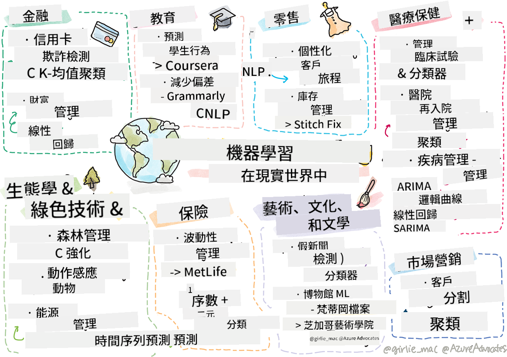

<!--
CO_OP_TRANSLATOR_METADATA:
{
  "original_hash": "20f18ff565638be615df4174858e4a7f",
  "translation_date": "2025-09-03T17:26:12+00:00",
  "source_file": "9-Real-World/1-Applications/README.md",
  "language_code": "tw"
}
-->
# 後記：機器學習在現實世界中的應用

> 示意圖由 [Tomomi Imura](https://www.twitter.com/girlie_mac) 繪製

在這門課程中，你學到了許多準備訓練數據和建立機器學習模型的方法。你構建了一系列經典的回歸、聚類、分類、自然語言處理和時間序列模型。恭喜你！現在，你可能會想知道這些模型的實際用途是什麼……它們在現實世界中的應用是什麼？

儘管深度學習通常是人工智慧（AI）在業界中吸引注意力的主要技術，但經典的機器學習模型仍然有其價值。事實上，你今天可能已經在使用其中一些應用。在本課中，你將探索八個不同的行業和專業領域如何使用這些模型來使其應用更加高效、可靠、智能，並為用戶創造更多價值。

## [課前測驗](https://gray-sand-07a10f403.1.azurestaticapps.net/quiz/49/)

## 💰 金融

金融領域提供了許多機器學習的應用機會。該領域的許多問題都可以通過機器學習建模和解決。

### 信用卡詐欺檢測

我們在課程中學習了 [k-means 聚類](../../5-Clustering/2-K-Means/README.md)，但它如何用於解決信用卡詐欺相關問題呢？

k-means 聚類在一種稱為**異常檢測**的信用卡詐欺檢測技術中非常有用。異常值或數據集中的偏差可以幫助我們判斷信用卡的使用是否正常，或者是否有不尋常的情況發生。根據以下論文所述，你可以使用 k-means 聚類算法對信用卡數據進行分類，並根據交易的異常程度將其分配到不同的群組。然後，你可以評估最具風險的群組以區分詐欺交易和合法交易。
[參考資料](https://citeseerx.ist.psu.edu/viewdoc/download?doi=10.1.1.680.1195&rep=rep1&type=pdf)

### 財富管理

在財富管理中，個人或公司代表客戶處理投資。他們的工作是長期維持和增長財富，因此選擇表現良好的投資至關重要。

評估特定投資表現的一種方法是通過統計回歸。[線性回歸](../../2-Regression/1-Tools/README.md) 是理解基金相對於某些基準表現的有價值工具。我們還可以推斷回歸結果是否具有統計顯著性，或者它們對客戶投資的影響程度。你甚至可以進一步擴展分析，使用多元回歸來考慮額外的風險因素。以下論文展示了如何使用回歸評估特定基金的表現。
[參考資料](http://www.brightwoodventures.com/evaluating-fund-performance-using-regression/)

## 🎓 教育

教育領域也是機器學習可以應用的一個非常有趣的領域。有許多有趣的問題可以解決，例如檢測考試或文章中的作弊行為，或者管理糾正過程中的偏差（無意或有意）。

### 預測學生行為

[Coursera](https://coursera.com)，一家在線開放課程提供商，在其技術博客中討論了許多工程決策。在這個案例研究中，他們繪製了一條回歸線，試圖探索低 NPS（淨推薦值）評分與課程保留或退課之間的相關性。
[參考資料](https://medium.com/coursera-engineering/controlled-regression-quantifying-the-impact-of-course-quality-on-learner-retention-31f956bd592a)

### 減少偏差

[Grammarly](https://grammarly.com)，一款檢查拼寫和語法錯誤的寫作助手，在其產品中使用了複雜的[自然語言處理系統](../../6-NLP/README.md)。他們在技術博客中發表了一篇有趣的案例研究，討論如何處理機器學習中的性別偏差，這也是我們在[公平性入門課程](../../1-Introduction/3-fairness/README.md)中學到的內容。
[參考資料](https://www.grammarly.com/blog/engineering/mitigating-gender-bias-in-autocorrect/)

## 👜 零售

零售業可以從機器學習中受益匪淺，從創造更好的客戶旅程到以最佳方式管理庫存。

### 個性化客戶旅程

在 Wayfair，一家銷售家具等家居用品的公司，幫助客戶找到符合其品味和需求的產品至關重要。在這篇文章中，該公司的工程師描述了他們如何使用機器學習和自然語言處理來「為客戶提供合適的結果」。值得注意的是，他們的查詢意圖引擎使用了實體提取、分類器訓練、資產和意見提取以及客戶評論的情感標記。這是自然語言處理在在線零售中的經典應用案例。
[參考資料](https://www.aboutwayfair.com/tech-innovation/how-we-use-machine-learning-and-natural-language-processing-to-empower-search)

### 庫存管理

像 [StitchFix](https://stitchfix.com) 這樣的創新型公司，一家向消費者寄送服裝的盒子服務公司，在推薦和庫存管理方面高度依賴機器學習。他們的造型團隊與商品團隊合作，事實上：「我們的一位數據科學家使用遺傳算法並將其應用於服裝，預測出今天不存在但可能成功的服裝。我們將其提供給商品團隊，現在他們可以將其作為工具使用。」
[參考資料](https://www.zdnet.com/article/how-stitch-fix-uses-machine-learning-to-master-the-science-of-styling/)

## 🏥 醫療保健

醫療保健領域可以利用機器學習來優化研究任務以及物流問題，例如患者再入院管理或阻止疾病傳播。

### 臨床試驗管理

臨床試驗中的毒性是藥物製造商的一個主要關注點。多少毒性是可以容忍的？在這項研究中，分析各種臨床試驗方法導致了一種新的方法，用於預測臨床試驗結果的概率。具體而言，他們使用隨機森林生成了一個[分類器](../../4-Classification/README.md)，能夠區分不同的藥物群組。
[參考資料](https://www.sciencedirect.com/science/article/pii/S2451945616302914)

### 醫院再入院管理

醫院護理成本高昂，尤其是當患者需要再次入院時。這篇論文討論了一家公司如何使用機器學習通過[聚類](../../5-Clustering/README.md)算法來預測再入院的可能性。這些群組幫助分析師「發現可能有共同原因的再入院群組」。
[參考資料](https://healthmanagement.org/c/healthmanagement/issuearticle/hospital-readmissions-and-machine-learning)

### 疾病管理

最近的疫情突顯了機器學習在阻止疾病傳播方面的作用。在這篇文章中，你會看到 ARIMA、邏輯曲線、線性回歸和 SARIMA 的使用。「這項工作試圖計算病毒的傳播速度，並預測死亡、康復和確診病例，以便我們能更好地準備和應對。」
[參考資料](https://www.ncbi.nlm.nih.gov/pmc/articles/PMC7979218/)

## 🌲 生態與綠色科技

自然和生態由許多敏感的系統組成，動物與自然之間的相互作用尤為重要。準確測量這些系統並在出現問題（如森林火災或動物數量下降）時採取適當行動非常重要。

### 森林管理

你在之前的課程中學習了[強化學習](../../8-Reinforcement/README.md)。它在預測自然模式時非常有用。特別是，它可以用於追蹤生態問題，如森林火災和入侵物種的擴散。在加拿大，一組研究人員使用強化學習從衛星圖像中建立森林火災動態模型。他們使用了一種創新的「空間擴散過程（SSP）」，將森林火災視為「景觀中任何單元格的代理」。火災在任何時間點可以採取的行動包括向北、南、東、西擴散或不擴散。

這種方法顛覆了通常的強化學習設置，因為對應的馬爾可夫決策過程（MDP）的動態是一個已知的即時火災擴散函數。閱讀以下鏈接了解該研究小組使用的經典算法。
[參考資料](https://www.frontiersin.org/articles/10.3389/fict.2018.00006/full)

### 動物運動感測

雖然深度學習在視覺追蹤動物運動方面帶來了革命（你可以在這裡構建自己的[北極熊追蹤器](https://docs.microsoft.com/learn/modules/build-ml-model-with-azure-stream-analytics/?WT.mc_id=academic-77952-leestott)），但經典機器學習在這項任務中仍然有其地位。

用於追蹤農場動物運動的感測器和物聯網技術利用了這類視覺處理，但更基本的機器學習技術對數據預處理非常有用。例如，在這篇論文中，使用各種分類器算法監測和分析羊的姿勢。你可能會在第 335 頁看到 ROC 曲線。
[參考資料](https://druckhaus-hofmann.de/gallery/31-wj-feb-2020.pdf)

### ⚡️ 能源管理

在我們的[時間序列預測](../../7-TimeSeries/README.md)課程中，我們提到了智能停車計時器的概念，通過理解供需來為城鎮創造收入。這篇文章詳細討論了聚類、回歸和時間序列預測如何結合使用，幫助基於智能計量器預測愛爾蘭未來的能源使用。
[參考資料](https://www-cdn.knime.com/sites/default/files/inline-images/knime_bigdata_energy_timeseries_whitepaper.pdf)

## 💼 保險

保險業是另一個使用機器學習構建和優化可行財務和精算模型的領域。

### 波動性管理

MetLife，一家人壽保險提供商，公開了他們如何分析和減少財務模型中的波動性。在這篇文章中，你會看到二元和序數分類的可視化，以及預測的可視化。
[參考資料](https://investments.metlife.com/content/dam/metlifecom/us/investments/insights/research-topics/macro-strategy/pdf/MetLifeInvestmentManagement_MachineLearnedRanking_070920.pdf)

## 🎨 藝術、文化與文學

在藝術領域，例如新聞業，有許多有趣的問題。檢測假新聞是一個巨大的挑戰，因為它已被證明能影響人們的觀點，甚至顛覆民主。博物館也可以利用機器學習，從發現文物之間的聯繫到資源規劃。

### 假新聞檢測

在當今媒體中，檢測假新聞已成為一場貓捉老鼠的遊戲。在這篇文章中，研究人員建議測試並部署最佳模型的系統：「該系統基於自然語言處理從數據中提取特徵，然後使用這些特徵訓練機器學習分類器，例如 Naive Bayes、支持向量機（SVM）、隨機森林（RF）、隨機梯度下降（SGD）和邏輯回歸（LR）。」
[參考資料](https://www.irjet.net/archives/V7/i6/IRJET-V7I6688.pdf)

這篇文章展示了如何結合不同的機器學習領域來產生有趣的結果，幫助阻止假新聞的傳播和造成的實際損害；在這種情況下，動機是 COVID 治療的謠言引發的暴力事件。

### 博物館機器學習

博物館正處於人工智慧革命的前沿，隨著技術的進步，收藏品的編目和數字化以及發現文物之間的聯繫變得更加容易。像 [In Codice Ratio](https://www.sciencedirect.com/science/article/abs/pii/S0306457321001035#:~:text=1.,studies%20over%20large%20historical%20sources.) 這樣的項目正在幫助解開像梵蒂岡檔案館這樣的不可接觸收藏的謎團。但博物館的商業方面也受益於機器學習模型。

例如，芝加哥藝術博物館建立了模型來預測觀眾的興趣以及他們何時會參加展覽。目標是每次用戶參觀博物館時都能創造個性化和最佳化的訪客體驗。「在 2017 財年，該模型在 1% 的準確度內預測了參觀人數和門票收入，芝加哥藝術博物館高級副總裁 Andrew Simnick 說。」
[參考資料](https://www.chicagobusiness.com/article/20180518/ISSUE01/180519840/art-institute-of-chicago-uses-data-to-make-exhibit-choices)

## 🏷 行銷

### 客戶分群

最有效的行銷策略根據不同的群組以不同方式定位客戶。在這篇文章中，討論了聚類算法的用途以支持差異化行銷。差異化行銷幫助公司提高品牌知名度、接觸更多客戶並賺取更多收入。
[參考資料](https://ai.inqline.com/machine-learning-for-marketing-customer-segmentation/)

## 🚀 挑戰
識別另一個可以從本課程中學到的一些技術中受益的行業，並探索該行業如何使用機器學習。

## [課後測驗](https://gray-sand-07a10f403.1.azurestaticapps.net/quiz/50/)

## 複習與自學

Wayfair 的數據科學團隊有幾個有趣的影片，介紹他們如何在公司內使用機器學習。值得[看看](https://www.youtube.com/channel/UCe2PjkQXqOuwkW1gw6Ameuw/videos)！

## 作業

[機器學習尋寶遊戲](assignment.md)

---

**免責聲明**：  
本文件已使用 AI 翻譯服務 [Co-op Translator](https://github.com/Azure/co-op-translator) 進行翻譯。雖然我們致力於提供準確的翻譯，但請注意，自動翻譯可能包含錯誤或不準確之處。原始文件的母語版本應被視為權威來源。對於關鍵資訊，建議使用專業人工翻譯。我們對因使用此翻譯而引起的任何誤解或錯誤解釋不承擔責任。