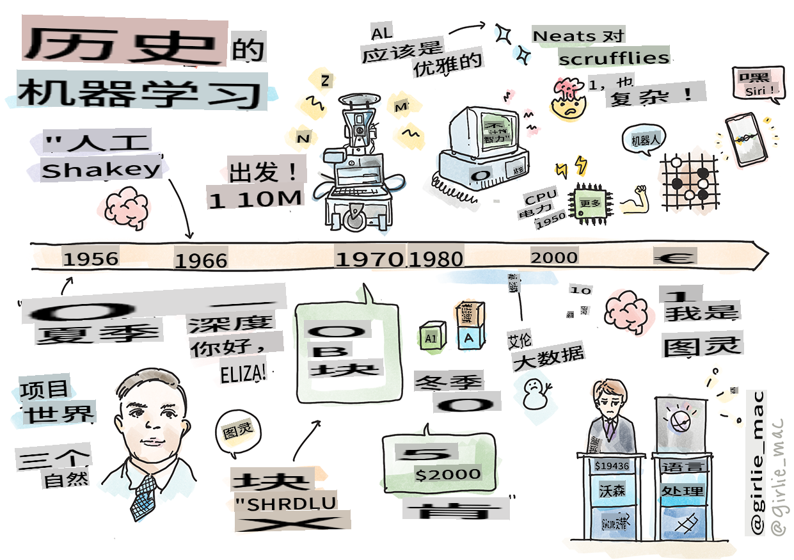

<!--
CO_OP_TRANSLATOR_METADATA:
{
  "original_hash": "b2d11df10030cacc41427a1fbc8bc8f1",
  "translation_date": "2025-09-03T17:51:01+00:00",
  "source_file": "1-Introduction/2-history-of-ML/README.md",
  "language_code": "zh"
}
-->
# 机器学习的历史

> 草图由 [Tomomi Imura](https://www.twitter.com/girlie_mac) 绘制

## [课前测验](https://gray-sand-07a10f403.1.azurestaticapps.net/quiz/3/)

---

> 🎥 点击上方图片观看本课的简短视频。

在本课中，我们将回顾机器学习和人工智能历史上的重要里程碑。

人工智能（AI）作为一个领域的历史与机器学习的历史密不可分，因为支撑机器学习的算法和计算进步推动了人工智能的发展。值得注意的是，尽管这些领域作为独立的研究方向在20世纪50年代开始成型，但重要的[算法、统计、数学、计算和技术发现](https://wikipedia.org/wiki/Timeline_of_machine_learning)早在这一时期之前就已经出现并有所交集。事实上，人类已经思考这些问题[数百年](https://wikipedia.org/wiki/History_of_artificial_intelligence)：这篇文章探讨了“会思考的机器”这一理念的历史性思想基础。

---
## 重要发现

- 1763年, 1812年 [贝叶斯定理](https://wikipedia.org/wiki/Bayes%27_theorem)及其前身。这一定理及其应用奠定了推断的基础，描述了基于先验知识事件发生的概率。
- 1805年 [最小二乘法](https://wikipedia.org/wiki/Least_squares)，由法国数学家Adrien-Marie Legendre提出。这一理论（你将在回归单元中学习）有助于数据拟合。
- 1913年 [马尔可夫链](https://wikipedia.org/wiki/Markov_chain)，以俄罗斯数学家Andrey Markov命名，用于描述基于前一状态的一系列可能事件。
- 1957年 [感知机](https://wikipedia.org/wiki/Perceptron)，一种由美国心理学家Frank Rosenblatt发明的线性分类器，是深度学习进步的基础。

---

- 1967年 [最近邻算法](https://wikipedia.org/wiki/Nearest_neighbor)，最初设计用于路径规划。在机器学习中，它被用来检测模式。
- 1970年 [反向传播算法](https://wikipedia.org/wiki/Backpropagation)，用于训练[前馈神经网络](https://wikipedia.org/wiki/Feedforward_neural_network)。
- 1982年 [循环神经网络](https://wikipedia.org/wiki/Recurrent_neural_network)，从前馈神经网络衍生而来，用于创建时间序列图。

✅ 做一些研究。还有哪些日期在机器学习和人工智能的历史上具有重要意义？

---
## 1950年：会思考的机器

艾伦·图灵（Alan Turing）是一位真正杰出的人物，他在[2019年被公众评选](https://wikipedia.org/wiki/Icons:_The_Greatest_Person_of_the_20th_Century)为20世纪最伟大的科学家。他被认为帮助奠定了“会思考的机器”这一概念的基础。他通过创建[图灵测试](https://www.bbc.com/news/technology-18475646)来应对质疑者以及自己对这一概念的实证需求，你将在自然语言处理课程中深入探讨这一测试。

---
## 1956年：达特茅斯夏季研究项目

“达特茅斯夏季人工智能研究项目是人工智能作为一个领域的奠基性事件”，并且在这里首次提出了“人工智能”这一术语（[来源](https://250.dartmouth.edu/highlights/artificial-intelligence-ai-coined-dartmouth)）。

> 学习的每一个方面或智能的任何其他特征原则上都可以被如此精确地描述，以至于可以制造出一台机器来模拟它。

---

首席研究员、数学教授John McCarthy希望“基于这样的猜想进行研究：学习的每一个方面或智能的任何其他特征原则上都可以被如此精确地描述，以至于可以制造出一台机器来模拟它。”参与者中还包括该领域的另一位杰出人物Marvin Minsky。

这次研讨会被认为开启并推动了多项讨论，包括“符号方法的兴起、专注于有限领域的系统（早期专家系统）以及演绎系统与归纳系统的对比”（[来源](https://wikipedia.org/wiki/Dartmouth_workshop)）。

---
## 1956 - 1974年：“黄金时代”

从20世纪50年代到70年代中期，人们对人工智能能够解决许多问题充满乐观。1967年，Marvin Minsky自信地表示：“在一代人的时间内……创造‘人工智能’的问题将基本解决。”（Minsky, Marvin (1967), Computation: Finite and Infinite Machines, Englewood Cliffs, N.J.: Prentice-Hall）

自然语言处理研究蓬勃发展，搜索技术得到了改进并变得更强大，“微观世界”的概念被提出，在这种环境下可以使用简单的语言指令完成简单任务。

---

政府机构为研究提供了充足的资金，计算和算法取得了进展，智能机器的原型被制造出来。这些机器包括：

* [Shakey机器人](https://wikipedia.org/wiki/Shakey_the_robot)，它能够“智能地”移动并决定如何执行任务。

    
    > 1972年的Shakey

---

* Eliza，一个早期的“聊天机器人”，能够与人对话并充当一个原始的“治疗师”。你将在自然语言处理课程中进一步了解Eliza。

    
    > Eliza的一个版本

---

* “积木世界”是一个微观世界的例子，在这里可以堆叠和排序积木，并测试教机器做决策的实验。使用诸如[SHRDLU](https://wikipedia.org/wiki/SHRDLU)之类的库所取得的进展推动了语言处理的发展。

    

    > 🎥 点击上方图片观看视频：SHRDLU的积木世界

---
## 1974 - 1980年：“人工智能寒冬”

到20世纪70年代中期，制造“智能机器”的复杂性被低估的事实变得显而易见，而其承诺在当时的计算能力下被过度夸大。资金枯竭，领域信心减弱。影响信心的一些问题包括：
---
- **局限性**。计算能力过于有限。
- **组合爆炸**。随着对计算机要求的增加，需要训练的参数数量呈指数增长，而计算能力和性能却没有相应提升。
- **数据匮乏**。数据的匮乏阻碍了测试、开发和优化算法的过程。
- **我们提出了正确的问题吗？**。研究人员开始质疑他们提出的问题：
  - 图灵测试因“中文房间理论”等观点受到质疑，该理论认为，“编程一台数字计算机可能使其看起来理解语言，但无法产生真正的理解。”（[来源](https://plato.stanford.edu/entries/chinese-room/)）
  - 将像“治疗师”ELIZA这样的人工智能引入社会的伦理问题受到挑战。

---

与此同时，各种人工智能学派开始形成。“[粗糙派](https://wikipedia.org/wiki/Neats_and_scruffies)”与“严谨派”之间的二分法逐渐确立。_粗糙派_实验室通过不断调整程序直到获得期望结果，而_严谨派_实验室则“专注于逻辑和形式化问题解决”。ELIZA和SHRDLU是著名的_粗糙派_系统。到了20世纪80年代，随着对机器学习系统可重复性的需求增加，_严谨派_方法逐渐占据主导地位，因为其结果更具可解释性。

---
## 1980年代 专家系统

随着该领域的发展，其对商业的益处变得更加明显，1980年代“专家系统”开始大量涌现。“专家系统是最早真正成功的人工智能（AI）软件形式之一。”（[来源](https://wikipedia.org/wiki/Expert_system)）

这种系统实际上是_混合型_的，部分由定义业务需求的规则引擎组成，部分由利用规则系统推导新事实的推理引擎组成。

这一时期还见证了对神经网络的日益关注。

---
## 1987 - 1993年：人工智能“冷却期”

专用专家系统硬件的泛滥导致其过于专用化。个人计算机的兴起也与这些大型、专用、集中化的系统形成了竞争。计算的民主化开始了，并最终为现代大数据的爆发铺平了道路。

---
## 1993 - 2011年

这一时期见证了机器学习和人工智能能够解决早期由于数据和计算能力不足而导致的一些问题。数据量开始迅速增加并变得更加广泛可用，无论是好是坏，尤其是在2007年左右智能手机的出现之后。计算能力呈指数级增长，算法也随之演进。随着过去自由奔放的日子逐渐凝聚成一个真正的学科，该领域开始走向成熟。

---
## 现在

今天，机器学习和人工智能几乎触及我们生活的每一个部分。这个时代需要我们仔细理解这些算法对人类生活的风险和潜在影响。正如微软的Brad Smith所说：“信息技术提出了一些问题，这些问题触及了隐私和言论自由等基本人权保护的核心。这些问题加重了创造这些产品的科技公司的责任。在我们看来，这也需要深思熟虑的政府监管以及围绕可接受用途的规范发展。”（[来源](https://www.technologyreview.com/2019/12/18/102365/the-future-of-ais-impact-on-society/)）

---

未来会怎样仍未可知，但理解这些计算机系统及其运行的软件和算法是非常重要的。我们希望这门课程能帮助你更好地理解这些内容，从而让你自己做出判断。

> 🎥 点击上方图片观看视频：Yann LeCun在这次讲座中讨论了深度学习的历史

---
## 🚀挑战

深入研究这些历史时刻中的一个，了解背后的人物。这些人物非常有趣，没有任何科学发现是在文化真空中产生的。你发现了什么？

## [课后测验](https://gray-sand-07a10f403.1.azurestaticapps.net/quiz/4/)

---
## 复习与自学

以下是一些可以观看和收听的内容：

[这期Amy Boyd讨论人工智能演变的播客](http://runasradio.com/Shows/Show/739)

---

## 作业

[创建一个时间线](assignment.md)

---

**免责声明**：  
本文档使用AI翻译服务[Co-op Translator](https://github.com/Azure/co-op-translator)进行翻译。尽管我们努力确保翻译的准确性，但请注意，自动翻译可能包含错误或不准确之处。原始语言的文档应被视为权威来源。对于重要信息，建议使用专业人工翻译。我们不对因使用此翻译而产生的任何误解或误读承担责任。