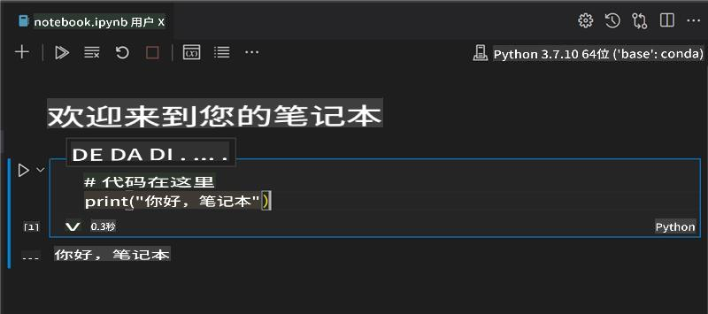

<!--
CO_OP_TRANSLATOR_METADATA:
{
  "original_hash": "6b1cb0e46d4c5b747eff6e3607642760",
  "translation_date": "2025-09-03T16:38:08+00:00",
  "source_file": "2-Regression/1-Tools/README.md",
  "language_code": "zh"
}
-->
# 使用 Python 和 Scikit-learn 构建回归模型


> 手绘笔记由 [Tomomi Imura](https://www.twitter.com/girlie_mac) 提供

## [课前小测验](https://gray-sand-07a10f403.1.azurestaticapps.net/quiz/9/)

> ### [本课程也提供 R 版本！](../../../../2-Regression/1-Tools/solution/R/lesson_1.html)

## 介绍

在这四节课中，您将学习如何构建回归模型。我们很快会讨论这些模型的用途。但在开始之前，请确保您已经准备好合适的工具来启动这个过程！

在本节课中，您将学习如何：

- 配置您的计算机以进行本地机器学习任务。
- 使用 Jupyter 笔记本。
- 安装并使用 Scikit-learn。
- 通过实践练习探索线性回归。

## 安装和配置

[](https://youtu.be/-DfeD2k2Kj0 "机器学习初学者 - 配置工具以构建机器学习模型")

> 🎥 点击上方图片观看一段简短视频，了解如何配置您的计算机以进行机器学习。

1. **安装 Python**。确保您的计算机上已安装 [Python](https://www.python.org/downloads/)。Python 是进行数据科学和机器学习任务的重要工具。大多数计算机系统已经预装了 Python。您还可以使用一些方便的 [Python 编码包](https://code.visualstudio.com/learn/educators/installers?WT.mc_id=academic-77952-leestott)，以简化部分用户的设置过程。

   但需要注意的是，不同的 Python 使用场景可能需要不同的版本。因此，建议您使用 [虚拟环境](https://docs.python.org/3/library/venv.html) 来管理。

2. **安装 Visual Studio Code**。确保您的计算机上已安装 Visual Studio Code。按照这些说明完成 [Visual Studio Code 的安装](https://code.visualstudio.com/)。在本课程中，您将使用 Visual Studio Code 来运行 Python，因此您可能需要了解如何为 Python 开发 [配置 Visual Studio Code](https://docs.microsoft.com/learn/modules/python-install-vscode?WT.mc_id=academic-77952-leestott)。

   > 通过学习这组 [模块](https://docs.microsoft.com/users/jenlooper-2911/collections/mp1pagggd5qrq7?WT.mc_id=academic-77952-leestott)，熟悉 Python 的使用。
   >
   > [](https://youtu.be/yyQM70vi7V8 "使用 Visual Studio Code 配置 Python")
   >
   > 🎥 点击上方图片观看视频：在 VS Code 中使用 Python。

3. **安装 Scikit-learn**，按照 [这些说明](https://scikit-learn.org/stable/install.html) 进行安装。由于需要确保使用 Python 3，建议您使用虚拟环境。如果您是在 M1 Mac 上安装该库，请参考上述页面中的特殊说明。

4. **安装 Jupyter Notebook**。您需要 [安装 Jupyter 包](https://pypi.org/project/jupyter/)。

## 您的机器学习开发环境

您将使用 **笔记本** 来开发 Python 代码并创建机器学习模型。这种文件类型是数据科学家常用的工具，其文件后缀为 `.ipynb`。

笔记本是一种交互式环境，允许开发者编写代码，同时添加注释和文档，非常适合实验性或研究导向的项目。

[](https://youtu.be/7E-jC8FLA2E "机器学习初学者 - 设置 Jupyter 笔记本以开始构建回归模型")

> 🎥 点击上方图片观看一段简短视频，了解如何完成此练习。

### 练习 - 使用笔记本

在此文件夹中，您会找到文件 _notebook.ipynb_。

1. 在 Visual Studio Code 中打开 _notebook.ipynb_。

   一个 Jupyter 服务器将启动，并运行 Python 3+。您会发现笔记本中有一些可以 `运行` 的代码块。您可以通过选择类似播放按钮的图标来运行代码块。

2. 选择 `md` 图标，添加一些 Markdown 文本，例如 **# 欢迎来到您的笔记本**。

   接下来，添加一些 Python 代码。

3. 在代码块中输入 **print('hello notebook')**。
4. 点击箭头运行代码。

   您应该会看到打印的输出：

    ```output
    hello notebook
    ```



您可以在代码中穿插注释，以便自我记录笔记本内容。

✅ 想一想，Web 开发者的工作环境与数据科学家的工作环境有何不同？

## 使用 Scikit-learn 入门

现在，您已经在本地环境中设置了 Python，并熟悉了 Jupyter 笔记本，接下来让我们熟悉一下 Scikit-learn（发音为 `sci`，类似于 `science`）。Scikit-learn 提供了一个 [广泛的 API](https://scikit-learn.org/stable/modules/classes.html#api-ref)，帮助您完成机器学习任务。

根据其 [官网](https://scikit-learn.org/stable/getting_started.html) 的描述，“Scikit-learn 是一个开源的机器学习库，支持监督学习和非监督学习。它还提供了多种工具，用于模型拟合、数据预处理、模型选择和评估，以及许多其他实用功能。”

在本课程中，您将使用 Scikit-learn 和其他工具来构建机器学习模型，完成我们称之为“传统机器学习”的任务。我们特意避免涉及神经网络和深度学习，因为这些内容将在我们即将推出的“AI 初学者”课程中详细讲解。

Scikit-learn 使构建模型和评估模型变得简单。它主要用于处理数值数据，并包含多个现成的数据集供学习使用。它还包括一些预构建的模型供学生尝试。接下来，我们将探索如何加载预打包数据，并使用内置估计器构建第一个机器学习模型。

## 练习 - 您的第一个 Scikit-learn 笔记本

> 本教程的灵感来源于 Scikit-learn 网站上的 [线性回归示例](https://scikit-learn.org/stable/auto_examples/linear_model/plot_ols.html#sphx-glr-auto-examples-linear-model-plot-ols-py)。

[](https://youtu.be/2xkXL5EUpS0 "机器学习初学者 - 在 Python 中完成您的第一个线性回归项目")

> 🎥 点击上方图片观看一段简短视频，了解如何完成此练习。

在与本课相关的 _notebook.ipynb_ 文件中，清空所有单元格，方法是点击“垃圾桶”图标。

在本节中，您将使用 Scikit-learn 中内置的一个小型糖尿病数据集进行学习。假设您想测试一种针对糖尿病患者的治疗方法。机器学习模型可能会帮助您根据变量的组合确定哪些患者对治疗的反应更好。即使是一个非常基础的回归模型，通过可视化，也可能揭示一些关于变量的信息，帮助您组织理论上的临床试验。

✅ 回归方法有很多种，选择哪一种取决于您想要回答的问题。如果您想预测某个年龄段的人的可能身高，您会使用线性回归，因为您在寻找一个 **数值结果**。如果您想确定某种菜肴是否属于素食，您需要的是一个 **类别分配**，因此会使用逻辑回归。稍后您将学习更多关于逻辑回归的内容。想一想，您可以从数据中提出哪些问题，以及哪种方法更合适。

让我们开始这个任务吧。

### 导入库

在本任务中，我们将导入以下库：

- **matplotlib**。这是一个非常有用的 [绘图工具](https://matplotlib.org/)，我们将用它来创建线性图。
- **numpy**。 [numpy](https://numpy.org/doc/stable/user/whatisnumpy.html) 是一个处理 Python 数值数据的实用库。
- **sklearn**。这是 [Scikit-learn](https://scikit-learn.org/stable/user_guide.html) 库。

导入一些库以帮助完成任务。

1. 通过输入以下代码添加导入：

   ```python
   import matplotlib.pyplot as plt
   import numpy as np
   from sklearn import datasets, linear_model, model_selection
   ```

   上述代码中，您导入了 `matplotlib` 和 `numpy`，并从 `sklearn` 中导入了 `datasets`、`linear_model` 和 `model_selection`。`model_selection` 用于将数据分割为训练集和测试集。

### 糖尿病数据集

内置的 [糖尿病数据集](https://scikit-learn.org/stable/datasets/toy_dataset.html#diabetes-dataset) 包含 442 个关于糖尿病的数据样本，具有 10 个特征变量，其中一些包括：

- age：年龄（单位：年）
- bmi：身体质量指数
- bp：平均血压
- s1 tc：T 细胞（白细胞的一种）

✅ 该数据集包含“性别”这一特征变量，这是糖尿病研究中的一个重要因素。许多医学数据集都包含这种二元分类。想一想，这种分类可能会如何将某些人群排除在治疗之外。

现在，加载 X 和 y 数据。

> 🎓 请记住，这是监督学习，我们需要一个名为 'y' 的目标变量。

在一个新的代码单元格中，通过调用 `load_diabetes()` 加载糖尿病数据集。输入参数 `return_X_y=True` 表示 `X` 将是数据矩阵，而 `y` 将是回归目标。

1. 添加一些打印命令以显示数据矩阵的形状及其第一个元素：

    ```python
    X, y = datasets.load_diabetes(return_X_y=True)
    print(X.shape)
    print(X[0])
    ```

    您得到的响应是一个元组。您将元组的前两个值分别分配给 `X` 和 `y`。了解更多关于 [元组](https://wikipedia.org/wiki/Tuple) 的信息。

    您可以看到，这些数据包含 442 个项目，每个项目由 10 个元素组成的数组表示：

    ```text
    (442, 10)
    [ 0.03807591  0.05068012  0.06169621  0.02187235 -0.0442235  -0.03482076
    -0.04340085 -0.00259226  0.01990842 -0.01764613]
    ```

    ✅ 想一想数据与回归目标之间的关系。线性回归预测特征 X 和目标变量 y 之间的关系。您能在文档中找到糖尿病数据集的 [目标](https://scikit-learn.org/stable/datasets/toy_dataset.html#diabetes-dataset) 吗？这个数据集在展示什么？

2. 接下来，通过选择数据集的第 3 列来绘制部分数据。您可以使用 `:` 操作符选择所有行，然后使用索引 (2) 选择第 3 列。您还可以使用 `reshape(n_rows, n_columns)` 将数据重塑为二维数组（绘图时需要）。如果参数之一为 -1，则对应的维度会自动计算。

   ```python
   X = X[:, 2]
   X = X.reshape((-1,1))
   ```

   ✅ 随时打印数据以检查其形状。

3. 现在，您已经准备好绘制数据，可以看看机器是否能帮助确定数据集中数字的逻辑分割。为此，您需要将数据 (X) 和目标 (y) 分割为测试集和训练集。Scikit-learn 提供了一种简单的方法，您可以在给定点分割测试数据。

   ```python
   X_train, X_test, y_train, y_test = model_selection.train_test_split(X, y, test_size=0.33)
   ```

4. 现在您可以训练模型了！加载线性回归模型，并使用 `model.fit()` 训练 X 和 y 的训练集：

    ```python
    model = linear_model.LinearRegression()
    model.fit(X_train, y_train)
    ```

    ✅ `model.fit()` 是一个您会在许多机器学习库（如 TensorFlow）中看到的函数。

5. 然后，使用 `predict()` 函数创建一个预测。这将用于绘制数据组之间的分界线。

    ```python
    y_pred = model.predict(X_test)
    ```

6. 现在是展示数据的时间了。Matplotlib 是完成此任务的非常有用的工具。创建一个包含所有 X 和 y 测试数据的散点图，并使用预测结果绘制一条线，表示数据组之间的最佳分界。

    ```python
    plt.scatter(X_test, y_test,  color='black')
    plt.plot(X_test, y_pred, color='blue', linewidth=3)
    plt.xlabel('Scaled BMIs')
    plt.ylabel('Disease Progression')
    plt.title('A Graph Plot Showing Diabetes Progression Against BMI')
    plt.show()
    ```

   
✅ 想一想这里发生了什么。一条直线穿过许多小数据点，但它究竟在做什么？你能看出如何利用这条线来预测一个新的、未见过的数据点在图的 y 轴上的位置吗？试着用语言描述这个模型的实际用途。

恭喜你！你构建了第一个线性回归模型，用它进行了预测，并在图中展示了结果！

---
## 🚀挑战

绘制该数据集中不同变量的图。提示：编辑这一行：`X = X[:,2]`。根据该数据集的目标，你能发现关于糖尿病作为一种疾病的进展的什么信息？

## [课后测验](https://gray-sand-07a10f403.1.azurestaticapps.net/quiz/10/)

## 回顾与自学

在本教程中，你使用了简单线性回归，而不是单变量或多变量线性回归。阅读一些关于这些方法差异的内容，或者看看[这个视频](https://www.coursera.org/lecture/quantifying-relationships-regression-models/linear-vs-nonlinear-categorical-variables-ai2Ef)。

阅读更多关于回归的概念，并思考可以通过这种技术回答哪些问题。参加这个[教程](https://docs.microsoft.com/learn/modules/train-evaluate-regression-models?WT.mc_id=academic-77952-leestott)，加深你的理解。

## 作业

[一个不同的数据集](assignment.md)

---

**免责声明**：  
本文档使用AI翻译服务[Co-op Translator](https://github.com/Azure/co-op-translator)进行翻译。尽管我们努力确保翻译的准确性，但请注意，自动翻译可能包含错误或不准确之处。原始语言的文档应被视为权威来源。对于关键信息，建议使用专业人工翻译。我们不对因使用此翻译而产生的任何误解或误读承担责任。