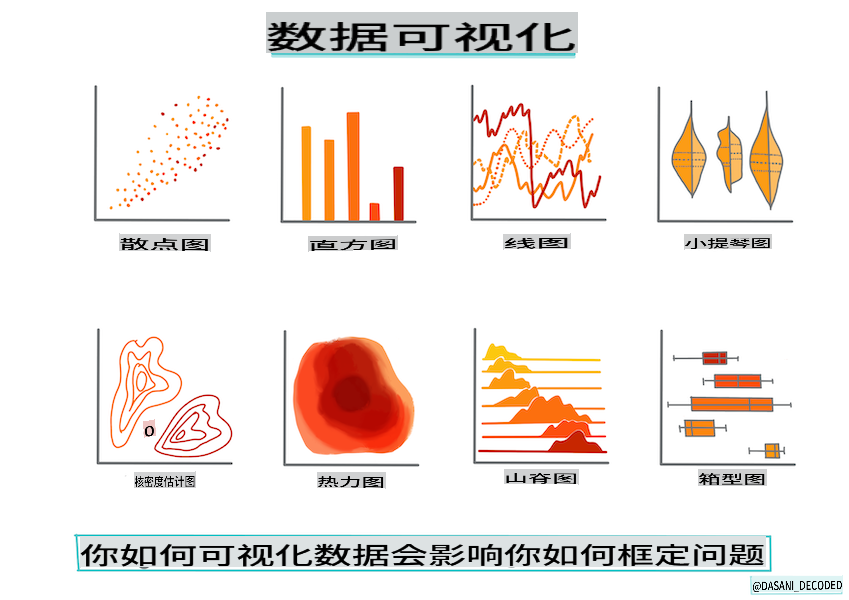

<!--
CO_OP_TRANSLATOR_METADATA:
{
  "original_hash": "a683e1fe430bb0d4a10b68f6ca15e0a6",
  "translation_date": "2025-09-03T16:43:17+00:00",
  "source_file": "2-Regression/2-Data/README.md",
  "language_code": "zh"
}
-->
# 使用 Scikit-learn 构建回归模型：准备和可视化数据



信息图作者：[Dasani Madipalli](https://twitter.com/dasani_decoded)

## [课前测验](https://gray-sand-07a10f403.1.azurestaticapps.net/quiz/11/)

> ### [本课程也提供 R 版本！](../../../../2-Regression/2-Data/solution/R/lesson_2.html)

## 介绍

现在你已经准备好使用 Scikit-learn 开始构建机器学习模型，是时候开始向你的数据提出问题了。在处理数据并应用机器学习解决方案时，了解如何提出正确的问题以充分挖掘数据的潜力非常重要。

在本课中，你将学习：

- 如何为模型构建准备数据。
- 如何使用 Matplotlib 进行数据可视化。

## 向数据提出正确的问题

你需要回答的问题将决定你使用哪种类型的机器学习算法。而你得到答案的质量将很大程度上取决于数据的性质。

看看为本课提供的[数据](https://github.com/microsoft/ML-For-Beginners/blob/main/2-Regression/data/US-pumpkins.csv)。你可以在 VS Code 中打开这个 .csv 文件。快速浏览会发现其中有空白值，还有字符串和数字数据的混合。此外，还有一个名为“Package”的奇怪列，其中的数据是“sacks”、“bins”等值的混合。事实上，这些数据有点混乱。

[](https://youtu.be/5qGjczWTrDQ "机器学习初学者 - 如何分析和清理数据集")

> 🎥 点击上方图片观看关于准备本课数据的短视频。

事实上，很少会直接获得一个完全准备好用于创建机器学习模型的数据集。在本课中，你将学习如何使用标准 Python 库准备原始数据集。你还将学习各种数据可视化技术。

## 案例研究：“南瓜市场”

在本文件夹中，你会发现根目录 `data` 文件夹中有一个名为 [US-pumpkins.csv](https://github.com/microsoft/ML-For-Beginners/blob/main/2-Regression/data/US-pumpkins.csv) 的 .csv 文件，其中包含关于南瓜市场的 1757 行数据，按城市分组。这是从美国农业部发布的[特种作物终端市场标准报告](https://www.marketnews.usda.gov/mnp/fv-report-config-step1?type=termPrice)中提取的原始数据。

### 准备数据

这些数据属于公共领域。可以从 USDA 网站下载多个单独的文件，每个城市一个。为了避免过多的单独文件，我们将所有城市的数据合并到一个电子表格中，因此我们已经对数据进行了部分_准备_。接下来，让我们仔细看看这些数据。

### 南瓜数据 - 初步结论

你对这些数据有什么发现？你可能已经注意到其中有字符串、数字、空白值和一些需要理解的奇怪值。

使用回归技术，你可以向这些数据提出什么问题？比如“预测某个月份出售南瓜的价格”。再次查看数据，你需要进行一些更改以创建适合任务的数据结构。

## 练习 - 分析南瓜数据

让我们使用 [Pandas](https://pandas.pydata.org/)（名称代表 `Python Data Analysis`），一个非常有用的数据处理工具，来分析和准备这些南瓜数据。

### 首先，检查缺失日期

你需要采取以下步骤检查是否有缺失日期：

1. 将日期转换为月份格式（这些是美国日期，格式为 `MM/DD/YYYY`）。
2. 提取月份到一个新列。

在 Visual Studio Code 中打开 _notebook.ipynb_ 文件，并将电子表格导入到一个新的 Pandas 数据框中。

1. 使用 `head()` 函数查看前五行。

    ```python
    import pandas as pd
    pumpkins = pd.read_csv('../data/US-pumpkins.csv')
    pumpkins.head()
    ```

    ✅ 你会使用什么函数来查看最后五行？

1. 检查当前数据框中是否有缺失数据：

    ```python
    pumpkins.isnull().sum()
    ```

    数据中确实有缺失值，但可能对当前任务没有影响。

1. 为了让数据框更易于处理，使用 `loc` 函数选择你需要的列。`loc` 函数从原始数据框中提取一组行（作为第一个参数传递）和列（作为第二个参数传递）。下面的表达式 `:` 表示“所有行”。

    ```python
    columns_to_select = ['Package', 'Low Price', 'High Price', 'Date']
    pumpkins = pumpkins.loc[:, columns_to_select]
    ```

### 其次，确定南瓜的平均价格

思考如何确定某个月份南瓜的平均价格。为此任务你会选择哪些列？提示：你需要 3 列。

解决方案：取 `Low Price` 和 `High Price` 列的平均值来填充新的 Price 列，并将 Date 列转换为仅显示月份。幸运的是，根据上面的检查，日期和价格没有缺失数据。

1. 要计算平均值，添加以下代码：

    ```python
    price = (pumpkins['Low Price'] + pumpkins['High Price']) / 2

    month = pd.DatetimeIndex(pumpkins['Date']).month

    ```

   ✅ 随时使用 `print(month)` 打印任何数据以进行检查。

2. 现在，将转换后的数据复制到一个新的 Pandas 数据框中：

    ```python
    new_pumpkins = pd.DataFrame({'Month': month, 'Package': pumpkins['Package'], 'Low Price': pumpkins['Low Price'],'High Price': pumpkins['High Price'], 'Price': price})
    ```

    打印出你的数据框将显示一个干净整洁的数据集，你可以基于此构建新的回归模型。

### 等等！这里有些奇怪的地方

如果你查看 `Package` 列，南瓜以多种不同的配置出售。有些以“1 1/9 bushel”计量，有些以“1/2 bushel”计量，有些按南瓜个数出售，有些按磅出售，还有些以不同宽度的大箱子出售。

> 南瓜似乎很难一致地称重

深入研究原始数据，发现 `Unit of Sale` 等于“EACH”或“PER BIN”的数据，其 `Package` 类型也为每英寸、每箱或“每个”。南瓜似乎很难一致地称重，因此我们通过选择 `Package` 列中包含字符串“bushel”的南瓜来进行过滤。

1. 在文件顶部的初始 .csv 导入下添加过滤器：

    ```python
    pumpkins = pumpkins[pumpkins['Package'].str.contains('bushel', case=True, regex=True)]
    ```

    如果现在打印数据，你会发现只剩下约 415 行按 bushel 销售的南瓜数据。

### 等等！还有一件事需要做

你是否注意到每行的 bushel 数量不同？你需要标准化定价，以显示每 bushel 的价格，因此需要进行一些数学运算来统一标准。

1. 在创建 new_pumpkins 数据框的代码块后添加以下代码：

    ```python
    new_pumpkins.loc[new_pumpkins['Package'].str.contains('1 1/9'), 'Price'] = price/(1 + 1/9)

    new_pumpkins.loc[new_pumpkins['Package'].str.contains('1/2'), 'Price'] = price/(1/2)
    ```

✅ 根据 [The Spruce Eats](https://www.thespruceeats.com/how-much-is-a-bushel-1389308)，bushel 的重量取决于农产品的类型，因为它是一个体积测量单位。“例如，一 bushel 的番茄应该重 56 磅……叶子和绿叶占据更多空间但重量更轻，因此一 bushel 的菠菜只有 20 磅。”这非常复杂！我们不需要进行 bushel 到磅的转换，而是按 bushel 定价。然而，这些关于南瓜 bushel 的研究表明，了解数据的性质是多么重要！

现在，你可以根据 bushel 测量分析每单位的定价。如果你再打印一次数据，你会看到它已经标准化。

✅ 你是否注意到按半 bushel 销售的南瓜非常昂贵？你能找出原因吗？提示：小南瓜比大南瓜贵得多，可能是因为每 bushel 中小南瓜的数量更多，而大南瓜的空心部分占据了更多空间。

## 可视化策略

数据科学家的部分职责是展示他们正在处理的数据的质量和性质。为此，他们通常会创建有趣的可视化，例如图表、散点图和柱状图，以展示数据的不同方面。通过这种方式，他们能够直观地展示数据中难以发现的关系和差距。

[](https://youtu.be/SbUkxH6IJo0 "机器学习初学者 - 如何使用 Matplotlib 可视化数据")

> 🎥 点击上方图片观看关于本课数据可视化的短视频。

可视化还可以帮助确定最适合数据的机器学习技术。例如，一个看起来沿着一条线分布的散点图表明数据非常适合线性回归练习。

一个在 Jupyter 笔记本中效果很好的数据可视化库是 [Matplotlib](https://matplotlib.org/)（你在上一课中也见过）。

> 在[这些教程](https://docs.microsoft.com/learn/modules/explore-analyze-data-with-python?WT.mc_id=academic-77952-leestott)中获得更多数据可视化经验。

## 练习 - 试验 Matplotlib

尝试创建一些基本图表来显示你刚刚创建的新数据框。一个基本的折线图会显示什么？

1. 在文件顶部的 Pandas 导入下导入 Matplotlib：

    ```python
    import matplotlib.pyplot as plt
    ```

1. 重新运行整个笔记本以刷新。
1. 在笔记本底部添加一个单元格，将数据绘制为一个框图：

    ```python
    price = new_pumpkins.Price
    month = new_pumpkins.Month
    plt.scatter(price, month)
    plt.show()
    ```

    

    这是一个有用的图表吗？它是否让你感到惊讶？

    它并不是特别有用，因为它只是显示了某个月份的数据点分布。

### 让它更有用

为了让图表显示有用的数据，你通常需要以某种方式对数据进行分组。让我们尝试创建一个图表，其中 y 轴显示月份，数据展示数据的分布。

1. 添加一个单元格以创建分组柱状图：

    ```python
    new_pumpkins.groupby(['Month'])['Price'].mean().plot(kind='bar')
    plt.ylabel("Pumpkin Price")
    ```

    

    这是一个更有用的数据可视化！它似乎表明南瓜的最高价格出现在九月和十月。这是否符合你的预期？为什么？

---

## 🚀挑战

探索 Matplotlib 提供的不同类型的可视化。哪些类型最适合回归问题？

## [课后测验](https://gray-sand-07a10f403.1.azurestaticapps.net/quiz/12/)

## 复习与自学

看看数据可视化的多种方式。列出各种可用的库，并记录哪些库最适合特定类型的任务，例如 2D 可视化与 3D 可视化。你发现了什么？

## 作业

[探索可视化](assignment.md)

---

**免责声明**：  
本文档使用AI翻译服务[Co-op Translator](https://github.com/Azure/co-op-translator)进行翻译。尽管我们努力确保翻译的准确性，但请注意，自动翻译可能包含错误或不准确之处。原始语言的文档应被视为权威来源。对于关键信息，建议使用专业人工翻译。我们不对因使用此翻译而产生的任何误解或误读承担责任。