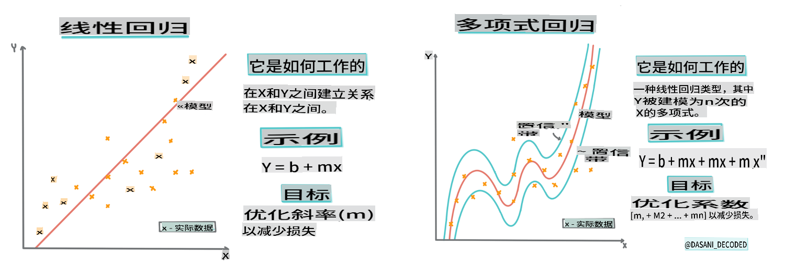
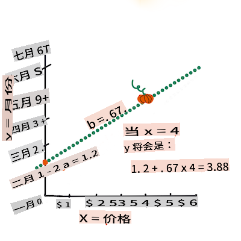

<!--
CO_OP_TRANSLATOR_METADATA:
{
  "original_hash": "2f88fbc741d792890ff2f1430fe0dae0",
  "translation_date": "2025-09-03T16:21:40+00:00",
  "source_file": "2-Regression/3-Linear/README.md",
  "language_code": "zh"
}
-->
# 使用 Scikit-learn 构建回归模型：四种回归方法


> 信息图由 [Dasani Madipalli](https://twitter.com/dasani_decoded) 提供
## [课前测验](https://gray-sand-07a10f403.1.azurestaticapps.net/quiz/13/)

> ### [本课程也提供 R 版本！](../../../../2-Regression/3-Linear/solution/R/lesson_3.html)
### 介绍

到目前为止，您已经通过南瓜定价数据集了解了回归的基本概念，并使用 Matplotlib 对其进行了可视化。

现在，您准备深入学习机器学习中的回归。虽然可视化可以帮助您理解数据，但机器学习的真正力量在于_训练模型_。模型通过历史数据进行训练，自动捕捉数据之间的依赖关系，并能够预测模型未见过的新数据的结果。

在本课程中，您将学习两种回归类型：_基本线性回归_和_多项式回归_，以及这些技术背后的部分数学原理。这些模型将帮助我们根据不同的输入数据预测南瓜价格。

[](https://youtu.be/CRxFT8oTDMg "机器学习初学者 - 理解线性回归")

> 🎥 点击上方图片观看关于线性回归的简短视频概述。

> 在整个课程中，我们假设您对数学的了解有限，并努力使其对来自其他领域的学生更易理解，因此请注意笔记、🧮 数学提示、图表和其他学习工具，以帮助理解。

### 前置知识

到目前为止，您应该已经熟悉我们正在研究的南瓜数据的结构。您可以在本课程的_notebook.ipynb_文件中找到预加载和预清理的数据。在文件中，南瓜价格以蒲式耳为单位显示在一个新的数据框中。确保您可以在 Visual Studio Code 的内核中运行这些笔记本。

### 准备工作

提醒一下，您加载这些数据是为了提出问题：

- 什么时候是购买南瓜的最佳时机？
- 我可以预期一箱迷你南瓜的价格是多少？
- 我应该购买半蒲式耳篮子还是 1 1/9 蒲式耳箱？

让我们继续深入挖掘这些数据。

在上一课中，您创建了一个 Pandas 数据框，并用原始数据集的一部分填充它，将价格标准化为蒲式耳单位。然而，通过这样做，您只能收集到大约 400 个数据点，并且仅限于秋季月份。

查看本课程附带笔记本中预加载的数据。数据已预加载，并绘制了初始散点图以显示月份数据。也许通过进一步清理数据，我们可以获得更多细节。

## 线性回归线

正如您在第 1 课中所学，线性回归的目标是绘制一条线以：

- **显示变量关系**。展示变量之间的关系
- **进行预测**。准确预测新数据点相对于该线的位置

通常使用**最小二乘回归**来绘制这种类型的线。“最小二乘”意味着围绕回归线的所有数据点的误差平方后相加。理想情况下，这个最终的总和应该尽可能小，因为我们希望误差数量较少，即`最小二乘`。

我们这样做是因为我们希望建模一条与所有数据点的累计距离最小的线。我们还对误差项进行平方后再相加，因为我们关心的是误差的大小而不是方向。

> **🧮 数学展示**
> 
> 这条线，称为_最佳拟合线_，可以通过[一个公式](https://en.wikipedia.org/wiki/Simple_linear_regression)表示：
> 
> ```
> Y = a + bX
> ```
>
> `X` 是“解释变量”。`Y` 是“因变量”。线的斜率是 `b`，而 `a` 是 y 截距，表示当 `X = 0` 时 `Y` 的值。
>
>
>
> 首先，计算斜率 `b`。信息图由 [Jen Looper](https://twitter.com/jenlooper) 提供
>
> 换句话说，参考我们南瓜数据的原始问题：“根据月份预测每蒲式耳南瓜的价格”，`X` 表示价格，`Y` 表示销售月份。
>
>
>
> 计算 `Y` 的值。如果您支付大约 $4，那可能是四月！信息图由 [Jen Looper](https://twitter.com/jenlooper) 提供
>
> 计算线的数学公式必须展示线的斜率，这也取决于截距，即当 `X = 0` 时 `Y` 的位置。
>
> 您可以在 [Math is Fun](https://www.mathsisfun.com/data/least-squares-regression.html) 网站上观察这些值的计算方法。还可以访问[最小二乘计算器](https://www.mathsisfun.com/data/least-squares-calculator.html)，观察数值如何影响线的形状。

## 相关性

另一个需要理解的术语是给定 X 和 Y 变量之间的**相关系数**。使用散点图，您可以快速可视化该系数。数据点整齐排列成一条线的图具有高相关性，而数据点在 X 和 Y 之间随意分布的图具有低相关性。

一个好的线性回归模型应该是使用最小二乘回归方法和回归线具有高相关系数（接近 1 而非 0）的模型。

✅ 运行本课程附带的笔记本，查看月份与价格的散点图。根据您的视觉解释，南瓜销售的月份与价格之间的数据相关性是高还是低？如果您使用更精细的度量而不是`月份`，例如*一年中的天数*（即从年初开始的天数），相关性是否会发生变化？

在下面的代码中，我们假设已经清理了数据，并获得了一个名为 `new_pumpkins` 的数据框，类似于以下内容：

ID | Month | DayOfYear | Variety | City | Package | Low Price | High Price | Price
---|-------|-----------|---------|------|---------|-----------|------------|-------
70 | 9 | 267 | PIE TYPE | BALTIMORE | 1 1/9 bushel cartons | 15.0 | 15.0 | 13.636364
71 | 9 | 267 | PIE TYPE | BALTIMORE | 1 1/9 bushel cartons | 18.0 | 18.0 | 16.363636
72 | 10 | 274 | PIE TYPE | BALTIMORE | 1 1/9 bushel cartons | 18.0 | 18.0 | 16.363636
73 | 10 | 274 | PIE TYPE | BALTIMORE | 1 1/9 bushel cartons | 17.0 | 17.0 | 15.454545
74 | 10 | 281 | PIE TYPE | BALTIMORE | 1 1/9 bushel cartons | 15.0 | 15.0 | 13.636364

> 清理数据的代码可在[`notebook.ipynb`](notebook.ipynb)中找到。我们执行了与上一课相同的清理步骤，并使用以下表达式计算了`DayOfYear`列：

```python
day_of_year = pd.to_datetime(pumpkins['Date']).apply(lambda dt: (dt-datetime(dt.year,1,1)).days)
```

现在您已经了解了线性回归背后的数学原理，让我们创建一个回归模型，看看是否可以预测哪种南瓜包装的价格最优。为节日南瓜园购买南瓜的人可能需要这些信息来优化南瓜包装的购买。

## 寻找相关性

[](https://youtu.be/uoRq-lW2eQo "机器学习初学者 - 寻找相关性：线性回归的关键")

> 🎥 点击上方图片观看关于相关性的简短视频概述。

从上一课中，您可能已经看到不同月份的平均价格如下所示：


这表明可能存在某种相关性，我们可以尝试训练线性回归模型来预测`月份`与`价格`之间的关系，或者`一年中的天数`与`价格`之间的关系。以下是显示后者关系的散点图：

 

让我们使用`corr`函数查看是否存在相关性：

```python
print(new_pumpkins['Month'].corr(new_pumpkins['Price']))
print(new_pumpkins['DayOfYear'].corr(new_pumpkins['Price']))
```

看起来相关性很小，`月份`为 -0.15，`一年中的天数`为 -0.17，但可能存在另一个重要关系。看起来不同的南瓜品种对应不同的价格簇。为了验证这一假设，让我们为每个南瓜类别绘制不同的颜色。通过向`scatter`绘图函数传递`ax`参数，我们可以将所有点绘制在同一个图上：

```python
ax=None
colors = ['red','blue','green','yellow']
for i,var in enumerate(new_pumpkins['Variety'].unique()):
    df = new_pumpkins[new_pumpkins['Variety']==var]
    ax = df.plot.scatter('DayOfYear','Price',ax=ax,c=colors[i],label=var)
```

 

我们的调查表明，品种对整体价格的影响比实际销售日期更大。我们可以通过柱状图看到这一点：

```python
new_pumpkins.groupby('Variety')['Price'].mean().plot(kind='bar')
```

 

让我们暂时专注于一种南瓜品种“馅饼型”，看看日期对价格的影响：

```python
pie_pumpkins = new_pumpkins[new_pumpkins['Variety']=='PIE TYPE']
pie_pumpkins.plot.scatter('DayOfYear','Price') 
```
 

如果我们现在使用`corr`函数计算`价格`与`一年中的天数`之间的相关性，我们会得到类似`-0.27`的结果——这意味着训练预测模型是有意义的。

> 在训练线性回归模型之前，确保数据清理是很重要的。线性回归对缺失值的处理效果不佳，因此清除所有空单元格是有意义的：

```python
pie_pumpkins.dropna(inplace=True)
pie_pumpkins.info()
```

另一种方法是用对应列的平均值填充这些空值。

## 简单线性回归

[](https://youtu.be/e4c_UP2fSjg "机器学习初学者 - 使用 Scikit-learn 进行线性和多项式回归")

> 🎥 点击上方图片观看关于线性和多项式回归的简短视频概述。

为了训练我们的线性回归模型，我们将使用 **Scikit-learn** 库。

```python
from sklearn.linear_model import LinearRegression
from sklearn.metrics import mean_squared_error
from sklearn.model_selection import train_test_split
```

我们首先将输入值（特征）和预期输出（标签）分离到单独的 numpy 数组中：

```python
X = pie_pumpkins['DayOfYear'].to_numpy().reshape(-1,1)
y = pie_pumpkins['Price']
```

> 请注意，我们必须对输入数据执行`reshape`操作，以便线性回归包能够正确理解它。线性回归需要一个二维数组作为输入，其中数组的每一行对应于输入特征的向量。在我们的例子中，由于我们只有一个输入——我们需要一个形状为 N×1 的数组，其中 N 是数据集的大小。

然后，我们需要将数据分为训练集和测试集，以便在训练后验证我们的模型：

```python
X_train, X_test, y_train, y_test = train_test_split(X, y, test_size=0.2, random_state=0)
```

最后，训练实际的线性回归模型只需要两行代码。我们定义`LinearRegression`对象，并使用`fit`方法将其拟合到我们的数据：

```python
lin_reg = LinearRegression()
lin_reg.fit(X_train,y_train)
```

`LinearRegression`对象在`fit`之后包含所有回归系数，可以通过`.coef_`属性访问。在我们的例子中，只有一个系数，应该大约是`-0.017`。这意味着价格似乎随着时间略有下降，但幅度不大，大约每天下降 2 美分。我们还可以通过`lin_reg.intercept_`访问回归线与 Y 轴的交点——在我们的例子中，它大约是`21`，表示年初的价格。

为了查看我们的模型有多准确，我们可以预测测试数据集上的价格，然后测量预测值与预期值的接近程度。这可以通过均方误差（MSE）指标来完成，它是所有预测值与预期值之间平方差的平均值。

```python
pred = lin_reg.predict(X_test)

mse = np.sqrt(mean_squared_error(y_test,pred))
print(f'Mean error: {mse:3.3} ({mse/np.mean(pred)*100:3.3}%)')
```
我们的错误似乎集中在两个点上，大约是 17%。表现不太理想。另一个衡量模型质量的指标是 **决定系数**，可以通过以下方式获得：

```python
score = lin_reg.score(X_train,y_train)
print('Model determination: ', score)
```  
如果值为 0，意味着模型没有考虑输入数据，表现为*最差的线性预测器*，即结果的平均值。值为 1 表示我们可以完美预测所有预期输出。在我们的案例中，决定系数约为 0.06，较低。

我们还可以将测试数据与回归线一起绘制，以更好地观察回归在我们案例中的表现：

```python
plt.scatter(X_test,y_test)
plt.plot(X_test,pred)
```  


## 多项式回归

线性回归的另一种形式是多项式回归。有时变量之间存在线性关系——例如南瓜的体积越大，价格越高——但有时这些关系无法用平面或直线来表示。

✅ 这里有一些[更多示例](https://online.stat.psu.edu/stat501/lesson/9/9.8)，展示了可以使用多项式回归的数据。

再看看日期和价格之间的关系。这个散点图看起来是否一定要用直线来分析？价格难道不会波动吗？在这种情况下，你可以尝试使用多项式回归。

✅ 多项式是可能包含一个或多个变量和系数的数学表达式。

多项式回归会创建一条曲线，以更好地拟合非线性数据。在我们的案例中，如果将平方的 `DayOfYear` 变量包含到输入数据中，我们应该能够用抛物线拟合数据，该抛物线在一年中的某个点会有一个最低值。

Scikit-learn 提供了一个非常有用的 [pipeline API](https://scikit-learn.org/stable/modules/generated/sklearn.pipeline.make_pipeline.html?highlight=pipeline#sklearn.pipeline.make_pipeline)，可以将数据处理的不同步骤组合在一起。**管道**是**估计器**的链条。在我们的案例中，我们将创建一个管道，首先向模型添加多项式特征，然后训练回归：

```python
from sklearn.preprocessing import PolynomialFeatures
from sklearn.pipeline import make_pipeline

pipeline = make_pipeline(PolynomialFeatures(2), LinearRegression())

pipeline.fit(X_train,y_train)
```  

使用 `PolynomialFeatures(2)` 意味着我们将包含输入数据中的所有二次多项式。在我们的案例中，这仅意味着 `DayOfYear`<sup>2</sup>，但如果有两个输入变量 X 和 Y，这将添加 X<sup>2</sup>、XY 和 Y<sup>2</sup>。如果需要，我们也可以使用更高次的多项式。

管道可以像原始的 `LinearRegression` 对象一样使用，例如我们可以 `fit` 管道，然后使用 `predict` 获取预测结果。以下是显示测试数据和拟合曲线的图表：


使用多项式回归，我们可以获得稍低的均方误差（MSE）和更高的决定系数，但提升并不显著。我们需要考虑其他特征！

> 你可以看到南瓜价格最低点大约出现在万圣节附近。你如何解释这一现象？

🎃 恭喜你！你刚刚创建了一个可以帮助预测派南瓜价格的模型。你可能可以对所有南瓜类型重复相同的过程，但这会很繁琐。现在让我们学习如何在模型中考虑南瓜品种！

## 分类特征

在理想情况下，我们希望能够使用同一个模型预测不同南瓜品种的价格。然而，`Variety` 列与 `Month` 等列有所不同，因为它包含非数值值。这类列被称为**分类特征**。

[](https://youtu.be/DYGliioIAE0 "机器学习初学者 - 使用线性回归预测分类特征")

> 🎥 点击上方图片观看关于使用分类特征的简短视频概述。

以下是品种与平均价格的关系：


为了考虑品种，我们首先需要将其转换为数值形式，或者**编码**。有几种方法可以实现：

* 简单的**数值编码**会构建一个不同品种的表，然后用表中的索引替换品种名称。这对线性回归来说不是最好的选择，因为线性回归会将索引的实际数值考虑在内，并通过某个系数将其加入结果。在我们的案例中，索引号与价格之间的关系显然是非线性的，即使我们确保索引按某种特定方式排序。
* **独热编码**会用 4 个不同的列替换 `Variety` 列，每个品种对应一个列。如果某行属于某个品种，该列值为 `1`，否则为 `0`。这意味着线性回归中会有四个系数，每个南瓜品种对应一个，负责该品种的“起始价格”（或“附加价格”）。

以下代码展示了如何对品种进行独热编码：

```python
pd.get_dummies(new_pumpkins['Variety'])
```  

 ID | FAIRYTALE | MINIATURE | MIXED HEIRLOOM VARIETIES | PIE TYPE  
----|-----------|-----------|--------------------------|----------  
70 | 0 | 0 | 0 | 1  
71 | 0 | 0 | 0 | 1  
... | ... | ... | ... | ...  
1738 | 0 | 1 | 0 | 0  
1739 | 0 | 1 | 0 | 0  
1740 | 0 | 1 | 0 | 0  
1741 | 0 | 1 | 0 | 0  
1742 | 0 | 1 | 0 | 0  

为了使用独热编码的品种作为输入训练线性回归，我们只需正确初始化 `X` 和 `y` 数据：

```python
X = pd.get_dummies(new_pumpkins['Variety'])
y = new_pumpkins['Price']
```  

其余代码与我们之前用于训练线性回归的代码相同。如果你尝试，你会发现均方误差大致相同，但决定系数显著提高（约 77%）。为了获得更准确的预测，我们可以考虑更多分类特征，以及数值特征，例如 `Month` 或 `DayOfYear`。为了获得一个大的特征数组，我们可以使用 `join`：

```python
X = pd.get_dummies(new_pumpkins['Variety']) \
        .join(new_pumpkins['Month']) \
        .join(pd.get_dummies(new_pumpkins['City'])) \
        .join(pd.get_dummies(new_pumpkins['Package']))
y = new_pumpkins['Price']
```  

这里我们还考虑了 `City` 和 `Package` 类型，这使得均方误差达到 2.84（10%），决定系数达到 0.94！

## 综合起来

为了构建最佳模型，我们可以将上述示例中的组合数据（独热编码分类特征 + 数值特征）与多项式回归一起使用。以下是完整代码供参考：

```python
# set up training data
X = pd.get_dummies(new_pumpkins['Variety']) \
        .join(new_pumpkins['Month']) \
        .join(pd.get_dummies(new_pumpkins['City'])) \
        .join(pd.get_dummies(new_pumpkins['Package']))
y = new_pumpkins['Price']

# make train-test split
X_train, X_test, y_train, y_test = train_test_split(X, y, test_size=0.2, random_state=0)

# setup and train the pipeline
pipeline = make_pipeline(PolynomialFeatures(2), LinearRegression())
pipeline.fit(X_train,y_train)

# predict results for test data
pred = pipeline.predict(X_test)

# calculate MSE and determination
mse = np.sqrt(mean_squared_error(y_test,pred))
print(f'Mean error: {mse:3.3} ({mse/np.mean(pred)*100:3.3}%)')

score = pipeline.score(X_train,y_train)
print('Model determination: ', score)
```  

这应该能让我们获得接近 97% 的最佳决定系数，以及 MSE=2.23（约 8% 的预测误差）。

| 模型 | MSE | 决定系数 |  
|------|-----|----------|  
| `DayOfYear` 线性 | 2.77 (17.2%) | 0.07 |  
| `DayOfYear` 多项式 | 2.73 (17.0%) | 0.08 |  
| `Variety` 线性 | 5.24 (19.7%) | 0.77 |  
| 所有特征线性 | 2.84 (10.5%) | 0.94 |  
| 所有特征多项式 | 2.23 (8.25%) | 0.97 |  

🏆 做得好！你在一节课中创建了四个回归模型，并将模型质量提升至 97%。在回归的最后一部分中，你将学习如何使用逻辑回归来确定类别。

---

## 🚀挑战

在此笔记本中测试几个不同的变量，看看相关性如何对应于模型准确性。

## [课后测验](https://gray-sand-07a10f403.1.azurestaticapps.net/quiz/14/)

## 复习与自学

在本课中我们学习了线性回归。还有其他重要的回归类型。阅读关于逐步回归、岭回归、套索回归和弹性网络技术的内容。一个不错的学习课程是 [斯坦福统计学习课程](https://online.stanford.edu/courses/sohs-ystatslearning-statistical-learning)。

## 作业

[构建一个模型](assignment.md)

---

**免责声明**：  
本文档使用AI翻译服务 [Co-op Translator](https://github.com/Azure/co-op-translator) 进行翻译。尽管我们努力确保翻译的准确性，但请注意，自动翻译可能包含错误或不准确之处。应以原始语言的文档作为权威来源。对于重要信息，建议使用专业人工翻译。我们不对因使用此翻译而产生的任何误解或误读承担责任。