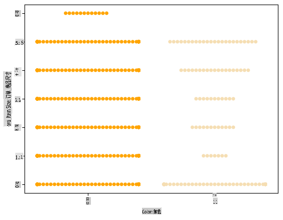

<!--
CO_OP_TRANSLATOR_METADATA:
{
  "original_hash": "72b5bae0879baddf6aafc82bb07b8776",
  "translation_date": "2025-09-03T16:30:26+00:00",
  "source_file": "2-Regression/4-Logistic/README.md",
  "language_code": "zh"
}
-->
# 使用逻辑回归预测类别


## [课前测验](https://gray-sand-07a10f403.1.azurestaticapps.net/quiz/15/)

> ### [本课程也提供 R 版本！](../../../../2-Regression/4-Logistic/solution/R/lesson_4.html)

## 简介

在本课程中，我们将学习逻辑回归，这是经典机器学习技术之一。你可以使用这种技术发现模式以预测二元类别。例如，这颗糖果是巧克力还是不是巧克力？这种疾病是否具有传染性？这个顾客是否会选择这个产品？

在本课程中，你将学习：

- 一个新的数据可视化库
- 逻辑回归的技术

✅ 在这个 [学习模块](https://docs.microsoft.com/learn/modules/train-evaluate-classification-models?WT.mc_id=academic-77952-leestott) 中深入了解这种回归类型的工作原理。

## 前置知识

在之前的课程中，我们已经熟悉了南瓜数据，并意识到其中有一个可以使用的二元类别：`Color`。

让我们构建一个逻辑回归模型来预测给定一些变量时，_某个南瓜可能的颜色_（橙色 🎃 或白色 👻）。

> 为什么我们在回归课程中讨论二元分类？仅仅是为了语言上的方便，因为逻辑回归实际上是[一种分类方法](https://scikit-learn.org/stable/modules/linear_model.html#logistic-regression)，尽管它是基于线性的。在下一组课程中，你将学习其他分类数据的方法。

## 定义问题

对于我们的目的，我们将问题表达为二元类别：“白色”或“非白色”。数据集中还有一个“条纹”类别，但实例很少，因此我们不会使用它。实际上，在移除数据集中的空值后，它也会消失。

> 🎃 有趣的事实，我们有时称白色南瓜为“幽灵”南瓜。它们不太容易雕刻，因此不像橙色南瓜那么受欢迎，但它们看起来很酷！所以我们也可以将问题重新表述为：“幽灵”或“非幽灵”。👻

## 关于逻辑回归

逻辑回归与之前学习的线性回归有几个重要的不同点。

[](https://youtu.be/KpeCT6nEpBY "机器学习初学者 - 理解逻辑回归用于分类")

> 🎥 点击上方图片观看关于逻辑回归的简短视频概述。

### 二元分类

逻辑回归无法提供线性回归的功能。前者预测二元类别（“白色或非白色”），而后者可以预测连续值，例如根据南瓜的产地和收获时间，_价格将上涨多少_。


> 信息图由 [Dasani Madipalli](https://twitter.com/dasani_decoded) 提供

### 其他分类

逻辑回归还有其他类型，包括多项式和有序分类：

- **多项式分类**：涉及多个类别，例如“橙色、白色和条纹”。
- **有序分类**：涉及有序类别，适用于逻辑排序的结果，例如按有限大小排序的南瓜（迷你、小、中、大、特大、超大）。


### 变量不需要相关

还记得线性回归在变量相关性较强时效果更好吗？逻辑回归正好相反——变量不需要相关。这适用于数据中相关性较弱的情况。

### 需要大量干净数据

逻辑回归在使用更多数据时会提供更准确的结果；我们的数据集较小，因此并不理想。

[](https://youtu.be/B2X4H9vcXTs "机器学习初学者 - 数据分析与准备用于逻辑回归")

> 🎥 点击上方图片观看关于准备线性回归数据的简短视频概述。

✅ 思考哪些类型的数据适合逻辑回归。

## 练习 - 整理数据

首先，清理数据，删除空值并选择部分列：

1. 添加以下代码：

    ```python
  
    columns_to_select = ['City Name','Package','Variety', 'Origin','Item Size', 'Color']
    pumpkins = full_pumpkins.loc[:, columns_to_select]

    pumpkins.dropna(inplace=True)
    ```

    你可以随时查看新的数据框：

    ```python
    pumpkins.info
    ```

### 可视化 - 分类图

现在你已经加载了 [起始笔记本](./notebook.ipynb)，再次使用南瓜数据并清理数据以保留包含一些变量（包括 `Color`）的数据集。让我们使用一个不同的库 [Seaborn](https://seaborn.pydata.org/index.html) 在笔记本中可视化数据。Seaborn 基于之前使用的 Matplotlib。

Seaborn 提供了一些很棒的方式来可视化数据。例如，你可以比较 `Variety` 和 `Color` 的数据分布。

1. 使用 `catplot` 函数创建这样的图，使用南瓜数据 `pumpkins`，并为每个南瓜类别（橙色或白色）指定颜色映射：

    ```python
    import seaborn as sns
    
    palette = {
    'ORANGE': 'orange',
    'WHITE': 'wheat',
    }

    sns.catplot(
    data=pumpkins, y="Variety", hue="Color", kind="count",
    palette=palette, 
    )
    ```

    

    通过观察数据，你可以看到 `Color` 数据与 `Variety` 的关系。

    ✅ 根据这个分类图，你能想到哪些有趣的探索？

### 数据预处理：特征和标签编码

我们的南瓜数据集的所有列都包含字符串值。处理分类数据对人类来说很直观，但对机器来说却不然。机器学习算法更适合处理数字数据。这就是为什么编码是数据预处理阶段非常重要的一步，因为它可以将分类数据转换为数值数据，而不会丢失任何信息。良好的编码有助于构建良好的模型。

对于特征编码，主要有两种编码器：

1. 有序编码器：适用于有序变量，即数据具有逻辑顺序的分类变量，例如数据集中的 `Item Size` 列。它创建一个映射，使每个类别由一个数字表示，该数字是列中类别的顺序。

    ```python
    from sklearn.preprocessing import OrdinalEncoder

    item_size_categories = [['sml', 'med', 'med-lge', 'lge', 'xlge', 'jbo', 'exjbo']]
    ordinal_features = ['Item Size']
    ordinal_encoder = OrdinalEncoder(categories=item_size_categories)
    ```

2. 分类编码器：适用于名义变量，即数据没有逻辑顺序的分类变量，例如数据集中除 `Item Size` 之外的所有特征。它是一种独热编码，这意味着每个类别由一个二进制列表示：如果南瓜属于该 `Variety`，则编码变量等于 1，否则为 0。

    ```python
    from sklearn.preprocessing import OneHotEncoder

    categorical_features = ['City Name', 'Package', 'Variety', 'Origin']
    categorical_encoder = OneHotEncoder(sparse_output=False)
    ```

然后，使用 `ColumnTransformer` 将多个编码器合并为一个步骤并应用于适当的列。

```python
    from sklearn.compose import ColumnTransformer
    
    ct = ColumnTransformer(transformers=[
        ('ord', ordinal_encoder, ordinal_features),
        ('cat', categorical_encoder, categorical_features)
        ])
    
    ct.set_output(transform='pandas')
    encoded_features = ct.fit_transform(pumpkins)
```

另一方面，为了编码标签，我们使用 scikit-learn 的 `LabelEncoder` 类，这是一个实用类，用于将标签标准化，使其仅包含 0 到 n_classes-1（这里是 0 和 1）之间的值。

```python
    from sklearn.preprocessing import LabelEncoder

    label_encoder = LabelEncoder()
    encoded_label = label_encoder.fit_transform(pumpkins['Color'])
```

一旦我们对特征和标签进行了编码，就可以将它们合并到一个新的数据框 `encoded_pumpkins` 中。

```python
    encoded_pumpkins = encoded_features.assign(Color=encoded_label)
```

✅ 使用有序编码器处理 `Item Size` 列有什么优势？

### 分析变量之间的关系

现在我们已经对数据进行了预处理，可以分析特征和标签之间的关系，以了解模型在给定特征时预测标签的能力。

分析这种关系的最佳方式是绘制数据。我们将再次使用 Seaborn 的 `catplot` 函数，以分类图的形式可视化 `Item Size`、`Variety` 和 `Color` 的关系。为了更好地绘制数据，我们将使用编码后的 `Item Size` 列和未编码的 `Variety` 列。

```python
    palette = {
    'ORANGE': 'orange',
    'WHITE': 'wheat',
    }
    pumpkins['Item Size'] = encoded_pumpkins['ord__Item Size']

    g = sns.catplot(
        data=pumpkins,
        x="Item Size", y="Color", row='Variety',
        kind="box", orient="h",
        sharex=False, margin_titles=True,
        height=1.8, aspect=4, palette=palette,
    )
    g.set(xlabel="Item Size", ylabel="").set(xlim=(0,6))
    g.set_titles(row_template="{row_name}")
```


### 使用 swarm 图

由于 `Color` 是一个二元类别（白色或非白色），它需要“[一种专门的可视化方法](https://seaborn.pydata.org/tutorial/categorical.html?highlight=bar)”。还有其他方法可以可视化此类别与其他变量的关系。

你可以使用 Seaborn 图并排可视化变量。

1. 尝试使用“swarm”图显示值的分布：

    ```python
    palette = {
    0: 'orange',
    1: 'wheat'
    }
    sns.swarmplot(x="Color", y="ord__Item Size", data=encoded_pumpkins, palette=palette)
    ```

    

**注意**：上述代码可能会生成警告，因为 Seaborn 无法在 swarm 图中表示如此多的数据点。一个可能的解决方案是通过使用 `size` 参数减小标记的大小。然而，请注意，这会影响图表的可读性。

> **🧮 数学原理**
>
> 逻辑回归依赖于“最大似然”的概念，使用 [Sigmoid 函数](https://wikipedia.org/wiki/Sigmoid_function)。在图表上，Sigmoid 函数呈现“S”形。它将一个值映射到 0 和 1 之间。其曲线也被称为“逻辑曲线”。公式如下：
>
> 
>
> 其中，Sigmoid 的中点位于 x 的 0 点，L 是曲线的最大值，k 是曲线的陡度。如果函数的结果大于 0.5，则该标签被归为二元选择的类别“1”。否则，它被归为类别“0”。

## 构建模型

在 Scikit-learn 中构建用于二元分类的模型非常简单。

[](https://youtu.be/MmZS2otPrQ8 "机器学习初学者 - 使用逻辑回归进行数据分类")

> 🎥 点击上方图片观看关于构建线性回归模型的简短视频概述。

1. 选择你想在分类模型中使用的变量，并调用 `train_test_split()` 分割训练集和测试集：

    ```python
    from sklearn.model_selection import train_test_split
    
    X = encoded_pumpkins[encoded_pumpkins.columns.difference(['Color'])]
    y = encoded_pumpkins['Color']

    X_train, X_test, y_train, y_test = train_test_split(X, y, test_size=0.2, random_state=0)
    
    ```

2. 现在你可以通过调用 `fit()` 使用训练数据训练模型，并打印结果：

    ```python
    from sklearn.metrics import f1_score, classification_report 
    from sklearn.linear_model import LogisticRegression

    model = LogisticRegression()
    model.fit(X_train, y_train)
    predictions = model.predict(X_test)

    print(classification_report(y_test, predictions))
    print('Predicted labels: ', predictions)
    print('F1-score: ', f1_score(y_test, predictions))
    ```

    查看模型的评分。考虑到数据只有大约 1000 行，结果还不错：

    ```output
                       precision    recall  f1-score   support
    
                    0       0.94      0.98      0.96       166
                    1       0.85      0.67      0.75        33
    
        accuracy                                0.92       199
        macro avg           0.89      0.82      0.85       199
        weighted avg        0.92      0.92      0.92       199
    
        Predicted labels:  [0 0 0 0 0 0 0 0 0 0 0 0 0 0 0 0 0 0 0 0 1 0 0 1 0 0 0 0 0 0 0 0 1 0 0 0 0
        0 0 0 0 0 1 0 1 0 0 1 0 0 0 0 0 1 0 1 0 1 0 1 0 0 0 0 0 0 0 0 0 0 0 0 0 0
        1 0 0 0 0 0 0 0 1 0 0 0 0 0 0 0 1 0 0 0 0 0 0 0 0 1 0 1 0 0 0 0 0 0 0 1 0
        0 0 0 0 0 0 0 0 0 0 0 0 0 0 0 0 0 0 0 0 0 1 0 0 0 0 0 0 0 0 1 0 0 0 1 1 0
        0 0 0 0 1 0 0 0 0 0 1 0 0 0 0 0 0 0 0 0 0 0 0 0 0 0 0 0 0 0 0 0 0 0 0 0 1
        0 0 0 1 0 0 0 0 0 0 0 0 1 1]
        F1-score:  0.7457627118644068
    ```

## 使用混淆矩阵更好地理解模型

虽然你可以通过打印上述项获得评分报告[术语](https://scikit-learn.org/stable/modules/generated/sklearn.metrics.classification_report.html?highlight=classification_report#sklearn.metrics.classification_report)，但使用[混淆矩阵](https://scikit-learn.org/stable/modules/model_evaluation.html#confusion-matrix)可能更容易理解模型的表现。

> 🎓 “[混淆矩阵](https://wikipedia.org/wiki/Confusion_matrix)”（或“误差矩阵”）是一个表格，用于表达模型的真实与预测的正负情况，从而评估预测的准确性。

1. 要使用混淆矩阵，调用 `confusion_matrix()`：

    ```python
    from sklearn.metrics import confusion_matrix
    confusion_matrix(y_test, predictions)
    ```

    查看模型的混淆矩阵：

    ```output
    array([[162,   4],
           [ 11,  22]])
    ```

在 Scikit-learn 中，混淆矩阵的行（轴 0）是实际标签，列（轴 1）是预测标签。

|       |   0   |   1   |
| :---: | :---: | :---: |
|   0   |  TN   |  FP   |
|   1   |  FN   |  TP   |

这里发生了什么？假设我们的模型需要将南瓜分类为两个二元类别：“白色”和“非白色”。

- 如果模型预测南瓜为非白色，而实际上属于“非白色”类别，我们称之为真负例，显示在左上角。
- 如果模型预测南瓜为白色，而实际上属于“非白色”类别，我们称之为假负例，显示在左下角。
- 如果模型预测南瓜为非白色，而实际上属于“白色”类别，我们称之为假正例，显示在右上角。
- 如果模型预测南瓜为白色，而实际上属于“白色”类别，我们称之为真正例，显示在右下角。

正如你可能猜到的，较多的真正例和真负例以及较少的假正例和假负例表明模型表现更好。
混淆矩阵如何与精确率和召回率相关？记住，上面打印的分类报告显示了精确率（0.85）和召回率（0.67）。

精确率 = tp / (tp + fp) = 22 / (22 + 4) = 0.8461538461538461

召回率 = tp / (tp + fn) = 22 / (22 + 11) = 0.6666666666666666

✅ 问：根据混淆矩阵，模型表现如何？  
答：还不错；有相当数量的真负样本，但也有一些假负样本。

让我们通过混淆矩阵中 TP/TN 和 FP/FN 的映射，重新审视之前看到的术语：

🎓 精确率：TP/(TP + FP)  
检索到的实例中相关实例的比例（例如，哪些标签被正确标注）。

🎓 召回率：TP/(TP + FN)  
检索到的相关实例的比例，无论是否被正确标注。

🎓 f1-分数：(2 * 精确率 * 召回率)/(精确率 + 召回率)  
精确率和召回率的加权平均值，最佳为 1，最差为 0。

🎓 支持：检索到的每个标签的出现次数。

🎓 准确率：(TP + TN)/(TP + TN + FP + FN)  
样本中预测正确的标签所占的百分比。

🎓 宏平均：对每个标签的度量进行无权重平均计算，不考虑标签的不平衡。

🎓 加权平均：对每个标签的度量进行平均计算，考虑标签的不平衡，通过支持（每个标签的真实实例数量）进行加权。

✅ 你能想到如果想减少假负样本，应该关注哪个指标吗？

## 可视化该模型的 ROC 曲线

[](https://youtu.be/GApO575jTA0 "机器学习入门 - 使用 ROC 曲线分析逻辑回归性能")

> 🎥 点击上方图片观看关于 ROC 曲线的简短视频概述

让我们再做一个可视化，看看所谓的“ROC”曲线：

```python
from sklearn.metrics import roc_curve, roc_auc_score
import matplotlib
import matplotlib.pyplot as plt
%matplotlib inline

y_scores = model.predict_proba(X_test)
fpr, tpr, thresholds = roc_curve(y_test, y_scores[:,1])

fig = plt.figure(figsize=(6, 6))
plt.plot([0, 1], [0, 1], 'k--')
plt.plot(fpr, tpr)
plt.xlabel('False Positive Rate')
plt.ylabel('True Positive Rate')
plt.title('ROC Curve')
plt.show()
```

使用 Matplotlib 绘制模型的 [接收者操作特性](https://scikit-learn.org/stable/auto_examples/model_selection/plot_roc.html?highlight=roc) 或 ROC。ROC 曲线通常用于查看分类器输出的真阳性与假阳性情况。“ROC 曲线通常在 Y 轴上显示真阳性率，在 X 轴上显示假阳性率。”因此，曲线的陡峭程度以及中线与曲线之间的空间很重要：你希望曲线迅速向上并越过中线。在我们的例子中，开始时有假阳性，然后曲线正确地向上并越过中线：


最后，使用 Scikit-learn 的 [`roc_auc_score` API](https://scikit-learn.org/stable/modules/generated/sklearn.metrics.roc_auc_score.html?highlight=roc_auc#sklearn.metrics.roc_auc_score) 计算实际的“曲线下面积”（AUC）：

```python
auc = roc_auc_score(y_test,y_scores[:,1])
print(auc)
```  
结果是 `0.9749908725812341`。由于 AUC 的范围是 0 到 1，你希望分数越大越好，因为一个预测完全正确的模型的 AUC 为 1；在这种情况下，模型表现 _相当不错_。

在未来的分类课程中，你将学习如何迭代以提高模型的分数。但现在，恭喜你！你已经完成了这些回归课程！

---

## 🚀挑战

关于逻辑回归还有很多内容可以深入探讨！但学习的最佳方式是实验。找到一个适合这种分析的数据集，并用它构建一个模型。你学到了什么？提示：试试 [Kaggle](https://www.kaggle.com/search?q=logistic+regression+datasets) 寻找有趣的数据集。

## [课后测验](https://gray-sand-07a10f403.1.azurestaticapps.net/quiz/16/)

## 复习与自学

阅读 [斯坦福大学的这篇论文](https://web.stanford.edu/~jurafsky/slp3/5.pdf) 的前几页，了解逻辑回归的一些实际应用。思考哪些任务更适合我们到目前为止学习的不同类型的回归任务。什么方法效果最好？

## 作业

[重试这个回归](assignment.md)

---

**免责声明**：  
本文档使用AI翻译服务 [Co-op Translator](https://github.com/Azure/co-op-translator) 进行翻译。尽管我们努力确保翻译的准确性，但请注意，自动翻译可能包含错误或不准确之处。原始语言的文档应被视为权威来源。对于关键信息，建议使用专业人工翻译。我们不对因使用此翻译而产生的任何误解或误读承担责任。