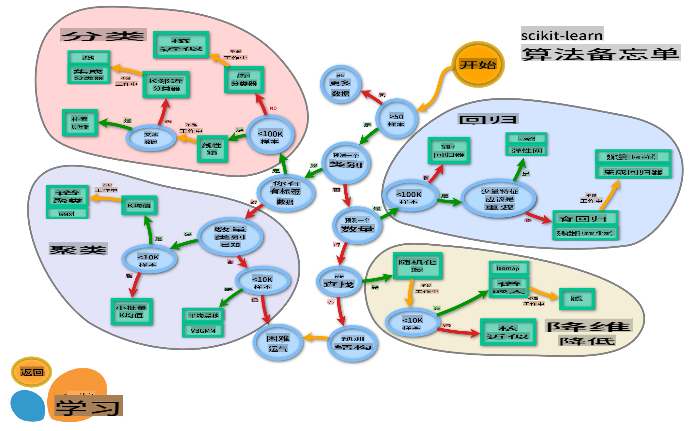

<!--
CO_OP_TRANSLATOR_METADATA:
{
  "original_hash": "808a71076f76ae8f5458862a8edd9215",
  "translation_date": "2025-09-03T18:10:33+00:00",
  "source_file": "4-Classification/3-Classifiers-2/README.md",
  "language_code": "zh"
}
-->
# 菜系分类器 2

在第二节分类课程中，您将探索更多分类数值数据的方法，并了解选择不同分类器的影响。

## [课前测验](https://gray-sand-07a10f403.1.azurestaticapps.net/quiz/23/)

### 前置条件

我们假设您已经完成了之前的课程，并在本课程的根目录下的 `data` 文件夹中准备了一个名为 _cleaned_cuisines.csv_ 的清理过的数据集。

### 准备工作

我们已经将您的 _notebook.ipynb_ 文件加载了清理过的数据集，并将其分为 X 和 y 数据框，准备进行模型构建。

## 分类地图

之前，您学习了使用微软的速查表对数据进行分类的各种选项。Scikit-learn 提供了一个类似但更详细的速查表，可以进一步帮助您缩小选择范围（分类器的另一种说法是估计器）：


> 提示：[在线访问此地图](https://scikit-learn.org/stable/tutorial/machine_learning_map/)，点击路径以阅读相关文档。

### 计划

一旦您对数据有了清晰的理解，这张地图就非常有帮助，您可以沿着路径做出决策：

- 我们有超过 50 个样本
- 我们希望预测一个类别
- 我们有标注数据
- 我们的样本少于 10 万
- ✨ 我们可以选择线性 SVC
- 如果这不起作用，由于我们有数值数据
    - 我们可以尝试 ✨ KNeighbors 分类器
      - 如果这不起作用，可以尝试 ✨ SVC 和 ✨ 集成分类器

这是一条非常有用的路径。

## 练习 - 划分数据

按照这条路径，我们应该先导入一些需要使用的库。

1. 导入所需的库：

    ```python
    from sklearn.neighbors import KNeighborsClassifier
    from sklearn.linear_model import LogisticRegression
    from sklearn.svm import SVC
    from sklearn.ensemble import RandomForestClassifier, AdaBoostClassifier
    from sklearn.model_selection import train_test_split, cross_val_score
    from sklearn.metrics import accuracy_score,precision_score,confusion_matrix,classification_report, precision_recall_curve
    import numpy as np
    ```

1. 划分训练数据和测试数据：

    ```python
    X_train, X_test, y_train, y_test = train_test_split(cuisines_feature_df, cuisines_label_df, test_size=0.3)
    ```

## 线性 SVC 分类器

支持向量聚类（SVC）是支持向量机（SVM）家族中的一种机器学习技术（下面可以了解更多）。在这种方法中，您可以选择一个“核函数”来决定如何聚类标签。“C”参数指的是“正则化”，用于调节参数的影响。核函数可以是[多种选项](https://scikit-learn.org/stable/modules/generated/sklearn.svm.SVC.html#sklearn.svm.SVC)之一；这里我们将其设置为“linear”，以确保使用线性 SVC。概率默认值为“false”；这里我们将其设置为“true”以获取概率估计。我们将随机状态设置为“0”，以打乱数据以获取概率。

### 练习 - 应用线性 SVC

首先创建一个分类器数组。随着测试的进行，您将逐步向这个数组添加内容。

1. 从线性 SVC 开始：

    ```python
    C = 10
    # Create different classifiers.
    classifiers = {
        'Linear SVC': SVC(kernel='linear', C=C, probability=True,random_state=0)
    }
    ```

2. 使用线性 SVC 训练模型并打印报告：

    ```python
    n_classifiers = len(classifiers)
    
    for index, (name, classifier) in enumerate(classifiers.items()):
        classifier.fit(X_train, np.ravel(y_train))
    
        y_pred = classifier.predict(X_test)
        accuracy = accuracy_score(y_test, y_pred)
        print("Accuracy (train) for %s: %0.1f%% " % (name, accuracy * 100))
        print(classification_report(y_test,y_pred))
    ```

    结果相当不错：

    ```output
    Accuracy (train) for Linear SVC: 78.6% 
                  precision    recall  f1-score   support
    
         chinese       0.71      0.67      0.69       242
          indian       0.88      0.86      0.87       234
        japanese       0.79      0.74      0.76       254
          korean       0.85      0.81      0.83       242
            thai       0.71      0.86      0.78       227
    
        accuracy                           0.79      1199
       macro avg       0.79      0.79      0.79      1199
    weighted avg       0.79      0.79      0.79      1199
    ```

## K-Neighbors 分类器

K-Neighbors 是机器学习方法中“邻居”家族的一部分，可用于监督学习和非监督学习。在这种方法中，创建了预定义数量的点，并围绕这些点收集数据，以便预测数据的通用标签。

### 练习 - 应用 K-Neighbors 分类器

之前的分类器表现不错，适合数据，但也许我们可以获得更好的准确性。尝试使用 K-Neighbors 分类器。

1. 在分类器数组中添加一行（在线性 SVC 项后加一个逗号）：

    ```python
    'KNN classifier': KNeighborsClassifier(C),
    ```

    结果稍差一些：

    ```output
    Accuracy (train) for KNN classifier: 73.8% 
                  precision    recall  f1-score   support
    
         chinese       0.64      0.67      0.66       242
          indian       0.86      0.78      0.82       234
        japanese       0.66      0.83      0.74       254
          korean       0.94      0.58      0.72       242
            thai       0.71      0.82      0.76       227
    
        accuracy                           0.74      1199
       macro avg       0.76      0.74      0.74      1199
    weighted avg       0.76      0.74      0.74      1199
    ```

    ✅ 了解 [K-Neighbors](https://scikit-learn.org/stable/modules/neighbors.html#neighbors)

## 支持向量分类器

支持向量分类器属于 [支持向量机](https://wikipedia.org/wiki/Support-vector_machine) 家族的机器学习方法，可用于分类和回归任务。SVM 将“训练样本映射到空间中的点”，以最大化两个类别之间的距离。后续数据被映射到这个空间，以预测其类别。

### 练习 - 应用支持向量分类器

让我们尝试使用支持向量分类器获得更好的准确性。

1. 在 K-Neighbors 项后加一个逗号，然后添加以下行：

    ```python
    'SVC': SVC(),
    ```

    结果非常好！

    ```output
    Accuracy (train) for SVC: 83.2% 
                  precision    recall  f1-score   support
    
         chinese       0.79      0.74      0.76       242
          indian       0.88      0.90      0.89       234
        japanese       0.87      0.81      0.84       254
          korean       0.91      0.82      0.86       242
            thai       0.74      0.90      0.81       227
    
        accuracy                           0.83      1199
       macro avg       0.84      0.83      0.83      1199
    weighted avg       0.84      0.83      0.83      1199
    ```

    ✅ 了解 [支持向量](https://scikit-learn.org/stable/modules/svm.html#svm)

## 集成分类器

让我们沿着路径走到最后，尽管之前的测试结果已经非常好。尝试一些“集成分类器”，特别是随机森林和 AdaBoost：

```python
  'RFST': RandomForestClassifier(n_estimators=100),
  'ADA': AdaBoostClassifier(n_estimators=100)
```

结果非常好，尤其是随机森林：

```output
Accuracy (train) for RFST: 84.5% 
              precision    recall  f1-score   support

     chinese       0.80      0.77      0.78       242
      indian       0.89      0.92      0.90       234
    japanese       0.86      0.84      0.85       254
      korean       0.88      0.83      0.85       242
        thai       0.80      0.87      0.83       227

    accuracy                           0.84      1199
   macro avg       0.85      0.85      0.84      1199
weighted avg       0.85      0.84      0.84      1199

Accuracy (train) for ADA: 72.4% 
              precision    recall  f1-score   support

     chinese       0.64      0.49      0.56       242
      indian       0.91      0.83      0.87       234
    japanese       0.68      0.69      0.69       254
      korean       0.73      0.79      0.76       242
        thai       0.67      0.83      0.74       227

    accuracy                           0.72      1199
   macro avg       0.73      0.73      0.72      1199
weighted avg       0.73      0.72      0.72      1199
```

✅ 了解 [集成分类器](https://scikit-learn.org/stable/modules/ensemble.html)

这种机器学习方法“结合多个基础估计器的预测”，以提高模型质量。在我们的示例中，我们使用了随机森林和 AdaBoost。

- [随机森林](https://scikit-learn.org/stable/modules/ensemble.html#forest)，一种平均方法，构建了一个随机性注入的“决策树森林”，以避免过拟合。n_estimators 参数设置为树的数量。

- [AdaBoost](https://scikit-learn.org/stable/modules/generated/sklearn.ensemble.AdaBoostClassifier.html) 将分类器拟合到数据集，然后将该分类器的副本拟合到同一数据集。它关注错误分类项的权重，并调整下一分类器的拟合以进行纠正。

---

## 🚀挑战

每种技术都有大量参数可以调整。研究每种技术的默认参数，并思考调整这些参数对模型质量的影响。

## [课后测验](https://gray-sand-07a10f403.1.azurestaticapps.net/quiz/24/)

## 复习与自学

这些课程中有很多术语，花点时间复习[这个术语表](https://docs.microsoft.com/dotnet/machine-learning/resources/glossary?WT.mc_id=academic-77952-leestott)，它非常有用！

## 作业 

[参数调整](assignment.md)

---

**免责声明**：  
本文档使用AI翻译服务 [Co-op Translator](https://github.com/Azure/co-op-translator) 进行翻译。尽管我们努力确保翻译的准确性，但请注意，自动翻译可能包含错误或不准确之处。原始语言的文档应被视为权威来源。对于关键信息，建议使用专业人工翻译。我们不对因使用此翻译而产生的任何误解或误读承担责任。