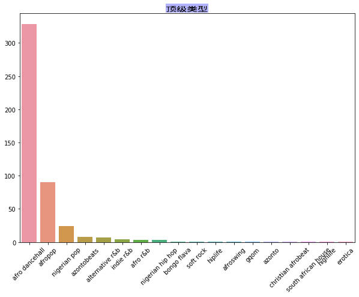
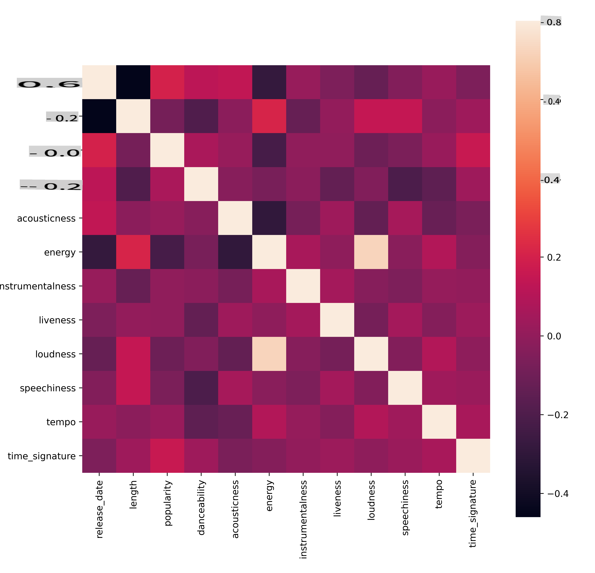
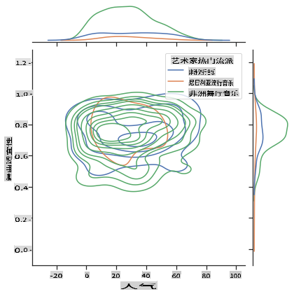

<!--
CO_OP_TRANSLATOR_METADATA:
{
  "original_hash": "0ab69b161efd7a41d325ee28b29415d7",
  "translation_date": "2025-09-03T17:10:46+00:00",
  "source_file": "5-Clustering/1-Visualize/README.md",
  "language_code": "zh"
}
-->
# 聚类简介

聚类是一种[无监督学习](https://wikipedia.org/wiki/Unsupervised_learning)方法，假设数据集是未标记的，或者其输入未与预定义的输出匹配。它使用各种算法对未标记的数据进行分类，并根据数据中识别出的模式提供分组。

[](https://youtu.be/ty2advRiWJM "PSquare的《No One Like You》")

> 🎥 点击上方图片观看视频。在学习聚类机器学习的同时，欣赏一些尼日利亚舞厅音乐——这是PSquare在2014年发布的一首高评价歌曲。

## [课前测验](https://gray-sand-07a10f403.1.azurestaticapps.net/quiz/27/)

### 简介

[聚类](https://link.springer.com/referenceworkentry/10.1007%2F978-0-387-30164-8_124)在数据探索中非常有用。让我们看看它是否能帮助发现尼日利亚观众消费音乐的趋势和模式。

✅ 花一分钟思考一下聚类的用途。在现实生活中，聚类发生在你有一堆洗衣物并需要将家人衣物分类时 🧦👕👖🩲。在数据科学中，聚类发生在试图分析用户偏好或确定任何未标记数据集的特征时。聚类在某种程度上帮助我们从混乱中找到秩序，就像整理袜子抽屉一样。

[](https://youtu.be/esmzYhuFnds "聚类简介")

> 🎥 点击上方图片观看视频：麻省理工学院的John Guttag介绍聚类

在专业环境中，聚类可以用于确定市场细分，例如确定哪些年龄段购买哪些商品。另一个用途是异常检测，比如从信用卡交易数据集中检测欺诈行为。或者你可以用聚类来识别一批医学扫描中的肿瘤。

✅ 花一分钟思考一下你可能在银行、电子商务或商业环境中遇到过的聚类应用。

> 🎓 有趣的是，聚类分析起源于20世纪30年代的人类学和心理学领域。你能想象它可能是如何被使用的吗？

另外，你可以用它来对搜索结果进行分组——例如按购物链接、图片或评论分组。当你有一个大型数据集并希望对其进行简化以进行更细致的分析时，聚类技术非常有用，因此它可以在构建其他模型之前帮助了解数据。

✅ 一旦你的数据被组织成聚类，你可以为其分配一个聚类ID。这种技术在保护数据集隐私时非常有用；你可以通过聚类ID而不是更具识别性的详细数据来引用数据点。你能想到其他使用聚类ID而不是聚类元素来标识数据的原因吗？

通过这个[学习模块](https://docs.microsoft.com/learn/modules/train-evaluate-cluster-models?WT.mc_id=academic-77952-leestott)深入了解聚类技术。

## 聚类入门

[Scikit-learn提供了大量方法](https://scikit-learn.org/stable/modules/clustering.html)来执行聚类。你选择的方法将取决于你的使用场景。根据文档，每种方法都有不同的优势。以下是Scikit-learn支持的方法及其适用场景的简化表格：

| 方法名称                     | 使用场景                                                               |
| :--------------------------- | :--------------------------------------------------------------------- |
| K-Means                      | 通用目的，归纳式                                                      |
| Affinity propagation         | 多个、不均匀的聚类，归纳式                                            |
| Mean-shift                   | 多个、不均匀的聚类，归纳式                                            |
| Spectral clustering          | 少量、均匀的聚类，转导式                                              |
| Ward hierarchical clustering | 多个、受约束的聚类，转导式                                            |
| Agglomerative clustering     | 多个、受约束的、非欧几里得距离，转导式                                |
| DBSCAN                       | 非平面几何、不均匀的聚类，转导式                                      |
| OPTICS                       | 非平面几何、不均匀的聚类，密度可变，转导式                            |
| Gaussian mixtures            | 平面几何，归纳式                                                     |
| BIRCH                        | 大型数据集，包含异常值，归纳式                                        |

> 🎓 我们如何创建聚类与我们如何将数据点分组密切相关。让我们解读一些术语：
>
> 🎓 ['转导式' vs. '归纳式'](https://wikipedia.org/wiki/Transduction_(machine_learning))
> 
> 转导式推理基于观察到的训练案例映射到特定测试案例。归纳式推理基于训练案例映射到一般规则，然后应用于测试案例。
> 
> 示例：假设你有一个部分标记的数据集。一些是“唱片”，一些是“CD”，一些是空白。你的任务是为空白部分提供标签。如果你选择归纳式方法，你会训练一个模型寻找“唱片”和“CD”，并将这些标签应用于未标记数据。这种方法可能难以分类实际上是“磁带”的东西。而转导式方法则更有效地处理这些未知数据，因为它会努力将相似的项目分组，然后为组应用标签。在这种情况下，聚类可能反映“圆形音乐物品”和“方形音乐物品”。
> 
> 🎓 ['非平面' vs. '平面'几何](https://datascience.stackexchange.com/questions/52260/terminology-flat-geometry-in-the-context-of-clustering)
> 
> 源自数学术语，非平面与平面几何指的是通过“平面”（[欧几里得](https://wikipedia.org/wiki/Euclidean_geometry)）或“非平面”（非欧几里得）几何方法测量点之间的距离。
>
> 在此上下文中，“平面”指欧几里得几何（部分内容被称为“平面”几何），而“非平面”指非欧几里得几何。几何与机器学习有什么关系？作为两个根植于数学的领域，必须有一种通用方法来测量聚类中点之间的距离，这可以通过“平面”或“非平面”的方式完成，具体取决于数据的性质。[欧几里得距离](https://wikipedia.org/wiki/Euclidean_distance)是通过两点之间线段的长度来测量的。[非欧几里得距离](https://wikipedia.org/wiki/Non-Euclidean_geometry)则沿曲线测量。如果你的数据在可视化时似乎不在平面上，你可能需要使用专门的算法来处理它。
>

> 信息图由[Dasani Madipalli](https://twitter.com/dasani_decoded)制作
> 
> 🎓 ['距离'](https://web.stanford.edu/class/cs345a/slides/12-clustering.pdf)
> 
> 聚类由其距离矩阵定义，例如点之间的距离。这种距离可以通过几种方式测量。欧几里得聚类由点值的平均值定义，并包含一个“质心”或中心点。因此距离是通过到质心的距离来测量的。非欧几里得距离则指“聚心”，即最接近其他点的点。聚心可以通过多种方式定义。
> 
> 🎓 ['受约束'](https://wikipedia.org/wiki/Constrained_clustering)
> 
> [受约束聚类](https://web.cs.ucdavis.edu/~davidson/Publications/ICDMTutorial.pdf)在这种无监督方法中引入了“半监督”学习。点之间的关系被标记为“不能链接”或“必须链接”，因此对数据集施加了一些规则。
>
> 示例：如果一个算法在一批未标记或半标记数据上自由运行，它生成的聚类可能质量较差。在上述示例中，聚类可能会将“圆形音乐物品”、“方形音乐物品”、“三角形物品”和“饼干”分组。如果给出一些约束或规则（“物品必须是塑料制成的”，“物品需要能够产生音乐”），这可以帮助“约束”算法做出更好的选择。
> 
> 🎓 '密度'
> 
> 数据“噪声”被认为是“密集”的。每个聚类中点之间的距离在检查时可能会更密集或更稀疏，因此需要使用适当的聚类方法来分析这些数据。[这篇文章](https://www.kdnuggets.com/2020/02/understanding-density-based-clustering.html)展示了使用K-Means聚类与HDBSCAN算法探索具有不均匀聚类密度的噪声数据集的区别。

## 聚类算法

有超过100种聚类算法，其使用取决于手头数据的性质。让我们讨论一些主要的算法：

- **层次聚类**。如果一个对象根据其与附近对象的接近程度而被分类，而不是与更远的对象，聚类是基于其成员与其他对象的距离形成的。Scikit-learn的凝聚聚类是层次聚类。

   
   > 信息图由[Dasani Madipalli](https://twitter.com/dasani_decoded)制作

- **质心聚类**。这种流行的算法需要选择“k”，即要形成的聚类数量，然后算法确定聚类的中心点并围绕该点收集数据。[K均值聚类](https://wikipedia.org/wiki/K-means_clustering)是质心聚类的一种流行版本。中心点由最近的平均值确定，因此得名。聚类的平方距离被最小化。

   
   > 信息图由[Dasani Madipalli](https://twitter.com/dasani_decoded)制作

- **基于分布的聚类**。基于统计建模，分布式聚类的核心是确定数据点属于某个聚类的概率，并据此分配。高斯混合方法属于此类型。

- **基于密度的聚类**。数据点根据其密度或围绕彼此的分组被分配到聚类。远离组的数据点被认为是异常值或噪声。DBSCAN、Mean-shift和OPTICS属于此类型聚类。

- **基于网格的聚类**。对于多维数据集，创建一个网格并将数据分配到网格的单元中，从而形成聚类。

## 练习 - 聚类你的数据

聚类技术在良好的可视化支持下效果更佳，因此让我们通过可视化音乐数据开始。这项练习将帮助我们决定针对数据性质最有效的聚类方法。

1. 打开此文件夹中的[_notebook.ipynb_](https://github.com/microsoft/ML-For-Beginners/blob/main/5-Clustering/1-Visualize/notebook.ipynb)。

1. 导入`Seaborn`包以实现良好的数据可视化。

    ```python
    !pip install seaborn
    ```

1. 从[_nigerian-songs.csv_](https://github.com/microsoft/ML-For-Beginners/blob/main/5-Clustering/data/nigerian-songs.csv)中追加歌曲数据。加载一个包含歌曲数据的数据框。通过导入库并输出数据准备探索：

    ```python
    import matplotlib.pyplot as plt
    import pandas as pd
    
    df = pd.read_csv("../data/nigerian-songs.csv")
    df.head()
    ```

    检查数据的前几行：

    |     | name                     | album                        | artist              | artist_top_genre | release_date | length | popularity | danceability | acousticness | energy | instrumentalness | liveness | loudness | speechiness | tempo   | time_signature |
    | --- | ------------------------ | ---------------------------- | ------------------- | ---------------- | ------------ | ------ | ---------- | ------------ | ------------ | ------ | ---------------- | -------- | -------- | ----------- | ------- | -------------- |
    | 0   | Sparky                   | Mandy & The Jungle           | Cruel Santino       | alternative r&b  | 2019         | 144000 | 48         | 0.666        | 0.851        | 0.42   | 0.534            | 0.11     | -6.699   | 0.0829      | 133.015 | 5              |
    | 1   | shuga rush               | EVERYTHING YOU HEARD IS TRUE | Odunsi (The Engine) | afropop          | 2020         | 89488  | 30         | 0.71         | 0.0822       | 0.683  | 0.000169         | 0.101    | -5.64    | 0.36        | 129.993 | 3              |
| 2   | LITT!                    | LITT!                        | AYLØ                | 独立R&B          | 2018         | 207758 | 40         | 0.836        | 0.272        | 0.564  | 0.000537         | 0.11     | -7.127   | 0.0424      | 130.005 | 4              |
| 3   | Confident / Feeling Cool | Enjoy Your Life              | Lady Donli          | 尼日利亚流行     | 2019         | 175135 | 14         | 0.894        | 0.798        | 0.611  | 0.000187         | 0.0964   | -4.961   | 0.113       | 111.087 | 4              |
| 4   | wanted you               | rare.                        | Odunsi (The Engine) | 非洲流行         | 2018         | 152049 | 25         | 0.702        | 0.116        | 0.833  | 0.91             | 0.348    | -6.044   | 0.0447      | 105.115 | 4              |

1. 获取数据框的一些信息，调用 `info()`：

    ```python
    df.info()
    ```

   输出如下所示：

    ```output
    <class 'pandas.core.frame.DataFrame'>
    RangeIndex: 530 entries, 0 to 529
    Data columns (total 16 columns):
     #   Column            Non-Null Count  Dtype  
    ---  ------            --------------  -----  
     0   name              530 non-null    object 
     1   album             530 non-null    object 
     2   artist            530 non-null    object 
     3   artist_top_genre  530 non-null    object 
     4   release_date      530 non-null    int64  
     5   length            530 non-null    int64  
     6   popularity        530 non-null    int64  
     7   danceability      530 non-null    float64
     8   acousticness      530 non-null    float64
     9   energy            530 non-null    float64
     10  instrumentalness  530 non-null    float64
     11  liveness          530 non-null    float64
     12  loudness          530 non-null    float64
     13  speechiness       530 non-null    float64
     14  tempo             530 non-null    float64
     15  time_signature    530 non-null    int64  
    dtypes: float64(8), int64(4), object(4)
    memory usage: 66.4+ KB
    ```

1. 通过调用 `isnull()` 并验证总和为 0 来仔细检查是否有空值：

    ```python
    df.isnull().sum()
    ```

    看起来不错：

    ```output
    name                0
    album               0
    artist              0
    artist_top_genre    0
    release_date        0
    length              0
    popularity          0
    danceability        0
    acousticness        0
    energy              0
    instrumentalness    0
    liveness            0
    loudness            0
    speechiness         0
    tempo               0
    time_signature      0
    dtype: int64
    ```

1. 描述数据：

    ```python
    df.describe()
    ```

    |       | release_date | length      | popularity | danceability | acousticness | energy   | instrumentalness | liveness | loudness  | speechiness | tempo      | time_signature |
    | ----- | ------------ | ----------- | ---------- | ------------ | ------------ | -------- | ---------------- | -------- | --------- | ----------- | ---------- | -------------- |
    | count | 530          | 530         | 530        | 530          | 530          | 530      | 530              | 530      | 530       | 530         | 530        | 530            |
    | mean  | 2015.390566  | 222298.1698 | 17.507547  | 0.741619     | 0.265412     | 0.760623 | 0.016305         | 0.147308 | -4.953011 | 0.130748    | 116.487864 | 3.986792       |
    | std   | 3.131688     | 39696.82226 | 18.992212  | 0.117522     | 0.208342     | 0.148533 | 0.090321         | 0.123588 | 2.464186  | 0.092939    | 23.518601  | 0.333701       |
    | min   | 1998         | 89488       | 0          | 0.255        | 0.000665     | 0.111    | 0                | 0.0283   | -19.362   | 0.0278      | 61.695     | 3              |
    | 25%   | 2014         | 199305      | 0          | 0.681        | 0.089525     | 0.669    | 0                | 0.07565  | -6.29875  | 0.0591      | 102.96125  | 4              |
    | 50%   | 2016         | 218509      | 13         | 0.761        | 0.2205       | 0.7845   | 0.000004         | 0.1035   | -4.5585   | 0.09795     | 112.7145   | 4              |
    | 75%   | 2017         | 242098.5    | 31         | 0.8295       | 0.403        | 0.87575  | 0.000234         | 0.164    | -3.331    | 0.177       | 125.03925  | 4              |
    | max   | 2020         | 511738      | 73         | 0.966        | 0.954        | 0.995    | 0.91             | 0.811    | 0.582     | 0.514       | 206.007    | 5              |

> 🤔 如果我们正在使用聚类算法，这是一种不需要标注数据的无监督方法，为什么还要展示带有标签的数据？在数据探索阶段，这些标签很有用，但它们并不是聚类算法运行所必需的。你完全可以移除列标题，用列号来引用数据。

观察数据的一般值。注意，`popularity`（流行度）可以为“0”，这表示歌曲没有排名。我们稍后会移除这些数据。

1. 使用条形图找出最受欢迎的音乐类型：

    ```python
    import seaborn as sns
    
    top = df['artist_top_genre'].value_counts()
    plt.figure(figsize=(10,7))
    sns.barplot(x=top[:5].index,y=top[:5].values)
    plt.xticks(rotation=45)
    plt.title('Top genres',color = 'blue')
    ```

    

✅ 如果你想看到更多的前几名值，可以将 `[:5]` 改为更大的值，或者移除它以查看所有内容。

注意，当最受欢迎的音乐类型被描述为“Missing”时，这意味着 Spotify 没有对其进行分类，因此我们需要移除这些数据。

1. 通过过滤移除缺失数据：

    ```python
    df = df[df['artist_top_genre'] != 'Missing']
    top = df['artist_top_genre'].value_counts()
    plt.figure(figsize=(10,7))
    sns.barplot(x=top.index,y=top.values)
    plt.xticks(rotation=45)
    plt.title('Top genres',color = 'blue')
    ```

    现在重新检查音乐类型：

    

1. 显然，前三大音乐类型在这个数据集中占据主导地位。让我们专注于 `afro dancehall`、`afropop` 和 `nigerian pop`，并进一步过滤数据，移除任何流行度值为 0 的数据（这意味着这些数据在数据集中未被分类为流行度，可以视为噪声）：

    ```python
    df = df[(df['artist_top_genre'] == 'afro dancehall') | (df['artist_top_genre'] == 'afropop') | (df['artist_top_genre'] == 'nigerian pop')]
    df = df[(df['popularity'] > 0)]
    top = df['artist_top_genre'].value_counts()
    plt.figure(figsize=(10,7))
    sns.barplot(x=top.index,y=top.values)
    plt.xticks(rotation=45)
    plt.title('Top genres',color = 'blue')
    ```

1. 快速测试数据是否存在特别强的相关性：

    ```python
    corrmat = df.corr(numeric_only=True)
    f, ax = plt.subplots(figsize=(12, 9))
    sns.heatmap(corrmat, vmax=.8, square=True)
    ```

    

    唯一的强相关性是 `energy` 和 `loudness` 之间的关系，这并不令人意外，因为响亮的音乐通常充满活力。除此之外，相关性相对较弱。看看聚类算法如何处理这些数据会很有趣。

    > 🎓 请注意，相关性并不意味着因果关系！我们有相关性的证据，但没有因果关系的证据。一个[有趣的网站](https://tylervigen.com/spurious-correlations) 提供了一些强调这一点的可视化内容。

在这个数据集中，歌曲的流行度和舞蹈性是否存在某种程度的收敛？一个 FacetGrid 显示，无论音乐类型如何，都存在一些同心圆的排列。是否可能是尼日利亚的音乐品味在某种程度上对这种类型的舞蹈性趋于一致？

✅ 尝试不同的数据点（如 `energy`、`loudness`、`speechiness`）以及更多或不同的音乐类型。你能发现什么？查看 `df.describe()` 表格，了解数据点的一般分布。

### 练习 - 数据分布

这三种音乐类型在流行度和舞蹈性上的感知是否存在显著差异？

1. 检查我们前三种音乐类型在给定 x 和 y 轴上的流行度和舞蹈性数据分布：

    ```python
    sns.set_theme(style="ticks")
    
    g = sns.jointplot(
        data=df,
        x="popularity", y="danceability", hue="artist_top_genre",
        kind="kde",
    )
    ```

    你可以发现围绕一个一般收敛点的同心圆，显示数据点的分布。

    > 🎓 请注意，此示例使用了 KDE（核密度估计）图，它通过连续的概率密度曲线表示数据。这使我们在处理多个分布时能够更好地解释数据。

    总体而言，这三种音乐类型在流行度和舞蹈性方面大致对齐。在这种松散对齐的数据中确定聚类将是一个挑战：

    

1. 创建一个散点图：

    ```python
    sns.FacetGrid(df, hue="artist_top_genre", height=5) \
       .map(plt.scatter, "popularity", "danceability") \
       .add_legend()
    ```

    同一轴上的散点图显示了类似的收敛模式：

    

通常，对于聚类，你可以使用散点图来显示数据的聚类，因此掌握这种可视化方法非常有用。在下一课中，我们将使用 k-means 聚类算法来探索这些数据中有趣的重叠群组。

---

## 🚀挑战

为下一课做准备，制作一张关于你可能在生产环境中发现和使用的各种聚类算法的图表。这些聚类算法试图解决什么样的问题？

## [课后测验](https://gray-sand-07a10f403.1.azurestaticapps.net/quiz/28/)

## 复习与自学

在应用聚类算法之前，正如我们所学，了解数据集的性质是一个好主意。阅读更多相关内容[这里](https://www.kdnuggets.com/2019/10/right-clustering-algorithm.html)

[这篇有用的文章](https://www.freecodecamp.org/news/8-clustering-algorithms-in-machine-learning-that-all-data-scientists-should-know/) 带你了解不同聚类算法在不同数据形状下的表现。

## 作业

[研究其他用于聚类的可视化方法](assignment.md)

---

**免责声明**：  
本文档使用AI翻译服务[Co-op Translator](https://github.com/Azure/co-op-translator)进行翻译。尽管我们努力确保翻译的准确性，但请注意，自动翻译可能包含错误或不准确之处。原始语言的文档应被视为权威来源。对于关键信息，建议使用专业人工翻译。我们不对因使用此翻译而产生的任何误解或误读承担责任。