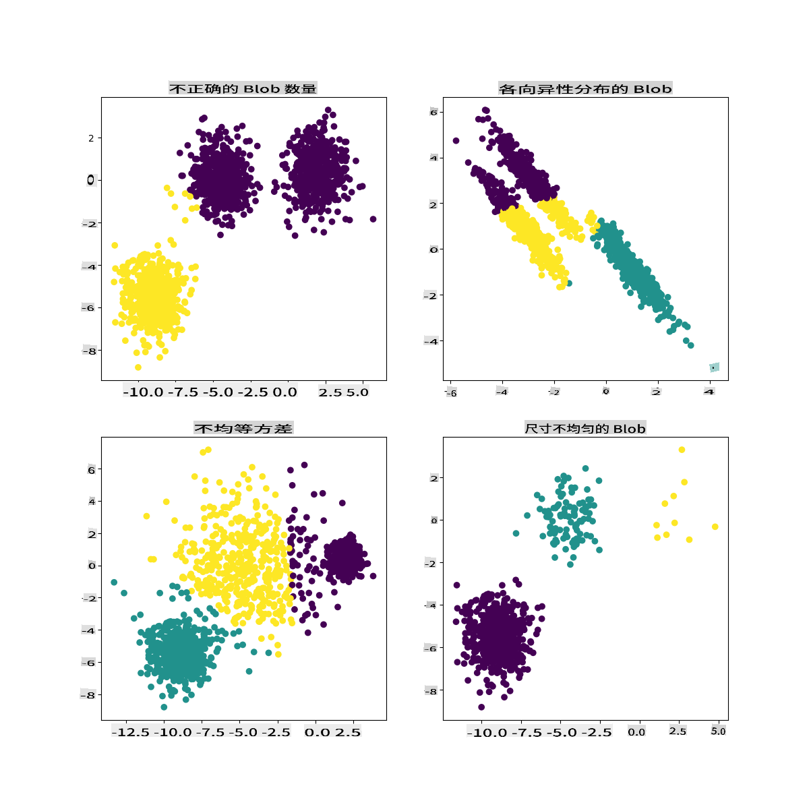

<!--
CO_OP_TRANSLATOR_METADATA:
{
  "original_hash": "085d571097d201810720df4cd379f8c2",
  "translation_date": "2025-09-03T17:18:36+00:00",
  "source_file": "5-Clustering/2-K-Means/README.md",
  "language_code": "zh"
}
-->
# K-Means 聚类

## [课前测验](https://gray-sand-07a10f403.1.azurestaticapps.net/quiz/29/)

在本课中，您将学习如何使用 Scikit-learn 和之前导入的尼日利亚音乐数据集创建聚类。我们将介绍 K-Means 聚类的基础知识。请记住，正如您在之前的课程中学到的那样，有许多方法可以处理聚类，具体使用哪种方法取决于您的数据。我们将尝试 K-Means，因为它是最常见的聚类技术。让我们开始吧！

您将学习以下术语：

- Silhouette评分
- 肘部法则
- 惯性
- 方差

## 简介

[K-Means 聚类](https://wikipedia.org/wiki/K-means_clustering) 是一种源自信号处理领域的方法。它用于通过一系列观察将数据分组并划分为“k”个聚类。每次观察都将数据点分配到离其最近的“均值”或聚类中心点。

这些聚类可以通过 [Voronoi 图](https://wikipedia.org/wiki/Voronoi_diagram) 进行可视化，其中包括一个点（或“种子”）及其对应的区域。


> 信息图由 [Jen Looper](https://twitter.com/jenlooper) 提供

K-Means 聚类过程[通过三步流程执行](https://scikit-learn.org/stable/modules/clustering.html#k-means)：

1. 算法通过从数据集中采样选择 k 个中心点。之后进入循环：
    1. 将每个样本分配到最近的质心。
    2. 通过计算分配到之前质心的所有样本的平均值来创建新的质心。
    3. 计算新质心与旧质心之间的差异，并重复直到质心稳定。

使用 K-Means 的一个缺点是需要确定“k”，即质心的数量。幸运的是，“肘部法则”可以帮助估算一个好的起始值。您马上就会尝试。

## 前提条件

您将在本课的 [_notebook.ipynb_](https://github.com/microsoft/ML-For-Beginners/blob/main/5-Clustering/2-K-Means/notebook.ipynb) 文件中工作，其中包括您在上一课中完成的数据导入和初步清理。

## 练习 - 准备工作

首先再次查看歌曲数据。

1. 为每一列调用 `boxplot()` 创建一个箱线图：

    ```python
    plt.figure(figsize=(20,20), dpi=200)
    
    plt.subplot(4,3,1)
    sns.boxplot(x = 'popularity', data = df)
    
    plt.subplot(4,3,2)
    sns.boxplot(x = 'acousticness', data = df)
    
    plt.subplot(4,3,3)
    sns.boxplot(x = 'energy', data = df)
    
    plt.subplot(4,3,4)
    sns.boxplot(x = 'instrumentalness', data = df)
    
    plt.subplot(4,3,5)
    sns.boxplot(x = 'liveness', data = df)
    
    plt.subplot(4,3,6)
    sns.boxplot(x = 'loudness', data = df)
    
    plt.subplot(4,3,7)
    sns.boxplot(x = 'speechiness', data = df)
    
    plt.subplot(4,3,8)
    sns.boxplot(x = 'tempo', data = df)
    
    plt.subplot(4,3,9)
    sns.boxplot(x = 'time_signature', data = df)
    
    plt.subplot(4,3,10)
    sns.boxplot(x = 'danceability', data = df)
    
    plt.subplot(4,3,11)
    sns.boxplot(x = 'length', data = df)
    
    plt.subplot(4,3,12)
    sns.boxplot(x = 'release_date', data = df)
    ```

    这些数据有点杂乱：通过观察每一列的箱线图，您可以看到异常值。

    

您可以遍历数据集并删除这些异常值，但这样会使数据变得非常少。

1. 目前，选择您将用于聚类练习的列。选择范围相似的列，并将 `artist_top_genre` 列编码为数值数据：

    ```python
    from sklearn.preprocessing import LabelEncoder
    le = LabelEncoder()
    
    X = df.loc[:, ('artist_top_genre','popularity','danceability','acousticness','loudness','energy')]
    
    y = df['artist_top_genre']
    
    X['artist_top_genre'] = le.fit_transform(X['artist_top_genre'])
    
    y = le.transform(y)
    ```

1. 现在您需要选择目标聚类的数量。您知道数据集中有 3 个歌曲流派，因此我们尝试 3：

    ```python
    from sklearn.cluster import KMeans
    
    nclusters = 3 
    seed = 0
    
    km = KMeans(n_clusters=nclusters, random_state=seed)
    km.fit(X)
    
    # Predict the cluster for each data point
    
    y_cluster_kmeans = km.predict(X)
    y_cluster_kmeans
    ```

您会看到一个数组，其中打印了数据框每一行的预测聚类（0、1 或 2）。

1. 使用此数组计算“Silhouette评分”：

    ```python
    from sklearn import metrics
    score = metrics.silhouette_score(X, y_cluster_kmeans)
    score
    ```

## Silhouette评分

寻找接近 1 的 Silhouette评分。此评分范围从 -1 到 1，如果评分为 1，则聚类密集且与其他聚类分离良好。接近 0 的值表示聚类重叠，样本非常接近邻近聚类的决策边界。[（来源）](https://dzone.com/articles/kmeans-silhouette-score-explained-with-python-exam)

我们的评分是 **0.53**，处于中间位置。这表明我们的数据不太适合这种类型的聚类，但我们继续。

### 练习 - 构建模型

1. 导入 `KMeans` 并开始聚类过程。

    ```python
    from sklearn.cluster import KMeans
    wcss = []
    
    for i in range(1, 11):
        kmeans = KMeans(n_clusters = i, init = 'k-means++', random_state = 42)
        kmeans.fit(X)
        wcss.append(kmeans.inertia_)
    
    ```

    这里有几个部分需要解释。

    > 🎓 range：这些是聚类过程的迭代次数

    > 🎓 random_state：“确定质心初始化的随机数生成。”[来源](https://scikit-learn.org/stable/modules/generated/sklearn.cluster.KMeans.html#sklearn.cluster.KMeans)

    > 🎓 WCSS：“聚类内平方和”衡量聚类内所有点到质心的平均平方距离。[来源](https://medium.com/@ODSC/unsupervised-learning-evaluating-clusters-bd47eed175ce)

    > 🎓 惯性：K-Means 算法尝试选择质心以最小化“惯性”，“惯性是衡量聚类内部一致性的一种方法。”[来源](https://scikit-learn.org/stable/modules/clustering.html)。该值在每次迭代中附加到 wcss 变量。

    > 🎓 k-means++：在 [Scikit-learn](https://scikit-learn.org/stable/modules/clustering.html#k-means) 中，您可以使用“k-means++”优化，“初始化质心使其（通常）彼此距离较远，从而可能比随机初始化获得更好的结果。”

### 肘部法则

之前，您推测因为目标是 3 个歌曲流派，所以应该选择 3 个聚类。但真的是这样吗？

1. 使用“肘部法则”确认。

    ```python
    plt.figure(figsize=(10,5))
    sns.lineplot(x=range(1, 11), y=wcss, marker='o', color='red')
    plt.title('Elbow')
    plt.xlabel('Number of clusters')
    plt.ylabel('WCSS')
    plt.show()
    ```

    使用您在上一步中构建的 `wcss` 变量创建一个图表，显示肘部的“弯曲”位置，这表明最佳聚类数量。也许确实是 3！

    

## 练习 - 显示聚类

1. 再次尝试该过程，这次设置三个聚类，并将聚类显示为散点图：

    ```python
    from sklearn.cluster import KMeans
    kmeans = KMeans(n_clusters = 3)
    kmeans.fit(X)
    labels = kmeans.predict(X)
    plt.scatter(df['popularity'],df['danceability'],c = labels)
    plt.xlabel('popularity')
    plt.ylabel('danceability')
    plt.show()
    ```

1. 检查模型的准确性：

    ```python
    labels = kmeans.labels_
    
    correct_labels = sum(y == labels)
    
    print("Result: %d out of %d samples were correctly labeled." % (correct_labels, y.size))
    
    print('Accuracy score: {0:0.2f}'. format(correct_labels/float(y.size)))
    ```

    该模型的准确性不太好，聚类的形状给出了原因的提示。

    

    这些数据过于不平衡，相关性太低，并且列值之间的方差太大，无法很好地聚类。事实上，形成的聚类可能受到我们上面定义的三个流派类别的严重影响或偏斜。这是一个学习过程！

    在 Scikit-learn 的文档中，您可以看到像这样的模型，聚类分界不太清晰，存在“方差”问题：

    
    > 信息图来自 Scikit-learn

## 方差

方差定义为“与均值的平方差的平均值”[（来源）](https://www.mathsisfun.com/data/standard-deviation.html)。在此聚类问题的背景下，它指的是数据集中数值偏离均值的程度。

✅ 这是一个很好的时机来思考所有可能的解决方法。进一步调整数据？使用不同的列？使用不同的算法？提示：尝试[缩放数据](https://www.mygreatlearning.com/blog/learning-data-science-with-k-means-clustering/)以进行归一化并测试其他列。

> 尝试这个“[方差计算器](https://www.calculatorsoup.com/calculators/statistics/variance-calculator.php)”来更好地理解这个概念。

---

## 🚀挑战

花些时间研究这个 notebook，调整参数。通过进一步清理数据（例如删除异常值），您能否提高模型的准确性？您可以使用权重为某些数据样本赋予更大的权重。还有什么方法可以创建更好的聚类？

提示：尝试缩放数据。notebook 中有注释代码，添加了标准缩放以使数据列在范围上更接近。您会发现虽然 Silhouette评分下降了，但肘部图中的“弯曲”变得更平滑。这是因为未缩放的数据允许方差较小的数据具有更大的权重。阅读更多关于此问题的信息[这里](https://stats.stackexchange.com/questions/21222/are-mean-normalization-and-feature-scaling-needed-for-k-means-clustering/21226#21226)。

## [课后测验](https://gray-sand-07a10f403.1.azurestaticapps.net/quiz/30/)

## 复习与自学

查看一个 K-Means 模拟器[例如这个](https://user.ceng.metu.edu.tr/~akifakkus/courses/ceng574/k-means/)。您可以使用此工具可视化样本数据点并确定其质心。您可以编辑数据的随机性、聚类数量和质心数量。这是否帮助您更好地理解数据如何分组？

此外，查看 [斯坦福的 K-Means 手册](https://stanford.edu/~cpiech/cs221/handouts/kmeans.html)。

## 作业

[尝试不同的聚类方法](assignment.md)

---

**免责声明**：  
本文档使用AI翻译服务[Co-op Translator](https://github.com/Azure/co-op-translator)进行翻译。尽管我们努力确保翻译的准确性，但请注意，自动翻译可能包含错误或不准确之处。原始语言的文档应被视为权威来源。对于关键信息，建议使用专业人工翻译。我们不对因使用此翻译而产生的任何误解或误读承担责任。