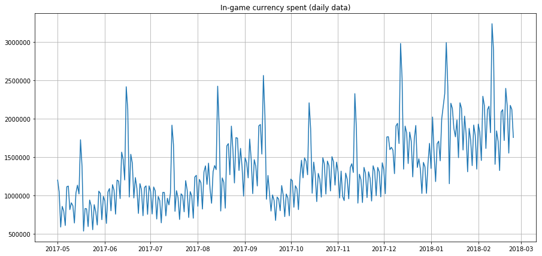

<!--
CO_OP_TRANSLATOR_METADATA:
{
  "original_hash": "3150d40f36a77857316ecaed5f31e856",
  "translation_date": "2025-09-03T16:54:36+00:00",
  "source_file": "7-TimeSeries/1-Introduction/README.md",
  "language_code": "zh"
}
-->
# 时间序列预测简介


> 手绘图作者：[Tomomi Imura](https://www.twitter.com/girlie_mac)

在本课及下一课中，您将学习一些关于时间序列预测的知识。这是机器学习科学家技能库中一个有趣且有价值的部分，但相比其他主题，它的知名度稍低。时间序列预测就像一种“水晶球”：基于某个变量（如价格）的过去表现，您可以预测其未来的潜在价值。

[](https://youtu.be/cBojo1hsHiI "时间序列预测简介")

> 🎥 点击上方图片观看关于时间序列预测的视频

## [课前测验](https://gray-sand-07a10f403.1.azurestaticapps.net/quiz/41/)

时间序列预测是一个有用且有趣的领域，对商业具有实际价值，因为它可以直接应用于定价、库存和供应链问题。尽管深度学习技术开始被用于更深入地预测未来表现，但时间序列预测仍然是一个主要由经典机器学习技术驱动的领域。

> 宾夕法尼亚州立大学的时间序列课程可以在[这里](https://online.stat.psu.edu/stat510/lesson/1)找到。

## 简介

假设您维护了一组智能停车计时器，这些计时器提供关于它们使用频率和使用时长的数据。

> 如果您能够根据计时器的过去表现，预测其未来价值（依据供需规律），会怎么样？

准确预测何时采取行动以实现目标是一个挑战，可以通过时间序列预测来解决。虽然在繁忙时段提高停车费可能会让人们不满，但这确实是一个清理街道的有效收入来源！

让我们探索一些时间序列算法，并开始一个笔记本来清理和准备一些数据。您将分析的数据来自GEFCom2014预测竞赛，包括2012年至2014年间3年的每小时电力负载和温度值。根据电力负载和温度的历史模式，您可以预测未来的电力负载值。

在这个例子中，您将学习如何仅使用历史负载数据预测一个时间步长的未来值。然而，在开始之前，了解背后的原理是很有帮助的。

## 一些定义

当遇到“时间序列”这个术语时，您需要理解它在不同上下文中的使用。

🎓 **时间序列**

在数学中，“时间序列是一系列按时间顺序索引（或列出或绘制）的数据点。最常见的是，时间序列是在连续且等间隔的时间点上记录的序列。” 时间序列的一个例子是[道琼斯工业平均指数](https://wikipedia.org/wiki/Time_series)的每日收盘值。时间序列图和统计建模经常用于信号处理、天气预测、地震预测以及其他事件发生并可以随时间绘制数据点的领域。

🎓 **时间序列分析**

时间序列分析是对上述时间序列数据的分析。时间序列数据可以采取不同的形式，包括“中断时间序列”，它检测时间序列在中断事件前后的演变模式。所需的时间序列分析类型取决于数据的性质。时间序列数据本身可以是数字或字符序列。

分析使用了多种方法，包括频域和时域、线性和非线性等。[了解更多](https://www.itl.nist.gov/div898/handbook/pmc/section4/pmc4.htm)关于分析这种数据的方法。

🎓 **时间序列预测**

时间序列预测是使用模型根据过去收集的数据所显示的模式预测未来值。虽然可以使用回归模型来探索时间序列数据，并将时间索引作为图上的x变量，但这种数据最好使用特殊类型的模型进行分析。

时间序列数据是一组有序的观察值，与可以通过线性回归分析的数据不同。最常见的模型是ARIMA，它是“自回归积分移动平均”的缩写。

[ARIMA模型](https://online.stat.psu.edu/stat510/lesson/1/1.1)“将序列的当前值与过去的值和过去的预测误差联系起来。” 它们最适合分析时间域数据，即按时间顺序排列的数据。

> ARIMA模型有多种类型，您可以在[这里](https://people.duke.edu/~rnau/411arim.htm)了解更多内容，并将在下一课中涉及。

在下一课中，您将使用[单变量时间序列](https://itl.nist.gov/div898/handbook/pmc/section4/pmc44.htm)构建一个ARIMA模型，该序列专注于一个随时间变化的变量。这种数据的一个例子是[这个数据集](https://itl.nist.gov/div898/handbook/pmc/section4/pmc4411.htm)，记录了Mauna Loa天文台的每月CO2浓度：

|   CO2   | YearMonth | Year  | Month |
| :-----: | :-------: | :---: | :---: |
| 330.62  |  1975.04  | 1975  |   1   |
| 331.40  |  1975.13  | 1975  |   2   |
| 331.87  |  1975.21  | 1975  |   3   |
| 333.18  |  1975.29  | 1975  |   4   |
| 333.92  |  1975.38  | 1975  |   5   |
| 333.43  |  1975.46  | 1975  |   6   |
| 331.85  |  1975.54  | 1975  |   7   |
| 330.01  |  1975.63  | 1975  |   8   |
| 328.51  |  1975.71  | 1975  |   9   |
| 328.41  |  1975.79  | 1975  |  10   |
| 329.25  |  1975.88  | 1975  |  11   |
| 330.97  |  1975.96  | 1975  |  12   |

✅ 在这个数据集中，识别随时间变化的变量。

## 时间序列数据需要考虑的特性

在查看时间序列数据时，您可能会注意到它具有[某些特性](https://online.stat.psu.edu/stat510/lesson/1/1.1)，需要考虑并减轻这些特性以更好地理解其模式。如果您将时间序列数据视为可能提供“信号”的数据，这些特性可以被视为“噪声”。您通常需要通过使用一些统计技术来减少这些“噪声”。

以下是一些您需要了解的概念，以便能够处理时间序列：

🎓 **趋势**

趋势是指随时间可测量的增长或下降。[阅读更多](https://machinelearningmastery.com/time-series-trends-in-python)。在时间序列的背景下，重点是如何使用以及在必要时从时间序列中移除趋势。

🎓 **[季节性](https://machinelearningmastery.com/time-series-seasonality-with-python/)**

季节性是指周期性波动，例如节假日的销售高峰。[查看](https://itl.nist.gov/div898/handbook/pmc/section4/pmc443.htm)不同类型的图如何显示数据中的季节性。

🎓 **异常值**

异常值远离标准数据方差。

🎓 **长期周期**

独立于季节性，数据可能显示长期周期，例如持续超过一年的经济衰退。

🎓 **恒定方差**

随着时间的推移，某些数据显示恒定的波动，例如每天和夜间的能源使用量。

🎓 **突变**

数据可能显示需要进一步分析的突变。例如，由于COVID导致企业突然关闭，数据发生了变化。

✅ 这里有一个[时间序列图示例](https://www.kaggle.com/kashnitsky/topic-9-part-1-time-series-analysis-in-python)，显示了几年来每日游戏内货币的消费。您能在这些数据中识别出上述特性吗？



## 练习 - 使用电力使用数据入门

让我们开始创建一个时间序列模型，以根据过去的使用情况预测未来的电力使用。

> 本例中的数据来自GEFCom2014预测竞赛，包括2012年至2014年间3年的每小时电力负载和温度值。
>
> Tao Hong, Pierre Pinson, Shu Fan, Hamidreza Zareipour, Alberto Troccoli 和 Rob J. Hyndman, "Probabilistic energy forecasting: Global Energy Forecasting Competition 2014 and beyond", International Journal of Forecasting, vol.32, no.3, pp 896-913, July-September, 2016.

1. 在本课的`working`文件夹中，打开_notebook.ipynb_文件。首先添加一些库，以帮助您加载和可视化数据。

    ```python
    import os
    import matplotlib.pyplot as plt
    from common.utils import load_data
    %matplotlib inline
    ```

    注意，您正在使用包含的`common`文件夹中的文件，这些文件设置了您的环境并处理数据下载。

2. 接下来，通过调用`load_data()`和`head()`将数据作为数据框检查：

    ```python
    data_dir = './data'
    energy = load_data(data_dir)[['load']]
    energy.head()
    ```

    您可以看到有两列分别表示日期和负载：

    |                     |  load  |
    | :-----------------: | :----: |
    | 2012-01-01 00:00:00 | 2698.0 |
    | 2012-01-01 01:00:00 | 2558.0 |
    | 2012-01-01 02:00:00 | 2444.0 |
    | 2012-01-01 03:00:00 | 2402.0 |
    | 2012-01-01 04:00:00 | 2403.0 |

3. 现在，通过调用`plot()`绘制数据：

    ```python
    energy.plot(y='load', subplots=True, figsize=(15, 8), fontsize=12)
    plt.xlabel('timestamp', fontsize=12)
    plt.ylabel('load', fontsize=12)
    plt.show()
    ```

    

4. 接下来，通过提供`energy`的输入为`[起始日期]:[结束日期]`模式，绘制2014年7月的第一周：

    ```python
    energy['2014-07-01':'2014-07-07'].plot(y='load', subplots=True, figsize=(15, 8), fontsize=12)
    plt.xlabel('timestamp', fontsize=12)
    plt.ylabel('load', fontsize=12)
    plt.show()
    ```

    

    一个漂亮的图！查看这些图，看看您是否能确定上述列出的任何特性。通过可视化数据，我们可以推测出什么？

在下一课中，您将创建一个ARIMA模型来进行一些预测。

---

## 🚀挑战

列出您能想到的所有可能受益于时间序列预测的行业和研究领域。您能想到这些技术在艺术领域的应用吗？在计量经济学、生态学、零售业、工业、金融领域呢？还有哪些其他领域？

## [课后测验](https://gray-sand-07a10f403.1.azurestaticapps.net/quiz/42/)

## 复习与自学

虽然我们不会在这里讨论，但有时会使用神经网络来增强经典的时间序列预测方法。阅读更多关于它们的内容[在这篇文章中](https://medium.com/microsoftazure/neural-networks-for-forecasting-financial-and-economic-time-series-6aca370ff412)。

## 作业

[可视化更多时间序列](assignment.md)

---

**免责声明**：  
本文档使用AI翻译服务 [Co-op Translator](https://github.com/Azure/co-op-translator) 进行翻译。尽管我们努力确保翻译的准确性，但请注意，自动翻译可能包含错误或不准确之处。应以原始语言的文档作为权威来源。对于关键信息，建议使用专业人工翻译。我们不对因使用此翻译而产生的任何误解或误读承担责任。