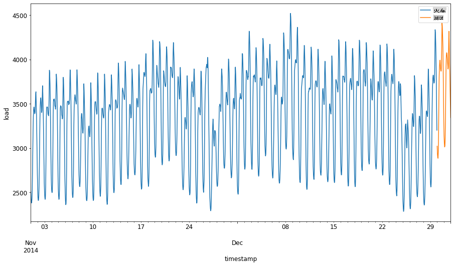
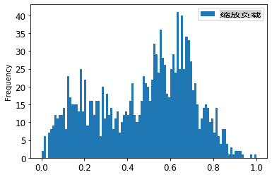

<!--
CO_OP_TRANSLATOR_METADATA:
{
  "original_hash": "2f400075e003e749fdb0d6b3b4787a99",
  "translation_date": "2025-09-03T16:49:17+00:00",
  "source_file": "7-TimeSeries/2-ARIMA/README.md",
  "language_code": "zh"
}
-->
# 使用 ARIMA 进行时间序列预测

在上一节课中，你学习了一些关于时间序列预测的知识，并加载了一个显示电力负载随时间波动的数据集。

[](https://youtu.be/IUSk-YDau10 "ARIMA 简介")

> 🎥 点击上方图片观看视频：ARIMA 模型的简要介绍。示例使用 R 语言，但概念具有普适性。

## [课前测验](https://gray-sand-07a10f403.1.azurestaticapps.net/quiz/43/)

## 简介

在本节课中，你将学习一种特定的方法来构建 [ARIMA: *A*uto*R*egressive *I*ntegrated *M*oving *A*verage](https://wikipedia.org/wiki/Autoregressive_integrated_moving_average) 模型。ARIMA 模型特别适合拟合显示 [非平稳性](https://wikipedia.org/wiki/Stationary_process) 的数据。

## 基本概念

为了能够使用 ARIMA，有一些概念需要了解：

- 🎓 **平稳性**。从统计学的角度来看，平稳性指的是分布在时间上不发生变化的数据。而非平稳数据则由于趋势的影响而出现波动，必须经过转换才能进行分析。例如，季节性可能会引入数据波动，可以通过“季节性差分”过程来消除。

- 🎓 **[差分](https://wikipedia.org/wiki/Autoregressive_integrated_moving_average#Differencing)**。差分数据是指从统计学角度将非平稳数据转换为平稳数据的过程，通过去除其非恒定趋势来实现。“差分消除了时间序列中的水平变化，消除了趋势和季节性，从而稳定了时间序列的均值。” [Shixiong 等人的论文](https://arxiv.org/abs/1904.07632)

## ARIMA 在时间序列中的应用

让我们拆解 ARIMA 的各个部分，以更好地理解它如何帮助我们对时间序列建模并进行预测。

- **AR - 自回归**。顾名思义，自回归模型会“回顾”过去，分析数据中的先前值并对其进行假设。这些先前值称为“滞后”。例如，显示每月铅笔销售数据的时间序列。每个月的销售总额被视为数据集中的“演变变量”。该模型的构建方式是“将感兴趣的演变变量回归到其自身的滞后（即先前）值上。” [维基百科](https://wikipedia.org/wiki/Autoregressive_integrated_moving_average)

- **I - 积分**。与类似的“ARMA”模型不同，ARIMA 中的“I”指的是其 *[积分](https://wikipedia.org/wiki/Order_of_integration)* 特性。通过应用差分步骤来消除非平稳性，从而使数据“积分化”。

- **MA - 移动平均**。该模型的 [移动平均](https://wikipedia.org/wiki/Moving-average_model) 部分指的是通过观察当前和过去的滞后值来确定输出变量。

总结：ARIMA 用于使模型尽可能贴合时间序列数据的特殊形式。

## 练习 - 构建 ARIMA 模型

打开本节课中的 [_/working_](https://github.com/microsoft/ML-For-Beginners/tree/main/7-TimeSeries/2-ARIMA/working) 文件夹，找到 [_notebook.ipynb_](https://github.com/microsoft/ML-For-Beginners/blob/main/7-TimeSeries/2-ARIMA/working/notebook.ipynb) 文件。

1. 运行 notebook 加载 `statsmodels` Python 库；你将需要它来构建 ARIMA 模型。

1. 加载必要的库。

1. 现在，加载更多用于绘制数据的库：

    ```python
    import os
    import warnings
    import matplotlib.pyplot as plt
    import numpy as np
    import pandas as pd
    import datetime as dt
    import math

    from pandas.plotting import autocorrelation_plot
    from statsmodels.tsa.statespace.sarimax import SARIMAX
    from sklearn.preprocessing import MinMaxScaler
    from common.utils import load_data, mape
    from IPython.display import Image

    %matplotlib inline
    pd.options.display.float_format = '{:,.2f}'.format
    np.set_printoptions(precision=2)
    warnings.filterwarnings("ignore") # specify to ignore warning messages
    ```

1. 从 `/data/energy.csv` 文件中加载数据到 Pandas 数据框并查看：

    ```python
    energy = load_data('./data')[['load']]
    energy.head(10)
    ```

1. 绘制 2012 年 1 月至 2014 年 12 月的所有可用能源数据。没有意外，因为我们在上一节课中已经看过这些数据：

    ```python
    energy.plot(y='load', subplots=True, figsize=(15, 8), fontsize=12)
    plt.xlabel('timestamp', fontsize=12)
    plt.ylabel('load', fontsize=12)
    plt.show()
    ```

    现在，让我们构建一个模型！

### 创建训练和测试数据集

现在数据已经加载，可以将其分为训练集和测试集。你将使用训练集训练模型。像往常一样，模型训练完成后，你将使用测试集评估其准确性。需要确保测试集覆盖训练集之后的时间段，以确保模型不会从未来时间段中获取信息。

1. 将 2014 年 9 月 1 日至 10 月 31 日的两个月分配给训练集。测试集将包括 2014 年 11 月 1 日至 12 月 31 日的两个月：

    ```python
    train_start_dt = '2014-11-01 00:00:00'
    test_start_dt = '2014-12-30 00:00:00'
    ```

    由于这些数据反映了每日能源消耗，因此存在强烈的季节性模式，但消耗与最近几天的消耗最为相似。

1. 可视化差异：

    ```python
    energy[(energy.index < test_start_dt) & (energy.index >= train_start_dt)][['load']].rename(columns={'load':'train'}) \
        .join(energy[test_start_dt:][['load']].rename(columns={'load':'test'}), how='outer') \
        .plot(y=['train', 'test'], figsize=(15, 8), fontsize=12)
    plt.xlabel('timestamp', fontsize=12)
    plt.ylabel('load', fontsize=12)
    plt.show()
    ```

    

    因此，使用一个相对较小的时间窗口来训练数据应该足够。

    > 注意：由于我们用于拟合 ARIMA 模型的函数在拟合过程中使用样本内验证，因此我们将省略验证数据。

### 准备训练数据

现在，你需要通过过滤和缩放数据来准备训练数据。过滤数据集以仅包含所需的时间段和列，并缩放数据以确保其投影在区间 0,1 内。

1. 过滤原始数据集，仅包括每个集合中上述时间段，并仅包括所需的“load”列和日期：

    ```python
    train = energy.copy()[(energy.index >= train_start_dt) & (energy.index < test_start_dt)][['load']]
    test = energy.copy()[energy.index >= test_start_dt][['load']]

    print('Training data shape: ', train.shape)
    print('Test data shape: ', test.shape)
    ```

    你可以查看数据的形状：

    ```output
    Training data shape:  (1416, 1)
    Test data shape:  (48, 1)
    ```

1. 将数据缩放到范围 (0, 1)。

    ```python
    scaler = MinMaxScaler()
    train['load'] = scaler.fit_transform(train)
    train.head(10)
    ```

1. 可视化原始数据与缩放数据：

    ```python
    energy[(energy.index >= train_start_dt) & (energy.index < test_start_dt)][['load']].rename(columns={'load':'original load'}).plot.hist(bins=100, fontsize=12)
    train.rename(columns={'load':'scaled load'}).plot.hist(bins=100, fontsize=12)
    plt.show()
    ```

    

    > 原始数据

    

    > 缩放数据

1. 现在你已经校准了缩放数据，可以对测试数据进行缩放：

    ```python
    test['load'] = scaler.transform(test)
    test.head()
    ```

### 实现 ARIMA

现在是时候实现 ARIMA 了！你将使用之前安装的 `statsmodels` 库。

接下来需要遵循几个步骤：

   1. 调用 `SARIMAX()` 定义模型，并传入模型参数：p、d 和 q 参数，以及 P、D 和 Q 参数。
   2. 调用 `fit()` 函数为训练数据准备模型。
   3. 调用 `forecast()` 函数进行预测，并指定预测步数（即“预测范围”）。

> 🎓 这些参数是做什么的？在 ARIMA 模型中，有 3 个参数用于帮助建模时间序列的主要方面：季节性、趋势和噪声。这些参数是：

`p`：与模型的自回归部分相关的参数，包含*过去*的值。
`d`：与模型的积分部分相关的参数，影响应用于时间序列的*差分*（🎓 记得差分 👆？）数量。
`q`：与模型的移动平均部分相关的参数。

> 注意：如果你的数据具有季节性特征（例如本数据），我们使用季节性 ARIMA 模型（SARIMA）。在这种情况下，需要使用另一组参数：`P`、`D` 和 `Q`，它们与 `p`、`d` 和 `q` 的关联相同，但对应于模型的季节性部分。

1. 首先设置你偏好的预测范围值。我们试试 3 小时：

    ```python
    # Specify the number of steps to forecast ahead
    HORIZON = 3
    print('Forecasting horizon:', HORIZON, 'hours')
    ```

    为 ARIMA 模型选择最佳参数值可能具有挑战性，因为它有些主观且耗时。你可以考虑使用 [`pyramid` 库](https://alkaline-ml.com/pmdarima/0.9.0/modules/generated/pyramid.arima.auto_arima.html) 的 `auto_arima()` 函数。

1. 目前尝试一些手动选择以找到一个好的模型。

    ```python
    order = (4, 1, 0)
    seasonal_order = (1, 1, 0, 24)

    model = SARIMAX(endog=train, order=order, seasonal_order=seasonal_order)
    results = model.fit()

    print(results.summary())
    ```

    打印出结果表。

你已经构建了第一个模型！现在我们需要找到一种方法来评估它。

### 评估模型

为了评估模型，可以执行所谓的 `逐步验证`。在实践中，每次有新数据可用时，时间序列模型都会重新训练。这使得模型能够在每个时间步进行最佳预测。

从时间序列的开头开始，使用此技术对训练数据集进行训练。然后对下一个时间步进行预测。预测结果与已知值进行评估。然后将训练集扩展以包含已知值，并重复该过程。

> 注意：为了更高效地训练，你应该保持训练集窗口固定，这样每次向训练集中添加新观察值时，就从集合的开头移除一个观察值。

此过程提供了模型在实际中表现的更稳健估计。然而，这需要创建许多模型的计算成本。如果数据量较小或模型较简单，这是可以接受的，但在规模较大时可能会成为问题。

逐步验证是时间序列模型评估的黄金标准，推荐用于你的项目。

1. 首先，为每个预测范围步创建一个测试数据点。

    ```python
    test_shifted = test.copy()

    for t in range(1, HORIZON+1):
        test_shifted['load+'+str(t)] = test_shifted['load'].shift(-t, freq='H')

    test_shifted = test_shifted.dropna(how='any')
    test_shifted.head(5)
    ```

    |            |          | load | load+1 | load+2 |
    | ---------- | -------- | ---- | ------ | ------ |
    | 2014-12-30 | 00:00:00 | 0.33 | 0.29   | 0.27   |
    | 2014-12-30 | 01:00:00 | 0.29 | 0.27   | 0.27   |
    | 2014-12-30 | 02:00:00 | 0.27 | 0.27   | 0.30   |
    | 2014-12-30 | 03:00:00 | 0.27 | 0.30   | 0.41   |
    | 2014-12-30 | 04:00:00 | 0.30 | 0.41   | 0.57   |

    数据根据预测范围点水平移动。

1. 使用滑动窗口方法对测试数据进行预测，循环大小为测试数据长度：

    ```python
    %%time
    training_window = 720 # dedicate 30 days (720 hours) for training

    train_ts = train['load']
    test_ts = test_shifted

    history = [x for x in train_ts]
    history = history[(-training_window):]

    predictions = list()

    order = (2, 1, 0)
    seasonal_order = (1, 1, 0, 24)

    for t in range(test_ts.shape[0]):
        model = SARIMAX(endog=history, order=order, seasonal_order=seasonal_order)
        model_fit = model.fit()
        yhat = model_fit.forecast(steps = HORIZON)
        predictions.append(yhat)
        obs = list(test_ts.iloc[t])
        # move the training window
        history.append(obs[0])
        history.pop(0)
        print(test_ts.index[t])
        print(t+1, ': predicted =', yhat, 'expected =', obs)
    ```

    你可以观察到训练过程：

    ```output
    2014-12-30 00:00:00
    1 : predicted = [0.32 0.29 0.28] expected = [0.32945389435989236, 0.2900626678603402, 0.2739480752014323]

    2014-12-30 01:00:00
    2 : predicted = [0.3  0.29 0.3 ] expected = [0.2900626678603402, 0.2739480752014323, 0.26812891674127126]

    2014-12-30 02:00:00
    3 : predicted = [0.27 0.28 0.32] expected = [0.2739480752014323, 0.26812891674127126, 0.3025962399283795]
    ```

1. 将预测结果与实际负载进行比较：

    ```python
    eval_df = pd.DataFrame(predictions, columns=['t+'+str(t) for t in range(1, HORIZON+1)])
    eval_df['timestamp'] = test.index[0:len(test.index)-HORIZON+1]
    eval_df = pd.melt(eval_df, id_vars='timestamp', value_name='prediction', var_name='h')
    eval_df['actual'] = np.array(np.transpose(test_ts)).ravel()
    eval_df[['prediction', 'actual']] = scaler.inverse_transform(eval_df[['prediction', 'actual']])
    eval_df.head()
    ```

    输出
    |     |            | timestamp | h   | prediction | actual   |
    | --- | ---------- | --------- | --- | ---------- | -------- |
    | 0   | 2014-12-30 | 00:00:00  | t+1 | 3,008.74   | 3,023.00 |
    | 1   | 2014-12-30 | 01:00:00  | t+1 | 2,955.53   | 2,935.00 |
    | 2   | 2014-12-30 | 02:00:00  | t+1 | 2,900.17   | 2,899.00 |
    | 3   | 2014-12-30 | 03:00:00  | t+1 | 2,917.69   | 2,886.00 |
    | 4   | 2014-12-30 | 04:00:00  | t+1 | 2,946.99   | 2,963.00 |

    观察每小时数据的预测结果，与实际负载进行比较。准确性如何？

### 检查模型准确性

通过测试所有预测的平均绝对百分比误差 (MAPE) 来检查模型的准确性。
> **🧮 展示数学公式**
>
> 
>
> [MAPE](https://www.linkedin.com/pulse/what-mape-mad-msd-time-series-allameh-statistics/) 用于以上述公式定义的比率显示预测准确性。实际值与预测值之间的差值除以实际值。
>
> “在此计算中，绝对值会对每个预测点进行求和，然后除以拟合点的数量 n。” [wikipedia](https://wikipedia.org/wiki/Mean_absolute_percentage_error)
1. 用代码表达公式：

    ```python
    if(HORIZON > 1):
        eval_df['APE'] = (eval_df['prediction'] - eval_df['actual']).abs() / eval_df['actual']
        print(eval_df.groupby('h')['APE'].mean())
    ```

1. 计算单步预测的MAPE：

    ```python
    print('One step forecast MAPE: ', (mape(eval_df[eval_df['h'] == 't+1']['prediction'], eval_df[eval_df['h'] == 't+1']['actual']))*100, '%')
    ```

    单步预测的MAPE：0.5570581332313952 %

1. 打印多步预测的MAPE：

    ```python
    print('Multi-step forecast MAPE: ', mape(eval_df['prediction'], eval_df['actual'])*100, '%')
    ```

    ```output
    Multi-step forecast MAPE:  1.1460048657704118 %
    ```

    一个较低的数值是最好的：请考虑一个预测的MAPE为10时，表示误差为10%。

1. 但正如往常一样，这种准确性测量更容易通过可视化来理解，所以让我们绘制一下：

    ```python
     if(HORIZON == 1):
        ## Plotting single step forecast
        eval_df.plot(x='timestamp', y=['actual', 'prediction'], style=['r', 'b'], figsize=(15, 8))

    else:
        ## Plotting multi step forecast
        plot_df = eval_df[(eval_df.h=='t+1')][['timestamp', 'actual']]
        for t in range(1, HORIZON+1):
            plot_df['t+'+str(t)] = eval_df[(eval_df.h=='t+'+str(t))]['prediction'].values

        fig = plt.figure(figsize=(15, 8))
        ax = plt.plot(plot_df['timestamp'], plot_df['actual'], color='red', linewidth=4.0)
        ax = fig.add_subplot(111)
        for t in range(1, HORIZON+1):
            x = plot_df['timestamp'][(t-1):]
            y = plot_df['t+'+str(t)][0:len(x)]
            ax.plot(x, y, color='blue', linewidth=4*math.pow(.9,t), alpha=math.pow(0.8,t))

        ax.legend(loc='best')

    plt.xlabel('timestamp', fontsize=12)
    plt.ylabel('load', fontsize=12)
    plt.show()
    ```

    

🏆 非常棒的图表，展示了一个具有良好准确性的模型。干得好！

---

## 🚀挑战

深入研究测试时间序列模型准确性的方法。本课中我们提到了MAPE，但是否还有其他方法可以使用？研究它们并进行注释。可以参考[这份文档](https://otexts.com/fpp2/accuracy.html)。

## [课后测验](https://gray-sand-07a10f403.1.azurestaticapps.net/quiz/44/)

## 复习与自学

本课仅涉及ARIMA时间序列预测的基础知识。花些时间通过研究[这个仓库](https://microsoft.github.io/forecasting/)及其各种模型类型来加深你的知识，学习构建时间序列模型的其他方法。

## 作业

[一个新的ARIMA模型](assignment.md)

---

**免责声明**：  
本文档使用AI翻译服务 [Co-op Translator](https://github.com/Azure/co-op-translator) 进行翻译。尽管我们努力确保翻译的准确性，但请注意，自动翻译可能包含错误或不准确之处。原始语言的文档应被视为权威来源。对于关键信息，建议使用专业人工翻译。我们不对因使用此翻译而产生的任何误解或误读承担责任。